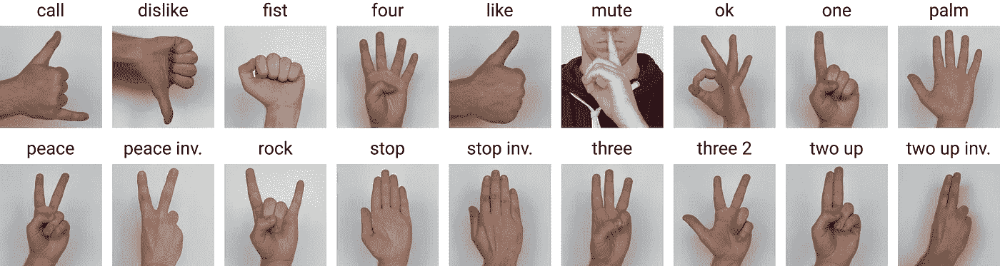
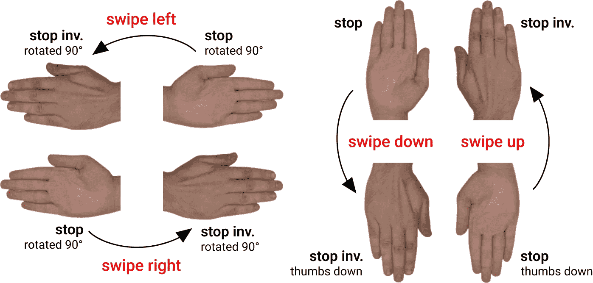
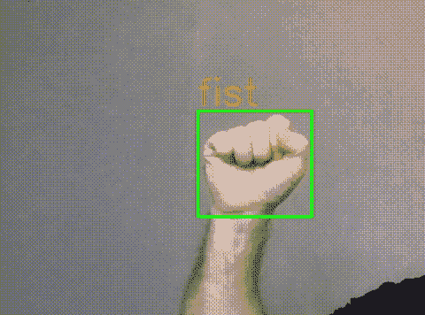
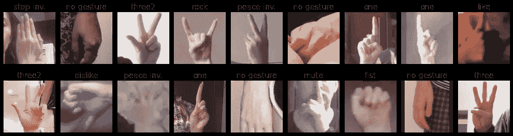
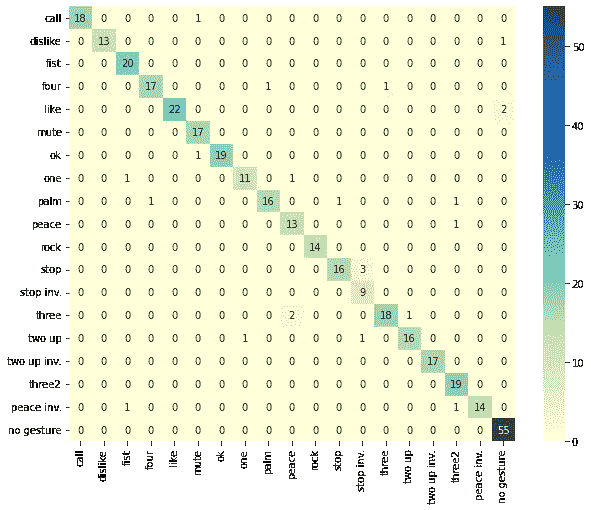

# 海格——手势识别图像数据集

> 原文：<https://betterprogramming.pub/hagrid-hand-gesture-recognition-image-dataset-a70cc291e539>

## 构建您自己的数据集


手势在人类交流中的使用起着重要的作用:手势可以在情感上加强陈述，也可以完全取代陈述。此外，手势识别(HGR)可以成为人机交互的一部分。

这种系统可以用于视频会议服务(Zoom、Skype、Discord、Jazz 等)。)、家庭自动化系统、汽车行业、为有语言和听力障碍的人提供的服务等。此外，该系统可以成为积极的手语使用者——听力和语言障碍者——的虚拟助理或服务的一部分。

这些领域要求系统在线工作，并对背景、场景、主题和照明条件具有鲁棒性。这些问题以及其他一些问题启发我们创建了一个新的 HGR 数据集。

# 资料组

**海格**(**HA**nd**G**esture**R**ecognition**I**mage**D**ataset)是 HGR 系统最大的数据集之一。该数据集包含 552，992 张全高清 RGB 图像，分为 **18** 类手势。我们特别关注与设备的交互来管理它们。这就是为什么所有 18 个选择的手势都是功能性的，为大多数人所熟悉，并且可能是采取一些行动的激励。



“inv。”是“倒置”的缩写

我们使用众包平台来收集数据集，并考虑各种参数以确保数据的多样性。数据集包含**34730 个独特的场景**。它主要是在室内采集的，光线有相当大的**变化，包括人造光和自然光。此外，数据集包括在极端条件下拍摄的图像，例如**面对和背对窗户**。此外，受试者必须在距离摄像机 0.5 至 4 米**的**处展示手势。**

海格可用于两项 HGR 任务:手部检测和手势分类；以及额外的任务——引导手搜索。注释由 COCO 格式的手的边界框`[top left X position, top left Y position, width, height]`和手势标签组成。同样，注释具有标记`leading hands`(手势为`left`或`right`)和`leading_conf`作为`leading_hand`注释的置信度。我们提供了`user_id`字段，允许您自己分割训练/测试数据集。

请记住，建议的数据集包含两个位置的一些手势:手的前部和后部。这允许使用两个静态手势来解释动态手势。例如，通过手势`stop` 和`stop inverted`，您可以设计动态手势`swipe up` ( `stop thumbs down`，即`stop`旋转 180 度，作为行的开始，`stop inverted`作为结束)，以及`swipe down` ( `stop`作为行的开始，`stop inverted thumbs down`，即`stop inverted`旋转 180 度，作为结束)。此外，您还可以获得 2 个动态手势，`swipe right`和`swipe left`，并增加 90 度旋转。



在注释中增加了`Leading_hand`，用静态手势解释动态手势:`swipe up`和`swipe down`可以用一只手显示，而手势`swipe right`和`swipe left`不使用第二只手很难显示。如果左手显示水平静态手势`stop`和`stop inverted`，则为动态手势`swipe right`，否则为`swipe left`。引导手标签可以用来从一个手势设计两个手势。比如右`three`和左`three`可以是两种不同的手势`right three`和`left three`。

下载海格的链接在[资源库](https://github.com/hukenovs/hagrid)中公开。

# 数据挖掘

数据集分 4 个阶段收集:(1)手势图像收集阶段，称为**挖掘** , (2) **验证**阶段，其中检查挖掘规则和一些条件，(3) **过滤**不合适的图像，(4) **标记边界框和引导手的注释**阶段。通过为每个手势类别划分池，分类阶段被构建到挖掘和验证管道中。

1.  **采矿。**人群工作人员的任务是用任务描述中指定的特定姿势给自己拍照。我们定义了以下标准:(1)注释者必须在距离摄像机 0.5 - 4 米的**处，(2)有手势的手(即引导手)必须完全在**帧中**。有时，受试者会接受一项任务，在弱光条件下或对着明亮的光源拍照，以使神经网络对极端条件具有弹性。还使用图像散列比较来检查所有接收到的图像的重复。**
2.  **验证。**由于用户试图在挖掘阶段欺骗系统，我们实施了验证阶段以获得高置信度图像。验证阶段的目标是在挖掘阶段选择正确执行的图像。
3.  **过滤。**由于伦理原因，儿童、不穿衣服的人和带有铭文的图像在此阶段被从海格中移除。
4.  **注解。**在此阶段，群组工作人员应在每张图像上的手势周围画一个红色边框，如果手完全在帧中，则在没有手势的手周围画一个绿色边框。不同的颜色需要进一步翻译成标签。

关于数据集和挖掘的详细信息在我们的[论文](https://arxiv.org/pdf/2206.08219.pdf)中提供。

# 手势识别系统



在本节中，我们将提供一个教程来展示如何使用海格建立一个 HGR 系统，它可以检测你的手势并对其进行分类。另外，我们要说明如何做一个有两个头的模型，其中第二个是预测主导手。

让我们从导入所有必需的库开始:

海格分为 18 类手势和一个`no gesture`类。由于本教程选择的数据集的子样本，我们不使用很多历元，并且模型可以快速学习。在模型训练之前，它移动到选定的设备。

我们实现了一个继承自`Dataset`类型的类`GestureDataset`，并定义了数据读取和数据预处理函数:

此外，我们为`get_transform()`函数实现了自己的类`ToTensor`:

我们指定两个不同的数据集，一个用于训练模型(训练集)，另一个用于测试模型(测试集)。两个命令只有一个参数`is_train`不同，用户使用`user_id`散列将整个数据集分成两部分。如果有更多数据，可以将定型集分为定型集和验证集。

**数据集/** 的结构如下:

已实施`GestureDataset`的输出如下:

让我们创建简短的类名，以便于图像和混淆矩阵的可视化:

让我们尝试可视化多个图像，以确保数据得到正确处理:



最后，我们可以将我们的图片放入一个`DataLoader`中。

我们实现了一个类`ResNet18`,将第二个头添加到预先训练好的火炬视觉 ResNet18 模型中。

我们将使用动量为 0.9、重量衰减为 0.0005 的 SGD 作为优化器来训练我们的模型。学习率从 0.005 开始。选择交叉熵损失函数作为判据。

此外，我们在`train_dataloader`中迭代一批图像。所有管道都是标准的，除了计算两个任务的损耗并求和。代码:

让我们在我们的`test_dataloader`上评估训练过的模型。与模型训练代码类似，以下代码在计算两个指标时不同于标准代码:

对于每个任务，模型评估返回的 F1 分数为 **93.8 %** 。给定下面的混淆矩阵，我们可以得出结论，所有的类都很好地彼此分离。



# 资源

整个数据集、每类 100 幅图像的试用版、预训练模型和演示在[资源库](https://github.com/hukenovs/hagrid)中公开提供。

其他链接: [arXiv](https://arxiv.org/pdf/2206.08219.pdf) ， [Kaggle](https://www.kaggle.com/datasets/kapitanov/hagrid) ， [Habr](https://habr.com/ru/company/sberdevices/blog/671614/)

```
Co-authored by [Alexander Kapitanov](https://www.linkedin.com/in/hukenovs/), [Andrey Makhlyarchuk](https://www.linkedin.com/in/makhliarchuk)
```