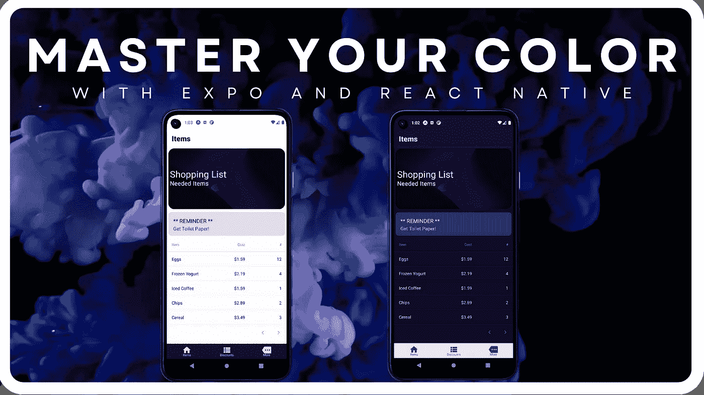
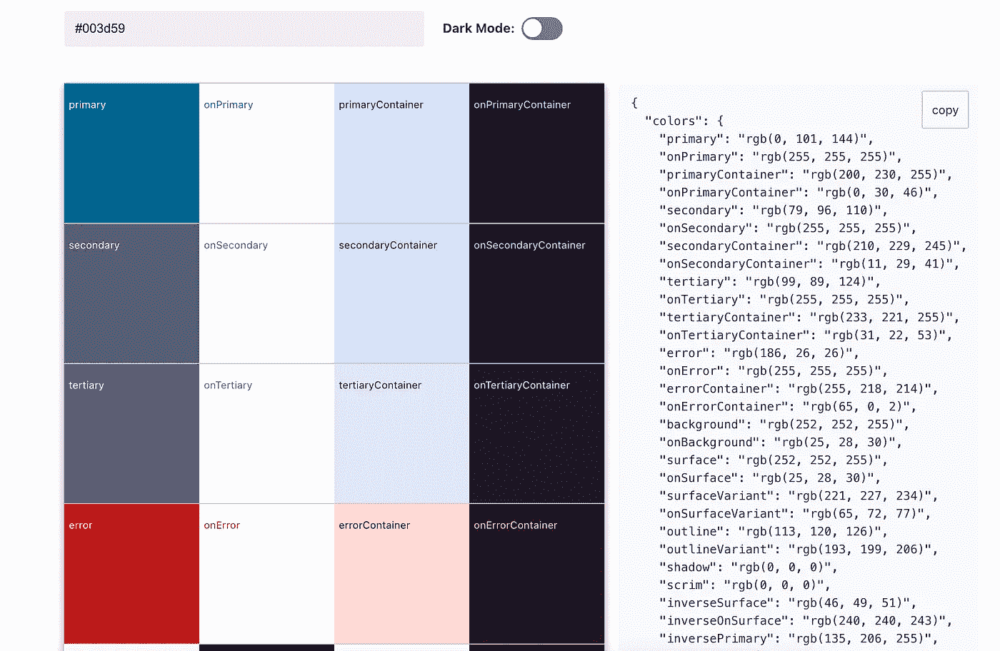

# 如何使用 React Native 和 Expo 向您的移动应用程序添加自定义主题

> 原文：<https://betterprogramming.pub/hail-to-the-theme-919de887120e>

## 在您的应用中配置亮模式和暗模式主题



添加自定义应用程序主题！

啊主题！不管你喜不喜欢主题，主题无处不在！我们的操作系统提供自定义主题选项(有些比其他的更多)，许多流行的网络浏览器允许安装自定义主题扩展…当然，我们的手机也是如此！

虽然移动设备主题化可能比上面提到的其他途径更受限制，但 iOS 和 Android 之间仍然存在潜在的共性，即现在为核心应用程序提供*亮*和*暗*主题。

作为一名开发人员，在设计和实现新的应用程序和特性时考虑主题变得越来越重要……不管是什么平台！在本文中，我们将专门研究在使用 React Native 创建一个新的 Android 应用程序时，我们如何去做这件事！

# 简介

在开始编写我们的应用程序之前，解释一下我们使用的方法是很重要的！本文使用的示例应用程序几乎完全是用 JavaScript 编写的，更确切地说是用扩展 JavaScript(或 JSX)编写的。这可能会让那些跨平台开发的新手感到震惊，他们通常认为 Java 和 Swift 是构建移动应用程序的唯一途径。诚然，Java/Kotlin 和 Swift/Objective-C 分别是用于构建 Android 和 iOS 移动应用程序的主要语言……但它们不是唯一的方法！

## 输入 React Native:

> React Native 将本机开发的最佳部分与 React 相结合，React 是用于构建用户界面的一流 JavaScript 库…
> 
> …创建特定于平台的组件版本，以便单个代码库可以跨平台共享代码。使用 React Native，一个团队可以维护两个平台并共享一个公共技术— React。

通过使用 React Native，我们将能够利用 React 提供的强大功能和灵活性，还能够重用定制组件来构建可以在 Android 和 iOS 上运行的移动应用程序…所有这些都使用相同的代码库！

为了建立我们的项目，我们将使用优秀的 [Expo](https://www.expo.io) 框架及其 CLI(命令行界面)。Expo 已经成为使用 react native 进行移动开发的最广泛使用的工具之一，这不仅是因为它使项目的启动变得非常简单，还因为它提供了丰富的库来定制您的应用程序的外观和功能！

首先，务必确保我们安装了以下系统要求:

*   Node.js LTS 版本(使用 LTS 特定版本很重要)
*   饭桶
*   Watchman(用于 Linux/macOS 系统)
*   纱线(非必需，但由 Expo 推荐)

这样一来，是时候写一些代码了！打开您喜欢的终端应用程序或 PowerShell，并导航到您计划创建项目目录的位置。在那里，运行以下命令来创建一个新的 expo 项目:

```
npx create-expo-app example-app && cd example-app
```

Expo 还提供了在创建新项目时传递模板的选项。要查看不同的模板，只需运行`npx create-expo-app --template`。至此，我们的新项目框架已经设置完毕，可以开始运行了👍。

# 代码

好吧，让我们来看看好东西！现在我们已经有了基本的设置，我们将继续创建一些组件，放在一个小的示例应用程序中，看看如何以一种简单的方式使用主题化。该应用程序将代表一个商店购物清单应用程序，它根据用户的设备是设置为*亮*还是*暗*模式来调整其组件主题。

第一步，也可以说是最重要的一步，是为我们的应用程序主题创建一组颜色。这个项目利用了一个很棒的 React 原生框架`react-native-paper`。它将提供用于构建我们的 UI 的关键组件。在他们的网站[上可以找到的一个很棒的特性](https://callstack.github.io/react-native-paper/theming.html)是一个基于提供的原色的材质 UI 主题生成器:



React 原生纸张主题生成器

这个神奇的工具不仅消除了创建适当的浅色和深色调色板对象的困难，还遵循了所有新版本 Android 都遵循的**材质设计**指导原则…允许我们的应用程序有效地*感觉* **和** *看起来*像任何其他原生构建的应用程序！

如果您还没有这样做，请确保将以下依赖项添加到您的`package.json`中，以便安装所有的魔法:

要使用我们之前创建的主题对象，请打开项目的`App.js`文件并添加它们，以及`expo`和`react-native-paper`的其他导入语句:

以上要点是我们应用程序中所有主题魔法发生的地方！我们使用`react-native-paper`生成的调色板值来声明我们的主题对象。Expo 提供了一个 API，用于根据设备是否设置为*暗*或*亮*模式来调整顶部状态栏的颜色，因此我们确保也包括这一点。这段代码的另一个重要部分是在定义我们的两个主题提供者时使用了`useColorScheme`钩子。这将允许应用程序中的所有子组件传递和访问我们的主题。

# 说到组件

您可能已经注意到上面代码中添加了一个`MainNavigator`组件的特定导入语句。这就是我们的应用程序的主要导航功能所在，并利用另一个强大且恰当命名的`react-navigation`框架来实现。在我们看一下我们的导航器之前，让我们把几个更小的组件放在一起，合并到我们的 UI 中:

定义好组件文件后，我们现在可以将它们导入到我们的`MainNavigator`文件中，同时导入的还有`react-navigation`提供的导航组件:

如果你密切关注，你可能会注意到代码的关键行，允许我们将自定义主题颜色应用到应用程序的组件。让我们更仔细地看一小段，看看它到底是如何工作的！

```
import { ..., useTheme, ... } from 'react-native-paper';
```

正是这个`useTheme`钩子允许我们访问从应用程序顶层传下来的自定义主题对象。使用这些颜色只需要调用钩子并将返回值存储在一个变量中，就像我们的`PrimaryScreen`组件:

## 测试

要在实时开发模式下运行我们的新项目，请在项目根目录下运行`npx expo start`。这将启动一个交互式命令行实用程序，允许您选择在哪个设备上测试您的应用程序:

*   使用 **Expo Go** 移动应用程序在物理设备上进行测试(扫描 QR 以方便设置)
*   在 Android 模拟器上运行(**使用 Android Studio** )
*   在 iOS 仿真设备上运行(**使用 Xcode** )

也没那么糟，对吧？对于包括我自己在内的许多开发人员来说，实现定制主题的过程一开始看起来相当令人生畏。然而，在一些令人惊奇的框架的帮助下，它可以(相对)毫无痛苦地完成！

尽管浏览 react native 开发的所有细节已经超出了本文的范围，但我希望至少能够阐明在 Expo 和 React Native 的帮助下创建和 ***定制*** 您自己的移动应用程序的可能性。

请随意检查和分叉该项目的整个源代码。或许能为你接下来的移动项目提供一些启发和指导！

[](https://github.com/dedSyn4ps3/react-native-theming) [## GitHub-ded syn 4 PS 3/react-native-theming

### 这个 repo 是用来保存中型文章的代码文件的。这是一个演示应用程序…

github.com](https://github.com/dedSyn4ps3/react-native-theming)