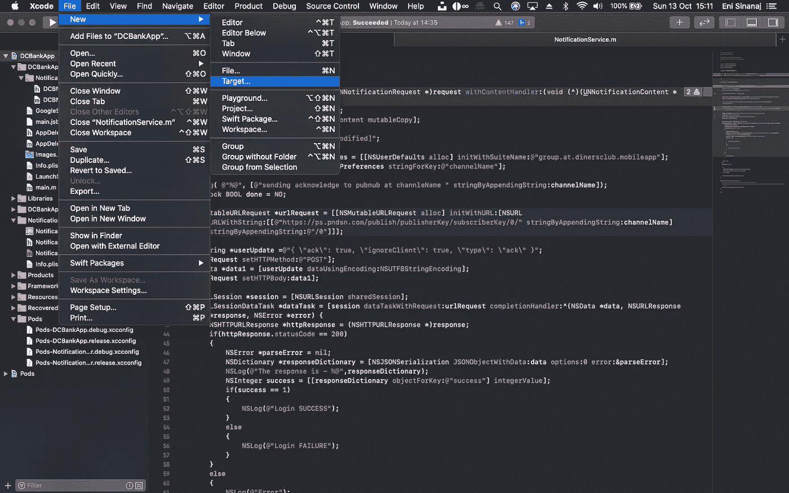
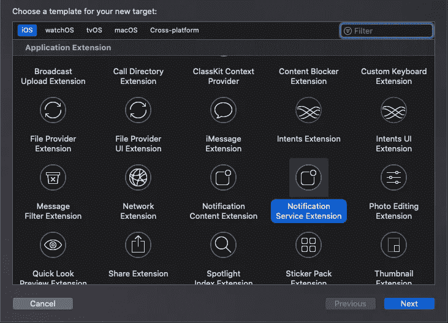
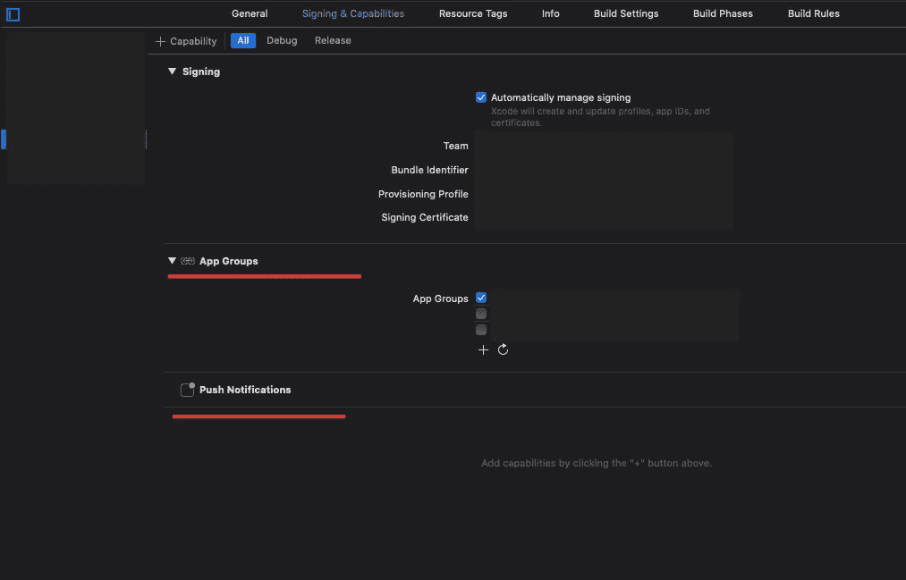
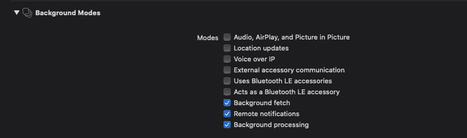

# 在 iOS 中处理传入通知

> 原文：<https://betterprogramming.pub/handle-incomming-notifications-in-ios-8b1a322bb5a9>

## 在用户看到通知之前更改或丰富通知



图片由作者提供

如何在 iOS 中处理收到的推送通知？

那么我们先来说明一下需求。在我的特殊例子中，每次我在应用程序中收到通知时，我都需要进行一次 HTTP 调用(更具体地说，将消息发布到 PubNub 通道)。它让我的服务器在收到通知的第一时间知道。

这在 iOS 和 Android 中都是可能的。在 iOS 中，可以通过通知服务扩展目标来完成，我们可以通过 File > New > Target 将它添加到我们的项目中。



# 通知服务扩展

iOS 中的通知服务扩展的主要目的是在操作系统显示通知之前，能够用更多的信息来更改或丰富通知。

甚至允许响应通知下载内容或向服务器发出 HTTP 请求。

请注意，通知服务扩展仅在 iOS 10 及更高版本中可用，您需要使用 XCode 8 或更高版本来实现这一功能。

## 扩展生命周期

使用通知服务扩展配置应用程序后，将针对每个通知执行以下过程:

1.  App 收到通知。
2.  系统创建一个扩展类的实例，并在后台启动它。
3.  您的扩展执行内容编辑和/或下载一些内容。
4.  如果您的扩展执行工作的时间太长，它将被通知并立即终止。
5.  向用户显示通知。

如您所见，使用 notification service 扩展时，您只有有限的时间来执行必要的工作。这是由操作系统控制的，就像 iOS 中的其他后台任务一样。如果您的扩展花费的时间太长，或者在执行扩展时发生任何其他异常，那么它将被系统停止，并且通知将被发送，就像您根本没有扩展一样。

## 密码

在将这个目标添加到您的项目中之后，将会在其中创建三个文件。

*   `NotificationService.h`
*   `NotificationService.m`
*   `Info.plist`

如果你使用 Swift，你将只有两个文件:`NotificationService.swift`和`Info.plist`。

所以代码放入`NotificationService[.m]`。该类扩展了从`<UserNotifications/UserNotifications.h>`导入的`UNNotificationServiceExtension`。

该类必须实现以下两个方法:

```
- (**void**)didReceiveNotificationRequest:(UNNotificationRequest *)request withContentHandler:(**void** (^)(UNNotificationContent * **_Nonnull**))contentHandler {
   **self**.contentHandler = contentHandler;
   **self**.bestAttemptContent = [request.content mutableCopy]; // change bestAttemptContent here ... **self**.contentHandler(**self**.bestAttemptContent);
}- (**void**)serviceExtensionTimeWillExpire {
   // Called just before the extension will be terminated by the system.
   // Use this as an opportunity to deliver your "best attempt" at modified content, otherwise the original push payload will be used.
 **  self**.contentHandler(**self**.bestAttemptContent);
}
```

显然，第一个是完成您需要它执行的所有工作所需要的。

## 正确设置项目的扩展



请确保将这些功能添加到您的目标中。应用程序目标和扩展都需要启用推送通知。而且，在 app target 上，也加入背景模式。



## 扩展限制

使用 notification service 扩展时，了解扩展的运行条件非常重要。

首先，你的扩展将只为那些被配置为向用户显示屏幕提示的通知而启动。这意味着任何静默通知都不会触发您的分机。

此外，传入的通知必须标记为具有可变内容。为此，将值为`1`的键`mutable-content`添加到`aps`字典中。

另一件需要了解的事情是如何在应用程序和扩展之间共享信息。正如你从上图中看到的，我已经在扩展中添加了应用程序组功能。应用程序也是如此。已定义的应用程序组必须具有相同的名称(例如`group.com.clubsmade.eventsapp`)。这使得使用`NSUserDefaults`共享信息变得很容易，如下所示:

```
NSUserDefaults *myDefaults = [[NSUserDefaults alloc] **initWithSuiteName:@"group.com.clubsmade.eventsapp"**];
[myDefaults setObject:**channelName** forKey:@"channelName"];
[myDefaults synchronize];
```

在上面截取的代码中，我将一个频道名保存到用户默认值的共享实例中。您可以注意到，`NSUserDefaults`实例已经用套件名*创建了。*

我保存在我的用户默认值中的频道名称将在我的扩展中使用，以向 PubNub 频道发布一些消息。

要从用户默认值中读取该信息，请使用以下代码片段:

```
NSUserDefaults *defaultUserPreferences = [[NSUserDefaults alloc] **initWithSuiteName:@"group.com.clubsmade.eventsapp"**];NSString *channelName = [defaultUserPreferences stringForKey:@"channelName"];
```

就是这么简单。

# 结论

通过 iOS 10 中新的`UNNotificationServiceExtension`类，你可以非常简单地为自己的应用实现通知服务扩展。无论您的用例是什么，这些 API 都允许您在通知显示给用户之前轻松地修改通知的内容，或者在有限的时间内执行其他操作。