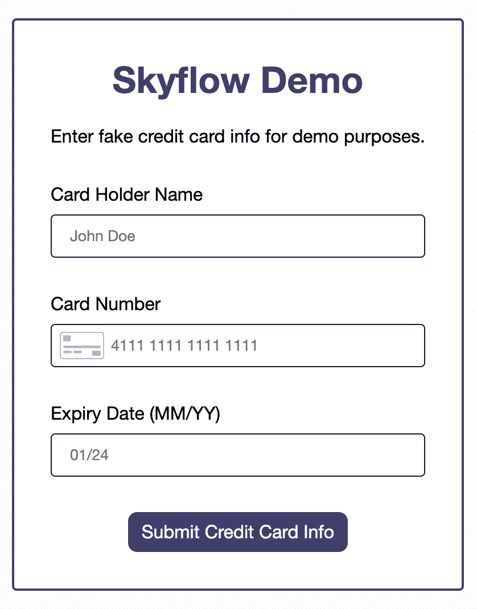
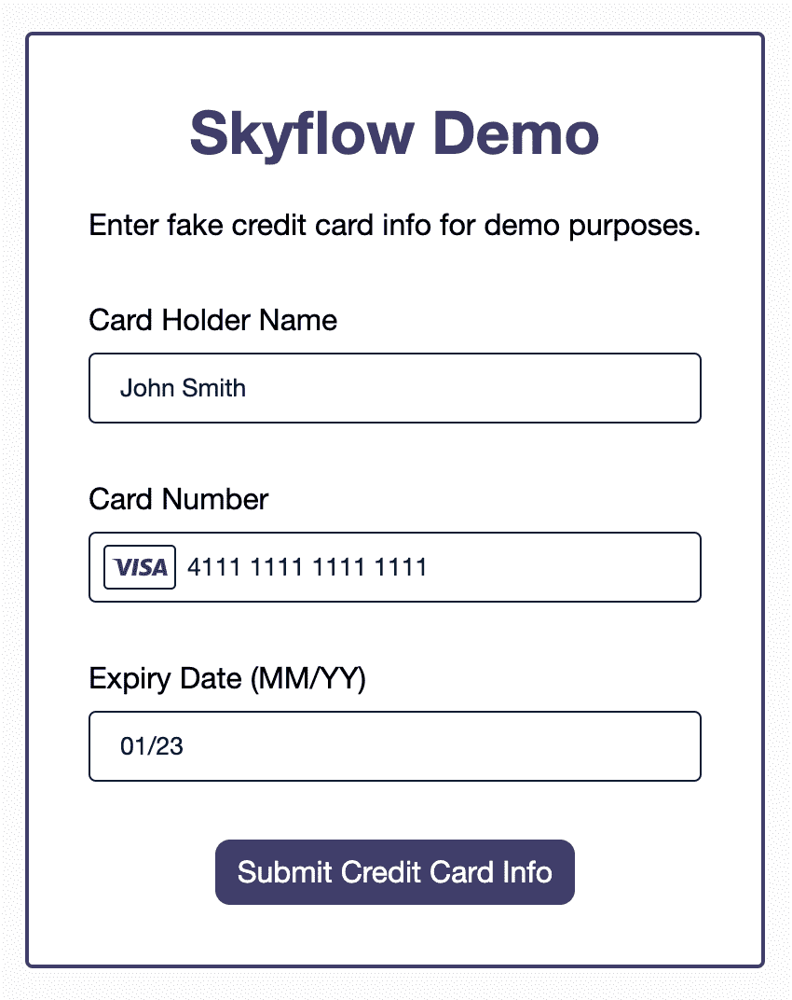
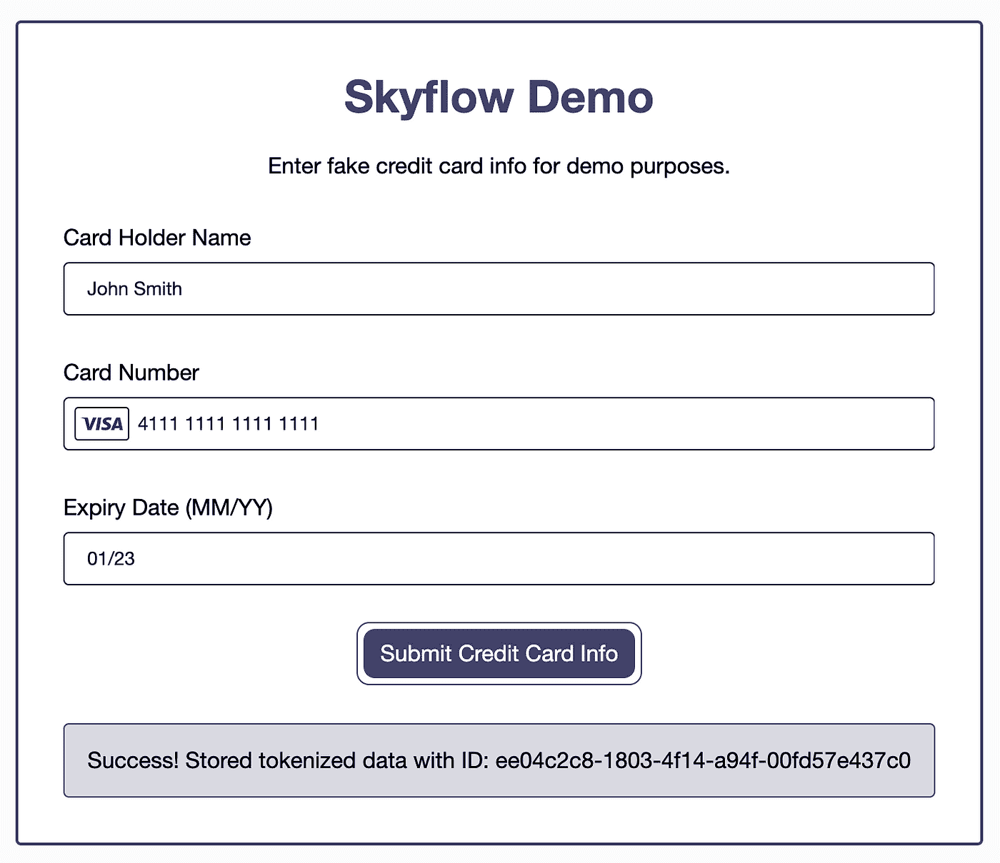
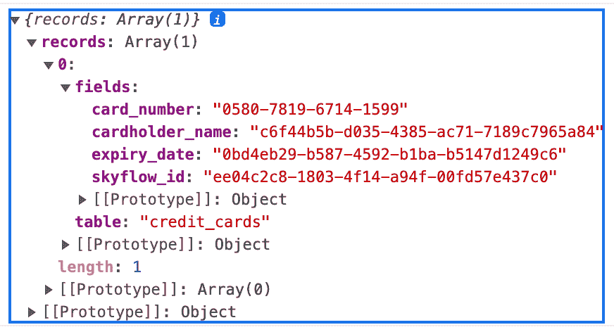
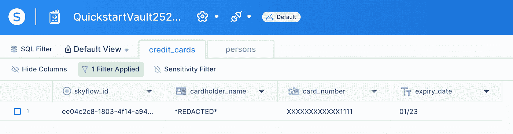
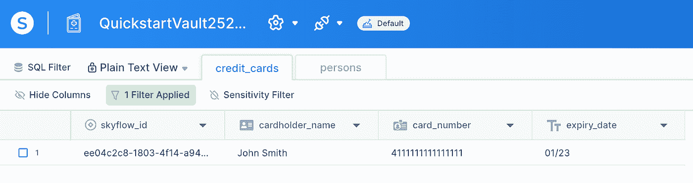

# 使用 Skyflow 安全处理敏感数据

> 原文：<https://betterprogramming.pub/handle-sensitive-data-securely-with-skyflow-8c626751e1a>

## PCI、PII、PHI 等等！

在 [Unsplash](https://unsplash.com?utm_source=medium&utm_medium=referral) 上由 [olieman.eth](https://unsplash.com/@moneyphotos?utm_source=medium&utm_medium=referral) 拍摄的照片

任何处理敏感数据的公司都需要将安全性放在首位。敏感数据可能包括信用卡信息等支付卡行业(PCI)数据、社会安全号码等个人身份信息(PII)、病历等受保护的健康信息(PHI)等。

PCI、PII 和 PHI？说到数据安全，这仅仅是个开始。数据需要在传输、使用和存放过程中保持安全。您需要确保对身份验证和授权进行适当的访问控制。您还需要维护数据机密性、数据完整性和数据可用性。当您需要跨系统复制数据时，这可能会更加复杂。

如果这一切听起来令人生畏，您应该考虑使用数据隐私保险服务来帮助满足您的安全需求。不是每家公司都雇得起安全和数据隐私专家团队，这没关系。不可以的是偷工减料。“购买，不要构建”是你在处理应用程序中相对于公司主要关注点来说次要的关键部分时应该采用的口头禅。

在本文中，我将带您浏览一个简单的安全信用卡存储应用程序演示，我是使用 [Skyflow 的数据隐私库](https://www.skyflow.com/)构建的。我们将了解外包您的数据隐私需求的一些好处，以便您可以专注于公司的核心产品，同时仍然保持安全性和合规性。

我们开始吧！

# 演示应用程序:结账页面

演示应用程序:结账页面

假设您是一家电子商务公司，用户在您的在线商店购物时正在进行购买。他们来到你的结账页面，需要输入他们的信用卡信息。您希望确保安全地处理他们的信用卡信息，并且您还希望存储他们的信用卡信息，以便他们下次使用您的网站时可以保存这些信息。

这里需要记住几个重要的注意事项:

请记住，数据在传输、使用和存放时都需要安全。这意味着使用 SSL/TLS (HTTPS 而不是 HTTP)通过网络发送信用卡信息，并对数据库中的数据进行加密，而不是以纯文本形式存储。

您还需要确保适当的访问控制到位，这意味着一旦数据被存储，只有合适的人才能访问它。

当谈到完整性和可用性时，您需要确保数据被正确存储并且不会被无意中修改，并且当有人需要检索数据时，数据必须是可用的。

这些只是为了符合 PCI 标准而需要满足的一些要求。

# 使用 Skyflow 的 SDK 快速跟踪演示应用程序

在构建我的结账页面时，我使用了 [Skyflow JavaScript SDK](https://github.com/skyflowapi/skyflow-js) 来提供 UI 中的表单字段元素。这些元素是在 iframess 中实现的，iframe 将它们与我的前端应用程序的其余部分分开，这降低了我的风险。当用户输入他们的信用卡信息并提交表单时，前端 Skyflow API 请求将数据发送到我的 [Skyflow 数据隐私库](https://docs.skyflow.com/create-a-vault/)。

服务器用一个惟一的 ID 和表示存储的信用卡信息的令牌化数据来响应。这意味着，除了不接触我的应用程序的前端，信用卡数据也不会接触我的应用程序的后端，进一步降低了我的风险。然后，标记化的数据可以存储在我自己的数据库中。这意味着我根本没有直接存储信用卡信息，只是对它的标记化引用。

让我们深入研究代码，看看我是如何构建的。所有的代码都可以在 GitHub 上找到[,如果你愿意的话。](https://github.com/thawkin3/skyflow-demo)

# 创建信用卡表单

我的应用程序是用 Node.js 和 Express 后端以及普通的 JavaScript 前端构建的。所以没有前端框架——只有一些简单的 HTML、CSS 和 JS。

创建信用卡表单相对简单，只需要几个步骤。高级功能及其顺序如下所示:

让我们一步一步地走过这些步骤。

首先，我使用我的保险库 ID、保险库 URL 和一个助手函数初始化我的 Skyflow 客户端，以获取用于身份验证的不记名令牌:

您可以从您的 Skyflow 帐户中获取保管库 ID 和保管库 URL。我按照[核心 API 快速入门指南](https://docs.skyflow.com/core-api-quickstart/)创建了我的第一个 vault。为了简洁和避免重复，我邀请您查看本部分指南中的步骤。

其次，我创建了一个容器来保存我的表单字段:

在我们在容器内部创建元素之前，容器本身不会做任何事情，所以我们现在就开始。

第三，我创建表单字段来收集用户的信用卡信息。这包括持卡人的姓名、信用卡号和信用卡到期日:

第四，我将表单域元素安装到 DOM 上。这就是将 iframes 插入到占位符容器中，以便表单字段实际出现在 UI 中的原因:

第五，也是最后一点，我向我的**提交**按钮添加了一个事件监听器。现在，当提交表单时，会发出一个 API 请求，将用户的信用卡信息安全地存储在我的 Skyflow vault 中:

差不多就是这样！这些步骤强调了使用 Skyflow JavaScript SDK 所需的核心代码片段。如果您需要完整的工作解决方案，请参考 GitHub 上的[库，特别注意`public`目录中的`index.html`和`script.js`文件。](https://github.com/thawkin3/skyflow-demo)

# 结账页面演示

现在我们已经对如何构建结帐页面有了基本的了解，让我们来看看它的实际操作吧！用户输入他们的信用卡信息:

输入您的信用卡信息

然后用户点击**提交**按钮，这将触发一个 API 请求来保存信用卡数据并返回一个 Skyflow ID:

提交信用卡信息以存储令牌化数据

我们在这里显示了 Skyflow ID，以便在演示中容易看到，但您应该注意，这并不是您想要或需要在用户界面中向您的用户显示的内容。

如果我们查看响应数据，我们可以看到我们的每一条敏感数据都被标记化，或者替换为一个标记值:

Skyflow API 响应

如果我们查看我们的 Skyflow vault，数据如下所示。请注意，默认情况下，它会被编辑和屏蔽，以保护具有保管库访问权限的应用程序的敏感数据:

具有编辑和屏蔽数据视图的 Skyflow vault

如果需要，像我们这样的管理员用户也可以选择以纯文本方式查看数据:

带纯文本视图的 Skyflow vault

最后一步，我们可以将该记录的 Skyflow ID 存储在我们自己的数据库中。将来，我们可以使用该 ID 来请求标记化的数据并将其去标记化。

# 结论

我们今天讲了很多！除了数据隐私和安全 101 课程之外，我们还将 Skyflow 视为一种可能的解决方案，可以帮助我们满足数据隐私需求。Skyflow 提供了您需要的一切，包括访问控制、加密和令牌化。其解决方案符合 SOC2、HIPAA 和 PCI 标准，甚至支持[数据驻留](https://www.skyflow.com/solutions/solutions-data-residency)，这是大多数数据隐私法中包含的常见要求。此外，通过将 PCI 数据存储在保险库中，而不是直接使用 Stripe 或 Braintree 等支付处理器，您可以[避免供应商锁定](https://www.skyflow.com/post/build-for-frictionless-growth-by-avoiding-pci-data-lock-in)，甚至可以使用多个支付处理器来帮助您更好地适应各种市场。

请记住，要实施最佳实践，您不需要成为数据隐私专家。创业公司、小型团队，甚至中型到企业级的公司都可以从产品核心功能之外的外包需求中受益。将这类工作交给领域专家可以让您专注于业务的核心部分。