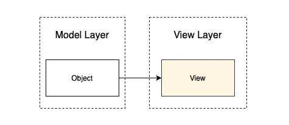
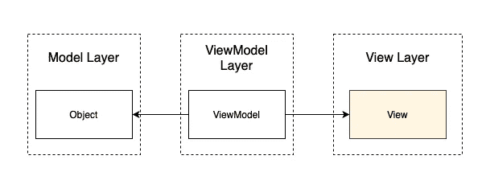
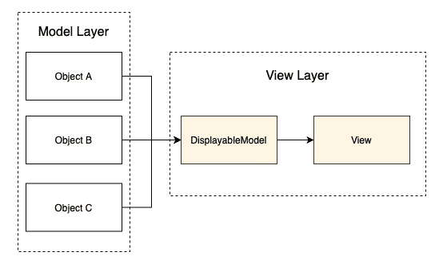

# 使用面向协议的编程处理 SwiftUI 视图

> 原文：<https://betterprogramming.pub/handle-swiftui-views-using-protocol-oriented-programming-d07741f58f4b>

## 编写可伸缩和可测试的代码

照片由[德米特里·奥西彭科](https://unsplash.com/@dmosipenko?utm_source=medium&utm_medium=referral)在 [Unsplash](https://unsplash.com?utm_source=medium&utm_medium=referral) 上拍摄

SwiftUI 展示了一种更新、更快、更有效的构建视图的方式。声明式编程是一项令人惊叹的技术，SwiftUI 以及 Android 上的 Jetpack Compose 和 Flutter 的 Widget 使视图构建比以往任何时候都更令人愉快。

然而，构建视图并不是移动开发人员生活的唯一部分。在一个高度变化的环境中，设计一个好的、可伸缩的、有效的、能与任何类型的模型一起工作的 UI 是一个相当大的挑战。

# 一般是怎么处理的？

在大多数常见场景和简单案例中，有两个层:

*   **Model** :这是从存储库中获取的，可以是来自 API 的数据、来自数据库的记录或者来自多个服务的其他类型的数据。模型通常公开公开字段，很少公开方法。
*   视图:实现视图协议的结构——在最好的情况下，只有一个依赖关系。

依赖关系图如下所示:

视图-模型从属关系

代码是:

将模型直接注入视图是一个……有效的想法。不要误会我！我并不是说这是不正确的方法。当模型是原始类型时，这些解决方案工作得很好，例如:

*   线
*   布尔代数学体系的
*   数字

将上述类型注入到视图中可以让我们避免多余的样板代码——比如额外的抽象层或者仅仅为了满足多余需求而创建的`ViewModel`类。

此外，当一个大视图被分成多个小视图时，改变一个特定的视图很容易，尤其是当它们不依赖于模型，而是依赖于原始类型时。

第二种方法是 MVVM 架构——在这里[有很好的描述。在这个架构中，大多数视图都有自己的`ViewModel`。](https://www.hackingwithswift.com/books/ios-swiftui/introducing-mvvm-into-your-swiftui-project)

MVVM 属地

MVVM 在模型和视图之间增加了一层 T2。模型和视图对象与前一个例子没有什么不同，重要的区别在于要显示的数据是如何传递给视图的。

这通常是解决视图层和模型层之间依赖问题的一个非常好的方法——并且被广泛使用。这种方法的最大优点是:

*   **层分离**:清晰可见抽象负责什么，领域模型和 UI 之间没有依赖关系
*   **可测试性**:视图模型通常容易测试
*   **视图模型通信**:发布者或代理可以从父视图模型传递到子视图模型，并在上层进行处理

但我也看到了一些缺点:

*   **不同种类的来源:**只有一个模型被`ViewModel`接受。这意味着一个类不是可扩展的，如果一个新的商业案例出现，它必须被重写。例如，一个额外的需求出现了，现在`user`列表填充了用户模型和`group`模型——这是一个完全不同的模型。
*   样板代码和 ViewModel 实际上只不过是模型的包装——只是暴露了更多的字段供查看。
*   在大多数情况下，为每个视图创建新的视图模型似乎是一个过度工程

知道了这些问题，我们就可以顺利地继续:

# 面向协议的方法

我推荐介于 MVVM 和原始模型之间的东西——视图依赖性，以避免:

*   许多视图模型文件——这些文件只描述了如何将模型转换成视图。

并确保:

*   良好的可测试性
*   轻松采用不同种类的资源
*   需要时从协议到视图模型的轻松转换

POP 方法的主要目标是创建一个适应各种业务需求的适应性强且灵活的环境。它的关键部分是一个协议(通常称为`DisplayableModel`，它描述了视图中需要显示的内容。

面向协议的模型

它可能看起来像这样:

`Displayable`协议定义了视图所需的所有数据。这里，它是一个`name`变量，描述每个用户行视图都有一个 name 文本元素，以及一个用于在屏幕上显示用户头像的`ImageSource`。

可显示模型不包含任何类型的业务逻辑。其中的属性对于正确显示视图至关重要。所以，`DisplayableModel`的目标是尽可能的清晰和小巧。

视图将接受`DisplayableModel`协议作为入口点:

由`UserRow`处理的每个模型都必须实现`DisplayableModel`协议。

接下来，必须在`UserView`上显示的每个模型都必须实现一个`DisplayableModel`协议。示例:

剩下的就看你的了。可显示的模型可能来自`ViewModel`，或来自可观察的商店，或来自任何种类的来源。

总之，使用这种技术，我们可以构建快速、可伸缩和适应性强的视图。

# 视图模型示例

现在，我将展示上述方法是如何结合 MVVM 的。记住，你不仅要在同一个列表视图中显示`user`，还要显示组。

1.  可显示的模型存储在一个数组中，并标记为`Published`
2.  当视图出现时，或者需要时，方法`fetch`被调用
3.  在其中，`ViewModel`异步获取两个不同的模型:`Group`和`User`
4.  因为两者都实现了一个`UserRowDisplayableModel`，所以它可以很容易地传递给 published 元素。

协议是 Swift 迄今为止最好的功能之一。它允许编写一个简单的，描述良好的，清晰的代码，有且只有一个容易理解的目的。

我强烈建议将相关代码封装到一个协议中，以获得更好的可读性和更容易的测试。