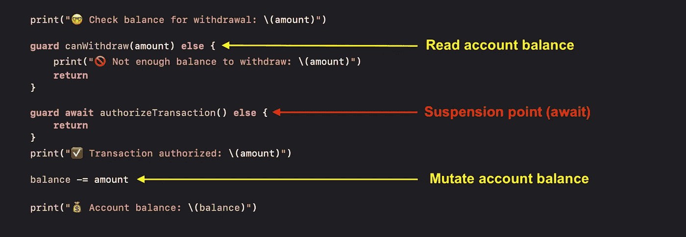

# 在 Swift 中处理参与者重入问题

> 原文：<https://betterprogramming.pub/handling-actor-reentrancy-problem-in-swift-cee60557dadf>

## 了解如何安全运行并发 Swift 代码


mate usz waca wek 在 [Unsplash](https://unsplash.com?utm_source=medium&utm_medium=referral) 上拍摄的照片

当我第一次看到 WWDC 关于演员的演示时，我对它的能力以及它将如何在不久的将来改变我们编写异步代码的方式感到兴奋。通过使用 actors，编写没有数据竞争和死锁的异步代码变得前所未有的简单。

除此之外，这并不意味着演员没有线程问题。如果我们不够小心，我们可能会在使用 actors 时意外地引入可重入性问题。

在本文中，我将带您了解什么是可重入性问题，为什么它会有问题，以及如何防止它发生。如果这是您第一次听说可重入性问题，一定要继续读下去，这样下次使用 actors 时就不会措手不及了。

# 现实生活中的银行交易示例

展示可重入性问题的最佳方式是使用现实生活中的例子。考虑下面的`BankAccount` actor，它有一个`balance`变量。

稍后，我们将为这个`BankAccount`角色提供一个取款功能，但在此之前，让我们为它提供一个私有功能，检查该帐户是否有足够的余额用于取款:

除此之外，我们将定义另一个模拟授权过程的私有函数:

实际上，授权过程应该是一个相当慢的过程，因此我们将使它成为一个异步函数。我们不打算实现实际的授权工作流，而是等待 1 秒钟，然后返回`true`来模拟交易已被授权的情况。

这样，我们现在可以像这样实现撤销功能:

实现非常简单。我们将首先检查帐户余额。如果余额足够，我们将继续授权交易。

一旦我们成功授权交易，我们将从余额中扣除取款金额，表明钱已从帐户中取出。

之后，让我们添加一些`print`语句来帮助我们监控整个取款过程的流程:

下面是`BankAccount` actor 的完整实现:

## 模拟可重入问题

现在，让我们考虑两次提款同时发生的情况。我们可以通过在两个独立的异步任务中触发`withdraw(_:)`函数来模拟。

你认为结果会是什么？

乍一看，你可能会认为第一次提款(800)应该通过，而第二次(500)会因为余额不足而被拒绝。不幸的是，情况并非如此。下面是我们从 Xcode 控制台得到的结果:

```
🤓 Check balance for withdrawal: 800
🤓 Check balance for withdrawal: 500
✅ Transaction authorized: 800
💰 Account balance: 200
✅ Transaction authorized: 500
💰 Account balance: -300
```

如您所见，两笔交易都已完成，用户能够提取的金额超过了账户余额。如果你是银行老板，你不会希望这种事情发生的！

现在让我们仔细看看`withdraw(_:)`函数的实现，你会注意到我们目前面临的问题实际上是由以下三个原因造成的:

1.  `withdraw(_:)`功能中存在一个暂停点，即`await authorizeTransaction()`。
2.  暂停点前后第二笔交易的`BankAccount`状态(`balance`值)不同。
3.  `withdraw(_:)`函数在其先前的执行完成之前被调用。

由于`withdraw(_:)`功能中的暂停点，第二笔交易的余额检查发生在第一笔交易完成之前。在此期间，账户仍然有足够的余额进行第二次交易，这就是为什么第二次交易的余额检查通过了。

这是一个非常典型的可重入性问题，看起来当它发生时，Swift actors 不会给我们任何编译器错误。如果是这样，我们该怎么做才能防止这种情况发生？

# 为可重入性设计参与者

根据 Apple 的说法，actor reentrancy 可以防止死锁并保证向前的进度。但是，它不能保证参与者的可变状态在每个 await 中都保持不变。

因此，作为开发人员，我们必须时刻注意，每次等待都是一个潜在的暂停点，而且在每次等待之后，参与者的可变状态可能会发生变化。换句话说，防止重入问题的发生是我们的责任。

如果是，我们有什么预防方法？

## 在同步代码中执行状态突变

苹果工程师建议的第一种方法是总是在同步代码中改变角色状态。正如您在我们的示例中看到的，我们改变参与者状态的时间点是余额扣除发生的时间点，我们读取参与者状态的时间点是我们检查帐户余额的时间点。这两个点由一个悬挂点隔开。



悬挂点位置

因此，为了确保余额检查和余额扣除同步运行，我们需要做的就是在执行余额检查之前授权交易。

如果我们再次运行代码，我们将得到以下输出:

```
✅ Transaction authorized: 800
🤓 Check balance for withdrawal: 800
💰 Account balance: 200
✅ Transaction authorized: 500
🤓 Check balance for withdrawal: 500
🚫 Not enough balance to withdraw: 500
```

太好了！我们的代码现在成功地拒绝了第二个事务。但是，取款工作流程并不真正有意义。如果账户余额不足，授权交易还有什么意义？

如果是这样的话，我们还有什么其他的选择，以便在解决可重入性问题的同时，我们可以保持原来的撤销工作流？

## 检查暂停点后的执行元状态

苹果工程师建议的另一种预防方法是在暂停点之后对演员状态进行检查。这可以确保我们对参与者可变状态所做的任何假设在各个暂停点上保持不变。

对于我们的例子，我们假设在授权过程之后账户余额是足够的。因此，为了防止重入问题，我们必须在交易被授权后再次检查账户余额。

下面是我们从上面的`withdraw(_:)`函数中得到的结果:

```
🤓 Check balance for withdrawal: 800
🤓 Check balance for withdrawal: 500
✅ Transaction authorized: 800
💰 Account balance: 200
✅ Transaction authorized: 500
⛔️ Not enough balance to withdraw: 500 (authorized)
```

这样，我们成功地防止了重入问题的发生，同时保持了原来的撤销工作流。

如您所见，没有能够防止各种可重入问题的灵丹妙药。我们需要根据我们真正需要的东西来调整我们采取的方法。

如果你想看一个更复杂的现实生活中的重入问题，我强烈推荐[这篇由](https://www.donnywals.com/using-swifts-async-await-to-build-an-image-loader/)[唐尼·瓦尔斯](https://twitter.com/DonnyWals)撰写的文章。在文章中，您将看到他如何使用字典来防止他的图像下载器演员由于重入问题而两次下载图像。

# 线程安全与可重入性

既然您已经了解了导致可重入性问题的原因以及我们如何防止它，那么让我们把注意力转移到线程安全和可重入性之间的区别上来。

众所周知，一个 actor 会在它自己的上下文中保证线程安全，那么为什么我们仍然会遇到可重入性问题呢？

根据苹果公司的说法，一个参与者将保证对其可变状态的互斥访问。这就是为什么在刚才的例子中，与`amount = 800`的交易总是先发生。如果一个 actor 不是线程安全的，我们就不能得到这样一致的结果。我们有时可能会得到与`amount = 500`的交易首先被触发的结果。

尽管可重入性问题发生在多线程环境中，但这并不意味着它是一个线程安全问题。发生可重入性问题是因为我们假设参与者的状态不会在一个暂停点上改变，而不是因为我们试图同时改变参与者的可变状态。因此，可重入性问题并不等同于线程安全问题。

# 包扎

在本文中，您已经了解到参与者可以保证线程安全，但是它不能防止可重入问题。因此，我们必须时刻注意，参与者状态可能会在一个暂停点上发生变化，我们有责任确保即使在参与者状态发生变化后，我们的代码仍然可以正确运行。

如果您想试用本文中的示例代码，您可以在这里获得它[。](https://github.com/LeeKahSeng/SwiftSenpai-Swift-Concurrency)

感谢阅读。更多关于 iOS 开发和 Swift 的文章，请务必在 [Twitter](https://twitter.com/Lee_Kah_Seng) 上关注我。