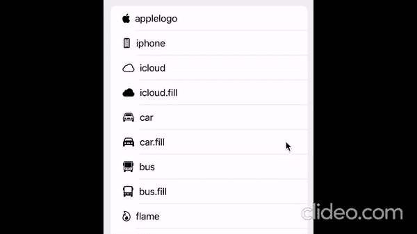
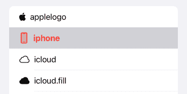

# 在 iOS 16 中使用 UIHostingConfiguration 处理单元交互

> 原文：<https://betterprogramming.pub/handling-cell-interactions-when-using-uihostingconfiguration-in-ios-16-562e5f160cdc>

## 选择状态更改和滑动操作的简要指南


作者图片

`UIHostingConfiguration`是 iOS 16 中引入的工具之一，用于帮助开发者将 SwiftUI 视图添加到他们的 UIKit 应用中。通过使用`UIHostingConfiguration`，开发人员可以使用 SwiftUI 轻松创建自定义单元格，并在`UITableView`或`UICollectionView`中呈现它。

在我之前的[文章](https://swiftsenpai.com/development/swiftui-custom-cell/)中，我深入讨论了如何使用`UIHostingConfiguration`来定义定制单元格的布局和内容。在本文中，让我们更进一步，研究它的用户交互方面。以下是您将学到的内容:

*   处理单元格的选择状态更改
*   处理单元格的滑动动作

所以，不浪费太多时间，让我们深入细节。

# 示例应用程序

像往常一样，我将使用一个示例应用程序来展示我将涉及的主题。以下是我们将要构建的内容:



为了开始，我使用`UIHostingConfiguration`预先构建了上面的列表(没有任何用户交互处理)。请随意使用下面的代码来帮助您开始并遵循本教程:

如果你在理解上面的代码时有困难，我强烈建议你先阅读我之前的博客文章，[“如何使用 SwiftUI](https://swiftsenpai.com/development/swiftui-custom-cell/) 创建定制的 UICollectionViewListCell”

# 处理单元格的选择状态更改

在进入状态改变处理之前，我们必须首先给`UserInteractionCell`一个代表其状态的变量。之后，我们可以根据刚刚定义的状态变量来设置单元格的样式。代码如下:

为了在单元格的状态改变时得到通知，我们可以使用 iOS 15 中引入的单元格的`configurationUpdateHandler`。这个想法是每当单元格的状态改变时，用一个新的`UIHostingConfiguration`实例更新单元格的内容配置。

注意，我已经更新了`createHostingConfiguration(for:)`方法，以便能够接受`state`变量，这样我们就可以用它来初始化`UserInteractionCell`。

请记住，`configurationUpdateHandler`主要用于在状态改变时更新单元格的 UI 和布局。单元格交互(如点击处理)仍将由集合视图或表格视图处理。换句话说，使用通常的`collectionView(_:didSelectItemAt:)`委托方法来处理用户点击动作。

## 禁用单元格的默认选择样式

如果您继续操作并点击其中一个单元格，您会注意到选中的单元格以灰色突出显示。



这是`UICollectionViewListCell`附带的默认行为。为了演示起见，让我们尝试禁用此行为。

这个想法很简单。我们需要做的就是将单元格的背景色设置为`.systemBackground`，而不管单元格的状态如何。为此，我们可以利用 iOS 15 中引入的`UIBackgroundConfiguration`。

这就是处理选择状态变化的方法。让我们继续前进！

# 处理单元格的滑动动作

在使用`UIHostingConfiguration`创建的单元格上处理滑动动作的方式与在 SwiftUI 列表行上处理滑动动作的方式相同——通过使用`swipeActions`修饰符。

下面是如何在`UserInteractionCell`的后缘添加一个“垃圾桶”按钮:

上面的代码非常简单明了。但是，请注意，我们需要手动禁用单元格的完全滑动功能，因为它在默认情况下是启用的。还要注意，将按钮的角色设置为`.destructive`将会产生一个红色的动作按钮。

接下来，让我们尝试在单元格的前沿添加多个按钮。正如您可能已经猜到的，我们需要做的就是在`swipeActions`的内容闭包中包装两个按钮。

对于上面的示例代码，有两件事值得注意。

首先，我们可以在动作按钮上显示文本(而不是图标)。这可以很容易地通过给按钮一个标题来实现。第二个是动作按钮的背景颜色可以通过使用`tint`修改器很容易地改变。

# 包扎

除了`UIHostingConfiguration`，本文呈现的大部分东西都不是 iOS 16 的新东西。如果您使用 SwiftUI 已经有一段时间了，那么您应该对它们相当熟悉。

另一方面，如果您仍在日常开发工作中使用 UIKit，但希望开始在开发例程中采用 SwiftUI，`UIHostingConfiguration`将是一个很好的起点。

你可以在这里获得完整的示例代码[。](https://github.com/LeeKahSeng/SwiftSenpai-UICollectionView-SwiftUI)

我希望你喜欢阅读这篇文章。感谢阅读。

```
**Want to Connect?**Feel free to follow me on [Twitter](https://twitter.com/Lee_Kah_Seng) and Medium so you won’t miss out on any of my upcoming iOS development-related articles.
```