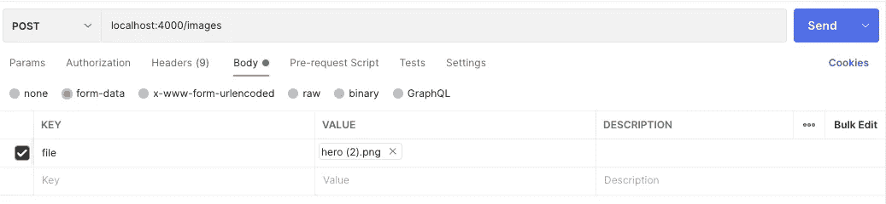

# 用 NestJS 和 MySQL 处理文件上传

> 原文：<https://betterprogramming.pub/handling-file-uploads-with-nestjs-and-mysql-10c83c80ff96>

## 使用 TypeORM 连接到 MySQL 数据库，创建一个实体，并将图像上传到 Nestjs 应用程序。


# 介绍

许多开发人员鄙视处理文件上传。这可能是由于缺乏关于最佳方法的知识，或者难以确定如何配置 Nest.js 应用程序来处理文件上传。许多人可能希望将他们的文件直接保存到 MySQL 数据库，或者保存图像名称并将图像保存在磁盘存储上:这完全取决于他们的偏好和他们想要实现的目标。本教程将教你如何使用 Nestjs 和 MySQL 建立一个文件上传功能。

# 先决条件

在开始学习本教程之前，请确保您的系统满足以下要求:

*   您的系统正在运行版本 14 或更高版本的 [Node.js](https://nodejs.org/en/download/) 。
*   您的系统安装了一个 [MySQL 数据库](https://www.mysql.com/downloads/)。
*   您已经安装了[邮递员](https://www.postman.com/)。

# 设置 NestJS

满足上述要求后，继续安装 Nestjs CLI，并通过运行以下命令创建一个新项目:

```
$ npm i -g @nestjs/cli
$ nest new file-upload
```

这些命令将安装 Nestjs CLI，并使用下面的文件夹结构创建一个新的 Nestjs 项目。

```
📦file-upload
┣ 📂src
┃ ┣ 📜app.controller.spec.ts
┃ ┣ 📜app.controller.ts
┃ ┣ 📜app.module.ts
┃ ┣ 📜app.service.ts
┃ ┣ 📜image.entity.ts
┃ ┗ 📜main.ts
┣ 📂test
┃ ┣ 📜app.e2e-spec.ts
┃ ┗ 📜jest-e2e.json
┣ 📜.eslintrc.js
┣ 📜.gitignore
┣ 📜.prettierrc
┣ 📜README.md
┣ 📜nest-cli.json
┣ 📜package-lock.json
┣ 📜package.json
┣ 📜tsconfig.build.json
┗ 📜tsconfig.json
```

创建 Nestjs 项目后，继续下一步——通过运行以下命令安装应用程序所需的依赖项:

```
npm install --save @nestjs/typeorm typeorm mysql2
```

在上面的命令中，您已经安装了 [TypeORM](https://typeorm.io/) 和 [mysql2](https://github.com/brianmario/mysql2) 模块:它们将使您能够将应用程序连接到 mysql 数据库并对其执行操作。

# 设置 MySQL 数据库

安装了上述依赖项后，继续设置并连接到 MySQL 数据库。首先，用下面的代码片段将代码添加到`app.module.ts`文件中。

```
...
import { TypeOrmModule } from '@nestjs/typeorm';
import { Image } from './image.entity';

@Module({
  imports: [TypeOrmModule.forRoot({
    type: 'mysql',
    host: 'localhost',
    port: 3306,
    username: 'root',
    password: '1234',
    database: 'blog',
    entities: [Image],
    synchronize: true,
  }),
  TypeOrmModule.forFeature([Image])
  ],
  ...
})
...
```

在上面的代码片段中，我们从之前安装的 typeorm 模块中导入了`TypeOrmModule`。我们使用`forRoot`方法将应用程序连接到 MySQL 数据库，并传递数据库凭证。这里要指出的另一件事是`entities`属性，它允许我们在模块中指定实体，并让我们访问您将很快创建的`Image`实体:我们还将`synchronize`属性设置为`true`来自动迁移数据库。

# 创建图像实体

接下来，让我们创建我们前面提到的图像实体。首先，在 src 目录中创建一个 image.entity.ts 文件，并添加下面的代码片段。

```
import { Entity, Column, PrimaryGeneratedColumn, CreateDateColumn, UpdateDateColumn } from 'typeorm';

@Entity()
export class Image {
    @PrimaryGeneratedColumn()
    id: number;

    @Column()
    name: string;

    @CreateDateColumn()
    dateCreated: Date;

    @UpdateDateColumn()
    dateUpdated: Date;
}
```

在上面的代码片段中，我们导入了创建实体所需的装饰器。使用这些装饰器，我们定义了实体的属性。我们有使用`@PrimaryGeneratedColumn()`装饰器为数据库中的每条记录生成随机 id 的`id`字段，存储将使用`@Column`装饰器上传的图像名称的`name`字段，保存使用`@CreateDateColumn()`和`@UpdateDateColumn()`创建和更新记录的日期的 dateCreated 和 dateUpdate 字段。

# 创建上传服务

创建图像实体后，让我们创建一个服务来执行 CRUD 操作，以处理文件上传。在`app.service.ts`文件中，添加下面的代码片段。

```
import { Injectable } from '@nestjs/common';
import { InjectRepository } from '@nestjs/typeorm';
import { Repository } from 'typeorm';
import { Image } from './image.entity';

@Injectable()
export class AppService {
  constructor(
    @InjectRepository(Image)
    private readonly imageRepository: Repository<Image>,
  ) {}

  async getImages(): Promise<Image[]> {
    return this.imageRepository.find();
  }

  async createImage(image: Image): Promise<Image> {
    return this.imageRepository.save(image);
  }

  async getImage(id: number): Promise<Image> {
    return this.imageRepository.findOneBy({ id });
  }

  async deleteImage(id: number): Promise<void> {
    await this.imageRepository.delete(id);
  }
}
```

在上面的代码片段中，我们导入了`injectRepository`装饰器，将`imageRepository`注入到`AppService`和`Repository`中，这为您提供了在数据库上执行某些操作所需的方法。因此，对于`createImage`图像服务，我们保存上传的图像名称，该名称将通过控制器传递。

# 创建上传控制器

现在让我们创建控制器来使用服务。并添加下面的代码片段。

```
import { Injectable } from '@nestjs/common';
import { InjectRepository } from '@nestjs/typeorm';
import { Repository } from 'typeorm';
import { Image } from './image.entity';

@Injectable()
export class AppService {
  constructor(
    @InjectRepository(Image)
    private readonly imageRepository: Repository<Image>,
  ) {}

  async getImages(): Promise<Image[]> {
    return this.imageRepository.find();
  }

  async createImage(image: Image): Promise<Image> {
    return this.imageRepository.save(image);
  }

  async getImage(id: number): Promise<Image> {
    return this.imageRepository.findOneBy({ id });
  }

  async deleteImage(id: number): Promise<void> {
    await this.imageRepository.delete(id);
  }
}
```

在上面的代码片段中，我们导入了几个装饰器，如`FileInterceptor`、`UploadedFile`和`UseInterceptors`。路由处理器的`FileInterceptor()`拦截器使用`@UploadedFile()`装饰器从请求中提取文件。`FileInterceptor()`装饰器从`@nestjs/platform-express`包中导出。`@UploadedFile()`装饰器是从`@nestjs/common`导出的。`FileInterceptor()` decorator 有两个参数，`fieldName`是提供保存文件的 HTML 表单中的字段名称的字符串，`options`是 MulterOptions 类型的可选对象。这是 multer 构造函数使用的同一个对象。

关于`createImage`函数，我们使用前面提到的 decorators 来处理文件上传，使用`FileInterceptor()`传递图像的字段名，并且我们修改了`FileInterceptor()`函数，通过使用`multer`中可用的`diskStorage`函数指定`storage`属性来将图像上传到磁盘。然后，我们指定图像的位置，并为图像生成随机名称。此外，我们添加了一个`filter`属性来限制某些图像格式的上传。现在我们使用`@UploadedFile()` decorator 提取文件，获取文件名并保存到数据库中。这样，我们可以使用每个图像的名称从存储位置获取图像。

要使上述代码运行，您需要在终端中运行以下命令来安装 multer:

```
npm i -D @types/multer
```

然后，您需要在`app.module.ts`文件的导入数组中注册 multer 模块:

```
...
import { MulterModule } from '@nestjs/platform-express';

@Module({
  ...
  MulterModule.register({
    dest: './files',
  }),],
  ...
```

上面的配置告诉 multer 处理文件上传和文件上传到的位置。最后但同样重要的是，我们应该在`src`目录中创建一个`files`文件夹来实际存储文件。

# 提供文件

要将上传到您应用程序上的图像实际提供给用户，您需要通过运行下面的命令来安装`serve-static`模块。

```
npm install --save @nestjs/serve-static
```

然后，用下面的代码片段将`ServeStaticModule`注册到`app.module.ts`文件的导入数组中。

```
...
import { ServeStaticModule } from '@nestjs/serve-static';
import { join } from 'path';

@Module({
  ...
  ServeStaticModule.forRoot({
    rootPath: join(__dirname, '..', 'files')
  }),],
  ...
```

在上面的代码片段中，您已经指定了文件所在的位置，并且可以从该位置提供服务。

# 测试 API

现在打开 Postman，通过向端点`localhost:4000/images`发送 POST 请求来测试应用程序，并将请求体中的有效负载作为表单数据传入。



如果您现在查看 files 文件夹，您应该会看到您上传的文件。请随意继续:测试并尝试其他路线。

# 结论

通过本教程，您已经学习了如何使用 NestJS 和 MySQL 处理文件上传。您已经学习了如何使用 TypeORM 连接到 MySQL 数据库，还创建了一个实体并将图像上传到 Nestjs 应用程序。

你已经成功地用 NestJS 和 MySQL 构建了一个文件上传特性:但是，对于你的数据库和应用程序的未来，请记住，持续关注你的应用程序和数据库不仅仅是为它们构建特性:[像 Arctype](https://arctype.com) 这样的 SQL 客户端将允许你编写 SQL 查询并优化它们，以及可视化数据库中当前存在的数据， 并且[Arctype 博客上的内容](https://arctype.com/blog)将让您轻松地学习如何[优化所有 MySQL 实例的安全性、可用性和性能](https://arctype.com/blog/mysql-storage-engine-big-data/)，并为您提供关于整个数据库世界的许多见解。

如需进一步阅读，还可以在 [Nestjs](https://docs.nestjs.com/techniques/file-upload) 中阅读更多关于上传文件的内容。对于额外的挑战，尝试通过保护删除和更新路由来扩展应用程序。你下一步会建什么？