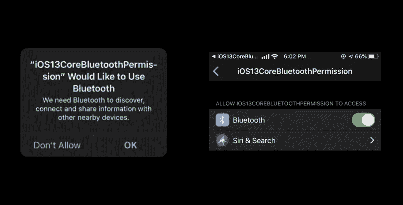
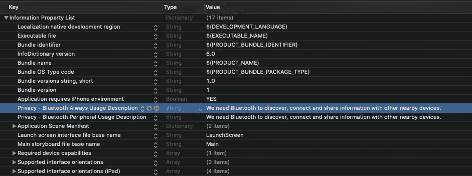
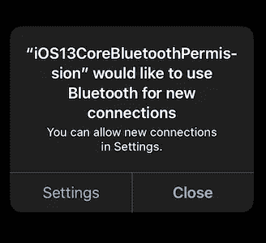

# 处理 iOS 13 蓝牙权限

> 原文：<https://betterprogramming.pub/handling-ios-13-bluetooth-permissions-26c6a8cbb816>

## 需要访问 CoreBluetooth？先问用户。


布雷特·乔丹在 [Unsplash](https://unsplash.com?utm_source=medium&utm_medium=referral) 上拍摄的照片

核心蓝牙框架是一个抽象层，为开发人员提供对 BLE 硬件的访问。苹果在 2019 年 WWDC 期间推出了不少更好的变化。除了快速传输和节能连接之外，用户隐私也备受关注。

在 iOS 12 之前，应用程序可以在用户不知情的情况下访问蓝牙。这样做可能有很好的理由，比如连接到 Chromecast 或无线耳机。

但这也有其自身的缺陷，并在用户的隐私方面创造了一个漏洞。开发人员可以利用这一点，跟踪位置数据等信息。

从 iOS 13 开始，如果你的应用程序使用任何核心蓝牙 API，它需要用户的许可。当然，他们可以从设置中更改它！



新的蓝牙权限。如果从 iOS 13 开始使用核心蓝牙则需要。

> 如果你已经把你的设备升级到了 iOS 13，我相信你会多次看到上面的提示！
> 
> 它揭示了迄今为止使用蓝牙的应用程序的数量。

# 隐私权限和使用说明

从 iOS 13 开始，开发者必须通过在他们的`info.plist`文件中包含`NSBluetoothAlwaysUsageDescription`来指定蓝牙的隐私使用描述。在没有使用说明的情况下访问核心蓝牙会导致运行时崩溃。

为了向后支持旧的 iOS 版本，还需要定义`NSBluetoothPeripheralUsageDescription`。



我最新的 iOS 应用程序 info.plist 文件的截屏。

# API 变更

`CBManagerAuthorisation`是新增加的属性是 iOS 13。用于确定蓝牙权限的授权状态。

`authorization`属性可以有以下任何一种状态:

*   `allowedAlways`
*   `restricted`
*   `notDetermined`
*   `denied`

在下一节中，我们将讨论将 CoreBluetooth 集成到您的应用程序中需要遵循的各个步骤。

# 履行

`import CoreBluetooth`为了在您的代码库中使用核心蓝牙框架。

为了使用核心蓝牙功能，我们需要实现`CBPeripheralDelegate`和`CBCentralManagerDelegate`协议。

## 初始化蓝牙管理器

`CBCentralManager`负责扫描和连接设备。一旦连接完成，`CBPeripheral`就会接管整个过程。

```
var centralManager: CBCentralManager?
var peripheral: CBPeripheral?

override func viewDidLoad() {
    super.viewDidLoad()
    centralManager = CBCentralManager(delegate: self, queue: nil) 
}
```

当`CentralManager`初始化时，触发`centralManagerDidUpdateState(_central: CBCentralManager)`委托方法来检查蓝牙连接的状态。

> 如果蓝牙被关闭，CBCentralManager 不能被实例化，系统会自动抛出一个对话框提示，要求您启用它。



我们可以使用`central.state.authorization`属性来检查用户授权状态。

```
func centralManagerDidUpdateState(_ central: CBCentralManager) {
           switch central.state {
           case .unauthorized:
               switch central.authorization {
               case .allowedAlways:
               case .denied:
               case .restricted:
               case .notDetermined:
           }
           case .unknown:
           case .unsupported:
           case .poweredOn:
               self.centralManager?.scanForPeripherals(withServices: nil, options: [CBCentralManagerScanOptionAllowDuplicatesKey:true])
           case .poweredOff:
           case .resetting:
           @unknown default:
           }
 }
```

只有当状态变为`poweredOn`时，才能扫描设备

> 注:核心蓝牙仅扫描 BLE 设备。

## 连接到扫描的设备

一旦发现 BLE 设备，它会以以下方式显示:

```
func centralManager(_ central: CBCentralManager, didDiscover peripheral: CBPeripheral, advertisementData: [String : Any], rssi RSSI: NSNumber) {

        self.peripheral = peripheral
        self.peripheral?.delegate = self

        centralManager?.connect(peripheral, options: nil)
        centralManager?.stopScan()
 }
```

然后，我们可以从`peripheral.name`属性中访问蓝牙设备名称。

从这里开始`CBPeripheralDelegate`开始控制。我们可以利用它的委托方法来获得关于外围设备特征的通知。

我们还可以在外设实例上使用`writeValue`函数传递数据。积极的一面是用户意识到了！

# 结论

苹果试图通过新的 iOS 13 权限提升蓝牙安全性，从而提供透明度并改善用户体验。
这一条就到此为止。我希望你喜欢它。