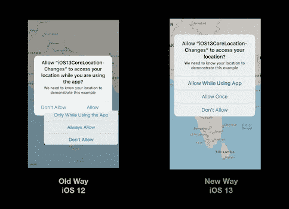
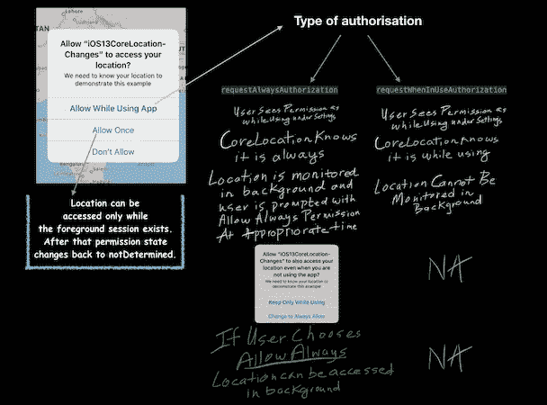

# 处理 iOS 13 位置权限

> 原文：<https://betterprogramming.pub/handling-ios-13-location-permissions-5482abc77961>

## 新权限，更多隐私


照片由[марьянблан](https://unsplash.com/@marjan_blan?utm_source=unsplash&utm_medium=referral&utm_content=creditCopyText)在 [Unsplash](https://unsplash.com/s/photos/map?utm_source=unsplash&utm_medium=referral&utm_content=creditCopyText) 上拍摄

苹果在 [WWDC 2019](https://developer.apple.com/videos/play/wwdc2019/705/) 期间展示了核心位置框架的变化。位置权限在 iOS 13 中有了更好的改变。用户的隐私受到了更多的重视。

苹果不仅增加了一个新的权限类型允许一次，而且他们改变了总是允许权限的工作方式。

# 核心位置有什么变化？

随着 iOS 13 的发布，核心位置框架发生了变化。现在你会看到一个不同类型的位置许可对话框。它有一次新的许可。

下图显示了从 iOS 12 到 iOS 13 的权限模型更改。



iOS 12 与 13 位置权限对比

# 核心位置许可授权

为了显示位置许可，我们需要以两种方式之一配置`CLLocationManager`实例:

*   `requestAlwaysAuthorization`
*   `requestWhenInUseAuthorization`

iOS 13 要求在`info.plist`文件中增加以下两条隐私使用说明:

*   `NSLocationWhenInUseUsageDescription`
*   `NSLocationAlwaysAndWhenInUseUsageDescription`

# 设置核心位置

下面是让您开始使用 iOS 应用程序中的核心位置的代码:

```
var locationManager = CLLocationManager()
locationManager.requestAlwaysAuthorization() 
//or use requestWhenInUseAuthorization()locationManager.desiredAccuracy = kCLLocationAccuracyBest
locationManager.startUpdatingLocation()
locationManager.allowsBackgroundLocationUpdates = true
locationManager.pausesLocationUpdatesAutomatically = false
```

对于`allowsBackgroundLocationUpdates`，确保您已经从 Xcode 项目的功能中启用了后台模式位置。

不再浪费时间，让我们深入研究新的位置许可模型。

# 位置权限:引擎盖下

iOS 13 有以下三个位置权限(忽略拒绝，因为它忽略了权限):

*   **使用时允许** —拥有允许的超能力
*   **允许一次** —使用中暂时允许
*   **允许** —推迟到真正需要的时候

下面是新权限模型的工作流程:



# 允许一次权限

Allow Once 类似于 Allow While Using，但仅用于一个前台会话。这意味着一旦你离开应用程序相当长一段时间，许可状态就会变成`notDetermined`。

下次用户启动应用程序时，开发人员可以根据他们的用例再次请求权限。这让用户对位置数据有了更好的控制，也让开发人员可以轻松处理一次性的位置案例。

# 使用权限时，“允许”总是隐藏在“允许”中

“使用权限时允许”推迟“总是允许”权限。

默认情况下，新权限对话框中没有“始终允许”权限。它以临时形式存在，以便在实际需要时使用。

让我们来看看不同类型的位置授权是如何工作的。

## **案例 1** :请求 AlwaysAuthorization

*   使用权限句柄时允许仅当您使用`requestAlwaysAuthorisation`请求位置授权时才允许权限。
*   使用上述类型的授权，用户将其视为前台权限，但是`CoreLocation`通知代理这是`always`权限。这样，它可以在后台监控位置事件，但是`CLLocationManagerDelegate`不能接收这些事件。
*   `CoreLocation`持有事件，并在适当的时候询问用户是否愿意`**Allow Always?**`。之后，也可以在后台接收位置事件。
*   这样,“始终允许”会推迟到真正需要用户同意才能在后台更新位置的阶段。
*   上述情况使得始终允许临时授权。

## **案例二** : `requestWhenInUseAuthorization`

*   在这种情况下，Always Allowed 永远不会发生，因为开发人员自己没有在`CLLocationManager`实例上设置它。
*   仅当应用程序在前台时才访问位置(尽管一旦用户切换到后台，它会在很短的时间间隔内继续访问它)。

# 结论

新的权限模型要简单得多，因为它在提示中隐藏了总是允许的选项，并使其成为使用权限时的一部分。

对于“始终允许”，当您尝试在后台访问该位置时，它会要求用户同意。这样，它努力向用户提供关于何时访问该位置的清晰和透明性。

总结了这篇文章。这里有一个[的例子](https://github.com/anupamchugh/iowncode/tree/master/iOS13CoreLocationChanges)的`MapKit`和`CoreLocation`带有新的 iOS 13 位置权限。