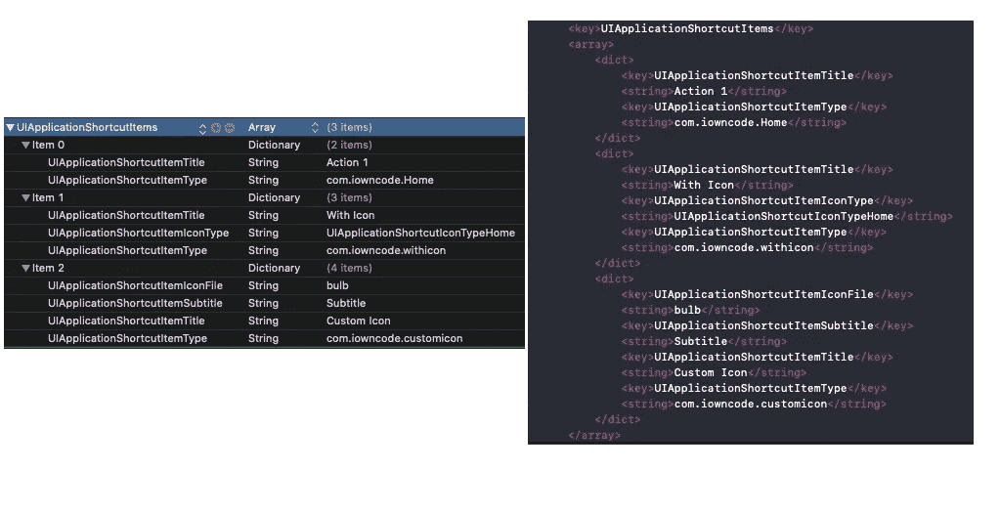
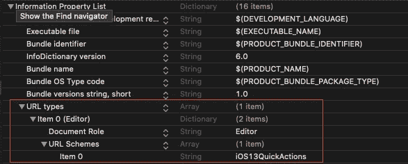
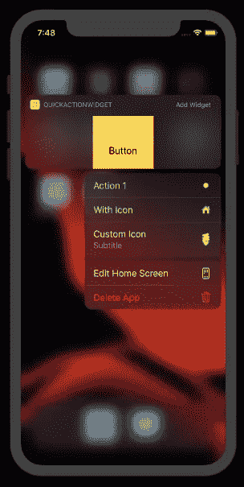

# 处理 iOS 13 快速操作

> 原文：<https://betterprogramming.pub/handling-ios-13-quick-actions-67f9e304dcc6>

## 了解如何配置上下文菜单快捷方式和小部件


照片由[迈克·尤克丹科](https://unsplash.com/@yamaicle?utm_source=medium&utm_medium=referral)在 [Unsplash](https://unsplash.com?utm_source=medium&utm_medium=referral) 上拍摄

iOS 13 通过摆脱 3D 触摸，支持触觉触摸手势，标准化了所有设备的主屏幕快速操作。这一变化的一个积极方面是消除了长按和强制触摸按压手势之间的手势冲突。

在过去，这很棘手，因为打开快速动作需要用力触摸，而卸载应用程序需要正常的按压才能产生抖动效果。现在，3D 触摸不再存在，访问快速操作比以往任何时候都更加流畅和快速。

主屏幕快速操作通过设置快捷菜单来提供导航到应用程序特定部分的便捷方式，长按应用程序的启动器图标即可查看快捷菜单。在 iOS 13 中，快速操作现在在每个快速操作菜单中隐式提供删除、重新排列和共享应用程序操作。

此外，我们可以通过显示带有快速操作菜单的小部件来进一步增强用户体验。小部件扩展有助于向用户显示有用的信息(如标题、钱包金额或股票价格)，同时还提供了添加到当前小部件屏幕的能力。

# 我们的目标

在接下来的几节中，我们将探索创建快速动作的不同方法以及处理菜单选择的方法。

此外，我们将在我们的操作菜单旁边集成一个小部件，这是 iOS 13 应用程序中相当常见的设计。

# 快速操作菜单

快速动作菜单有两种类型——静态或动态。

静态的永远不会改变，它们被定义在`UIApplicationShortcutItems`下的`Info.plist`文件中——这个键为菜单项保存了一个字典数组。另一方面，当您的菜单动作是特定于用户或会话的，如显示最常访问或最后访问的屏幕时，使用动态菜单动作。

让我们看看这些快速动作类型是如何在 iOS 应用程序中实现的。创建一个新的 Xcode 项目来开始。

# 静态快速动作

静态快速动作在`Info.plist`文件中定义如下:



Info.plist 以及 XML 版本

字典的`UIApplicationShortcutItems`数组中的每一项都必须定义自己的`UIApplicationShortcutItemTitle`和`UIApplicationShortcutItemType`属性。

可选地，使用`UIApplicationShortcutItemSubtitle`进行描述。`IconType`或`IconFile`可用于设置菜单项的图标。图标颜色是单色的，因此建议不要在菜单中使用表情图标。

此外，我们可以将每个条目的数据保存在`UIApplicationShortcutItemUserInfo`字典中。`userInfo`值需要符合`[NSSecureCoding](https://developer.apple.com/documentation/foundation/nssecurecoding)`协议。

下图展示了我们在上面定义的`Info.plist`的静态快速动作示例:


# 动态快速动作

动态快速操作要求应用程序至少加载一次。通常，这些动作应该在用户返回主屏幕时触发的`AppDelegate`中创建，从而检索任何必要的应用程序数据并相应地将其转换成动态动作。

我们可以在这里为每个上下文菜单项创建`UIApplicationShortcutItem`，并将数组设置为`UIApplication`的`shortcutItems`属性，如下所示:

```
func applicationWillResignActive(_ application: UIApplication) {application.shortcutItems = [
UIApplicationShortcutItem(type: "DynamicAction",
localizedTitle: "Name",
localizedSubtitle: nil,
icon: UIApplicationShortcutIcon(type: .contact),
userInfo: nil)]}
```

# 响应快速动作选择

当按下“快速动作”上下文菜单中的项目时，会发生以下任一情况:

*   如果应用程序没有运行，调用`AppDelegate`类中的`didFinishLaunchingWithOptions`方法。我们可以通过键`UIApplication.LaunchOptionsKey.shortcutItem`从`launchOptions`字典中检索`shortcutItem`来处理菜单项的动作。
*   如果应用程序已经在运行——对于 iOS 13，`SceneDelegate`会完成所有繁重的工作。所以被点击的`shortcutItem`会触发`SceneDelegate`类的以下方法:

```
func windowScene(_ windowScene: UIWindowScene, performActionFor shortcutItem: UIApplicationShortcutItem, completionHandler: @escaping (Bool) -> Void){//Handle actions based on shortcutItem.type}
```

对于 iOS 12 和更老的版本，等效的`AppDelegate`方法被触发。

# 集成当今的小部件扩展

小部件通过在主应用程序之外提供某些实时显示视图来提供对应用程序的快速访问。我们将在我们的应用程序中添加一个今天的小部件扩展，以便用快速动作菜单来显示它。

要设置扩展，点击`+`在 Xcode 中添加一个新目标，并选择今天的扩展。这将为扩展创建相关的文件(一个 ViewController、storyboard 和`Info.plist`文件)。

接下来，在主应用程序的目标中添加一个 URL 类型。我们将使用这个 URL 方案从小部件启动应用程序。



在我们的 TodayViewController.swift 文件中，我们用 UIButton 替换了 UILabel。为了从小部件启动包含的应用程序，我们需要点击按钮打开 URL，如下所示:

```
import UIKit
import NotificationCenterclass TodayViewController: UIViewController, NCWidgetProviding {override func viewDidLoad() {
        super.viewDidLoad()
    }

    @IBAction func onButtonTap(_ sender: Any) {
        self.extensionContext?.open(URL(string: "iOS13QuickActions://")!)
    }

    func widgetPerformUpdate(completionHandler: (@escaping (NCUpdateResult) -> Void)) {
        completionHandler(NCUpdateResult.newData)
    }   
}
```

我们甚至可以在 Xcode 中启用应用程序组的功能，以便在 widget 和 iOS 应用程序之间共享数据。

作为回报，当我们长按图标时，我们从应用程序中得到以下结果:



结果

# 结论

快速操作菜单仅对 App Store 中可用的应用程序显示“共享应用程序”操作。此外，我们看到了今天的扩展和快速动作菜单如何提供对应用程序内容的快速访问。你可以从 [Github 库](https://github.com/anupamchugh/iowncode/tree/master/iOS13QuickActions)下载完整的源代码。