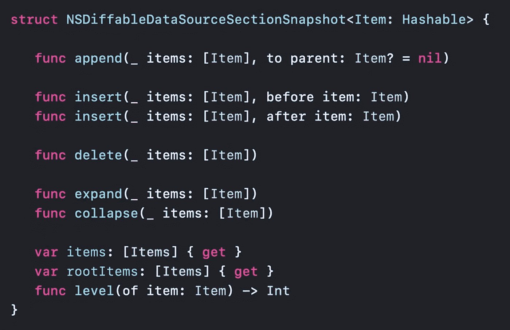
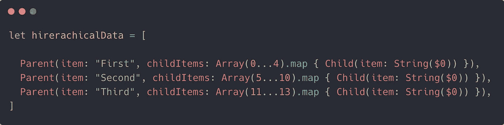
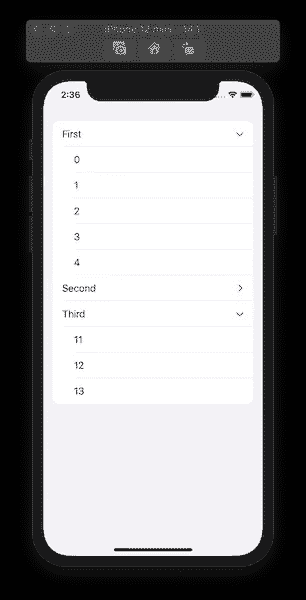
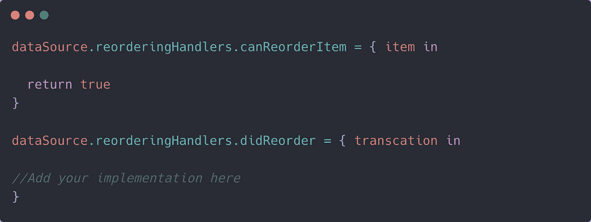
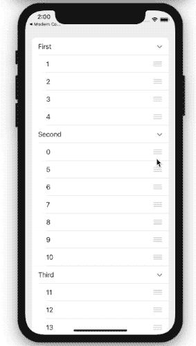
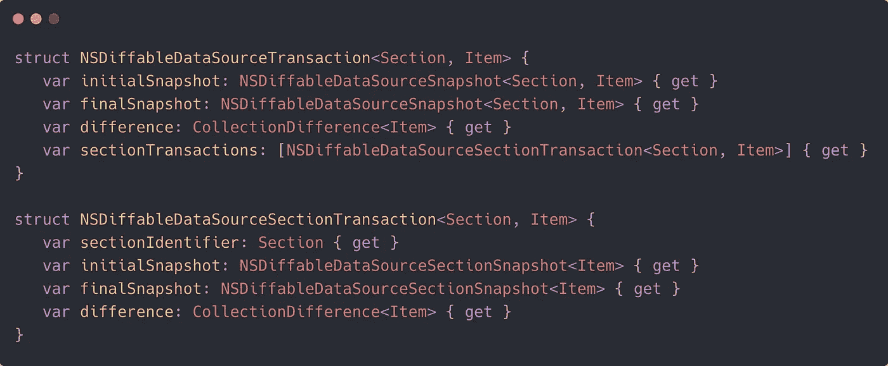

# 处理 iOS 14 不同的数据源

> 原文：<https://betterprogramming.pub/handling-ios-14-diffable-data-sources-29ebb6c53af4>

## 可区分的数据源获得节快照和一流的重新排序支持


Jess Bailey 在 [Unsplash](https://unsplash.com?utm_source=medium&utm_medium=referral) 上拍摄的照片。

尽管在 iOS 13 中引入了 SwiftUI(一种声明式 UI 框架)，但苹果仍然对 UIKit 框架进行了大量新的更改。突出的特性包括对`UICollectionView`的增强。

具体来说，[组合布局](https://medium.com/better-programming/ios-13-compositional-layouts-in-collectionview-90a574b410b8)和不同的数据源 API 允许更容易地构建高级`CollectionView`布局和集中式数据源。

iOS 14 更进一步，带来了新的细胞注册 API，并在`UICollectionView`内为`UITableView`提供开箱即用的支持。

但更重要的是，iOS 14 中可区分的数据源现在包括了节快照。这意味着你现在可以在每个部分的基础上更新数据，这在构建概述风格的列表中非常有用，这是 iOS 14 引入的新的分层设计。

一流的重新排序能力是今年不同数据源的另一个特点。

# 我们的目标

*   不同数据源的快速回顾。
*   了解如何实现节快照。
*   深入研究新的重新排序 API。

# 不同数据源概述

在这个新的声明式 API 之前，开发人员不得不依靠`numberOfItemsInSection`、`numberOfSections`、`cellForItemAt`方法来创建数据源。为了更新数据，`performBatchUpdates()`和`reloadData()`是常用的方法。

这种方法工作得很好，但是导致了分散的数据源。更糟糕的是，`reloadData()`方法毁了我们展示好动画的机会，而`performBatchUpdates`会无意中导致常见的错误，比如`NSInternalInconsistencyException`。

有了新的可区分数据源，我们就有了一个集中的专用数据源，其中的数据是通过快照提供的。

快照代表数据的单一状态，不依赖于索引路径来更新项目。相反，它依赖类型安全的唯一标识符来标识唯一的节和项。

更好的是，您可以使用`apply`方法将`NSDiffableDataSourceSnapshot`实例设置为`UITableView`或`UICollectionView`的数据源，并让它处理动画。有趣的是，`apply`方法也可以从后台线程执行。

总而言之，不同的数据源计算差异，并允许在我们的`UICollectionView`和`UITableView`布局中更容易地管理数据源。您可以访问`dataSource.snapshot()`来访问 UI 元素的当前状态，并相应地添加/删除项目。

# iOS 14 引入 SectionSnapshots

在 iOS 14 之前，要在 iOS 13 中填充项目和部分，我们必须在`NSDiffableDataSourceSnapshot`上使用以下方法:

```
var snapshot = NSDiffableDataSourceSnapshot<String, String>()        snapshot.appendSections(["1", "2"]) 
```

为了在一个部分中添加项目，我们使用下面的方法:

```
snapshot.appendItems(["1.1"], toSection: "1")
snapshot.appendItems(["2.1"], toSection: "2")
```

那么，考虑到我们已经可以在每个部分的基础上添加项目，新的`NSDiffableDataSourceSectionSnapshot` API 会带来什么呢？

简而言之:定制概要/可扩展列表。

通过使用`NSDiffableDataSourceSectionSnapshot` API，您可以轻松地创建和更新可扩展的集合视图，并且能够扩展和折叠某些部分。这在构建分层数据时非常方便。

以下是 iOS 14 中新的部分快照所公开的方法:



现在，让我们通过为我们的数据源使用全新的部分快照来创建一个 iOS 14 `CollectionView`。

## 创建您的数据模型

我们的数据源将保存字符串的分层数据。因此，让我们用一个`childItems`数组创建两个条目结构:

由于父项(标题)和`childItems`都是字符串，我们需要一种方法来区分它们的类型，以区别它们要放入的`UICollectionViewCell`。可以理解的是，我们将为这两种情况创建一个案例枚举:

```
**enum** OutlineItem: Hashable {
**case** parent(Parent)
**case** child(Child)
}
```

既然我们的数据模型已经准备好了，下面先来看一下将用于填充`UICollectionView`的虚拟数据:



图片作者。

## 创建我们不同的数据源

通过使用新的 iOS 14 小区注册技术，我们不需要使用传统的小区标识符初始化方式`UICollectionViewCell`。

下面看看如何在 iOS 14 `UICollectionView.CellRegistration`中创建和显示内容，并将它们传递给`UICollectionViewDiffableDataSource`:

请注意，我们已经注册了两个单元格。一个作为每个部分的根，包含公开指示符。另一个用于显示每个子项的内容。

既然我们的数据源已经准备好了，是时候将它设置在`CollectionView`上了:

```
private lazy var dataSource = makeDataSource()
```

最后，我们将对上面的数据源应用快照。

## 构建截面快照

截面快照按以下方式构建:

我们已经遍历了`hierarchical`数据，并将父实例设置为每个部分的标题，其中设置了`childItems`。此外，我们还扩展了每个标题部分以显示所有项目(您也可以将其配置为仅隐藏/扩展特定部分)。

最后，截面快照应用于`UICollectionView`的根截面，当在模拟器上运行时，应用程序看起来如下:



作者截图。

`UICollectionView` +不同数据源和截面快照的完整源代码[可在 GitHub](https://gist.github.com/anupamchugh/9a6555c7f3384623aa3236649d25c623) 上获得。

您还可以通过设置`dataSource`上的`sectionSnapshotHandlers`来定制各部分项目的展开状态。`SectionSnapshotHandler<Item>`提供不同的闭包，如`shouldCollapseItem`、`willCollapseItem`、`willExpandItem`和`shouldExpandItem`。

# 使用新的重新排序 API

虽然节快照有助于生成可扩展的列表并确定项目的嵌套级别(列表的根)，但还有一个重新排序 API，可以快速插入到我们不同的数据源中。

具体来说，要启用重新排序，您需要定义以下两个闭包:



可以理解的是，对于单元注册，您需要按照以下方式设置附件:

```
cell.accessories = [.reorder(displayed:.always)]
```

注意:为了简洁起见，我们将重新排序图标设置为总是显示。但建议设置一个在`whenEditing`和`whenNotEditing`状态之间切换的`Edit`按钮，用于启用/禁用重新排序。



`didReorder`和`willReorder`闭包通过了一种称为`NSDiffableDataSourceTranscation`的新类型。

该事务包含更新不同数据源所需的所有相关信息:



`CollectionDifference`是 Swift 5.1 中引入的新类型。它描述跨两种集合状态插入和移除项。

因此，您可以简单地用以下方式用`didReorder`闭包内重新排序的事务更新原始数据源:

```
originalDataSource.applying(transaction.difference)
```

# 结论

这篇关于 iOS 14 不同数据源变化的文章到此结束。通过使用节快照和新的重新排序 API，您可以轻松地在您的`CollectionViews`中编写和更新数据块。

感谢阅读。