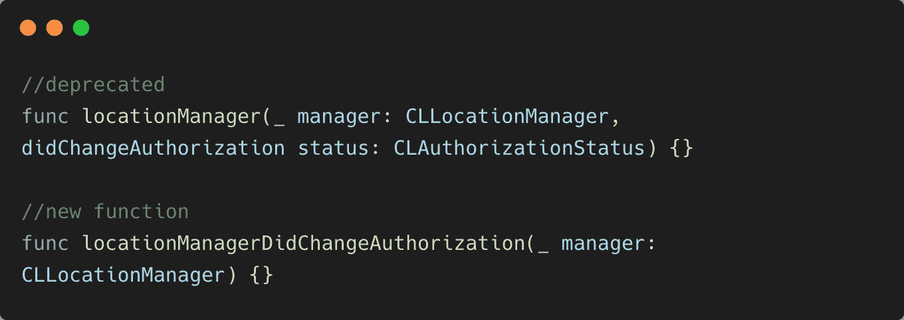
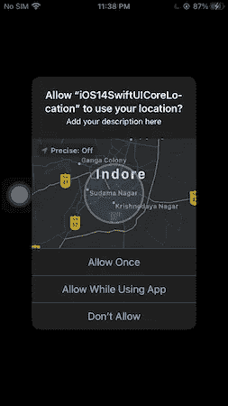
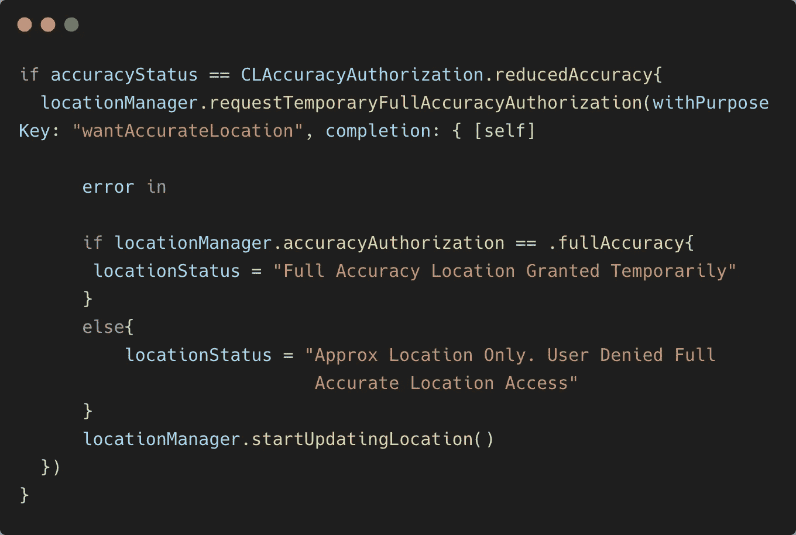
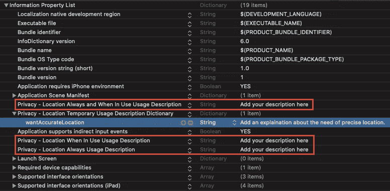
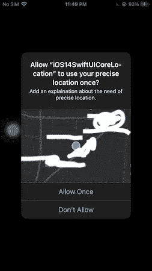

# 在 iOS 14 中处理位置权限

> 原文：<https://betterprogramming.pub/handling-location-permissions-in-ios-14-2cdd411d3cca>

## 在您的应用中管理近似位置访问


Heidi Fin 在 [Unsplash](https://unsplash.com?utm_source=medium&utm_medium=referral) 上拍摄的照片。

毫无疑问，苹果是数据隐私领域的领导者。位置访问在过去被各种应用程序错误地使用或滥用了。这是一个安全威胁——或者说是一个漏洞——随着 iOS 14 的发布，苹果再次希望让用户更好地控制他们正在分享的数据。

iOS 14 给`CoreLocation`框架带来了微小的改变。今后，用户可以选择是否提供精确或近似的位置访问。

在我们了解如何管理新的 iOS 14 位置更改之前，让我们快速回顾一下 iOS 13 位置权限中的新内容。

# iOS 13 位置权限快速回顾

去年，在 iOS 13 中，苹果改变了位置跟踪权限的工作方式。

*   值得注意的是，有一个新的“允许一次”权限需要设置`NSLocationWhenInUseUsageDescription`。需要注意的是，当应用程序关闭时，该权限会自动撤销。
*   此外，启用“使用应用程序时允许”将临时“总是允许”位置跟踪。现在，当你试图在后台访问一个位置时，系统会向用户显示一个对话框，让应用程序继续跟踪它或拒绝它。
*   iOS 13.4 引入了一种更好的方法来快速确保授予“始终允许”权限。简单地请求`authorizedWhenInUse`，如果被授权，显示`authorizedAlways`的提示。

要深入了解如何在应用程序中处理 iOS 13 位置权限，[请参考本文](https://medium.com/better-programming/handling-ios-13-location-permissions-5482abc77961)。

在下一节中，我们将了解如何在 iOS 14 SwiftUI 应用程序中管理位置更改。

让我们开始吧。

# iOS 14 核心位置变化

苹果已经否决了我们之前在`CLLocationManager`调用的类函数`authorizationStatus()`。

这意味着从 iOS 14 开始，`authorizationStatus()`只能在`CLLocationManager`的实例上调用。

苹果也不赞成使用包含`status`参数的`CoreLocation`的`didChangeAuthorization`委托函数。相反，我们现在有了一个新的`locationManagerDidChangeAuthorization`功能。



为了确定位置准确性状态，我们可以在位置管理器实例上调用新的枚举属性`accuracyAuthorization`。该属性的类型为`CLAccuracyAuthorization`，有两种枚举情况:

*   `fullAccuracy`
*   `reducedAccuracy`(返回一个大概的位置，而不是确切的位置)

设置`CoreLocation`进行位置更新与 iOS 13 中完全一样:

```
locationManager.delegate = self
locationManager.requestAlwaysAuthorization()locationManager.startUpdatingLocation()locationManager.allowsBackgroundLocationUpdates = true
locationManager.pausesLocationUpdatesAutomatically = false
```

*注意:对于* `*allowsBackgroundLocationUpdates*` *，请确保您已经从 Xcode 项目的功能中启用了后台模式位置。*

现在，当你在你的设备上运行上面的代码时，你会在 iOS 14 中得到如下修改后的提示:



截图来自作者手机。

通过切换“精确”按钮，您可以选择允许近似或精确的位置访问。

现在，可能会有一个用例，要求您只访问用户的准确位置。

令人欣慰的是，iOS 14 中有一个新功能，让我们可以临时请求:



`requestTemporaryFullAccuracyAuthorization`功能需要一个目的键来向用户解释对精确位置的需求。这个键在`NSLocationTemporaryUsageDescriptionDictionary`字典的`info.plist`文件中定义，如下所示:



一旦`requestTemporaryFullAccuracyAuthorization`被调用，将显示以下提示:



作者截图。

`reducedAccuracy`和`fullAccuracy`位置更新都是在`didUpdateLocations`委托方法中接收的。

SwiftUI 中一个示例 iOS 14 `CoreLocation`应用的完整源代码可以在 [GitHub](https://github.com/anupamchugh/iOS14-Resources/tree/master/iOS14SwiftUICoreLocation) 上获得。

需要注意的是，对于使用`reducedAccuracy`的后台位置更新，位置更新的时间间隔不会改变。此外，信标和区域监控在`reducedAccuracy`下被禁用。

# AppClips、Widgets 和默认设置的核心位置更新

AppClips 就像迷你应用程序模块，无需安装完整的应用程序即可运行。

*   当您访问 AppClips 中的某个位置时，没有“使用 App 时”权限。相反，有一个“使用到明天”的权限，在一天结束时会自动重置。
*   为了访问 WidgetKit 中的一个位置，您需要在 widget 的`info.plist`文件中定义`NSWidgetWantsLocation`键。
*   如果您的应用程序默认只显示大概位置的提示，您可以添加`info.plist`键`NSLocationDefaultAccuracyReduced`。这样，精确位置切换按钮将不会显示在权限对话框中。但是用户仍然可以从手机的设置中启用切换。

# 结论

`CoreLocation`给 iOS 14 带来了一个有趣的变化，让用户对自己的位置数据有更多的控制权。并不是所有的应用程序都需要精确的位置，所以你可以选择`reducedAccuracy`属性来获取大概的位置。

这一次到此为止。感谢阅读。