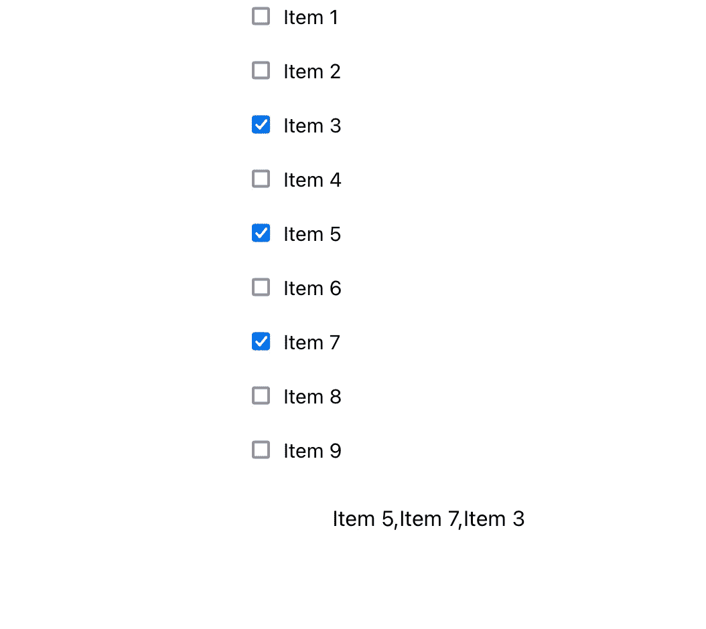

# 在 React 中处理多个复选框

> 原文：<https://betterprogramming.pub/handling-multiple-checkboxes-in-react-1ee21c8edcfa>

## 如何有效地处理任何 React 项目中的多个复选框


照片由[托马斯·博尔曼斯](https://unsplash.com/@thomasbormans?utm_source=medium&utm_medium=referral)在 [Unsplash](https://unsplash.com?utm_source=medium&utm_medium=referral) 上拍摄

# 介绍

很多时候，在任何 web 应用程序中，我们都需要从用户那里收集数据，作为特定和预定义选项的列表。这个问题，大多数时候是通过使用多个复选框来解决的。

用户可以选择它们中的一个或多个，以便创建最终的选项列表，该列表将被发送到例如 API，或者将被用作稍后在 web 应用的流程中有用的状态。

然而，我们有许多不同的方法来处理来自多个复选框的数据。一些开发人员喜欢将选项存储在一个包含所有选择的对象中，并根据每个复选框的状态将相应的值设置为 true 或 false，而其他人则喜欢将其存储在一个简单的数组中，甚至存储在浏览器的永久存储中(也称为 cookies)。

因此，在这里，我将使用尽可能少的代码来展示我认为是最有效和不言自明的方法。

# 创建项目

由于我是 typescript 的忠实粉丝(这一选择背后的原因超出了本文的范围)，我将使用 typescript 模板生成一个 react 项目。然而，相同的原则和模式可以在任何 React 项目中使用 Javascript 或 Typescript。因此，我在终端上执行的第一个命令如下:

```
create-react-app multiple-checkboxes --template typescript
```

# 创造我们需要的组件

为了实现更好的项目结构和更清晰的代码，我创建了一个名为`ListItem` **，**的组件，其中包含一个复选框和一个描述标签。我使用了`styled-components` 库来设计我在项目中使用的任何组件的样式，您可以通过键入

```
yarn add styled-components
```

因此，首先我声明了我们稍后将使用的任何样式组件，以便创建最终的`ListItem`组件:

声明我们将用来创建 ListItem 的样式化组件

然后，我们继续进行`ListItem`的实际实现，可以在下面的代码片段中看到:

ListItem 组件

正如您很容易理解的那样，该组件接收 3 个参数(又名 props)。

`text`、`handleOnChange`和`selected`。`text` prop 是将显示在复选框旁边的字符串，`handleOnChange`是在复选框的`onChange`事件上被调用的回调函数，最后`selected`是表示复选框是否被选中的布尔值。

最终的组件应该是这样的:


现在我们可以移动到项目的`App.tsx`文件来绘制 ListItem 组件的列表，并看看如何一次性处理它们。

## 呈现和处理复选框

首先，在`App.tsx`文件中，我们声明了我们需要的所有依赖项:

声明依赖关系

然后我们声明`state`，它包含一个名为 selections 的数组。该数组将保存在任何给定时间选择的所有选项。我们还声明了一个常量，名为 options，包含复选框列表的所有选项(字符串格式)。

然后，我们声明并实现一个函数，返回复选框列表。这是在`Array.map()`函数的宝贵帮助下实现的，该函数将一个`ListItem`对象映射到包含在`options`数组中的每个对象。为了避免错误，`ListItem`组件的列表必须嵌套在 div 或 React 片段组件中。

checkboxItems()函数

正如您所看到的，我们传递了一个键选项(第 6 行)，我们不需要它或者在任何地方使用它，但是，当我们使用输入组件时，设置键选项是一个很好的实践。

此外，我们用当前选项设置文本属性。

最后，我们将`ListItem`的`handleOnChange`函数设置为`handleCheckBoxChange`函数，将选项作为参数传递，如果当前选项包含在选择状态数组中，我们还将所选属性设置为 true，如果不包含，则设置为 false。

## handleCheckboxChange 函数如何工作

`handleCheckboxChange(key: string)`函数是实际处理和更新复选框状态的函数。它出现在下面的代码片段中:

handleCheckboxChange(key:string)函数

当一个复选框的值已经改变，关键参数被设置为相应的选项时，该函数被调用，试图找到刚刚改变的选项已经包含在`state.selections`数组中。

如果找到(`find > -1`)，则意味着该复选框在之前的状态下被选中，现在用户取消选中/取消选中它，因此该功能通过将其从选择数组中移除而继续。

否则(第 6 行)，当前选项在之前的状态中没有被选中，现在用户只是选中了它，所以函数将它附加到`state.selections`数组中。

## 把所有的放在一起

现在我们已经实现了复选框背后的业务逻辑，是时候将它们放在一起并呈现在页面中了。所以在 App 组件的 return 语句中，我们返回如下内容:

把所有的放在一起

该语句在主应用程序视图中追加复选框列表，还添加了一个段落项，以字符串列表的形式显示当前选择的选项。最终视图应该是这样的:



那都是乡亲们！

我希望你喜欢这篇文章，你学到了一些有用的东西。完整的项目和代码可以在我的 [GitHub](https://github.com/petrosDemetrakopoulos/react-multiple-checkboxes) 上找到。