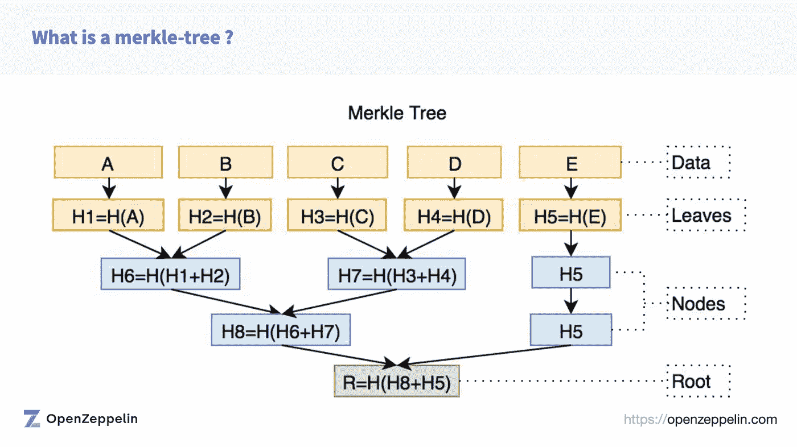
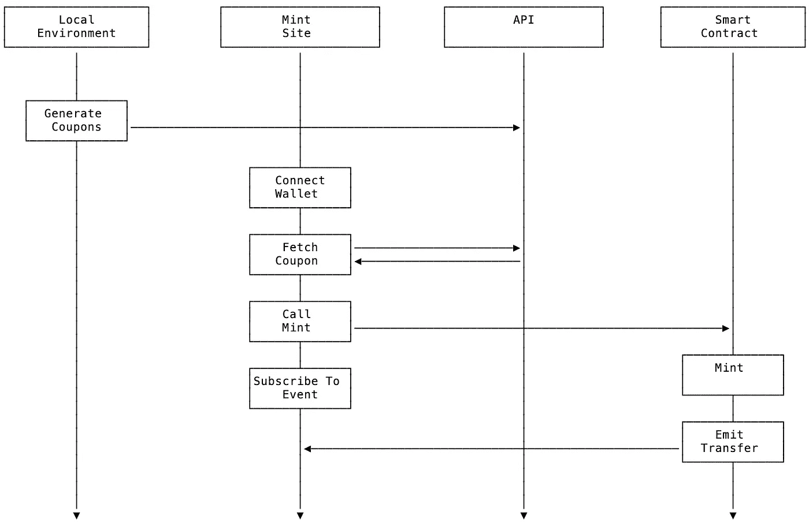
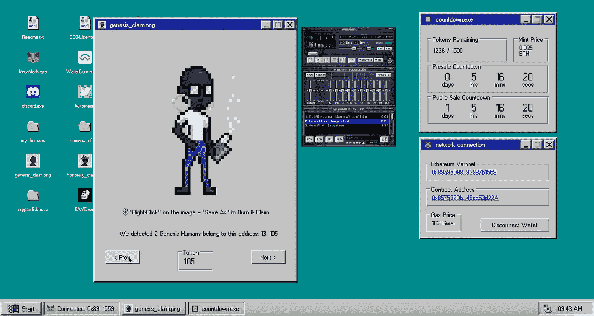

# 处理 NFT 预售——允许列表离线

> 原文：<https://betterprogramming.pub/handling-nft-presale-allow-lists-off-chain-47a3eb466e44>

## 一种使用离线生成的签名优惠券而不是链上允许列表的新方法。


NFT 的人类是一个由 1500 个真正独特的角色组成的项目，他们把以太坊区块链称为家。每个人都有一个手写的背景故事，由我们社区的一名成员贡献。在我们的[上一篇](https://medium.com/@humansofnft/designing-an-nft-smart-contract-for-flexible-minting-and-claiming-5b420a9a2d82)文章中，我们提供了一些背景，解释了为什么我们需要在一个契约中有如此多的铸造和声明机制。

经验证的合同可在 Etherscan 上查阅:

```
[https://etherscan.io/address/0x8575B2Dbbd7608A1629aDAA952abA74Bcc53d22A#code](https://etherscan.io/address/0x8575B2Dbbd7608A1629aDAA952abA74Bcc53d22A#code)
```

# **反对线上预售/允许列表的理由**

有很多不同的策略来处理一个*预售名单*在 NFT 的投放。您还会听到它被称为*白名单*，或*允许列表*以及其他名称。它只是指允许以特定方式与合同进行交互的预先批准的地址列表，例如在预售窗口期间生成。

一种常见的方法是在契约的存储中简单地包含一个数据结构，该数据结构将每个`address`映射到一个`bool`，或者将每个`address`映射到该地址所允许的铸币数量，看起来可能类似于:

```
mapping(address => uint8) _allowList;function setAllowList(
address[] calldata addresses, 
uint8 numAllowedToMint
) external onlyOwner {
  for (uint256 i = 0; i < addresses.length; i++) {
    _allowList[addresses[i]] = numAllowedToMint;
  }
}
```

这种方法绝对没有问题，但是在填充地址列表时，对于合同所有者来说，代价可能会高一些(`onlyOwner` 修饰符表示该函数只能由合同所有者调用)。如果您需要在预售列表中添加 1000 个地址之类的东西，那么在存储操作上会花费大量的时间。因为人类合同必须考虑几个不同的“列表”(作者、荣誉、预售、创世纪声明)，我们得出结论，这可能不是我们的最佳方法。

# **关于 Merkle 树的争论**

在我们寻找更有效的方法时，使用了很多 Merkle 树。在做了大量的研究并了解了它们的工作原理之后，我们决定走 Merkle Tree 路线。有许多关于 Merkle Trees 的文章和资源。有一个非常棒的媒体帖子 [(1)](https://nftchance.medium.com/the-gas-efficient-way-of-building-and-launching-an-erc721-nft-project-for-2022-b3b1dac5f2e1) 是由核呆子智能合同的团队发布的，这本身就非常令人印象深刻，你应该去看看！它链接到一些关于 Merkle Trees 的好资源，此外还有大量关于 gas 优化策略的附加信息——我们稍后也会涉及其中的一些。另一个很好的资源是来自 Openzeppelin [(2)](https://github.com/OpenZeppelin/workshops/blob/master/06-nft-merkle-drop/slides/20210506%20-%20Lazy%20minting%20workshop.pdf) 的一个演示，介绍了它们的实现以及如何进行 merkle-proof 验证。

我不打算用这篇文章来解释 Merkle 树是如何工作的，因为有许多资源，其中一些我已经提到过，会比我做得更好。要点是 Merkle 树是哈希树(即存储哈希的多分支树)。树中的每个叶子都包含其父数据块的散列。每个非叶(节点)由其子节点的散列组成，依此类推。然后，我们可以使用根(我们将在合同中设置)来验证树中任何数据片段(在我们的例子中是地址)的存在。这是验证大型数据结构(例如预售地址列表)内容的一种非常有效(并且安全)的方式。



前面提到的 Openzeppelin 演示中的 Merkle 树图。

这是我们最初决定采用的方法，它包括三个独立的 Merkle 树(创建、荣誉和售前)。它包括创建三个独立的链外 merkle 树，并通过专用的`onlyOwner` 函数调用在合同中为每个销售/索赔事件设置 Merkle 根。虽然您不会在我们的最终契约中看到该实现(原因我们稍后会讨论)，但该实现看起来像这样(为了清楚起见，缩写为):

```
import '@openzeppelin/contracts/utils/cryptography/MerkleProof.sol';...// declare bytes32 variables to store each root (a hash)bytes32 public genesisMerkleRoot; 
bytes32 public authorsMerkleRoot; 
bytes32 public presaleMerkleRoot;...// separate functions to set the roots of each individual Merkle Treefunction setGenesisMerkleRoot(bytes32 _root) external onlyOwner {
 genesisMerkleRoot = _root; 
} function setAuthorsMerkleRoot(bytes32 _root) external onlyOwner {
  authorsMerkleRoot = _root; 
}function setPresaleMerkleRoot(bytes32 _root) external onlyOwner {
  presaleMerkleRoot = _root; 
}...// create merkle leaves from supplied datafunction _generateGenesisMerkleLeaf(
  address _account, 
  uint256 _tokenId
)  internal  pure  returns (bytes32) {  
 return keccak256(abi.encodePacked(_tokenId, _account)); 
}function _generateAuthorsMerkleLeaf(
  address _account, 
  uint256 _tokenCount
)  internal  pure  returns (bytes32) {  
  return keccak256(abi.encodePacked(_account, _tokenCount)); 
}function _generatePresaleMerkleLeaf(
  address _account, 
  uint256 _max
)  internal  pure  returns (bytes32) {  
  return keccak256(abi.encodePacked(_max, _account)); 
}...// function to verify that the given leaf belongs to a given tree using its root for comparisonfunction _verifyMerkleLeaf(  
  bytes32 _leafNode,  
  bytes32 _merkleRoot,  
  bytes32[] memory _proof ) internal view returns (bool) {  
  return MerkleProof.verify(_proof, _merkleRoot, _leafNode); 
}
```

每个 mint/claim 函数调用都需要使用发送者的地址生成和验证一个叶节点。例如，当使用`for loop`铸造多个代币时:

```
require(     
  _verifyMerkleLeaf(
     _generateGenesisMerkleLeaf(
        msg.sender, 
        _tokenIds[i]),      
     genesisMerkleRoot,
     _proofs[i]
), "Invalid proof, you don't own that Token ID");
```

# 但是……最终的合同没有使用 Merkle 树……怎么回事？

非常正确…我们最终放弃了 Merkle Tree 实现并重写了合同…但是为什么呢？在向顾问介绍和讨论这种实现时，他指出，尽管这种方法可行，但它忽略了考虑 Merkle 树的真正价值主张。用户应该能够根据公开可用的树来验证他们自己，所以如果我们能够不断地改变树，那就没有意义了。此外，每当需要在给定列表中添加或删除地址时，都需要生成一个新的 Merkle 树，并且需要在契约中设置它的新根。维护三个独立的 Merkle 树开始变得混乱，尤其是不断发展/增长/变化的列表。

另一种方法，也是我们最终决定采用的方法，是使用离线生成的签名优惠券，并将其作为参数传递给契约函数。通过使用这种方法，所有的 mint/claim 函数都可以被标准化，以利用相同的逻辑，并且它最终会稍微更加高效，因为需要为验证执行的操作更少。从部署和管理合同交互的角度来看，它也变得更加经济高效，因为优惠券是离线生成的，更改/删除它们不需要与合同本身进行任何交互。

使用优惠券背后的想法是相对直接的。如果您接触 crypto 或 NFTs 有一段时间了，您可能以前就听说过“非对称”或“公钥”加密这两个术语。毕竟，您的 Eth 钱包地址是您的私钥-公钥对的公钥部分，您的私钥用于签署您的交易并验证您是该地址的所有者。

如果你以前没有听说过这些术语，没关系，它本质上是一个利用私有-公共密钥对的加密系统——你的私有密钥应该保密，决不能与任何人共享，而你的公共密钥是任何人都可以看到的。它是“公开”的。对于我们的优惠券，一段数据是使用只有我们知道的私有(秘密)密钥进行离线签名的，签名(或公钥)可以在链上恢复。这样，我们可以用密码证明契约接收的数据是从一个已知的来源发送的，即。优惠券本身是用我们(人类)的私钥签名的。在我们的例子中，该数据包含用户地址(例如预售名单上的某个人)和特定于该函数调用的一段数据(即匹配预售事件枚举值的整数)。

我们合同中的每个铸币/索赔选项(公开销售除外)都需要优惠券。在我们开始之前，让我们回顾一下在契约顶部声明的一些必要的数据类型。`Coupon`结构定义了签名过程离线生成的数据。例如，`CouponType` enum 允许我们创建特定于事件的优惠券，因此被验证为作者的人不能在预售期间自动声明。最后，`SalePhase`枚举让我们(作为合同所有者)控制哪个事件是活动的。

```
struct Coupon {
  bytes32 r;
  bytes32 s;
  uint8 v;
 }enum CouponType {
  Genesis,
  Author,
  Presale
}enum SalePhase {
  Locked,
  PreSale,
  PublicSale
}
```

现在我们已经了解了一些背景信息，让我们来看看售前造币的功能定义:

```
 /// Mint during presale
 /// [@dev](http://twitter.com/dev) mints by addresses validated using verified coupons signed by an admin signer
 /// [@notice](http://twitter.com/notice) mints tokens with randomized token IDs to addresses eligible for presale
 /// [@param](http://twitter.com/param) count number of tokens to mint in transaction
 /// [@param](http://twitter.com/param) coupon coupon signed by an admin coupon
 function mintPresale(uint256 count, Coupon memory coupon)
  external
  payable
  ensureAvailabilityFor(count)
  validateEthPayment(count)
 {
    require( 
      phase == SalePhase.PreSale, 
      'Presale event is not active'
    ); // 1

    require(
      count + addressToMints[msg.sender]._numberOfMintsByAddress <=
      MAX_PRESALE_MINTS_PER_ADDRESS,
      'Exceeds number of presale mints allowed'
    ); // 2 bytes32 digest = keccak256(
      abi.encode(CouponType.Presale, msg.sender)
    ); // 3

    require(
      _isVerifiedCoupon(digest, coupon), 
     'Invalid coupon'
    ); // 4...}
```

让我们分解一下上面的函数中发生了什么。从函数的定义中可以看出，第二个参数属于类型`Coupon`——这是我们在契约中声明的结构。

// 1
第一个`require`语句检查预售事件是否活动(使用之前使用`SalePhase`枚举设置的变量)。

// 2
第二个`require`语句确保函数调用方没有铸造超过由`MAX_PRESALE_MINTS_PER_ADDRESS`常量指定的允许量。

// 3
现在我们到了有趣的部分——我们为编码的`CouponType`(一个整数)和函数调用者的地址(`msg.sender`)创建了一个 32 字节的散列，如果我们展开它，它看起来会像这样:

```
bytes32 digest = keccak256(
 abi.encode(
  2, 
  0x8575B2Dbbd7608A1629aDAA952abA74Bcc53d22A
 )
);
```

这里需要指出的是，我们使用的是`abi.encode`而不是`abi.encodePacked`。使用`abi.encode`不那么模糊，并且在我们生成优惠券时使事情变得更清晰，我们将在后面进行讨论。

// 4
在我们允许调用`_mint()`函数之前，我们需要验证优惠券是由我们的私钥签署的，它包含函数调用者的地址(即他们“在”预售列表上)，并且他们是在正确的时间铸造的。

```
 /// [@dev](http://twitter.com/dev) check that the coupon sent was signed by the admin signer
 function _isVerifiedCoupon(bytes32 digest, Coupon memory coupon)
  internal
  view
  returns (bool)
 {
  address signer = ecrecover(digest, coupon.v, coupon.r, coupon.s);
  require(signer != address(0), 'ECDSA: invalid signature');
  return signer == _adminSigner;
 }
```

在上面的代码片段中，你可以看到我们“恢复”了签名者，即。来自密钥对的公钥，其私钥最初创建了优惠券。我们使用 solidity 内置的`ecrecover`函数通过传入摘要(即优惠券类型和发送者地址的 32 字节散列)以及优惠券本身。如果你有兴趣深入了解，这篇文章对解释`ecrecover`如何在幕后运作的复杂性非常有帮助。`_isVerifiedCoupon()`方法的最后一步是检查签名者是否与`_adminSigner`匹配，后者是在部署时在契约的构造函数中设置的。提醒一下，这个`_adminSigner`是属于私钥的公钥，用于在我们的开发环境中离线创建签名(即优惠券)。这种方法提供的安全性完全依赖于开发人员，即我们，对私钥保密。

## **那么优惠券从何而来？**

很棒的问题！优惠券是在我们独立的开发环境中使用脚本在本地生成的(在这里我们可以安全地存储我们的私钥)。优惠券然后被同步到 Humans API，在那里，访问我们 mint 站点的用户可以获取它们。


用户通过获取优惠券来确认他们在列表中的位置

用于签署/创建优惠券的私钥**不应该存储在服务器上，**原因很明显(你不希望它落入恶意参与者的手中)。一旦手动生成优惠券，它们就会与 mint 网站的后端(人类 API)同步。用户将他们的钱包连接到该网站，然后当他们试图访问该网站的某个造币/索赔部分时，该网站试图使用用户的地址作为查找来获取优惠券。这允许用户确认他们在特定列表中的位置。如果他们在列表上，API 返回优惠券，用户被允许进入网站的造币区。当他们通过调用 mint 函数与合同进行交互时，优惠券和任何其他需要的参数一起被传入。



优惠券生命周期

优惠券由 API 存储，用户的地址作为主键:

```
{
  "0x1813183E1A2a5a...a868A4e1b7610c0": {
    "coupon": {
         "r": "0x77b675bb4808.....674c42bde11618a",
         "s": "0x17baa76756fed.....4b0b9f4a380b8a9",
         "v": 27
    }
}
```

一旦从 API 获取了优惠券，它就被传递给各自的 mint 函数。下面的代码片段显示了通过从我们的前端调用合同的`mintPresale`函数来进行预售的实现。

```
mintPresale(
  qty: number, 
  priceInEth: number, 
  coupon: ICoupon
) {
  const mintPriceBn = utils.parseEther(priceInEth.toString());
  return this.contract.mintPresale(qty, coupon, {
    value: mintPriceBn.mul(qty),
    gasLimit: GAS_LIMIT_PER * qty
  });
}
```

**创建优惠券**

我们通过自定义的 Discord bot 收集预售地址(我们将单独发布一篇文章来介绍我们是如何做到这一点的)。然后，在我们的本地开发环境中，从数据库中提取地址后，会为每个地址生成一个优惠券，并以用户的地址作为键存储在一个对象中。我们使用来自`ethers`和`ethereumjs-utils`库的实用程序来帮助生成优惠券。看看下面的代码，我们将逐步完成生成优惠券的过程。

```
const {
  keccak256,
  toBuffer,
  ecsign,
  bufferToHex,
} = require("ethereumjs-utils");const { ethers } = require('ethers');...// create an object to match the contracts struct
const CouponTypeEnum = {
  Genesis: 0,
  Author: 1,
  Presale: 2,
};let coupons = {};for (let i = 0; i < presaleAddresses.length; i++) {
  const userAddress = ethers.utils.getAddress(presaleAddresses[i]);
  const hashBuffer = generateHashBuffer(
    ["uint256", "address"],
    [CouponTypeEnum["Presale"], userAddress]
  ); const coupon = createCoupon(hashBuffer, signerPvtKey);

  coupons[userAddress] = {
    coupon: serializeCoupon(coupon)
  };
}// HELPER FUNCTIONS
function createCoupon(hash, signerPvtKey) {
   return ecsign(hash, signerPvtKey);
}function generateHashBuffer(typesArray, valueArray) {
   return keccak256(
     toBuffer(ethers.utils.defaultAbiCoder.encode(typesArray,
     valueArray))
   );
}function serializeCoupon(coupon) {
   return {
     r: bufferToHex(coupon.r),
     s: bufferToHex(coupon.s),
     v: coupon.v,
   };
}
```

如果您还记得，当我们验证合同中的优惠券时，我们通过使用`keccak256`算法散列编码的`CouponType`枚举和用户地址来获得摘要。也许现在是关注这种方法的安全性的好时机。虽然我们显然会尽一切可能阻止任何人访问我们的后端，即使恶意行为者设法得到一张(甚至每张)优惠券，他们也无能为力。优惠券的预定接收者被编码在被签名的散列中。这是根据合同方的`msg.sender`进行检查的，因此恢复正确签名者的唯一方法是优惠券的发送者是否被编码在优惠券本身中。如果无法访问与密钥对中的`_adminSigner`相匹配的私钥，恶意演员就无法生成他/她自己的有效优惠券。

```
// [solidity] recreating the digest in the contract 
bytes32 digest = keccak256(
  abi.encode(CouponType.Presale, msg.sender)
);// [javascript] Creating the digest for the coupon off-chain
const hashBuffer = generateHashBuffer(
   ["uint256", "address"],
   [CouponTypeEnum["Presale"], userAddress]
);function generateHashBuffer(typesArray, valueArray) {
   return keccak256(
     toBuffer(ethers.utils.defaultAbiCoder.encode(typesArray,
     valueArray))
   );
}
```

在生成优惠券时，我们创建了一个名为`generateHashBuffer(typesArray, valueArray)`的便利函数，它利用了来自`ethereumjs-utils`的`keccack256`方法，该方法将一个缓冲区作为其唯一的参数，并返回一个包含散列数据的缓冲区。为了对数据进行编码，在将数据转换到缓冲区之前，我们利用`ethers.utils.defaultAbiCoder.encode()`方法对数据进行编码，该方法接受两个数组，第一个数组包含类型`[“uint256”, “address”]`作为字符串，第二个数组包含要编码的值`[CouponTypeEnum[“Presale”], userAddress]`。

现在我们有了将用来恢复签名的数据的散列，我们可以使用来自`ethereumjs-utils`的`ecsign`方法创建优惠券。

```
function createCoupon(hash, signerPvtKey) {
   return ecsign(hash, signerPvtKey);
}
```

`ecsign`方法接受散列数据(缓冲区)和签名者的私钥(也是一个缓冲区)，并返回一个`ECDSASignature`。椭圆曲线数字签名算法(ECDSA) [(4)](https://en.wikipedia.org/wiki/Elliptic_Curve_Digital_Signature_Algorithm) 是非对称加密的另一个例子，其中用户 A 用他们的私钥创建签名，用户 B 能够应用标准算法来恢复签名人(用户 A)的公钥。这篇中型文章 [(5)](/secure-and-test-the-contract-with-ecdsa-signature-3ff368a479a6) 对如何使用它提供了一些很好的见解。还值得指出的是，`ecsign`方法为`eth_sign` RPC 方法转换签名格式，而不是`personal_sign`方法，后者会将`\x19Ethereum Signed Message:\n`字符串添加到消息前面，这在我们的用例中是不需要的。一旦我们创建了优惠券，我们就调用`serializeCoupon()`便利函数并传入原始优惠券。该函数返回一个对象，其中的`r`和`s`缓冲区被转换为十六进制字符串，以便于存储。如果你有兴趣了解更多关于`ECDSASignature`的`{r,s,v}`组件，这本关于密码学的实用指南 [(6)](https://cryptobook.nakov.com/digital-signatures/ecdsa-sign-verify-messages) 提供了一些很好的见解。

如果您还记得，我们之前提到过`ecsign`的私钥参数需要一个缓冲区，所以在使用它来生成优惠券之前，我们一定不要忘记将它从字符串转换过来:

```
const signerPvtKeyString = process.env.ADMIN_SIGNER_PRIVATE_KEY || "";const signerPvtKey = Buffer.from(signerPvtKeyString, "hex");
```

值得一提的是，私钥不必来自现有的/活动的钱包，事实上它可能更安全。相反，您可以使用`crypto.randomBytes(32)`生成一个单一用途的私有密钥，然后使用下面的代码从中导出公共密钥(签名者):

```
const { privateToAddress } = require("ethereumjs-utils");
const { ethers } = require("ethers");
const crypto = require("crypto");const pvtKey = crypto.randomBytes(32);
const pvtKeyString = pvtKey.toString("hex");
const signerAddress = ethers.utils.getAddress(
privateToAddress(pvtKey).toString("hex"));console.log({ signerAddress, pvtKeyString });
```

在上面的代码片段中，`signerAddress`是我们在部署契约时传递给构造函数来设置`_adminSigner`的地址。

## **人类契约中的优惠券有哪些不同的使用案例？**

正如我们在这篇文章的前文中提到的，我们有各种各样的 mint / claim 事件，每一个都有其特殊的环境和条件。使用优惠券允许我们使用相同的方法来处理所有的优惠券，而不需要重复代码或添加任何定制的复杂逻辑。我将在下面详述这些。

## **作者**
我们的作者获得了免费的薄荷糖，作为为我们人类提交 Bios 的交换。每个作者根据自己的个人贡献获得不同数量的人类，并有权免费获得他们获得的人类(除了支付汽油费)。让我们看看函数定义和优惠券创建代码。

```
// [solidity] function signaturefunction claimAuthorTokens(
  uint256 count, 
  uint256 allotted, 
  Coupon memory coupon
) public ensureAvailabilityFor(count) { require(claimActive, 'Claim event is not active'); bytes32 digest = keccak256(
    abi.encode(
      CouponType.Author, allotted, msg.sender
    )
  ); require(_isVerifiedCoupon(digest, coupon), 'Invalid coupon'); ...}// [javascript] Creating the Author Coupons

for (const [address, qty] of Object.entries(authorAddressList)) {
  const hashBuffer = generateHashBuffer(
    [
      "uint256", 
      "uint256", 
      "address"
    ],
    [
      CouponTypeEnum["Author"], 
      qty, 
      ethers.utils.getAddress(address)
    ]
  ); const coupon = createCoupon(hashBuffer, signerPvtKey);
  coupons[ethers.utils.getAddress(address)] = {
     qty,
     coupon: serializeCoupon(coupon)
  };
}
```

从上面的片段可以看出，`qty`(即。获得的人类数量)因作者而异，所以每个作者的优惠券都有分配给他们的编码数字。我们将`qty`(他们被允许索赔的总数量)和`count`(在该事务中被索赔的数量)一起传递到合同`claimAuthorTokens()`函数中。我觉得这是一个很好的时机来指出我们的优惠券不包含 nonce，这将在大多数实现中使用。传统上，这可以防止有人重复使用优惠券，但在这种情况下，我们可以重复使用优惠券，因为合同会跟踪有多少人被认领:

```
require( 
 count + addressToMints[msg.sender]._numberOfAuthorMintsByAddress <=
 allotted,'Exceeds number of earned Tokens'
);
```

## **荣誉人类**

我们总共有 35 名荣誉人类。这些是为帮助支持和/或激励该项目的特定个人创建的 1 对 1 手绘人类。我们为这些人保留了代币 id`230 — 264`，所以我们需要将指定的 id 合并到优惠券中。让我们检查一下函数定义:

```
function claimReservedTokensByIds(
  address owner_,
  uint256[] calldata idxsToClaim,
  uint256[] calldata idsOfOwner,
  Coupon memory coupon
) external {
  require(claimActive, 'Claim event is not active');
  bytes32 digest = keccak256(
    abi.encode(CouponType.Genesis, idsOfOwner, owner_)
  ); ...}
```

作为项目团队，这个`claimReservedTokensByIds()`函数也是我们的一个方法，如果出于某种原因，他们不能自己认领，就把特定的 id 空投到给定的地址。它使用相同的机制来提供接收者地址(`owner_`)、包含属于`owner_`地址的 id 的`idsOfOwner`数组的索引(`idxsToClaim`)。这听起来有点混乱，但是让我们看看函数定义中缺少的部分:

```
 ... require(_isVerifiedCoupon(digest, coupon), 'Invalid coupon'); for (uint256 i; i < idxsToClaim.length; i++) {
     uint256 tokenId = idsOfOwner[idxsToClaim[i]];
     _claimReservedToken(owner_, tokenId);
  }}
```

假设用户拥有令牌 id`[3,9,122,211]`，这些都将被编码在优惠券中。如果出于某种原因，他们只想声明 id`9`和`211`，那么作为`idxsToClaim`，他们会在数组`[1,3]`中传递，因为`idsOfOwner[1] = 9;`等。这允许用户或代表他们空投代币的美国人在单次交易中申领他们所有代币的子集。

```
const hashBuffer = generateHashBuffer(
  [
    "uint256",
    "uint256[]",
    "address"
  ],
  [
    CouponTypeEnum["Genesis"],
    idsArray,
    ethers.utils.getAddress(address)
  ]
);const coupon = createCoupon(hashBuffer, signerPvtKey);
```

正如您在上面的代码片段中看到的，当我们生成优惠券时，我们包含了用于 Genesis 声明的`CouponType` enum(用于保留令牌 id)，以及用户拥有的 id 数组。

## **焚烧-认领创世令牌**

在前面的帖子中，我们提到了我们有一个由 229 个人组成的创世纪系列，这些人是根据 Opensea 的共享 ERC1155 合同制造的。我们希望将这些合并到我们自己合同的新集合中，所以我们实现了一个烧录替换机制。我们将在另一个帖子中讨论转移机制，但现在我们将扩展我们如何使用优惠券，因为我们认为这是一个有趣的用例。


为了从 Opensea 合同中烧录令牌并从我们的新合同中要求一对一的替换，我们需要知道每个令牌的 Opensea 令牌 ID。如果你不熟悉 ERC1155 标准的令牌 id 是什么样子，它们被存储为一个`uint256`。当我们创建最初的集合时，我们决定通过集合中的编号来“命名”人类(即一个我们自己的 ID)，例如`HumansOfNFT #1` 。Opensea 分配它自己的令牌 id(不是连续的)，所以为了将我们的 id 映射到它们的 Opensea IDs，我们创建了一个脚本，从 Opensea 的 API 中提取我们的集合，解析元数据，并从`name`属性中提取我们的 id。下面是我们的 API 中的一个条目示例，它将我们自己的令牌 ID 映射到由 Opensea 的共享合同分配的令牌 ID:

```
{
  "genesisId": 1,
  "openseaTokenId": "23436743935348681979378854387323145555258469867980315876480069342051002482689"
}
```



燃烧到索赔替代创世令牌

当用户点击我们的`genesis_claim.png`图标时，我们会扫描他们的钱包，检查是否有来自 Opensea 共享合同的令牌。然后，我们将这些令牌 id 与为原始集合存储的令牌 id 进行比较。如果找到匹配，就从 API 中检索该 ID 的优惠券。因为 burn 机制涉及调用 Opensea 契约上的`safeTransferFrom()`方法，所以传递优惠券的唯一方式是在附加的`data`字段中。看一下我们如何在前端启动传输:

```
function burnOpenseaToken( 
   userAddress: string,
   openseaId: string,
   newCollectionId: number,
   coupon: Object
) {

  const openseaIdBN = ethers.BigNumber.from(openseaId);
  const data = utils.defaultAbiCoder.encode(
     ["uint256", "tuple(bytes32 r, bytes32 s, uint8 v)"],
     [newCollectionId, coupon]
  ); const callData = {
    from: utils.getAddress(userAddress),
    to: utils.getAddress(this.humansContractAddress),
    id: openseaIdBN,
    data,
  }; // call the opensea contracts safeTransferFrom fn return this.contract.safeTransferFrom(
    callData.from,
    callData.to,
    callData.id,
    1,
    callData.data
  );
}
```

为了做到这一点，我们简单地包含了来自标准 ERC1155 契约实现的 ABI，它允许我们使用`ethers` 调用函数。在我们深入上面的代码片段之前，让我们快速浏览一下 ERC1155 的`safeTransferFrom()`的函数签名:

```
safeTransferFrom(address from, address to, uint256 id, uint256 amount, bytes data)
```

您会注意到传入的最后一个参数(`data`)的类型是`bytes`。因此，为了让我们通过优惠券，我们需要将其编码为一个`tuple`:

```
const data = utils.defaultAbiCoder.encode(
     ["uint256", "tuple(bytes32 r, bytes32 s, uint8 v)"],
     [newCollectionId, coupon]
  );
```

这样，我们能够将优惠券作为一个字符串`bytes`传递，并在转移启动时触发`onERC1155Received`回调时在契约中对其进行解码。

```
function onERC1155Received(
  address, 
  address from,
  uint256 id, 
  uint256, 
  bytes memory data
) public virtual override returns (bytes4) {   require(
    msg.sender == _openseaSharedContractAddress,
    'Sender not approved'
  );
  (uint256 genesisId, Coupon memory coupon) = abi.decode(
    data(uint256, Coupon)
  ); ...
}
```

首先，我们确保只有来自 Opensea 共享契约的令牌可以被我们的契约接收——我们不希望人们向我们的契约发送随机令牌。接下来，我们提取`genesisId`(新集合中的令牌 ID)和优惠券。为了恢复签名者，我们需要`CouponType`、`genesisId`(即。新集合中的 ID)和`id`(来自共享契约的`uint256`令牌 ID)。

```
bytes32 digest = keccak256(
  abi.encode(CouponType.Genesis, genesisId, id)
);
```

一旦我们创建了摘要并确认恢复的签名者与签名者的公钥匹配，令牌传输就可以完成了。

## **预售**

我们在这篇文章中使用了预售优惠券作为例子，所以我们不会再重复这个实现，因为我们已经深入讨论过了。

## **那么，在将优惠券部署到 mainnet 之前，我们如何测试它们呢？**

测试，测试，再测试。我再怎么强调测试尽可能多的场景的重要性也不为过。我使用 Hardhat 作为我的工作流程的一部分，因此作为我的单元测试的一部分，我能够动态地生成优惠券。请看下面我们的一个单元测试的摘录:

```
describe('presale minting', async function () {
  it('should be active', async function () {
    await expect(await humansOfNft.phase()).to.equal(1);
  }); // presaleAddresses are populated using ethers.getSigners(); presaleAddresses.forEach(async function (account) {
    it('should allow a whitelisted wallet to mint during presale',
      async function () {
        console.log(`${account} is minting presale`);
        let presaleIndex = this.accounts.findIndex(
        (signer: SignerWithAddress) => {
          return ( signer.address === account);
        });
        const tokenCount = Math.ceil(Math.random() * 3);
        const mintPriceInWei = await humansOfNft.mintPrice();
        const mintAmountInEther = parseFloat(
          ethers.utils.formatEther(mintPriceInWei.toString())
        ) * tokenCount; const hash = generateHashBuffer(
           ['uint256', 'address',[CouponTypeEnum['Presale'],
           this.accounts[presaleIndex].address]
        ); const coupon = createCoupon(hash, this.signerPvtKey); expect(await humansOfNft.connect(
           this.accounts[presaleIndex]).mintPresale(
             tokenCount, coupon, { 
               value: ethers.utils.parseEther(
               mintAmountInEther.toString())
             })
           ).to.emit(humansOfNft, 'Transfer');
        });
    });
})
```

这就是全部了！如果你有任何问题，或者注意到文章中的任何错误，请在评论中提出来！

特别感谢 [xtremetom](https://medium.com/u/f8fef5ff64a6?source=post_page-----47a3eb466e44--------------------------------) 他好心地回答了我的问题并提供了一些建议，感谢 [Lawrence Forman](https://medium.com/u/6f41ae64d95?source=post_page-----47a3eb466e44--------------------------------) 的指导和智慧。

```
**Want to Connect?**You can find us via our website: [https://humansofnft.com](https://humansofnft.com). Or come and visit us on Discord: [https://discord.gg/humansofnft](https://discord.gg/humansofnft)
```

# **参考文献**

(1)[https://NFT chance . medium . com/the-gas-efficient-way-of-building-and-launch-an-ERC 721-NFT-project-for-2022-B3 B1 DAC 5 F2 e 1](https://nftchance.medium.com/the-gas-efficient-way-of-building-and-launching-an-erc721-nft-project-for-2022-b3b1dac5f2e1)

(2)[https://github . com/open zeppelin/workshop/blob/master/06-NFT-merkle-drop/slides/2021 05 06% 20-% 20 lazy % 20 minting % 20 workshop . pdf](https://github.com/OpenZeppelin/workshops/blob/master/06-nft-merkle-drop/slides/20210506%20-%20Lazy%20minting%20workshop.pdf)

③https://soliditydeveloper.com/ecrecover

(4)[https://en . Wikipedia . org/wiki/Elliptic _ Curve _ Digital _ Signature _ Algorithm](https://en.wikipedia.org/wiki/Elliptic_Curve_Digital_Signature_Algorithm)

(5)[https://better programming . pub/secure-and-test-the-contract-with-ECD sa-signature-3ff 368 a 479 a 6](/secure-and-test-the-contract-with-ecdsa-signature-3ff368a479a6)

(6)[https://crypto book . nakov . com/digital-signatures/ECD sa-sign-verify-messages](https://cryptobook.nakov.com/digital-signatures/ecdsa-sign-verify-messages)