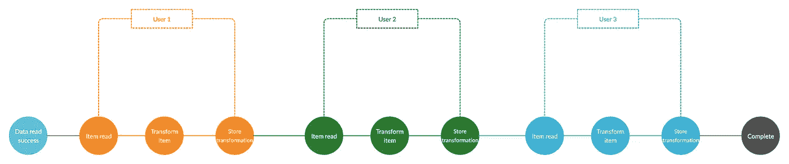
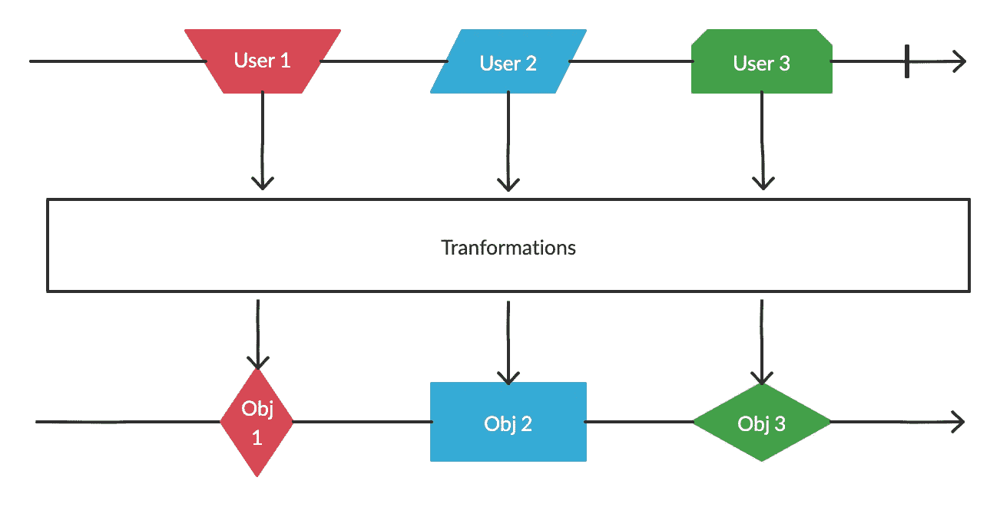

# 使用 RxJS 可观察对象、订户和运营商处理可观察流

> 原文：<https://betterprogramming.pub/handling-observable-streams-with-rxjs-observables-subscribers-and-operators-6111b71a9925>

## RxJS 概述


Karim Sakhibgareev 在 [Unsplash](https://unsplash.com/s/photos/stream?utm_source=unsplash&utm_medium=referral&utm_content=creditCopyText) 上拍摄的照片

在开发工业优势系统时，我们在构建时考虑性能是至关重要的。异步非阻塞处理已经成为 JavaScript 生态系统中不可或缺的一部分，无论是在服务器端还是客户端应用程序中。因此，存在许多工具来帮助开发经过微调的应用程序，以处理异步任务或事件，如回调、承诺、async/await 和 RxJS。

在这篇文章中，我们将在一个高层次上探索 RxJS，并考虑用它处理异步事件所需的基本组件。

# RxJS 到底是什么？

RxJS 是“Javascript 反应式扩展”的首字母缩写。简而言之，它是一个为反应式编程构建的库，带有支持异步代码合成的组件。它提供了一个`Observable`类型的实现。

## 看得见的

可观察对象是`Observable`类型的一个实例。它支持在应用程序中发布消息(事件)和订阅这些消息。换句话说，一个*可观察的*对一系列事件建模。持有可观察对象订阅的对象被称为*观察者*。

## 观察者

这些都是可以观察到的物体。订阅者侦听由 observables 发出的消息，并通过对收到的消息执行声明的转换来对这些消息做出“反应”。

这种模式支持高效处理并发操作，因为观察器*在等待来自观察器的消息时不会阻塞线程*。

## 经营者

这些函数使我们能够对 observables 发出的事件执行特定的操作。有许多可观察的算子。它们通常根据对可观察对象的影响进行分类——例如，产生可观察对象的算子`(from()`、`create()`、`start())`、转换可观察对象的算子`(map()`、 `scan()`、`flatMap())`以及过滤可观察对象的算子`(debounce()`、`filter()`、`sample()`、`take())`。

# 一个简单的可观察用例

假设您在 NoSQL 数据库中有一个`users`集合，您想从其中加载数据并检查数据是否满足给定的标准。如果满足条件，那么您希望对数据执行转换，并将数据存储在目标集合中。这个问题可以用同步和异步策略来解决。

## 同步方法

下面是一些伪代码，展示了如何使用同步策略来完成上述任务:

```
read users from DB collection
for each user in users
	check criteria
	if user meets critetia
		perform transformation
		store transformed data in target collection.
	end
end
```

下图描述了事件处理的顺序:



不相互依赖的任务被一个接一个地执行，直到完成。这种方法有利有弊。一些显著的优点是:

*   同步流程中算法的实现通常没有相应的异步解决方案复杂。
*   同步流程实现起来通常比异步流程耗时更少。

另一方面也有缺点:

*   同步代码由定义`blocks`程序执行，直到正在执行的任务完成。在上图中，用户二要完成的任务是不同的，并且独立于用户一的任务。然而，在用户一的任务完成之前，用户二的任务不能运行。这显然不是最有效的方法。更糟糕的是，如果在用户一执行任务的过程中出现错误，程序将被终止，而用户二和用户三的操作不会执行。
*   在许多情况下，这种形式的程序不能很好地利用资源，程序性能会受到严重影响。

## 异步方法

一种异步、非阻塞的方法涉及所需任务的并发执行，如下图所示:



上图描述了可观察流中的事件处理:

*   上面的水平线是可观测的时间线，时间从左向右流动。
*   与可观察时间线相交的形状是由可观察物体发出的项目。
*   与可观察时间线相切的垂直线表示可观察已经成功完成。
*   矩形框描述了在发射的对象上执行的变换。这些对象由订户接收并通过管道进行转换。
*   底部的水平线是转换的可观察结果。

在这种异步方法中，用户对象的操作和转换按顺序同时发生。

现在我们已经看到了 Observables 如何工作的一些背景，让我们看看如何在 RxJS 中利用它们。考虑这个程序:

```
const data = [];

for (let i = 0; i < 10; i++) {
    data.push(i)
}

const values: Array<number> = data
    .map(value => value * 3)
    .filter(value => value % 4 === 0);
```

上面的代码创建了一个数组，并将 0 到 9 的整数插入到数组中，然后将数组中的所有元素乘以系数 3。最后，它只将能被 4 整除的值过滤到一个名为“值”的新数组中。当我们将数组值记录到标准系统输出中时，我们看到我们的结果是[0，12，24]。

我们可以用 RxJS 和 observables 实现完全相同的一组动作。我们的第一个行动是创建一个生产者，它产生我们的程序将观察并最终“反应”的值。这很容易实现:

```
import { Observable } from "rxjs";
import { filter, map } from 'rxjs/operators';

const observable: Observable<number> = new Observable((subscriber) => {
    for (let i = 0; i < 10; i++) {
        subscriber.next(i);
    }
    subscriber.complete();
});
```

在第四行，我们创建了一个新的可观察实例。我们向订阅者(或观察者)传递构造函数的唯一参数。一个观察者有三个重要的基本功能:`next()`、`error()`和`complete()`。`next()`用于向观察实体发出消息。`error()`用来提醒观察者在过程中发生的错误。最后，`complete()`通知观察者成功完成。

记住这些方法，就很容易理解这个程序实现了什么。我们已经创建了一个可观察对象，它向订阅了它的观察者发送 1 到 9 的数字流。当然，在创建了一个可观察对象之后，我们必须创建其对应的订户:

```
observable
    .pipe(
        map(value => value * 3),
        filter(value => value % 4 === 0)
    ).subscribe(result => console.log(result));
```

在订阅可观察对象之前，使用`map`和`filter`运算符。`map` 通过对可观察对象应用函数来转换它们发出的项目。`filter`删除可观察流中不需要的元素，只发出通过谓词测试的元素。

此外，我们使用了一种我们可观察到的`pipe`方法。`pipe`用于无功运算符的合成。这在对数据流进行复杂转换时非常方便！

`pipe()`函数返回一个观察值，我们最终订阅该观察值以获得我们的结果。将发出的数据记录到控制台，我们得到 0、10、24。这正是我们使用第一种方法时得到的结果！

# 结论

在这篇文章中，我们用 RxJS 探索了 Node.js 中反应式编程的关键基础。不管怎样，在 ReactiveX 的世界里，总会有新的发现。如果您有兴趣深入研究 ReactiveX 和 RxJS，这里有一些很好的文章可以帮助您:

*   [node . js 中的反应式编程和可观察序列](https://www.freecodecamp.org/news/rxjs-and-node-8f4e0acebc7c/)
*   [react vex 文档](http://reactivex.io/documentation/observable.html)
*   [RxJS:可观测量、观测器和操作器介绍](https://ultimatecourses.com/blog/rxjs-observables-observers-operators)