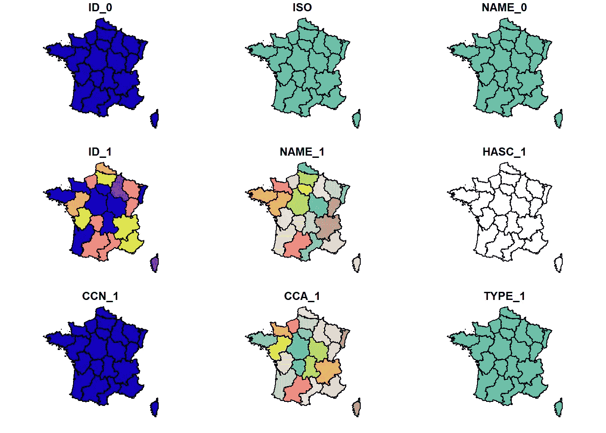
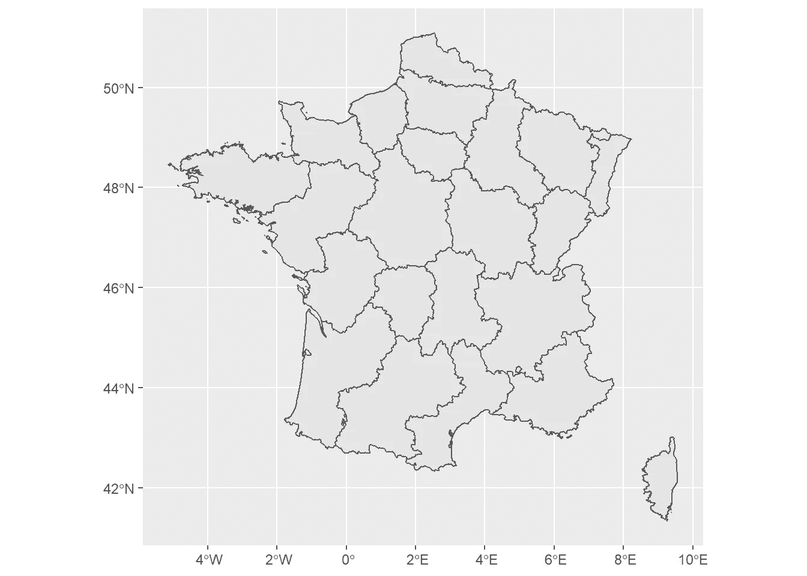

# 在 R 中处理空间数据

> 原文：<https://betterprogramming.pub/handling-spatial-data-in-r-2db1a1880981>

## R 空间数据基础


安妮·斯普拉特在 [Unsplash](https://unsplash.com?utm_source=medium&utm_medium=referral) 上的照片

我们正处于数据时代。全球各地都非常需要各种角色的数据专业人员。作为一名数据专家，我试图让你为各种困难的任务做好准备。其中一项任务就是处理空间数据。

根据定义，空间数据是一种与特定位置相关联的数据。这个位置可以是地球上的任何地方，并且可以以各种格式记录。

我觉得有必要写这篇简短的介绍，因为空间数据分析的使用比以往任何时候都多。这是最基本的技能之一，每个数据专业人员都应该具备导入、操作、分析、可视化和导出空间数据的正确技能。

这篇文章旨在给出一个关于空间数据分析的教程。我已经尽力让它尽可能的短，以便于阅读。我不得不说，这不是一个完整的空间数据教程，而是 R 的空间数据生态系统之旅，以帮助您快速入门。最后，我希望你能够正确处理空间数据。我们开始吧！

# 1.空间数据的类型

在地理信息系统(GIS)文献中，有两种主要类型的数据:矢量和栅格。

# 1.1.矢量数据

人类对记录地理实体的兴趣由来已久。我们现在使用的带有纬度和经度的地理坐标系统的发明归功于公元前 3 世纪古希腊哲学家昔兰尼的厄拉多塞。这个系统传播到了世界各地，地理学家们开始用它相互交流了几个世纪。就在现代计算机发明和数据库系统普及之后，数字地理信息系统赢得了声誉。

矢量数据可以被准确地理解为用坐标交流的数字化。正如人们通过将坐标写在纸上来共享空间信息一样，现在他们通过将坐标写在文件上来共享空间信息。就这么简单。

矢量数据有三个子类别:点、线和多边形。

一个坐标就是一个点。通常，房屋、汽车和特定事件发生的地方用一个点来表示。一系列直线上相互连接的点。道路、河流、电缆和管道都是线数据的完美例子。通过连接多条线而形成的封闭区域是多边形。街区、城市和国家都是面数据的例子。

# 1.2.栅格数据

二战后，美国和苏联开始了所谓的“太空竞赛”。这是一场争夺两个超级大国之间空间的竞赛，是冷战的延伸。任务是探索外层空间。但是卫星也拍了许多地球的照片。第一张从太空拍摄的地球照片，蓝色大理石，是阿波罗 17 号的机组人员从大约 29000 公里的距离拍摄的。从那时起，无数不同的宇宙飞船拍摄了地球表面的照片。这些照片是栅格数据的早期例子。

栅格数据也称为格网数据，是一种通过从空中拍摄地球照片而创建的空间数据类型。栅格数据存储为像素网格(有时称为像元)，其中网格是行和列的数组。卫星图像和航空照片是栅格数据的完美例子。

栅格数据分为两种:单波段和多波段(或单层和多层)。如果栅格数据只有一个像素格网，则称为单波段栅格。但有时栅格数据包含不止一个维度的信息。在这些情况下，有许多不同信息的网格，大小相同，相互重叠。那么它们被称为多波段栅格。

# 2.导入空间数据

在这个主题下，我们将讨论如何在 r 中导入空间数据。我们在这里讨论的方法的标准是通用性。我们这样说是什么意思？这里的所有方法都是为了检索全球任何地方的空间数据。

有一些针对世界特定地区的优秀包和 API。例如，我们的美国读者可以通过“`urbnmapr`”包轻松获得他们国家的空间数据。它非常直观，易于使用。像这样的包超出了本文的范围。

# 2.1.矢量数据和 sp/sf

矢量数据最常见的文件格式是扩展名为“”的 Shapefile。shp”。`sp`多年来，包一直是导入矢量数据的事实上的包。`sf`包是`sp`的继承者。它们都是由明斯特大学教授 Edzer Pebesma 创造的。

我们将导入伦敦的矢量 Shapefile 数据。您可以从下面的链接下载数据。

【https://www.statsilk.com/maps/download-free-shapefile-maps 

在这里，我们导入库，设置工作目录，并导入数据。

```
**library**(sf)
setwd(dir = "C:/Users/ugurc/Desktop/Medium Blog/Geo-Spatial Data in R/StatPlanet_India_Hindi/StatPlanet_India_Hindi/map")
india <- read_sf("map.shp")
```

# 2.2.栅格数据和栅格/地形

现在，我们将了解如何导入栅格数据。为此，`raster`包长期占据主导地位，它是栅格数据事实上的包。它是由加州大学戴维斯分校的环境科学家罗伯特·j·希曼斯发明的。最近他发布了`raster`的继任者`terra`包。

我们这里用的文件可以从这个[链接](http://www.naturalearthdata.com/downloads/10m-raster-data/10m-cross-blend-hypso/)下载。

```
**library**(terra)
setwd("C:/Users/ugurc/Desktop/Medium Blog/Geo-Spatial Data in R/HYP_LR/HYP_LR")
world <- rast(x =  "HYP_LR.tif")
```

# 3.可视化空间数据

可视化是空间数据分析的重要组成部分。r 中有许多可视化空间数据的工具。其中最著名的两个工具是`tmap`和`ggplot2`。

即使你是绝对的 R 初学者，也极有可能听说过`ggplot2`。这是一个数据可视化软件包，由多产的 R 程序员和统计学家 Hadley Wickham 创建。泛型`ggplot2`不是本文的主题。我们将更侧重于它的空间数据方面。

我们这里使用的数据是法国各地区的地图。可以从链接( [1](https://geodata.lib.utexas.edu/?f%5Bdc_format_s%5D%5B%5D=Shapefile&f%5Bdc_subject_sm%5D%5B%5D=Administrative+and+political+divisions&f%5Bdct_spatial_sm%5D%5B%5D=France&f%5Blayer_geom_type_s%5D%5B%5D=Polygon&per_page=20&sort=dc_title_sort+asc) 和 [2](https://geodata.lib.utexas.edu/catalog/stanford-ym781wr7170) )下载。

如果你对`ggplot2`一无所知，每个图形都是用`ggplot()`函数初始化的，其他层和几何图形是用`+`操作符添加上去的。我们将使用的图层函数是`geom_sf()`。

```
**library**(ggplot2)
**library**(tmap)setwd("C:/Users/ugurc/Desktop/Medium Blog/Geo-Spatial Data in R/france1")france <- read_sf("FRA_adm1.shp")
```

我们也可以使用`plot()`函数——尽管输出不是很吸引人。

```
plot(france)## Warning: plotting the first 9 out of 12 attributes; use max.plot = 12 to plot
## all
```



这就是我们如何使用`ggplot2`进行空间数据可视化。这很简单。

```
ggplot(france) + geom_sf()
```



我们将使用的另一个包是`tmap`。它的用法与`ggplot2`非常相似，非常直观。这两个软件包都是基于“图形的语法”哲学设计的。

由于我们的数据是一个多边形，我们可以将其图形绘制如下。

```
tm_shape(france) + tm_polygons()
```


# 结束语

作为一名数据工程师，我经常要处理各种不同类型的数据。这个过程总是痛苦和令人沮丧的。无论你的头衔是什么，如果你在软件行业，你必须管理不同类型的数据，只有系统的学习才能使这个过程更容易。

我试着去帮助别人，这样他们可以从我的错误和挫折中受益，不再犯同样的错误。在这篇文章中，我们解决了最棘手的数据类型之一:空间数据。如果您已经通读了它并亲自运行了代码，那么您应该拥有一套非常可靠的工具来处理空间数据。我希望你喜欢它，并发现它很有用。