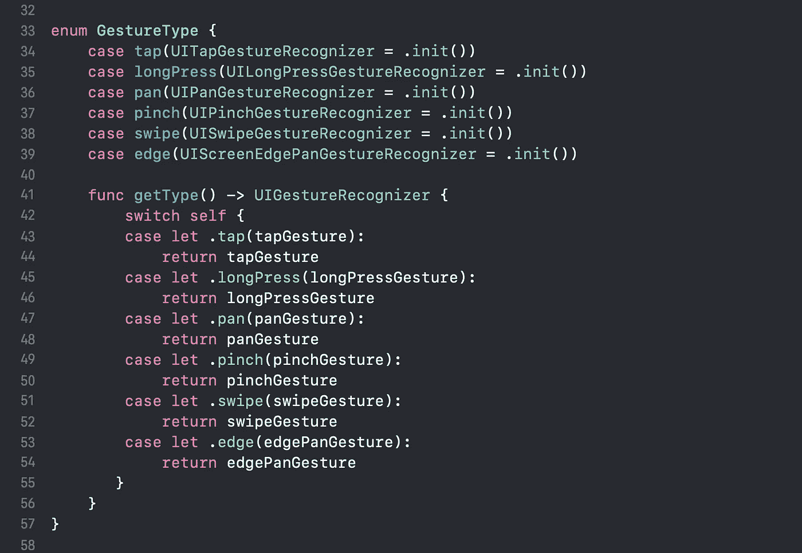
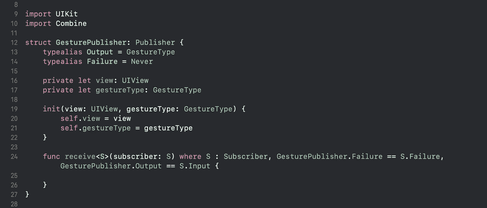
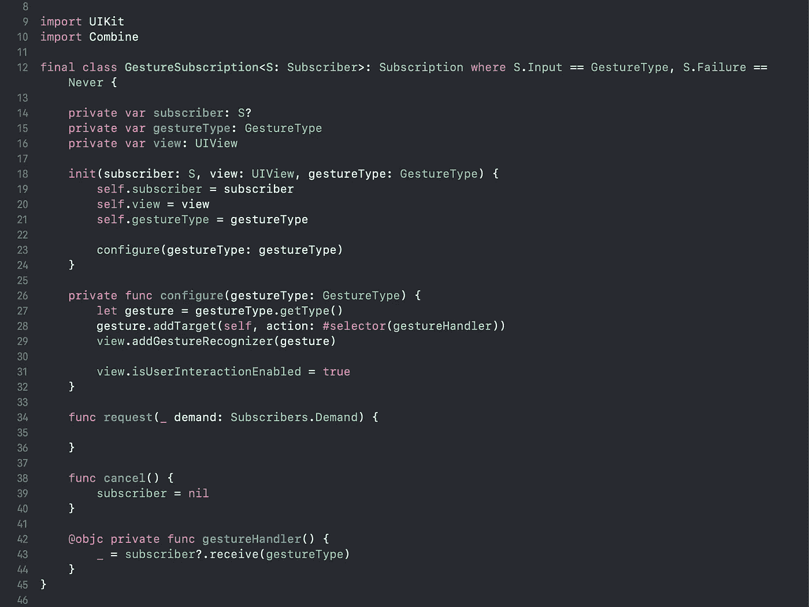
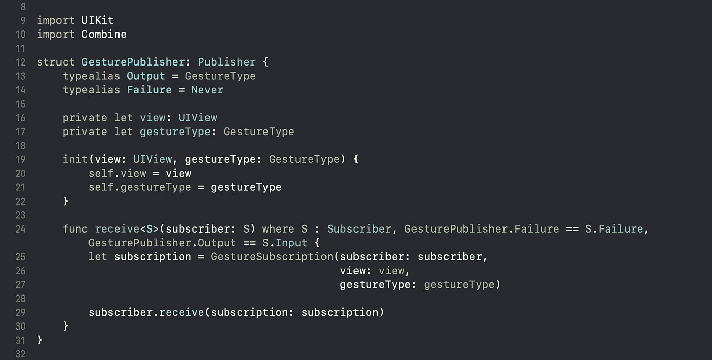
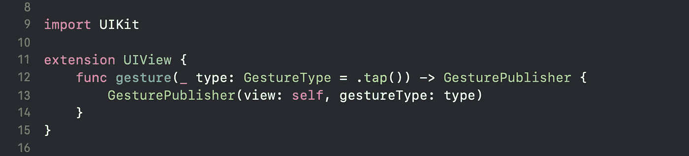

# 如何用苹果的 Combine 框架处理 UIKit 手势

> 原文：<https://betterprogramming.pub/handling-uikit-gestures-in-combine-framework-2ebe1c0572fd>

## 使用 Swift 中的 Combine 创建您自己的手势发布器

照片由[嫉妒周末](https://unsplash.com/@jealousweekends?utm_source=unsplash&utm_medium=referral&utm_content=creditCopyText)在 [Unsplash](https://unsplash.com/s/photos/apple-laptop?utm_source=unsplash&utm_medium=referral&utm_content=creditCopyText) 拍摄

既然您在这里，我希望您对 Combine 框架有一个基本的了解，并且可能也在编写它。

框架本身有很好的内置扩展，比如给关键路径赋值，但是没有响应`UIGesture`事件的功能。我们可能会在以后的更新中看到它。在此之前，让我们现在就创建自己的自定义发布程序来处理手势事件。

# 创建自定义发布者

首先，让我们通过遵循发布者协议来创建一个定制的发布者。发布者协议由两种相关类型组成，`Output`和`Failure`。

`Output`代表它将产生的值的类型，而`Failure`是它可能抛出的错误的类型。

为了处理手势类型，首先，我们需要用手势发布者将识别的值创建一个 enum `GestureType`。

现在我们将创建我们的自定义发布者。

由于输出将是`GestureType`情况之一，我们将`Output`设置为`GestureType` 并将`Failure`设置为`Never`，因为它永远不会抛出错误。

## 接收(订户:)

将指定的订阅服务器附加到该发布服务器。

因为`GesturePublisher`结构符合发布者协议，所以`receive(subscribe:)`需要被实现。它基本上将指定的订阅者附加到发布者。

由于我们尚未创建要附加到此处的订阅，因此让我们创建一个订阅。

# 创建自定义订阅

让我们创建一个符合订阅协议的类`GestureSubscription`。

订阅协议继承自可取消协议，该协议为我们提供了用于处理订阅取消的`cancel()`方法。

`Input`表示订阅将收到的值的类型，而`Failure`是它可能抛出的错误的类型。

由于发布者将值发送给下游订阅者，因此它的`Output`类型必须与订阅者的`Input`类型相匹配，`Failure`也是如此。我们将`Failure`设置为`Never`，因为它永远不会抛出错误。

`GestureSubscription`类必须符合订阅协议，该协议有两个必需的方法`cancel()`和`request(_ demand: Subscribers.Demand)`。

我们将使用`cancel()` 方法来取消订阅，并将`Subscriber`属性设置为零。

现在，既然我们的订阅已经创建，让我们将其实现到我们的自定义发布器`GesturePublisher`中的`receive(subscriber:)` 中。全面实施将是:

如果你运行这个项目，你会发现什么也没发生。这是因为由于我们没有真正处理用户手势，我们的订户还不能接收任何值。让我们解决这个问题。

# 一个 UIView 扩展，可以方便地访问我们的自定义发布者

让我们将一个方法放入一个`UIView`扩展中，该扩展将创建一个定制的发布者，并使用所提供的手势类型将其与视图相关联。

仅此而已。我们现在处理手势，并使用提供的识别器定义一个特定的动作。

# **例题**

这些例子展示了如何在 Combine 中使用手势来执行动作。

# 结论

自定义发布者可以向 UIKit 元素扩展更多的功能。

这只是一个简单的例子，说明我们可以在 Combine 中使用自定义发布程序做什么。许多样板代码可以删除，实现也可以简化，所有这些都是以一种被动的方式进行的。