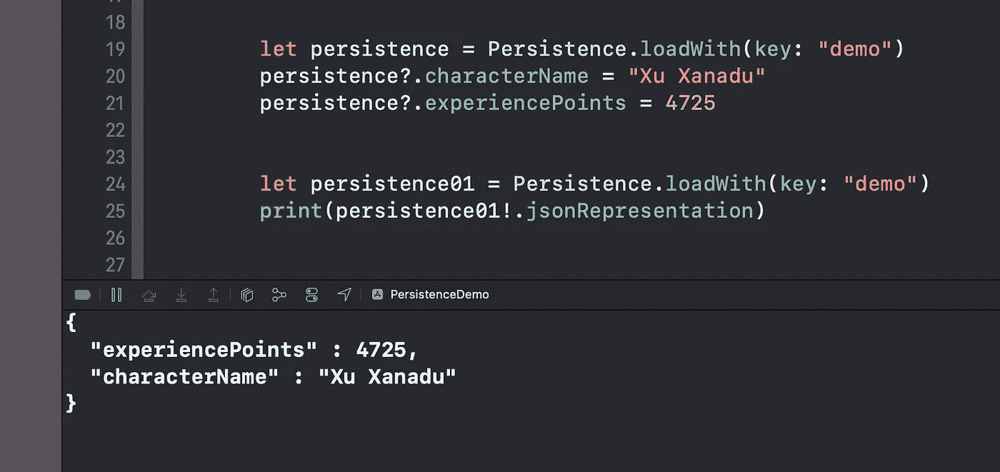
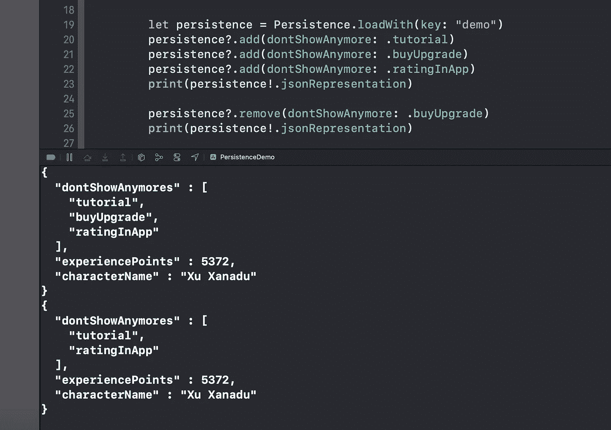
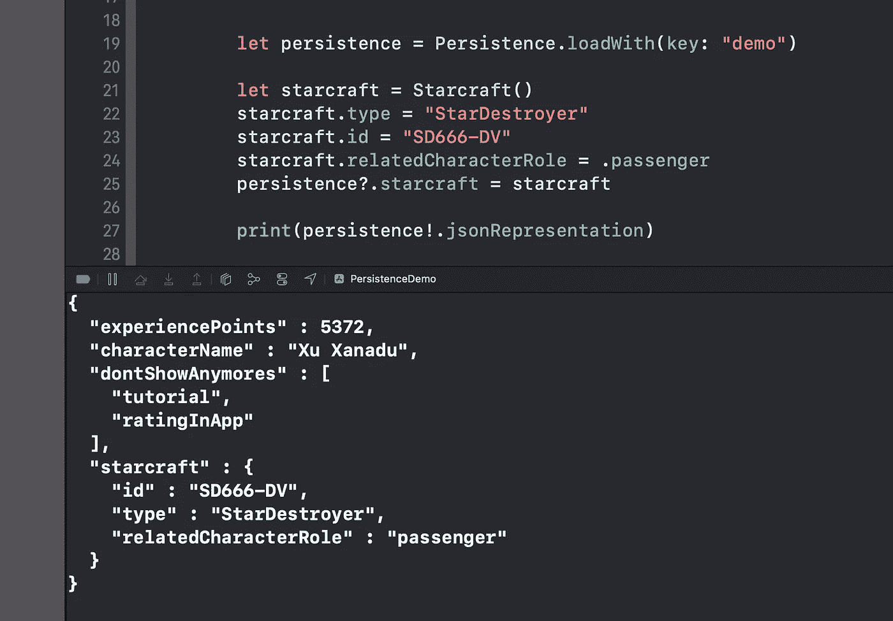

# 在 Swift 中处理用户默认值

> 原文：<https://betterprogramming.pub/handling-userdefaults-in-swift-fc1d5f9448f0>

## 在大型项目中使用用户默认值的最佳实践


[Firmbee.com](https://unsplash.com/@firmbee?utm_source=unsplash&utm_medium=referral&utm_content=creditCopyText)在 [Unsplash](https://unsplash.com/s/photos/macbook?utm_source=unsplash&utm_medium=referral&utm_content=creditCopyText) 上的照片

如今，在应用程序或项目中存储永久信息非常普遍。苹果操作系统为我们提供了一些选项来完成这项任务，毫无疑问，`UserDefaults`是最简单的。一行代码和数据被保存。一行代码和数据被检索。这种技术很棒，但是在更大的应用程序中，很容易失去控制，并以到处保存几十个`UserDefaults`而告终。然后，你会忘记你是否已经在应用程序的某个地方使用或保存了某个东西。

在我的项目中，我改变了方法，创建了一个`manager`类。我给你介绍一下`Persistence`。

# 脊梁

这个想法很简单。我将创建一个类来保存所有需要永久保存的信息。该类在应用程序启动时从`UserDefaults`加载，每次变量更新时，整个类都被保存。它基本上是所有持久变量的包装器。

由于 Swift `Codable`协议，执行此操作变得非常简单。

让我们来看看一些代码:

*   第 5 行:需要一个私有的`init`来强制从设计的函数中加载。
*   第 13 行:函数被赋予一个`key`，以保存/检索`UserDafaults`中的项目。我更喜欢传递它，因为在许多应用程序中，我需要根据登录用户或环境(例如，开发、测试、生产等)保存不同的首选项集。).
*   第 16 行:如果该项为空，则使用私有初始化器创建一个全新的项。我们第一次访问它时就需要它。
*   第 22 行:一个私有扩展添加了一些样板代码来保存和加载对象。请注意，由于对象本身符合`Codable`协议，为了持久化它，我在`Data`中转换它，然后保存它。另一方面，为了加载它，我检索了`Data`，并用`JSONDecoder`对其进行解码。

这个类现在很笨，它只存储密钥...这是我们唯一不需要存储的变量！还请注意，从未使用过`save()`功能。

# 添加基本类型的变量

是时候加点东西储存了！

让我们以这种方式修改这个类:

事情现在开始变得有趣了。

*   第 5 行和第 6 行:添加了两个变量。每次值更新时，`didSet`观察器触发`save()`函数，整个持久性保存在`UserDefaults`中。
*   第 8 行:为了只保存想要的变量，需要使用`CodingKeys`。`key`变量未保存。请注意，您想要保存的每个新变量都需要它的`CodingKey`。记得补充一下！

其余的`extensions`不变。

这是我们的实际结果:



如你所见，我已经创建了一个对象，给了它一些值，然后我使用相同的键创建了另一个对象，并打印了实际值。

请注意，`jsonRepresentation`是我编写的`Encodable`的扩展，目的是以一种易于阅读的 JSON 格式打印任何`Encodable`对象。

# 处理集合

在较大的应用程序中，保存对象列表是很常见的。例如，您可能需要用户已经检查过的所有“不再显示”弹出窗口的列表。

让我们更新我们的类来处理这种情况。我将使用一个`enum`列表，其中每个案例都是一种“不再显示”的类型:

请注意，`enum`符合`Codable`协议。

现在让我们更新我们的主类:

如你所见，我在第 7 行添加了一个新变量`dontShowAnymores`，在第 10 行也添加了一个新变量`CodingKey`。

您可能已经注意到新变量是一个`private (set)`。这意味着你需要一个函数来更新它的值。我将在一个扩展中完成:

如你所见，代码现在非常干净。第 5 行还有一个检查，如果列表为空，它将创建一个列表。所以现在您可以读取变量，但是您必须使用指定的函数来添加或删除项目。

它是这样工作的:



很酷，对吧？

# 添加复杂对象

老实说，这种事情并不常见，因为在这种持久化中，您通常会保存简单的信息，但有时，您可能需要存储复杂的对象。让我们开始吧。

首先，让我们用下面的代码创建我们的对象:

这只是一个简单的类，里面有一个枚举。请注意，这个类和往常一样，符合`Codable`协议。

让我们将新属性添加到`Persistence`类中。你知道规矩:



现在，让我们注意一下。

如果您需要更新`Starcraft`对象内部的值，则不会自动调用`save()`函数:

`persistence.starcraft.id = "SD777-DV`不会拯救整个`Persistence`。

我们可以用三种方法解决它:

1.  编写大量代码并调用嵌套对象的每个变量中的`save()`
2.  使用`struct`代替`class`作为内部对象
3.  检索对象，修改它并更新`Persistence`类中的整个对象
4.  公开`save()`函数，更新内部对象，保存整个`Persistence`类

就个人而言，我更喜欢选项 2 或 3，但有时选项 2 不可用，可能是因为对象是从其他地方给定的。比如来自第三方库。

# 最终代码

在这里你可以找到这个故事的所有代码:

# 最后的话

如你所见，我向你展示了一种以相对简单的方式在你的应用程序中存储大量内容的方法。这是最好的方法吗？我不知道，但这是我的方式。

您可能已经注意到，如果您保留了许多`Persistence`类的实例，那么它们将不会被同步。要解决这个问题，我可以建议三个选择:

1.  一定要注意创建生活在同一时刻的多个实例。
2.  将`Persistence`类转换成`Singleton`。
3.  将`Dependency Injection`与容器一起使用，这样你将确保拥有所需类的一个实例。

我一般走第三条路！

```
**Want to Connect?**See more helpful content on my [YouTube channel](https://www.youtube.com/channel/UCHv7KRr7VeG5Oe-6BxTIRww)
```