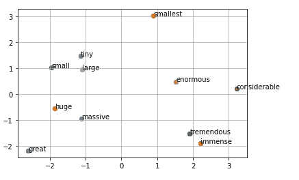

# 使用释义数据库的自然语言数据集的实际扩充

> 原文：<https://betterprogramming.pub/hands-on-augmentation-of-natural-language-dataset-using-paraphrase-database-5f4dfcd23141>

## 生成源自然语言数据的语言变体的逐行编码教程


照片由[拉杰·拉纳](https://unsplash.com/@theranaman?utm_source=medium&utm_medium=referral)在 [Unsplash](https://unsplash.com?utm_source=medium&utm_medium=referral) 拍摄

尽管现在互联网上有大量的自然语言文本，但我们仍然经常面临特定领域任务的数据短缺。例如，假设我们想要构建一个自然语言接口，它接收用户的自然语言输入，并输出特定于领域的翻译，比如 SQL、图形查询等等。在这种情况下，自然语言输入通常具有一定的语义结构，这是维基百科或谷歌新闻中的随机文本无法轻易表示的。

人类可以快速手工制作一小组输入输出对，数量级可能是数百甚至数千。但是手动创建数百万个示例的成本太高，而这通常是训练一个好的自然语言模型所需要的。所以，我们不得不求助于自动数据扩充。这篇博客文章提供了一个使用释义数据库的自然语言数据增强的编码教程。

# 首先将单词嵌入作为备选方案

在我们进入解释概念之前，让我们探索一种增加自然语言数据的替代方法。为了简化讨论，让我们假设我们的源数据集是一个句子列表，我们希望为每个句子添加语言变体。我们可以用同义词词典来代替句子中的单词。但是这经常受到字典大小及其可能的严格同义词定义的限制。为了使讨论有趣，我们选择使用单词嵌入模型。单词嵌入的思想是为每个单词创建一个紧凑的矢量表示，以便出现在相似上下文中的单词靠得很近。因此，给定一个单词，我们可以找到最相似的嵌入，并将这些对应的单词视为松散的同义词。我们使用`gensim`库在下面的代码片段中加载单词嵌入模型:

加载单词嵌入

让我们尝试一个随机的单词，`tiny`，并通过`model.most_similar('tiny')`获取其最相似的单词:

```
[('small', 0.8611764907836914),
('little', 0.8435531854629517),
('giant', 0.8068135380744934),
('huge', 0.8022578954696655),
('look', 0.7932928800582886),
('inside', 0.7844970226287842),
('monkey', 0.7816362380981445),
('horse', 0.7802691459655762),
('bigger', 0.7802377343177795),
('hole', 0.7757057547569275)]
```

前 2 名，`small`和`little`，确实不错。注意，结果集还包含像`giant`和`huge`这样的单词，它们是`tiny`的反义词。既然我们要的是语言上的变异，用一个相反意思的词来替代可能就可以了。但是结果集也包含类似于`monkey`、`horse`和`hole`的看似随机的单词。它们可能出现在单词嵌入训练数据集中的类似上下文中。用这些词替换`tiny`将是一派胡言。

不管怎样，让我们尝试使用下面的代码片段来扩充一个句子`"i want to make the world a better place"`:

单词嵌入增强

我们得到以下句子:

```
['just want to make the world a better place',
"'m want to make the world a better place",
'i even to make the world a better place',
"i 'll to make the world a better place",
'i want for make the world a better place',
'i want us make the world a better place',
'i want to need the world a better place',
'i want to put the world a better place',
'i want to make of world a better place',
'i want to make from world a better place',
'i want to make the the a better place',
'i want to make the one a better place',
'i want to make the world no better place',
'i want to make the world base better place',
'i want to make the world a but place',
'i want to make the world a way place',
'i want to make the world a better places',
'i want to make the world a better point']
```

没我们想的那么糟。其实有些句子看起来还行。因此，也许用于增强的单词嵌入对于单个单词替换是好的。但是单词嵌入真正的缺点是不能代替短语，除非我们先训练一个短语嵌入模型。另一个潜在的弱点是，它注入了源于单词嵌入模型的训练数据的先验偏差，这可能对我们试图执行的新训练任务有害。

# 释义数据库

现在，言归正传。我们将使用 [PPDB](http://paraphrase.org/#/) 来扩充我们的自然语言数据。PPDB 是一个释义数据库。释义对是在双语环境中创建的:如果两个短语翻译成同一个外国短语，它们就被认为是释义对。然后，根据一组语言特征，使用基于人工评分的监督模型来计算每个释义对的质量。PPDB 网站将数据库打包成各种大小。较小的尺寸只包含高质量的释义对。我们下载中等大小的软件包。我们将释义对加载到字典中，其中键作为源短语，值作为目标释义的列表，`phrases{source:[target1, target2, …]}`。你可以参考 PPDB 网站的文件格式。在写的时候，每一行都是一个释义对，源、目标短语和一些其他辅助信息都由`|||`界定。

作为一个简单的实验，我们来取`tiny`和`huge`的释义:

```
$ phrases[tiny]
{'small', 'smallest'}$ phrases[huge]
{'considerable', 'enormous', 'great', 'immense', 'large', 'massive', 'tremendous'}
```

释义看起来相当不错。现在，让我们在一个 [PCA](https://en.wikipedia.org/wiki/Principal_component_analysis) 投影之后，在二维空间中绘制它们的单词嵌入(使用下面的代码片段)。

释义嵌入投影



释义嵌入投影

正如我们所看到的，在嵌入空间中，释义不一定靠得很近。比如，`great`和`considerable`，同一个词`huge`的释义，就相距甚远。这是意料之中的，因为它们可能出现在单词嵌入训练数据集中非常不同的上下文中。

我们可以用释义重复替换句子部分的过程。这一次，我们可以针对单个单词和短语(多个连续单词)进行操作。

释义扩充

有了上面的代码片段，我们来为同一个源句子`"i want to make the world a better place"`生成句子。

```
[['i likes to make the world a better place',
'i want informed make the world a better place',
'i want benefits make the world a better place',
'i want to make existing world a better place',
'i want to make expected world a better place',
'i want to make the integrating a better place',
'i want to make the leading a better place',
'i want to make the world a increasing place',
'i want to make the world a heightened place'],["i 've wanted to make the world a better place",
'i was necessary to make the world a better place',
'i said he wished to make the world a better place',
'i want to make a better world a better place',
'i want to make the continents a better place',
"i want to make the world , it 's better place",
"i want to make the world that 's the best place"],['he wished to make the world a better place',
'i wish there were make the world a better place',
'i wants to see the world a better place']]
```

看起来转述法比单词嵌入法创造了一些更有趣的结果，比如`"i ‘ve wanted to make the world a better place"`和`"i wants to see the world a better place”`。