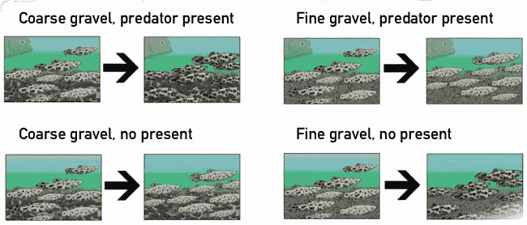
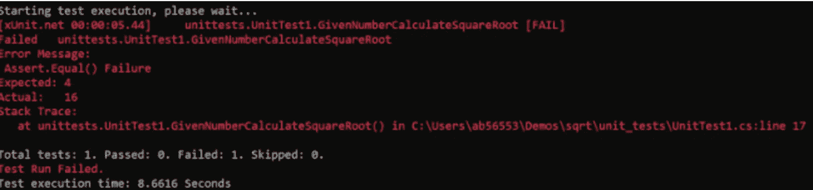
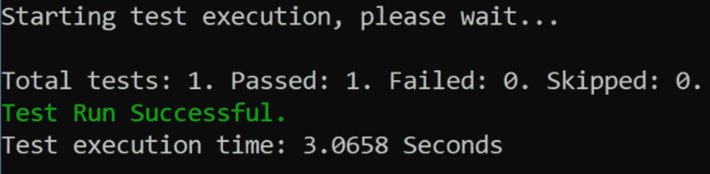
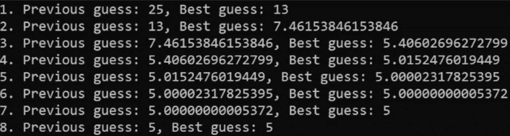
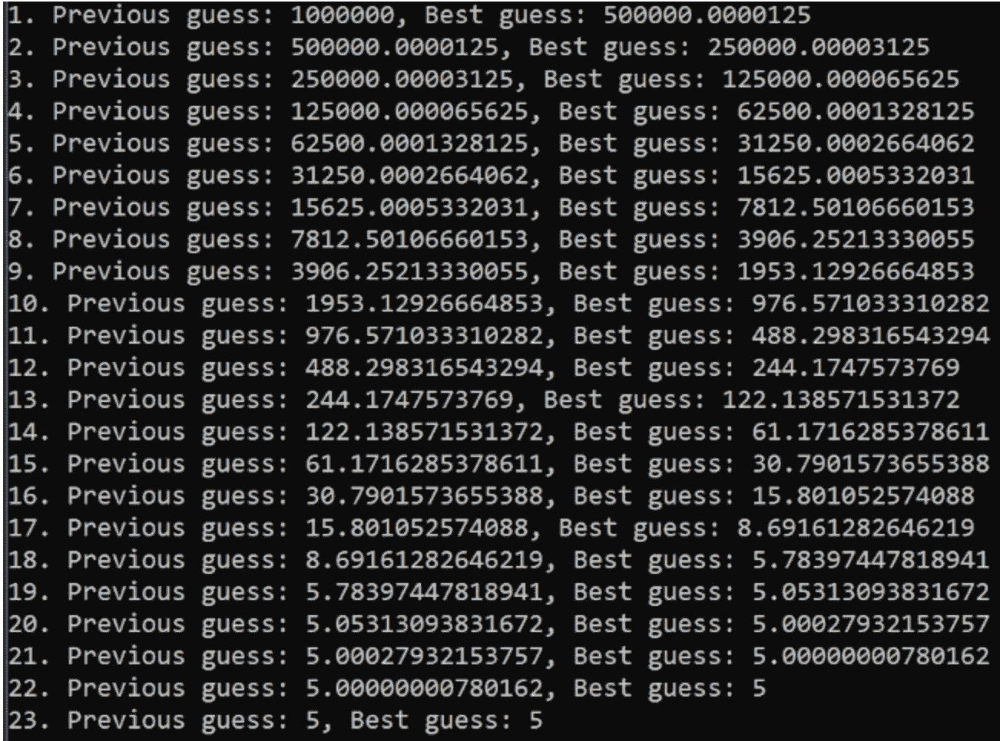

# 对测试驱动的设计如何工作的实际解释

> 原文：<https://betterprogramming.pub/hands-on-explanation-of-how-tdd-works-c009135dfc79>

## 深入的指南


亚历克斯·布纳季奇的照片

在“[失败在 DevOps 文化中是必不可少的](https://medium.com/@alexbunardzic/failure-is-essential-in-devops-culture-dace2a72bfa1)”中，我讨论了失败在通过征求反馈交付质量中的核心作用。这是敏捷开发运维团队赖以指导和推动开发/交付的失败。[测试驱动开发(TDD)](https://en.wikipedia.org/wiki/Test-driven_development) 是任何敏捷开发价值流交付的[必要条件](https://www.merriam-webster.com/dictionary/conditio%20sine%20qua%20non)。以失败为中心的 TDD 方法只有在与可测量的测试相结合时才有效。

TDD 方法论是基于自然如何工作以及自然如何在进化游戏中产生赢家和输家而建模的。

# 自然选择

1859 年，[查尔斯·达尔文](https://en.wikipedia.org/wiki/Charles_Darwin)在《物种起源 一书中提出了进化论。达尔文的论点是，自然变异是由个体生物的自发突变和不同的环境压力共同造成的。这些压力淘汰了不太适应的生物体，同时有利于其他更适应的生物体。

每一个生物都会使其染色体发生突变，这些自发的突变会遗传给下一代(后代)。然后在自然选择下测试新出现的可变性——由于环境条件的可变性而存在的环境压力。

这个简图说明了适应环境条件的过程:



图一。不同的环境压力导致不同的自然选择结果。理查德·道金斯的[视频截图。](https://www.youtube.com/watch?v=MgK5Rf7qFaU)

上图展示了一群生活在自然栖息地的鱼。栖息地不同(海底或河床较深或较浅的砾石)，每条鱼也不同(较深或较浅的身体花纹和颜色)。

它还显示了两种情况(即环境压力的两种变化):

1.  捕食者出现了
2.  捕食者不在

在第一种情况下，在砾石树荫下更容易被发现的鱼被捕食者吃掉的风险更高。当沙砾颜色变深时，鱼群中颜色较浅的部分就会变得稀疏。反之亦然——当沙砾颜色较浅时，鱼群中颜色较深的部分就会变得越来越少。

在第二种情况下，鱼足够放松来进行交配。在没有捕食者和有交配仪式的情况下，可以预期相反的结果:在背景中脱颖而出的鱼有更好的机会被选中交配，并将其特征传递给后代。

# 选择标准

当在可变性中进行选择时，过程决不是任意的、反复无常的、异想天开的，也不是随机的。决定性因素总是可以衡量的。这个决定性因素通常被称为测试或目标。

一个简单的数学例子可以说明这个决策过程。(只是在这种情况下它不会受自然选择的支配，而是受人工选择的支配。)假设有人让你构建一个小函数，它接受一个正数并计算这个数的平方根。你将如何着手做那件事？

敏捷开发的方式是快速失败。从谦逊开始，坦率地承认你真的不知道如何开发这个功能。在这一点上，你所知道的是如何描述你想做的事情。用技术术语来说，你已经准备好进行一个微测试了。

“微观测试”描述了你的具体期望。它可以简单地表述为“给定数字 16，我期望平方根函数返回数字 4。”你可能知道 16 的平方根是 4。然而，你不知道，在你的头顶上，一些更大的数字(如 533)的平方根。

至少，你已经制定了你的选择标准，你的测试，或者你的目标。

# 实施失败的测试

[。NET Core](https://dotnet.microsoft.com/) 平台可以说明实现。。NET 通常使用[xUnit.net](https://xunit.net/)作为单元测试框架。(要遵循编码示例，请安装。NET Core 和 xUnit.net)

打开命令行并创建一个文件夹，您的平方根解决方案将在其中实现。例如，键入:

```
mkdir square_root
```

然后键入:

```
cd square_root
```

为单元测试创建单独的文件夹:

```
mkdir unit_tests
```

进入`unit_tests folder` (cd 单元测试)并启动 xUnit 框架:

```
dotnet new xunit
```

现在，将一个文件夹移到 square_root 文件夹，并创建 app 文件夹:

```
mkdir app
cd app
```

为 C#代码创建必要的框架:

```
dotnet new classlib
```

现在打开你最喜欢的编辑器，开始破解！

在代码编辑器中，导航到 unit_tests 文件夹并打开 UnitTest1.cs。

将 UnitTest1.cs 中自动生成的代码替换为:

这个单元测试描述了期望变量应该是 4 的期望。下一行描述实际值。它建议通过向名为`calculator`的组件发送消息来计算实际值。该组件被描述为能够通过接受一个数值来处理`CalculateSquareRoot`消息。那个组件还没开发出来。但这并不重要，因为这只是描述了预期。

最后，它描述了当消息被触发发送时会发生什么。此时，它断言期望值是否等于实际值。如果是，测试通过，目标达到。如果期望值不等于实际值，测试失败。

接下来，要实现名为 calculator 的组件，在 app 文件夹中创建一个新文件，并将其命名为`Calculator.cs`。要实现计算数字平方根的函数，请将以下代码添加到这个新文件中:

```
namespace app {
   public class Calculator {
       public double CalculateSquareRoot(double number) {
           double bestGuess = number;
           return bestGuess;
       }
   }
}
```

在测试这个实现之前，您需要指导微测试如何找到这个新组件(`Calculator`)。导航到`unit_tests`文件夹并打开`unit_tests.csproj`文件。在< `ItemGroup` >代码块中添加下面一行:

```
<ProjectReference Include="../app/app.csproj" />
```

保存`unit_test.csproj`文件。现在，您已经为第一次试运行做好了准备。

转到命令行，将 cd 放入`unit_tests`文件夹。运行以下命令:

```
dotnet test
```

运行单元测试将产生以下输出:



图二。单元测试运行失败后的 xUnit 输出。

如你所见，微测试失败了。它预计向`calculator`组件发送数字 16 将导致数字`4`作为输出，但是输出(实际值)是数字`16`。

恭喜你！你制造了你的第一次失败。您的微测试提供了强烈的即时反馈，敦促您修复故障。

# 修复故障

要修复故障，必须改进`bestGuess`。现在，`bestGuess` 仅仅接受函数接收的数字并返回它。不够好。

但是，如何计算平方根值呢？我有一个想法——看看大自然是如何解决问题的。

# 通过迭代模仿自然母亲

很难(几乎不可能)从第一次(也是唯一一次)尝试中猜出正确的值。你必须允许多次猜测，以增加解决问题的机会。允许多次尝试的一种方法是迭代。

要进行迭代，将`bestGuess`值存储在`previousGuess` 变量中，转换`bestGuess` 值，并比较两个值之间的差异。如果差的是`0`，你就解决了问题。否则继续迭代。

下面是为任何正数的平方根生成正确值的函数体:

```
double bestGuess = number;
double previousGuess;do {
   previousGuess = bestGuess;
   bestGuess = (previousGuess + (number/previousGuess))/2;
} while((bestGuess - previousGuess) != 0);return bestGuess;
```

这个循环(迭代)将`bestGuess`值收敛到期望的解。现在您精心制作的单元测试通过了！



*图三。单元测试成功，0 个测试失败。*

# 迭代解决了这个问题

就像大自然母亲的方法一样，在这个练习中，迭代解决了问题。结合逐步完善的渐进方法是获得满意解决方案的可靠途径。这个游戏的决定性因素是有一个可衡量的目标和测试。一旦你有了它，你就可以继续迭代直到你达到目标。

# 现在是笑点！

好吧，这是一个有趣的实验，但更有趣的发现来自对这个新发明的解决方案的研究。到目前为止，您的 starting `bestGuess`始终等于函数作为输入参数接收的数字。如果改了开头的`bestGuess`会怎么样？

为了测试这一点，您可以运行几个场景。首先，当迭代试图计算 25 的平方根时，通过一系列猜测来观察逐步细化:



*图 4。迭代计算 25 的平方根。*

从 25 作为`bestGuess`开始，这个函数需要八次迭代来计算 25 的平方根。但是如果你在`bestGuess`做了一个滑稽可笑的错误尝试，会发生什么呢？如果你从一个毫无头绪的第二个猜测开始，100 万可能是 25 的平方根，会怎么样？在这种明显错误的情况下会发生什么？你的功能能够处理这样的白痴行为吗？

看看马的嘴。重新运行场景，这次从 100 万开始，作为`bestGuess`:



*图 5。计算 25 的平方根时，从 1，000，000 开始逐步细化，作为初始最佳猜测。*

哦，哇哦！从一个可笑的大数字开始，迭代次数只增加了三倍(从 8 次迭代到 23 次)。并不像你直觉预期的那样有戏剧性的增长。

# 这个故事的寓意

啊哈！当你意识到，迭代不仅保证解决问题，而且不管你对解决方案的搜索是从一个好的还是一个糟糕的初步猜测开始，这一时刻都到来了。无论您最初的理解多么错误，迭代的过程，再加上可测量的测试/目标，将您置于正确的轨道上，并交付解决方案。保证。

图 4 和图 5 显示了急剧的烧毁。从一个非常不正确的起点开始，迭代很快燃烧到一个绝对正确的解决方案。

简而言之，这种令人惊叹的方法是敏捷开发的精髓。

# 回到一些高层次的观察

敏捷开发实践源于这样一种认识，即我们生活在一个从根本上基于不确定性、模糊性、不完整性和适度混乱的世界中。从科学/哲学的角度来看，这些特质在[海森堡的不确定性原理](https://en.wikipedia.org/wiki/Uncertainty_principle)(涵盖不确定性部分)[维特根斯坦的逻辑哲学研究](https://en.wikipedia.org/wiki/Tractatus_Logico-Philosophicus)(模糊性部分)[哥德尔的不完全性定理](https://en.wikipedia.org/wiki/G%C3%B6del%27s_incompleteness_theorems)(不完全性方面)，以及[热力学第二定律](https://en.wikipedia.org/wiki/Second_law_of_thermodynamics)(无情熵引起的混乱)中得到了很好的证明和支持。

一言以蔽之，无论你如何努力，在试图解决任何问题时，你永远无法获得完整的信息。因此，放弃傲慢的姿态，采用更谦逊的方法来解决问题，会更有利可图。谦逊会给你带来丰厚的回报——不仅是希望的解决方案，还有一个结构良好的解决方案的副产品。

# 结论

大自然不停地运转——它是一个连续的流动。大自然没有总体规划；所有事情的发生都是对之前发生的事情的回应。反馈回路非常紧密，表面上的进步/退步是零碎的。在自然界的任何地方，你都可以看到一步一步的改进，以一种或另一种形式。

敏捷开发运维是工程模型逐渐成熟的一个非常有趣的结果。DevOps 是基于这样一种认识，即你现有的信息总是不完整的，所以你最好谨慎行事。

获得一个可测量的测试(例如，一个假设，一个可测量的期望)，尝试满足它，很可能失败，然后收集反馈，修复失败，并继续。除了同意每一步都必须有一个可测量的假设/测试之外，没有其他计划。

在下一篇文章的[中，我将仔细研究突变测试如何提供推动价值的急需反馈。](https://medium.com/@alexbunardzic/mutation-testing-by-example-how-to-leverage-failure-by-experimenting-fc4f13aa39bd)