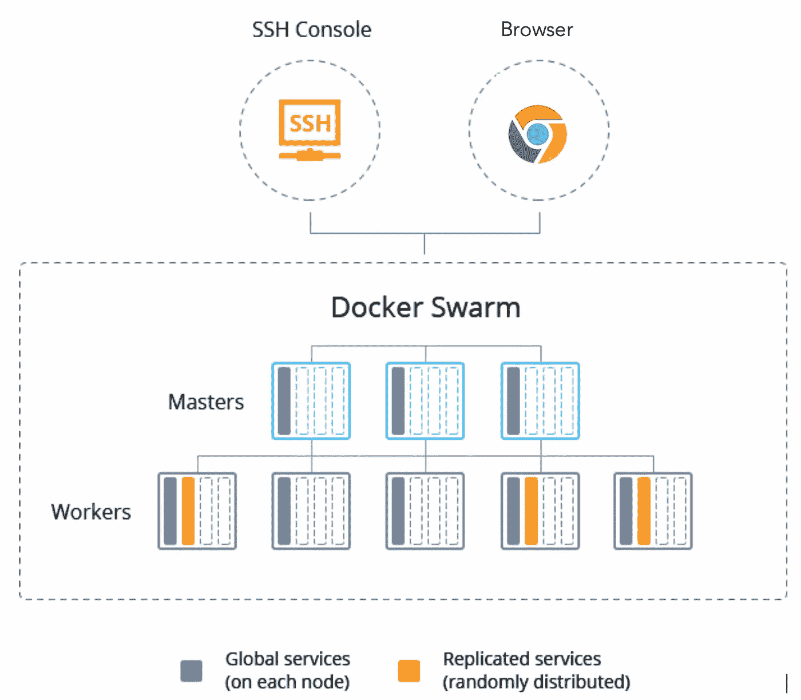
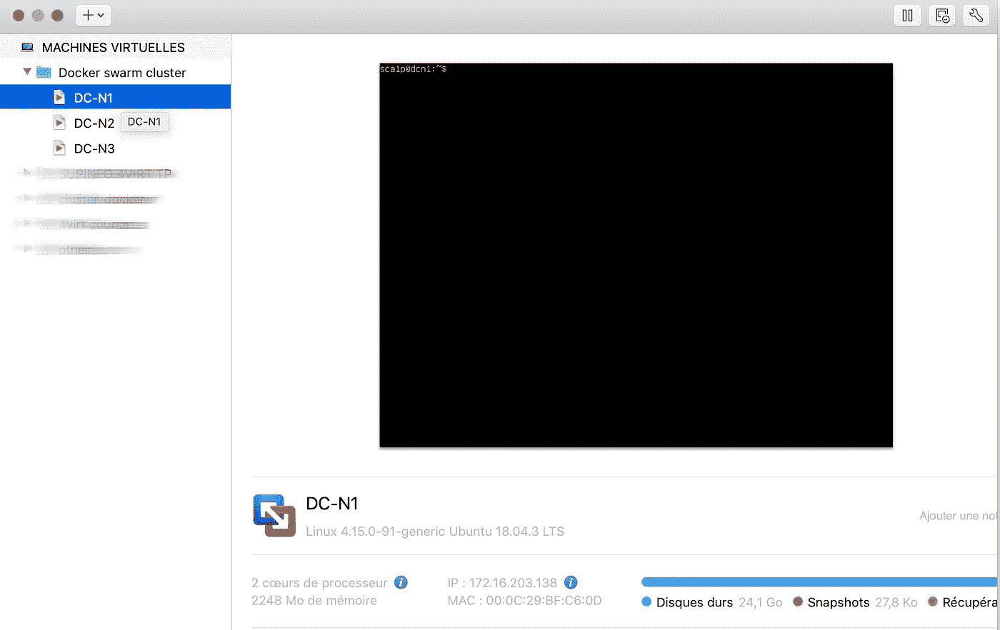
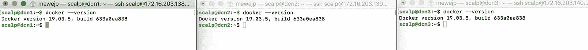
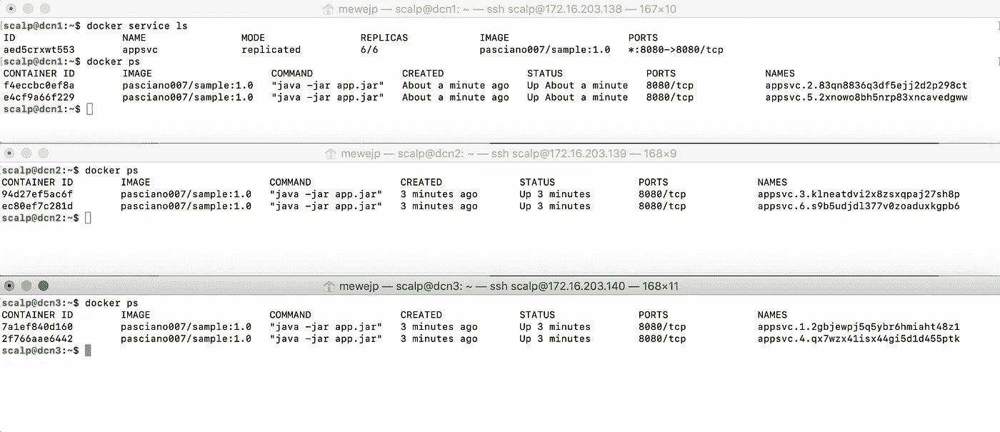
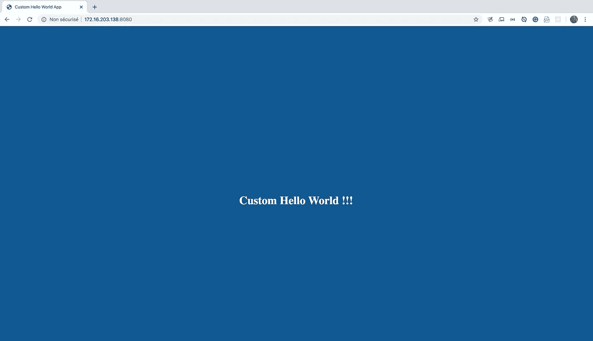
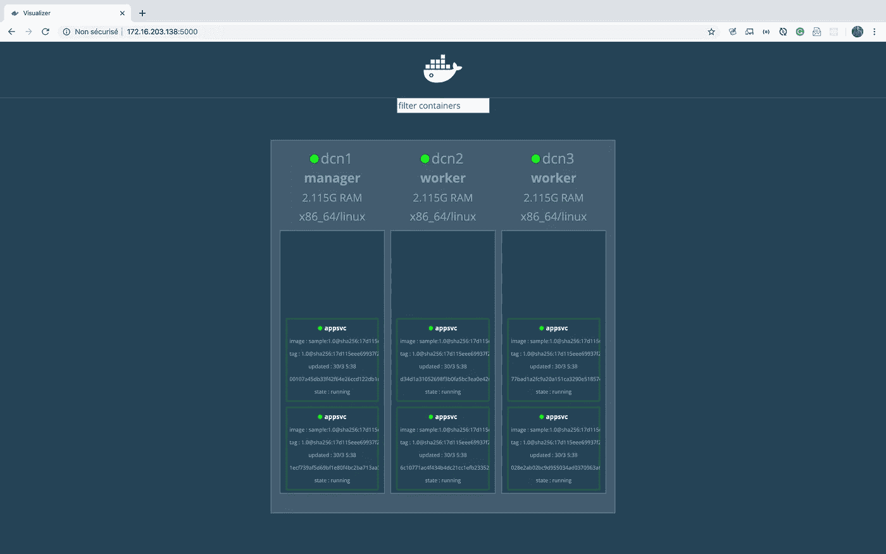
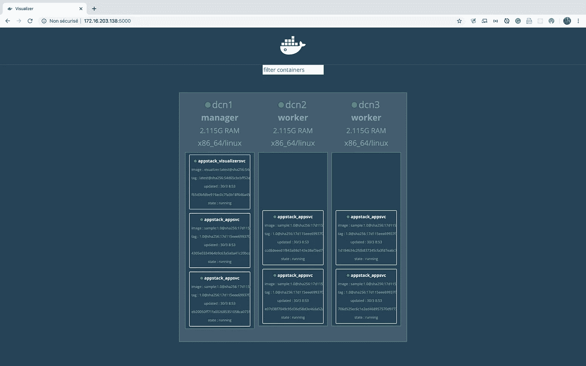
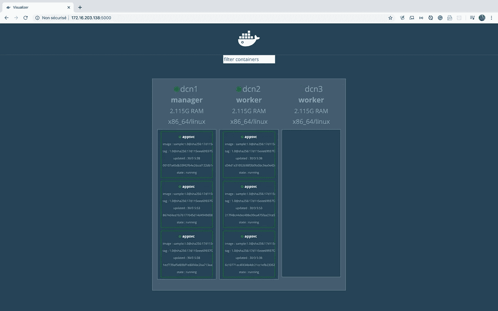

# Docker Swarm 容器编排实践指南

> 原文：<https://betterprogramming.pub/hands-on-guide-containers-orchestration-with-docker-swarm-27b3d64826c9>

## 熟悉 Docker


码头工人群

容器已经成为当今 IT 和软件行业中最流行的概念之一。在行业层面，需要快速部署高度可用和可伸缩的应用程序。这就是像 Docker Swarm 或 Kubernetes 这样的容器编排系统发挥作用的地方。

像往常一样，这篇文章将是一个循序渐进的实践指南。我们还将利用我们在[上一篇文章](https://medium.com/@mewejp/how-to-build-and-publish-a-spring-boot-apps-image-using-dockerfile-28d0d1b3940e)中构建的图像。

在本文中，我们将:

*   建立一个 Docker 集群
*   使用命令行和 Docker 编写 YAML 文件来部署服务
*   展示部署的应用程序的高可用性
*   使用 [Docker Swarm Visualizer](https://github.com/dockersamples/docker-swarm-visualizer) 查看集群节点和服务

在开始设置我们的环境和在集群中部署应用程序之前，让我们先定义一些贯穿本文的基本术语。如果你只对例子感兴趣，你可以跳过介绍。

# 介绍

## Docker 容器编排或 Docker 群

Docker 引擎内置的集群管理和编排功能被称为 *Docker Swarm。*它在 Docker 社区和企业版中都有提供。Docker 主机或节点的群集群是以群模式运行的高可用性服务器集群。



群集节点和服务概述

## 结节

一个*节点*是一个物理主机，或者它可以是云中的一个虚拟机，或者是运行 Docker 的虚拟机管理程序。管理器节点根据服务副本的数量向工作器分配任务。

## 服务

一个*服务*是在管理器或工作者节点上执行的任务的定义。这是 swarm 系统的中心结构，也是用户与 Swarm 交互的主要根源。

## 工作

一个*任务*携带一个 Docker 容器和在容器内运行的命令。

## **Docker 撰写**

根据官方文件:

> Docker Compose 是一个用于定义和运行多容器 Docker 应用程序的工具。使用 Compose，您可以使用 YAML 文件来配置应用程序的服务。然后，只需一个命令，您就可以从您的配置中创建和启动所有服务。”

在[官方文档](https://docs.docker.com/engine/swarm/key-concepts/)中了解更多基础术语。

# 环境设置

我的设置包括:

1.  在 VMware Fusion 中运行的三台虚拟机(VM)。我们可以安装任何虚拟机管理程序(VMware Workstation、Hyper-V 等。).我选择将我的虚拟机命名为`DC-N1`、`DC-N2`和`DC-N3`，就像“Docker 集群节点 1、2 和 3”你可以随意命名你的主机。
2.  每个虚拟机都安装了 Ubuntu server OS 18.04.3(可以安装任何系统)。
3.  每个虚拟机都安装了 Docker。如果您没有 Docker，请从[这个网站](https://docs.docker.com/install/)下载并在您的系统上安装 Docker。

下面是我在 VMware Fusion 中设置的虚拟机。



集群节点配置

下面的屏幕显示了我的每台主机中的 Docker 版本。



Docker 引擎版本

# 初始化集群

设置和配置 Docker 群组非常简单。首先要做的是初始化 Docker Swarm 集群。打开一个 Bash 终端，在第一个节点或选择作为管理器的节点中键入下面的命令。在我们的例子中，我们将选择`DC-N1` 作为管理节点。

```
docker swarm init
```

你的结果可能和我的相似。

```
**scalp@dcn1**:**~**$ docker swarm initSwarm initialized: current node (v375eb32g1k7vlm5uh96yzxhg) is now a manager.To add a worker to this swarm, run the following command:docker swarm join --token SWMTKN-1-1rgg6ldnnblce80kuyfdnpx9cvvdoymy0uouiyk65nv2b8i4gi-dywj1wnks23dzwvf2vr2aqiic 172.16.203.138:2377To add a manager to this swarm, run 'docker swarm join-token manager' and follow the instructions.
```

上面的结果告诉我们 Swarm 模式已经初始化，这个节点(主机)现在是管理器。它还向我们展示了如何加入这个集群中的工人。

这样，我们就创建了我们的集群。让我们通过键入 Bash 终端来验证节点。

```
docker node ls
```

你的结果可能和我的类似。它告诉我们该节点是一个管理器并且是活动的。

```
**scalp@dcn1**:**~**$ docker node lsID  HOSTNAME   STATUS  AVAILABILITY  MANAGER STATUS  ENGINE VERSIONv375eb32g1k7vlm5uh96yzxhg *   dcn1  Ready Active   Leader  19.03.5
```

现在，让我们向集群添加其他节点(工作节点)。

**提示:**如果您没有为了添加一个 worker 而复制上面的 Swarm 初始化命令的结果，您仍然可以通过运行下面的命令来显示它，以带回指令。运行后我们要做的就是复制命令并粘贴到其他节点。

```
**scalp@dcn1**:**~**$ docker swarm join-token workerTo add a worker to this swarm, run the following command:docker swarm join --token SWMTKN-1-1rgg6ldnnblce80kuyfdnpx9cvvdoymy0uouiyk65nv2b8i4gi-dywj1wnks23dzwvf2vr2aqiic 172.16.203.138:2377
```

# 将其他节点加入集群

```
**scalp@dcn2**:**~**$ docker swarm join --token SWMTKN-1-1rgg6ldnnblce80kuyfdnpx9cvvdoymy0uouiyk65nv2b8i4gi-dywj1wnks23dzwvf2vr2aqiic 172.16.203.138:2377This node joined a swarm as a worker.**scalp@dcn3**:**~**$ docker swarm join --token SWMTKN-1-1rgg6ldnnblce80kuyfdnpx9cvvdoymy0uouiyk65nv2b8i4gi-dywj1wnks23dzwvf2vr2aqiic 172.16.203.138:2377This node joined a swarm as a worker.
```

既然另外两个节点已经加入了集群，让我们回到管理节点，再次键入`docker node ls`。

```
**scalp@dcn1**:**~**$ docker node lsID                            HOSTNAME            STATUS              AVAILABILITY        MANAGER STATUS      ENGINE VERSIONv375eb32g1k7vlm5uh96yzxhg *   dcn1                Ready               Active              Leader              19.03.5fnb1v6vstratuscp2f6ysqow8     dcn2                Ready               Active                                  19.03.5ue1jk0odnt0ldm4xk9d2o3kc0     dcn3                Ready               Active                                  19.03.5
```

我们可以注意到我们有三个节点:一个管理节点和两个工作节点——它们都是活动的。

# 部署服务

为了部署一个高度可用和可伸缩的应用程序，我们将使用一个服务。我们将使用的图片来自发布到 Docker Hub 的[上一期教程](https://medium.com/@mewejp/how-to-build-and-publish-a-spring-boot-apps-image-using-dockerfile-28d0d1b3940e)。

在 manager 节点(`DC-N1`)中，打开一个 Bash 终端并输入下面的命令，这将创建一个名为`appsvc`的服务，它有六个副本并使用映像`pasciano007/sample:1.0`。

```
docker service create --name appsvc --replicas=6 --publish published=8080,target=8080  pasciano007/sample:1.0
```

## 查看结果

要查看新创建的服务，请在节点 3 中键入以下命令。

```
docker service ls
```

要查看每个节点中创建的容器，请运行以下命令:

```
docker ps
```

你的结果可能和我的相似。



使用端口 8080 上的任何节点 IP 地址，可以在浏览器中访问部署的高度可用和可扩展的应用程序。



在浏览器中访问部署的应用程序

# 使用 Docker Swarm Visualizer 查看节点

为了获得我们的 Swarm 集群节点的图形视图，我们可以使用开源的 Docker Swarm Visualizer。

运行 Docker Swarm Visualizer 最简单的方法是在容器中运行它。只需在您的管理器节点(`DC-N1`)中运行以下命令。由于端口 8080 已经被前面的部署使用，我们将把端口 5000 暴露给 Docker Swarm Visuailzer 容器的主机。

```
docker run -it -d -p 5000:8080 -v /var/run/docker.sock:/var/run/docker.sock dockersamples/visualizer
```

然后，我们可以使用 manager 节点的 IP 地址在浏览器中查看我们的集群节点。



Docker Swarm Visualizer 显示集群节点和服务

## 使用 UCP 管理节点

如果你有 Docker 的企业版，那么[通用控制平面](https://docs.docker.com/ee/ucp/)是内置的。这是在浏览器中管理整个集群的一种更强大的方式。

# 部署服务的最佳和最专业的方式

在企业级，服务的部署是使用一个`docker-compose` YAML 文件或`docker-stack` YAML 文件来完成的。我们可以在一个`docker-compose.yml`文件中创建服务，而不是运行上述所有命令来创建服务。Spring Boot 应用程序和 Docker Swarm Visualizer 可以一次性部署。

下面完整的`docker-compose` YAML 文件展示了如何部署服务。

docker-compose.yml

要部署服务，打开 Bash 终端并运行以下命令:

```
docker stack deploy --compose-file docker-compose.yml appstack
```

在 Docker Swarm Visualizer 中查看创建的服务:



Sprint Boot app 服务和 Docker Swarm Visualizer 服务

# 高可用性演示

为了展示我们集群的高可用性，我们将模拟一次故障。为此，让我们通过在节点 3 中运行下面的命令来停止在节点 3 中运行的 Docker 服务(`DC-N3`)。询问时键入您的密码。

```
sudo systemctl stop docker
```

现在，Docker Swarm 可视化工具如下所示。正如我们所看到的，节点 3 中的红色表示该节点有问题。在我们的例子中，Docker 守护进程已经停止。

但是 Docker 能够重启在节点 3 上运行的所有三个服务，并将它们分布在节点 1 和节点 2 上的集群中，因此我们仍然可以拥有在部署服务时设置的六个副本。



# 结论

哎呀！仅此而已。我们已经到了尽头。

感谢你的时间，我希望你能从这篇文章中学到一些东西。接下来，我将发表另一篇文章，展示如何在一个 [Kubernetes](https://kubernetes.io/) 集群中做同样的事情。