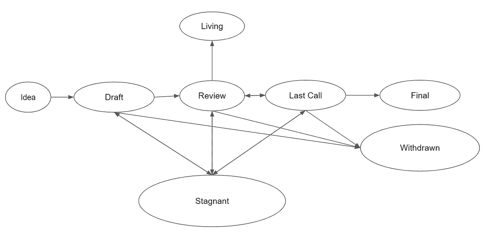
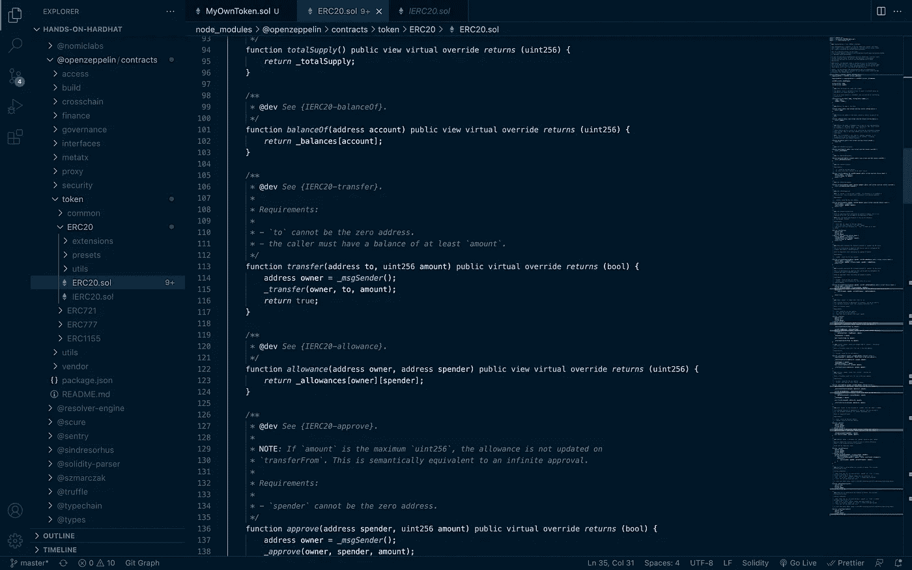
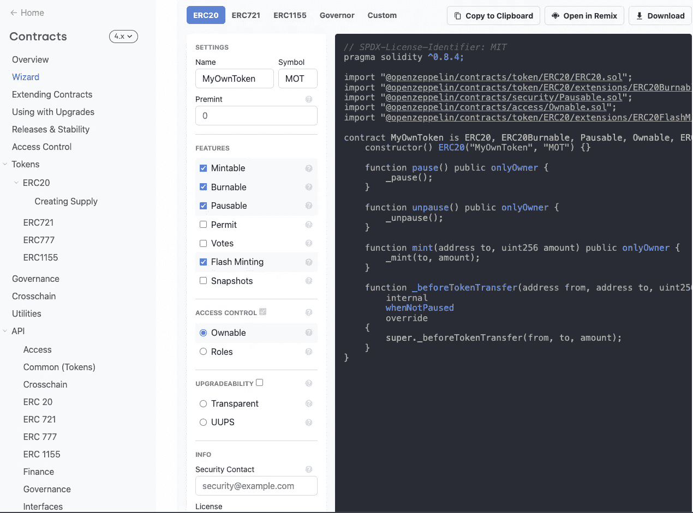
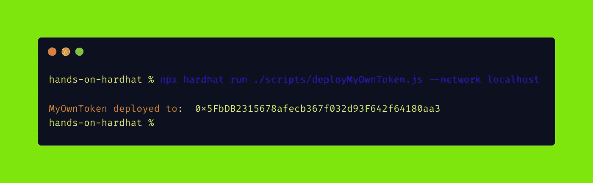
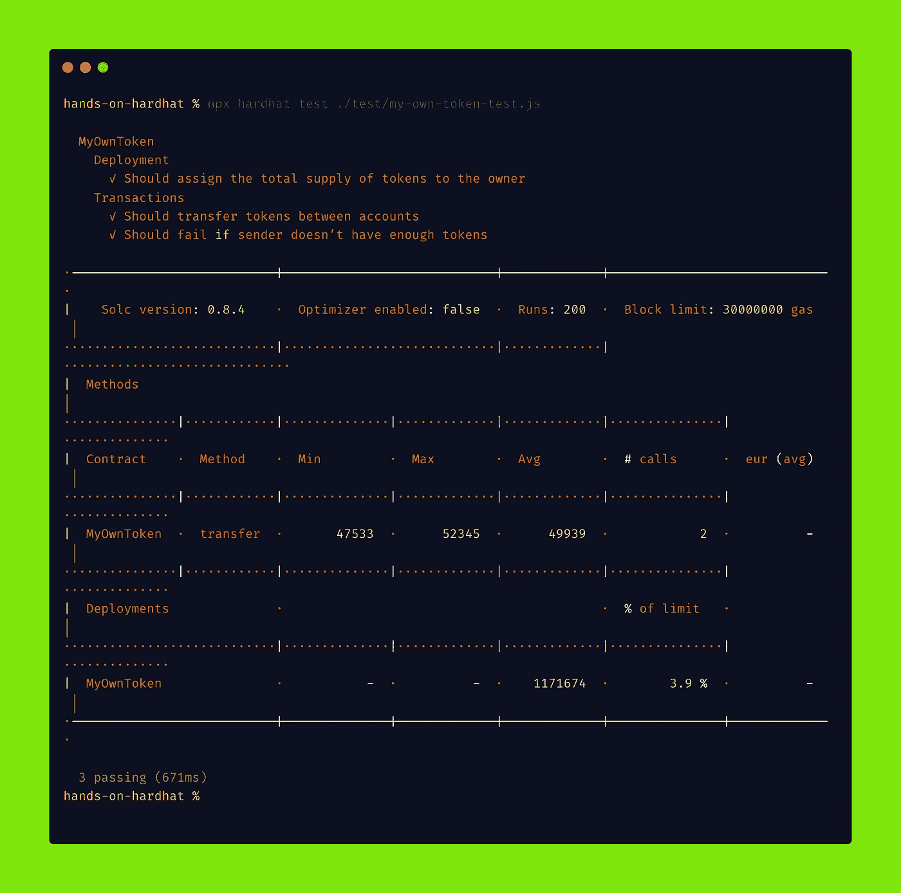

# 动手操作安全帽——编写您自己的定制令牌

> 原文：<https://betterprogramming.pub/hands-on-hardhat-write-your-custom-own-token-a8e2857dc9e4>

## 第 3 部分— EIP、ERC20 和 OpenZeppelin


[来自 Unsplash 的图像](https://unsplash.com/photos/b4D7FKAghoE)

在前面的[ [第一部分](https://medium.com/web3-magazine/hands-on-hardhat-part-1-c6d2f0a00603)、[ [第二部分](/hands-on-hardhat-writing-contracts-testing-and-deploying-fa31f5a0e573) ]中，我们写好了项目设置，并部署了我们的第一份合同。在这一部分，我们将学习 ERC-20 标准，并编写我们的 ERC-20 标准令牌。

# EIP

要了解 ERC，我们应该先了解 EIP(以太坊改进建议)。如你所知，以太坊和其他区块链网络是基于社区的。此时，任何想要改进网络的人都可以提出建议。

例如，如果 Vitalik Buterin 想为以太坊网络做点什么，他会提交一份提案，或者如果你想为以太坊网络做点什么，你必须提交一份提案。这就像是[比特币改进提案(BIP)](https://messari.io/resource/bitcoin-improvement-proposal-bip) 。简单地说，EIP 是由任何社区成员提出的新特性或设计功能的想法草案，由以太坊生态系统中的利益相关者审查。

然而，这些建议有基本的标准，你必须清楚地说明它们；摘要、动机、规范、基本原理、向后兼容性、测试用例、参考实现和安全性考虑。现在，我不会详述所有这些，我只是给出一个[提议](https://github.com/ethereum/EIPs/blob/master/eip-template.md)的例子。

EIP 也有三种类型:

1.  **标准追踪 EIP**

*   核心
*   建立工作关系网
*   连接
*   经济研究委员会(Economic Research Council)

**2。元 EIP**

**3。信息 EIP**

更多详情请查看[本](https://eips.ethereum.org/EIPS/eip-1)

换句话说，在你准备好紧凑的文档之后，你就可以提出你的建议了。但是，并不是所有的事情都同时发生，因为 EIP 有它的过程。

> *EIP 的生命周期包含不同的阶段。一个*【想法】*必须首先由*起草，*允许提案由 EIP 的编辑放入 EIP 储存库。然后，提案进入*‘审查’*阶段，在此期间，作者要求同行审查的日期。编辑为提案分配一个*“最后一次调用”*状态，在该状态结束时，它必须被授予*“最终”*状态，通常是在 14 天后。*
> 
> 如果六个月没有进展，任何 EIP 都可能被推入停滞状态。提交 EIP 需要高水平的技术能力，成功的 ERC 不仅已经进入“最终”状态，而且还被项目使用。

# EIP 过程



[来源](https://eips.ethereum.org/EIPS/eip-1)

# ERC-20

ERC 代表“以太坊请求注解”，它是 **EIP** 的一个专门化子类型，涉及不影响以太坊协议本身的应用级变化。

它是由 Fabian Vogelsteller 在 2015 年 11 月 19 日推出的。这是 GitHub 指定的第 20 期，命名为“ERC20”。ERC20 是一个提案，旨在对如何定义令牌契约、如何与令牌契约交互以及这些契约如何相互交互进行标准化。

> ERC20 标准适用于使用以太坊区块链创建的可替换代币。
> 
> 可替换令牌是可以与另一个令牌互换的令牌。
> 
> 这个标准接口允许以太坊上的任何令牌被其他应用程序重用:从钱包到分散的交换。

此外，还有许多 ERC，如 *ERC721 vs ERC1155* 我不会全部解释，要查看所有 ERC，请查看[此处](https://eips.ethereum.org/erc)。

正如我之前提到的，每个提案都有基本标准，您必须清楚地说明它们，因此根据 EIP-20 的文档 [ERC20 token 的规范](https://eips.ethereum.org/EIPS/eip-20)必须至少提供以下功能和事件:

在编码之前，让我解释一些事情。

现在，我不打算实现`ERC20Interface`它，以避免重新发明轮子。我将继续使用 [Openzeppelin](https://www.openzeppelin.com/) 。

# OpenZeppelin

OpenZeppelin 是一个用于构建安全智能合约的开源框架。它提供了一整套安全产品和审计服务，用于构建、管理和检查软件开发的各个方面以及分散应用程序的操作。

现在让我们开始编码。

首先，我们需要添加`openzeppelin`依赖项，要添加这个依赖项，打开您的终端并运行这个命令行:

```
npm install @openzeppelin/contracts
```

第二，在你的项目结构中，打开`contracts`包，创建一个名为`MyOwnToken.sol`的文件，然后导入`openzeppelin ERC20 contract`。

```
import "@openzeppelin/contracts/token/ERC20/ERC20.sol";
```

最后，写出你的`MyOwnToken`，继承`ERC20` **。您的代码应该如下所示:**

您的构造函数带有一个命名的`initialSupply`参数，并继承了带有两个参数的`ERC20`契约:令牌名称和令牌符号。

在构造函数的作用域中，有一个`_mint()`函数，它设置将铸造多少个令牌。现在你可能想知道我们为什么那样做。当你打开`ERC20.sol`文件时，你会看到它继承了我上面提到的`IERC20`接口，我们写的所有 ERC20 标准代码都应该来自`openzeppelin`。

如果我们没有从`ERC20`继承`MyOwnToken`，我们将不得不编写 ERC20 拥有的函数。而且我们写的代码可能不会像`openzeppelin`的代码那样高效和安全。



这是所有的乡亲。我们编写了自定义令牌。

接下来，在编写测试和部署我们的智能契约之前，还有一件事。

如果你希望令牌是可燃烧的，或者有一些访问控制，但是正在努力写它们，这里有一个`openzeppelin`游乐场。您选择选项，令牌的代码会自动编写—并且不限于 ERC20。ERC721 和 ERC1155 也存在。要查看游乐场，请访问[此处](https://docs.openzeppelin.com/contracts/4.x/wizard)。



## 部署

现在，让我们部署并编写我们的契约测试。首先，打开您的终端并运行编译命令行:

```
npx hardhat compile
```

编译后(我假设您没有得到任何错误)，在`scripts`包中创建一个`deployMyOwnToken.js`文件，并添加以下代码进行部署:

脚本编写完成后，打开两个终端，一个用于启动节点，另一个用于部署。

在第一次终端运行中:

```
npx hardhat node
```

在另一次运行中:

```
npx hardhat run ./scripts/deployMyOwnToken.js --network localhost
```



到目前为止一切都好。

## 单元测试

让我们编写单元测试。在`test`包内创建一个命名的`my-own-token-test.js`文件，文件代码如下:

指定您的`test`文件夹并运行测试命令行:

```
npx hardhat test ./test/my-own-token-test.js
```



好了，搞定了！下一部分再见。感谢阅读。

# 参考

*   [https://eips.ethereum.org/EIPS/eip-1](https://eips.ethereum.org/EIPS/eip-1)
*   [https://eips.ethereum.org/EIPS/eip-20](https://eips.ethereum.org/EIPS/eip-20)
*   [https://dev . to/养乐多/a-简明-安全帽-教程-第二部分-写作-erc20-2jpm](https://dev.to/yakult/a-concise-hardhat-tutorial-part-2-writing-erc20-2jpm)

```
**Want to Connect?**Connect with me on social media: [Twitter](https://twitter.com/0xazat), [LinkedIn](https://www.linkedin.com/in/azatsayan/), and [Github](https://github.com/0xazat).
```