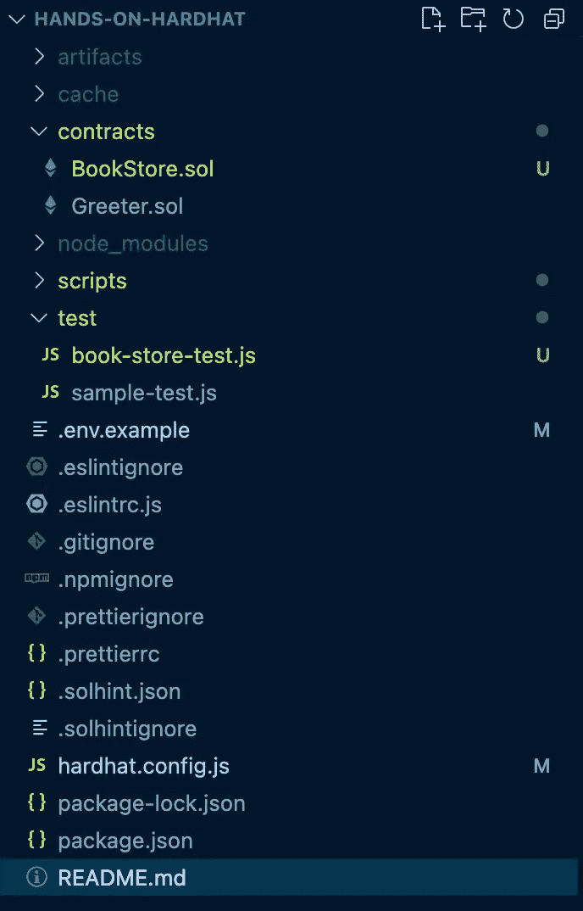
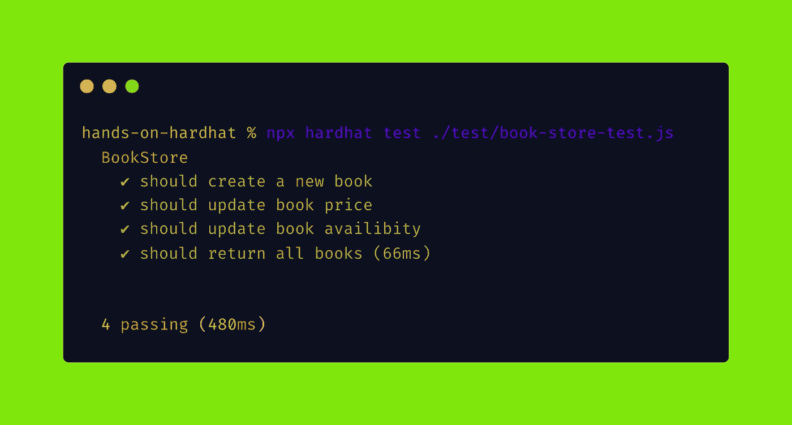
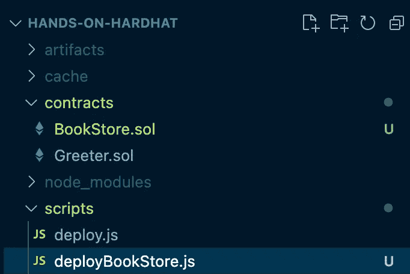
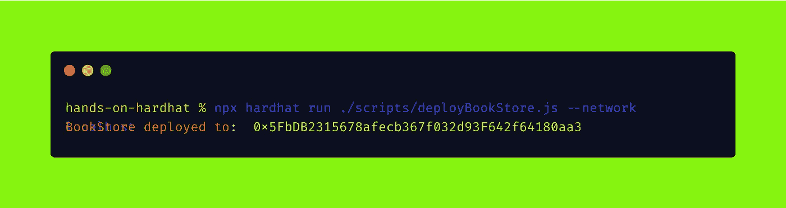
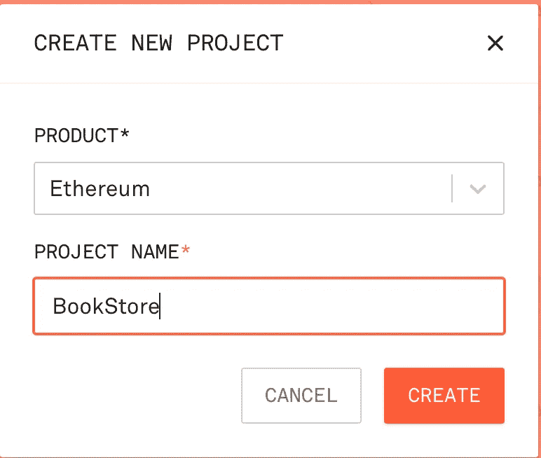
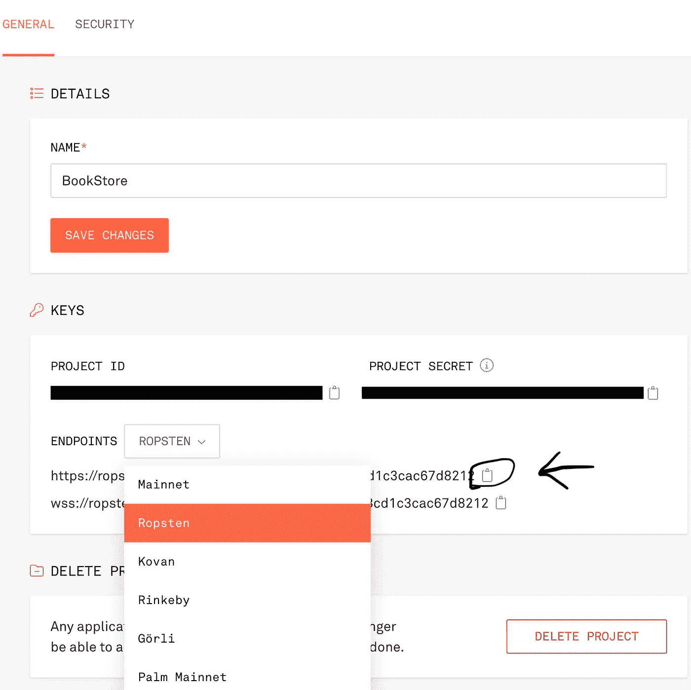
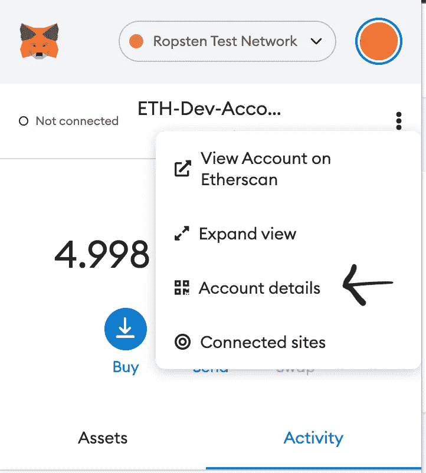
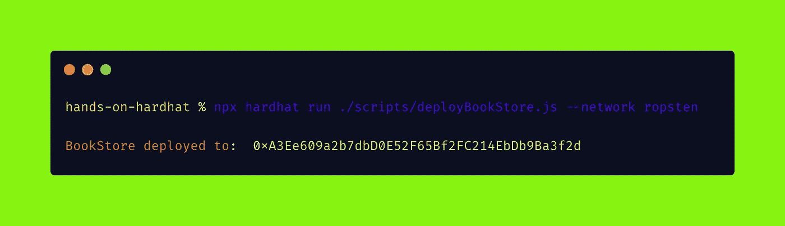

# 实际操作的安全帽——撰写合同、测试和部署

> 原文：<https://betterprogramming.pub/hands-on-hardhat-writing-contracts-testing-and-deploying-fa31f5a0e573>

## 第二部分


图片来自 Unsplash

在[上一部分](https://medium.com/web3-magazine/hands-on-hardhat-part-1-c6d2f0a00603)中，我们提到了如何用 Hardhat 设置我们的项目环境。在这一部分中，我们将详细说明我们的项目结构，并编写我们的第一个测试合同，最后，我们将部署它。

好了，伙计们，让我们打开我们的虚拟代码。

当你看我们的项目结构时，有一个合同是默认合同，但我们不需要也不会超过它。我们要写合同。


让我们考虑一下我们的合同，例如，我们有一家书店，它列出了我们的书籍，并为我们提供了关于所列书籍的信息，如书籍的名称、作者、价格和可用性。

# 创建合同

回到您的 VSCode，在`contract`目录中创建一个名为`BookStore.sol`的文件。


现在，我们的`BookStore.sol`应该如下；

```
//SPDX-License-Identifier: Unlicense
pragma solidity ^0.8.0;contract BookStore { // Book's infos
    struct Book {
        string bookName;
        string bookAuthor;
        uint256 bookPrice;
        bool available;
    } // Books list
    Book[] public books; // Create a new book to add books list
    function createBook(
        string memory _name,
        string memory _author,
        uint256 _price,
        bool _available
    ) external {
        books.push(Book(_name, _author, _price, _available));
    } // Update book price by books list index
    function updateBookPrice(
        uint _index, 
        uint256 _newPrice
    ) external {
        books[_index].bookPrice = _newPrice;
    } // Update book avalibility by books list index
    function updateBookAvalibility(
        uint _index,
        bool _isAvaliable
    ) external {
        books[_index].available = _isAvaliable;
    } // Gell all books
    function getAllBooks() external view returns(Book[] memory) {
        return books;
    }
}
```

# 编写合同测试

在测试文件夹中创建一个名为`book-store-test.js`的项目，其结构如下；



在这个阶段，我想指出一些事情。在前一部分中，我自动添加了所有必要的库或插件，因为我们选择了一个高级的示例项目，所以在这个文件中，你可能会对`chai`或其他东西感到困惑，因为它们是默认出现的。

```
const { expect } = require("chai");
const { ethers } = require("hardhat");describe("BookStore", function () {
  let BookStore, bookStore;before(async function () {
/**
** A ContractFactory in ethers.js is an abstraction used 
* to deploy new smart contracts, so BookStore here is 
* a factory for instances of our* bookStore *contract* */
BookStore = *await* *ethers.getContractFactory*("BookStore");/**
** Calling deploy() on a ContractFactory will start the deployment,
* and return a Promise that resolves to a Contract.
* This is the object that has a method for each of your smart
* contract functions.* */
bookStore = *await* *BookStore.deploy*();
*await* *bookStore.deployed*();
}); it("should create a new book", async function () {
    await bookStore.createBook("1984", "George Orwell", 2, true);
    let books = await bookStore.getAllBooks();
    expect(books[0].bookName).to.equal("1984");
    expect(books[0].bookAuthor).to.equal("George Orwell");
    expect(books[0].bookPrice).to.equal(2);
    expect(books[0].available).to.equal(true);
  }); it("should update book price", async function () {
    await bookStore.updateBookPrice(0, 4);
    let books = await bookStore.getAllBooks();
    expect(books[0].bookPrice).to.equal(4);
  }); it("should update book availibity", async function () {
    await bookStore.updateBookAvalibility(0, false);
    let books = await bookStore.getAllBooks();
    expect(books[0].available).to.equal(false);
  }); it("should return all books", async function () {
    await bookStore.createBook("Building a Second Brain", "Tiago Forte", 3, true );
    await bookStore.createBook("Last Summer on State Street", "Toya Wolfe", 1, true);
    await bookStore.createBook("Do Hard Things", "Steve Magness", 5, false);
    await bookStore.createBook("The Power of Discipline", "Daniel Walter", 6, true);
    await bookStore.createBook("Mindful Self-Discipline", "Giovanni Dienstmann", 2, false);
    let books = await bookStore.getAllBooks();
    expect(books.length).to.equal(6);
  });
});
```

编写完测试场景后，在您的终端中运行测试任务:

```
npx hardhat test
```

此时，不要忘记指定您的`test`文件夹。例如，我们的测试文件位于测试文件夹中，因此我们必须指定它:

```
npx hardhat test ./test/book-store-test.js
```



嗯，我们所有的测试都通过了。

# 部署合同

好了，伙计们，到目前为止，部署我们的合同一切顺利，我们必须编写部署脚本。打开你的`script`文件夹，创建一个名为`deployBookStore.js`的文件。



您的脚本文件应该如下所示:

```
/** ** We require the Hardhat Runtime Environment explicitly here.
* This is optional but useful for running
* the script in a standalone fashion through `node <script>`.
* When running the script with `npx hardhat run <script>`
* you'll find the Hardhat Runtime Environment's
* members available in the global scope.* */const *hre* = *require*("hardhat")*async* function *main*() {/** ** Hardhat always runs the compile task when running scripts
* with its command line interface.
* If this script is run directly using `node`
* you may want to call compile
* manually to make sure everything is compiled
* await hre.run('compile');* */// *We get the contract to deploy* const *BookStore* = *await hre.ethers.getContractFactory*("BookStore");
const *bookStore* = *await BookStore.deploy*();*await* *bookStore.deployed*();*console.log*("BookStore deployed to: ", *bookStore.*address);}/** ** We recommend this pattern to be able to use
* async/await everywhere and properly handle errors.* */*main*()*.catch*((error) => {
*console.error*(error);
*process.*exitCode = 1;
});
```

在您的脚本编写完成之后，打开您的终端并编写这个命令行来启动一个本地区块链；

```
npx hardhat node
```

然后，打开另一个终端并运行您的脚本文件；

```
npx hardhat run ./scripts/deployBookStore.js --network localhost
```



如您所见，我们的合同部署成功。

所以我们做得很完美，如果我们想把我们的合同部署到不同的网络，如 Ropsten、Rinkeby 或 Goerli。为了完成这个场景，我们有一些选择炼金术和炼金术。分别是区块链 API 和节点基础设施。

现在，我将使用 Infura，它提供了工具和基础设施，允许开发人员轻松地将他们的区块链应用程序从测试扩展到部署。

要设置环境，请转到 [Infura](https://infura.io/) 并注册，然后创建一个新项目。



然后进入项目详情页面选择 Ropsten 网络并复制端点；



在我们得到 Infura API_KEY 之后，我们还需要私钥。打开你的 Metamask 钱包，选择 Ropsten 测试网络，点击三个点，然后点击**账户详情**



然后点击**导出私钥**


获得私钥后，返回到 VSCode 并打开`hardhat.config.js`文件。

您的文件代码如下:

```
require("dotenv").config();require("@nomiclabs/hardhat-etherscan");
require("@nomiclabs/hardhat-waffle");
require("hardhat-gas-reporter");
require("solidity-coverage");// This is a sample Hardhat task. 
// To learn how to create your own go to
// <https://hardhat.org/guides/create-task.html>
task("accounts", "Prints the list of accounts", async (taskArgs, hre) => {
  const accounts = await hre.ethers.getSigners(); for (const account of accounts) {
    console.log(account.address);
  }
});// You need to export an object to set up your config
// Go to <https://hardhat.org/config/> to learn moreconst **API_URL** = "https://ropsten.infura.io/v3/API_KEY";
const **PRIVATE_KEY** = "";
/**
 * @type import('hardhat/config').HardhatUserConfig
 */
module.exports = {
  solidity: "0.8.4",
  networks: {
    ropsten: {
      url: API_URL,
      accounts: [`0x${PRIVATE_KEY}`],
    },
  },
};
```

现在，打开您的终端并运行您的部署任务；

```
npx hardhat run ./scripts/deployBookStore.js --network ropsten
```



要查看您的合同，请前往[https://ropsten.etherscan.io/](https://ropsten.etherscan.io/)并搜索您的合同地址。

恭喜各位，你们已经完成了第一份合同的编写、测试和部署。

综上所述，我们能用 HardHat 做什么？

*   覆盖率(检查遗漏的测试)
*   气体报告(检查优化)
*   Dotenv(部署安全密钥)
*   Localhost(用于本地测试的快速节点)
*   Solhint 集成(风格指南和安全性)
*   脚本(编译和部署正在运行的脚本)
*   Typescript(静态类型化以避免错误)
*   以太扫描验证(简化 IDE 上的工作流程)

```
Connect with me on social media: [Twitter](https://twitter.com/0xazat), [LinkedIn](https://www.linkedin.com/in/azatsayan/) and [Github](https://github.com/0xazat).
```