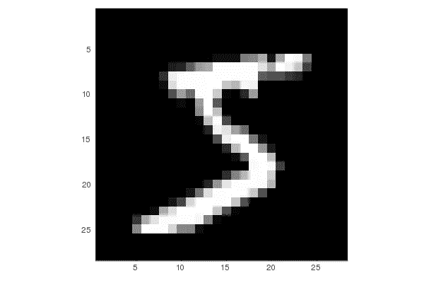

# 使用人工神经网络识别笔迹

> 原文：<https://betterprogramming.pub/handwriting-recognition-using-an-artificial-neural-network-78060d2a7963>

## 用 Julia 编写的神经网络识别数字


Artem Bryzgalov 在 [Unsplash](https://unsplash.com/s/photos/future?utm_source=unsplash&utm_medium=referral&utm_content=creditCopyText) 上拍摄的照片

一个典型的神经网络入门教程包括使用 [MNIST 数据库](https://en.wikipedia.org/wiki/MNIST_database)对手写进行从 0 到 9 数字的手写识别。


这涉及到对单个数字的识别。你可以想象这样的东西被用来扫描 giros 或支票，其中账号和需要转账的金额被写在明确定义的框中。


在本教程中，我们将介绍如何使用 [Julia](https://julialang.org) 编程语言和名为 [Flux](https://fluxml.ai) 的机器学习库来实现这一点。

# 为什么是 Flux 和 Julia？

现在，你为什么想要使用 [Flux](https://fluxml.ai) 和 [Julia](https://julialang.org) 而不是更知名的库，如 Torch、PyTorch、Keras 或 TensorFlow 2.0？

一个很大的原因是，你可以更快地学习 Flux 它提供更好的性能，并且它有更多的未来潜力。其中一个原因是 Flux 做了很多事情，但仍然是一个很小的库——它可以这么小是因为它所做的大部分事情都是由 Julia 编程语言本身提供的。

例如，如果你查看 Go 编程语言的[柳珊瑚](https://github.com/gorgonia/gorgonia) ML 库，你会发现一些线索。它明确显示了其他机器学习库如何需要建立一个需要执行和区分的表达式图。在流动中，这张图就是朱莉娅本身。Julia 与 LISP 非常相似，因为 Julia 代码可以很容易地表示为数据结构，可以修改和评估。

# 机器学习导论

如果你完全是机器学习的新手，你可以跟随这个教程，但并不是所有的东西都有意义。在这种情况下，你可以看看我以前写的一些关于媒体的文章，它们可能解释了你的一些绊脚石:

*   [**线性代数的核心思想**](https://medium.com/@Jernfrost/the-core-idea-of-linear-algebra-7405863d8c1d) 。线性代数基本上是关于向量和矩阵的，这是你在机器学习中经常用到的东西。
*   [**使用参照**](https://medium.com/@Jernfrost/working-with-and-emulating-references-in-julia-e02c1cae5826) 。这可能看起来有点外围，但如果你想了解像 Flux 这样的 ML 库，了解 Julia 中的引用是很重要的。
*   [**实现通量**](https://medium.com/@Jernfrost/implementation-of-a-modern-machine-learning-library-3596badf3be) 。如何实现 Flux ML 库的初学者指南？
*   [**机器学习简介**](https://medium.com/@Jernfrost/machine-learning-for-dummies-in-julia-6cd4d2e71a46) 。机器学习概论和 Flux。通量部分有点过时了。

# 简单多层感知器

我们要编程的人工神经网络被称为简单的[多层感知器](https://en.wikipedia.org/wiki/Multilayer_perceptron)。这是神经网络(ANN)的基本功能，大多数教科书都会从它开始。

我先展示整个程序，然后我们可以更详细地讨论不同的部分。

```
using Flux, Flux.Data.MNIST, Statistics
using Flux: onehotbatch, onecold, crossentropy, throttle
using Base.Iterators: repeated

# Load training data. 28x28 grayscale images of digits
imgs = MNIST.images()

# Reorder the layout of the data for the ANN
imagestrip(image::Matrix{<:Gray}) = Float32.(reshape(image, :))
X = hcat(imagestrip.(imgs)...)

# Target output. What digit each image represents.
labels = MNIST.labels()
Y = onehotbatch(labels, 0:9)

# Defining the model (a neural network)
m = Chain(
 Dense(28*28, 32, relu),
 Dense(32, 10),
 softmax)

loss(x, y) = crossentropy(m(x), y)
dataset = repeated((X, Y), 200)
opt = ADAM()

evalcb = () -> @show(loss(X, Y))

# Perform training on data
Flux.train!(loss, params(m), dataset, opt, cb = throttle(evalcb, 10))
```

# 浏览输入数据

准备用于处理的数据通常是数据科学中最大的工作之一。通常，数据没有按照您需要输入到算法中的方式进行组织或格式化。

我们首先将 MNIST 数据集加载为 28×28 像素的 60，000 幅灰度图像:

```
imgs = MNIST.images()
```

现在，如果你的任务是处理这样的数据，你可能不知道你会得到什么。例如，我怎么知道这些数据是什么样的？我本可以谷歌一下，但我只是让朱莉娅来检查一下:

```
julia> size(imgs)
(60000,)
```

这告诉我`imgs`是一个包含 60，000 个元素的 1D 数组。但是这些元素是什么呢？：

```
julia> eltype(imgs)
Array{Gray{FixedPointNumbers.Normed{UInt8,8}},2}
```

这可能对您来说可读性不强，但我可以用一种简化的方式向您展示这是什么:

```
julia> eltype(imgs) <: Matrix{T} where T <: Gray
true
```

这告诉我们`imgs`中的每个元素都是某种值的矩阵。这些值属于某种类型`T`，它是类型`Gray`的一个子类型。`Gray`是什么类型？

我们可以在 Julia 在线文档中查找:

```
help?> Gray
  Gray is a grayscale object. You can extract its value with gray(c).
```

自然，我们想知道这些灰度值矩阵的维数:

```
julia> size(imgs[1])
(28, 28)

julia> size(imgs[2])
(28, 28)
```

这告诉我们它们有 28x28 像素大。我们可以通过简单地绘制其中一些来进一步验证。Julia `Plots`库可以让你绘制函数和图像。

```
julia> using Plots
julia> plot(imgs[2])
```

这给了我下面的图像，它看起来很像一个数字:



一个手写的“五”

但是，您可能会发现了解更多数据的样子会更有用。我们可以很容易地绘制几幅图像:

```
imgplots = plot.(imgs[1:9])
plot(imgplots...)
```


训练数据中的前九个手写数字

现在我们对数据有了一个大概的了解。

# 准备输入数据

但是，我们不能像这样将数据输入到我们的神经网络(ANN)中。每个输入必须是列向量，而不是矩阵。

这是因为神经网络期望矩阵作为输入，其中矩阵中的每一列都是输入。ANN 看到的 3×10 矩阵对应于 10 个不同的输入，其中每个输入包括三个不同的值，或者更具体地说，包括三个不同的特征。因此，我们将 28x28 灰度图像转换成像素长的细带或像素条。

其次，我们的神经网络将不知道什么是灰度值。它对浮点数据进行操作。因此，我们必须转换数据的维度和元素类型。

阵列中的列数和行数称为其形状。许多人谈到张量，因为虽然不完全准确，但它是一个涵盖标量、向量、矩阵、立方体或任何秩的数组(基本上是数组的所有维度)的概念。

在 Julia 中，我们可以使用`reshape`函数来改变数组的形状。这里有一些你如何使用它的例子。

这创建了一个包含四个元素的列向量`A`:

```
julia> A = collect(1:4)
4-element Array{Int64,1}:
 1
 2
 3
 4
```

用`reshape`我们把它变成一个二乘二的矩阵，`B`:

```
julia> B = reshape(A, (2, 2))
2×2 Array{Int64,2}:
 1  3
 2  4
```

矩阵可以再次变成列向量:

```
julia> reshape(B, 4)
4-element Array{Int64,1}:
 1
 2
 3
 4
```

准确地找出一个列向量的元素长度通常是不切实际的。你可以让 Julia 计算出合适的长度，只要写下`:`而不是长度。

```
julia> reshape(B, :)
4-element Array{Int64,1}:
 1
 2
 3
 4
```

有了这些信息，应该更容易看到我的`imagestrip`函数实际上做了什么。它将 28x28 灰度值矩阵转换为 784 个 32 位浮点值的列向量。

```
imagestrip(image::Matrix{<:Gray}) = Float32.(reshape(image, :))
```

`.`符号用于将函数应用于数组的每个元素。因此`Float32.(xs)`与`map(Float32, xs)`相同。

接下来，我们将`imagestrip`函数应用于 60 000 幅灰度图像中的每一幅，从而为我们的模型生成 784x60000 个输入矩阵`X`。

```
X = hcat(imagestrip.(imgs)...)
```

这是如何工作的？正如您所想象的，`imagestrip.(imgs)`将图像转换成单个输入值的数组，就像这个`[X₁, X₂, X₃, ..., Xₙ]`，其中`n`是 60，000，每个`Xᵢ`是 784 个浮点值。

使用 splat 操作符`...`,我们将它转化为所有这些列向量的水平连接，以产生模型输入。

```
X = hcat(X₁, X₂, X₃, ..., Xₙ)
```

如果您想验证尺寸，只需运行`size(X)`。接下来，我们加载标签。

```
labels = MNIST.labels()
```

`Label`就是我们所说的监督学习中观察的答案部分。在这种情况下，标签是从`0`到`9`的数字。手绘数字的每个图像应该被分类为十个不同数字中的一个。举例来说，如果 iris 数据集涵盖了不同花卉品种的花瓣长度和花瓣宽度，那么该品种的名称就是标签。

`Xᵢ`，在这种情况下，代表了我们所有的一个特征向量。用机器学习的术语来说，每个像素灰度值都是一个特征。

你可以将标签与我们绘制的图像进行比较。

```
imgplots = plot.(imgs[1:9])
plot(imgplots...)
labels[1:9]
```

# 一键编码

有 60，000 个标签，每个图像一个。但是，一个神经网络不能直接吐槽标签。想象一下，你试图对猫和狗的图像进行分类——网络不能给出字符串`"dog"`或`"cat"`,因为它使用浮点值。

如果标签是一个不一定有帮助的数字。例如，如果输出是一系列邮政编码，那么将邮政编码 3000 视为邮政编码 1500 的两倍是没有意义的。同样，当使用神经网络从图像中预测数字时，4 是 2 的两倍也不重要。数字也可能是字母，因此它们的值并不重要。

我们在机器学习中处理这个问题的方式是，我们使用所谓的[一个热编码](https://en.wikipedia.org/wiki/One-hot)。这意味着，如果我们有标签`A`、`B`和`C`，并且我们想用一键编码来表示它们，那么`A`就是`[1, 0, 0]`、`B`就是`[0, 1, 0]`并且`C`就是`[0, 0, 1]`。

这看起来很浪费，但是在内部，Julia one-hot 数组只是跟踪元素的索引。它不会保存所有的零。

以下是这种编码方式的一些应用示例:

```
julia> Flux.onehot('B', ['A', 'B', 'C'])
3-element Flux.OneHotVector:
0
1
0

julia> Flux.onehot("foo", ["foo", "bar", "baz"])
3-element Flux.OneHotVector:
1
0
0
```

然而，我们不打算使用`onehot`函数，因为我们正在创建一批独热编码标签。我们将把所有 60，000 张图片作为一批进行处理。

机器学习批处理是指在我们的模型(神经网络)的权重或参数更新之前必须完成的最少量的工作。

```
Y = onehotbatch(labels, 0:9)
```

这将创建目标输出。在理想的情况下`model(X) == Y`，但是当然，在现实中，即使经过模型的大量训练，也会出现一些偏差。

现在我们已经讨论完了数据准备。让我们从人工神经网络构建我们的模型。

# 构建神经网络模型

模型就像模型船一样，是真实世界的简化表示。正如我们可以建立简化的物理模型一样，我们也可以用数学或代码创建物理世界的模型。存在许多这样的数学模型。

例如，统计模型可以使用统计数据来模拟一天中人们到达商店的方式。一般来说，人们会以一种遵循特定概率分布的方式到达。

在我们的例子中，我们试图使用神经网络来模拟现实世界中的一些东西。当然，这只是真实世界的近似值。

在构建神经网络时，我们有许多可以利用的部分。网络由多层连接而成。每一层通常具有激活功能。

构建神经网络的部分挑战是选择正确的层和激活函数，并决定每层应该有多少个节点。

我们的模型非常简单，定义为:

```
m = Chain(
  Dense(28^2, 32, relu),
  Dense(32, 10),
  softmax)
```

这是一个由三层组成的神经网络。`Chain`用于将单个层链接在一起。第一层`Dense(28^2, 32, relu)`有 784 (28x28)个输入节点，对应每幅图像的像素数。

它使用整流线性单位(ReLU)功能作为激活功能。在经典的神经网络文献中，通常会向您介绍`sigmoid`函数或`tanh`。是这个街区的新成员，很多人都喜欢他。它在大多数情况下都工作得很好，包括图像的分类，这就是我们正在做的。

下一层是我们的隐藏层，它有 32 个输入。它需要 32 个输入，因为前一层有 32 个输出。这就是我所遵循的示例代码所使用的。我不认为你想要的隐藏节点的数量有明显的正确或错误的选择。

输出的数量更明显，因为我们希望每个数字有一个输出。这就是一次性编码发挥作用的地方。

# Softmax 函数

如果可以称之为最后一层，那就是`softmax`函数。它将一个矩阵作为输入，并沿每一列进行归一化。矩阵是前一层的输出。

标准化将 60，000 列中的每一列都变成概率分布。那到底是什么意思？

概率以 0 到 1 之间的值给出。零表示事件永远不会发生。一个意味着它绝对肯定会发生。

像最小-最大归一化一样，`softmax`将所有输入归一化为 0 到 1 之间的值。然而，与 min-max 不同，它将确保所有这些值的总和为 1。这需要一些例子来阐明。

假设我从 1 到 10 创建了 10 个随机值。我们可以输入任意范围和任意数量的值。

```
julia> ys = rand(1:10, 10)
10-element Array{Int64,1}:
  9
  6
 10
  5
 10
  2
  6
  6
  7
  9
```

现在让我们使用不同的规范化函数来规范化这个数组。我们将使用来自`LinearAlgebra`模块的`normalize`,因为它与 Julia 捆绑在一起。

不过首先，`softmax`:

```
julia> softmax(ys)
10-element Array{Float64,1}:
 0.12919082661651196   
 0.006432032517257137  
 0.3511770763952676    
 0.002366212528045101  
 0.3511770763952676    
 0.00011780678490667763
 0.006432032517257137  
 0.006432032517257137  
 0.017484077111717768  
 0.12919082661651196
```

如你所见，所有值都在 0 和 1 之间。但是看看如果我们把它们加起来会发生什么:

```
julia> sum(softmax(ys))
0.9999999999999999
```

它们基本上变成了一个。现在对比一下`normalize`所做的:

```
julia> using LinearAlgebra

julia> normalize(ys)
10-element Array{Float64,1}:
0.38446094597254243
0.25630729731502827
0.4271788288583805 
0.21358941442919024
0.4271788288583805 
0.0854357657716761 
0.25630729731502827
0.25630729731502827
0.2990251802008663 
0.38446094597254243

julia> sum(normalize(ys))
2.9902518020086633

julia> norm(normalize(ys))
1.0

julia> norm(softmax(ys))
0.52959100847191
```

如果你对用`normalize`标准化的值求和，它们只是得到一些随机值。然而，如果我们将结果输入到`norm`中，我们得到的*正好是* 1.0。

不同之处在于`normalize`归一化了向量中的值，因此它们可以表示一个单位向量。长度正好为 1 的向量。`norm`给出矢量的大小。

相比之下,`softmax`不把这些值当作一个向量，而是当作一个概率分布。每个元素代表输入图像是该数字的概率。

假设我们有图像`A`、`B`和`C`作为输入。如果你从`softmax`得到一个输出，也就是`[0.1, 0.7, 0.2]`，那么有 10%的可能性输入图像是一幅`A`的图画。有 70%的可能性是一张`B`的图，最后有 20%的可能性是一张`C`的图。

这就是为什么我们要把`softmax`作为最后一层。我们不能绝对肯定地知道神经网络的输入图像是什么。然而，我们可以给出一个概率分布，它表明哪些数字更有可能。

# 定义损失函数

当训练我们的神经网络(模型)以给出准确的预测时，我们需要定义我们的人工神经网络(ANN)做得有多好。

为此，我们使用所谓的损失函数。它有很多名字。20 年前我学习神经网络时，我们习惯称之为误差函数。有人称之为成本函数。

然而，底线是这是一种表达我们的预测与现实相比有多正确的方式。

```
loss(x, y) = crossentropy(m(x), y)
```

训练一个神经网络实际上是最小化这个函数的输出，所以这是一个优化问题。训练是反复调整模型中的参数(权重)的过程，直到`loss`函数的输出变低，或者，换句话说，*，直到我们预测中的误差变得非常低*。

均方差函数(MSE)是计算预测误差的经典方法。这意味着取差值的平方。然而，`MSE`更适合线性回归(用一条或多条线拟合一些观察值)。

在这种情况下，我们使用`crossentropy`函数来代替。当您的最后一个图层是`softmax`并且您正在进行分类而不是线性回归时，这是推荐的选择。

# 指定纪元

在机器学习术语中，历元是训练算法的一次完整迭代。或者，换句话说:一个历元处理一个批次并更新权重

因此，如果我们用 10 个时期运行训练，那么我们的模型的参数/权重将被更新/调整 10 次。

为了获得 200 个历元，我们使用`repeat`将我们的批次重复 200 次。它实际上并没有将我们的数据复制 200 次。它只是用迭代器制造了一个假象。

```
dataset = repeated((X, Y), 200)
```

这在`dataset`中给了我们一个类似这样的数组:

```
dataset = [(X1, Y1), (X2, Y2), ..., (X200, Y200)]
```

# 【计算机】优化程序

训练神经网络的最常见和最著名的策略是梯度下降，它是由 Julia 中的`Descent`类型提供的。

然而，在我们的例子中，我们正在处理相当多的带有相当多噪音的数据，建议使用`ADAM`优化器。这就是所谓的随机优化。

```
opt = ADAM()
```

# 进行培训

我们终于准备好进行训练了。但是我们想在训练的时候得到一些反馈，因为训练有点慢。我们定义了一个回调函数，它在每次迭代(epoch)时打印出`loss`函数的值，从而显示错误。我们希望在每次迭代中看到误差下降。

```
evalcb = () -> @show(loss(X, Y))
```

能够观察错误发展的一个有用之处是，您可以看到是否出现振荡。摆弄神经网络这在我身上发生了很多。我的人工神经网络向最低值移动得太快，出现了超调。这导致它向相反的方向移动，但是速度太快——向相反的方向超调。振荡变得更加剧烈，直到误差变得无穷大。

这是一个转换优化算法或降低学习速度的暗示。

不管怎样，这就是你训练的方式。请注意，回调是可选的:

```
Flux.train!(loss, params(m), dataset, opt, cb = throttle(evalcb, 10))
```

# 评估模型预测准确性

训练之后，我们可以测试我们的模型在预测方面有多好。

我们为此定义了一个函数:

```
accuracy(x, y) = mean(onecold((m(x))) .== onecold(y))
```

然后我们用输入和目标来调用它:

```
@show accuracy(X, Y)
```

然而，这需要一些解释。`onecold`到底是什么？某种程度上和`onehot`正好相反。

请记住，我们的输出`m(X)`都是概率分布，我们的目标`Y`都是热点向量。

他们不能直接比较。首先，我们必须做出明确的选择。这就是`onecold`所做的。给定一个概率分布，它挑选最可能的候选者:

```
julia> onecold([0.1, 0.7, 0.2])
2

julia> onecold([0.9, 0.05, 0.05])
1
```

因此用`onecold(m(X))`我们得到预测的标签。这可以与实际标签进行比较`onecold(y)`。

# 用测试数据验证模型

到目前为止，我们只根据我们使用的训练数据验证了我们的模型。然而，如果这个模型不能处理新的数据，它将是完全无用的。

因此，在训练网络时，我们通常将数据分为训练数据和测试数据。测试数据不是培训的一部分，仅在培训完成后进行测试。

```
tX = hcat(float.(reshape.(MNIST.images(:test), :))...)
tY = onehotbatch(MNIST.labels(:test), 0:9)

@show accuracy(tX, tY)
```

# 结束语

我希望这有助于你理解建立神经网络的过程。

太多的教程倾向于跳过对初学者的解释，所有的新概念会很快变得令人困惑。我希望这给了进一步探索机器学习的一个起点，尤其是和 Julia 的机器学习，我觉得前景很光明。

请记住，在这个问题上，我也是一个初学者。这也是我写这篇文章的动机，因为我意识到专家通常认为你已经知道了很多细节。作为初学者，我知道很多绊脚石在哪里！

黑客快乐！