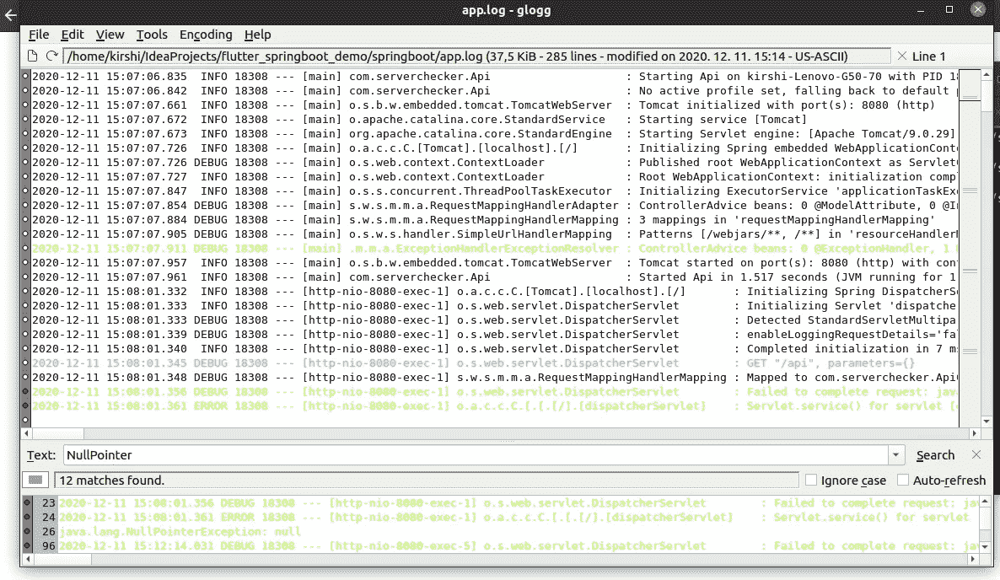
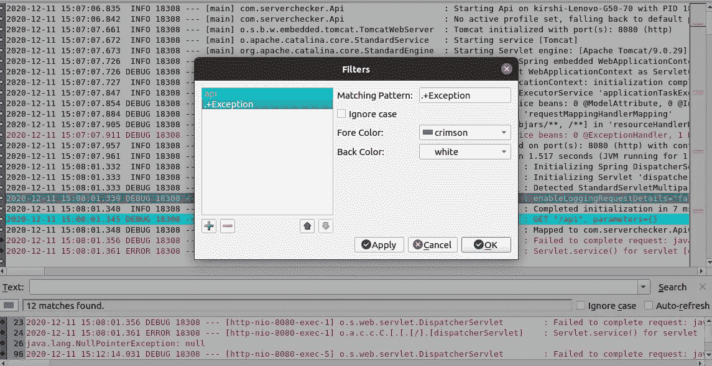

# 方便的日志文件管理工具来查看和监控您的日志

> 原文：<https://betterprogramming.pub/handy-log-file-management-tools-to-view-and-monitor-your-logs-75416d0c0fa4>

## 简单而强大的日志文件管理工具简介


[模板怪兽](https://unsplash.com/@templatemonster?utm_source=medium&utm_medium=referral)在 [Unsplash](https://unsplash.com?utm_source=medium&utm_medium=referral) 上拍照

日志文件在识别应用程序中的问题时起着至关重要的作用。有时我们不得不处理大型日志文件来查找相关信息。

有很多现代的解决方案，比如 Kibana 但是，您可能不希望在较小的项目中使用复杂的软件。或者由于某些限制，您无法利用此类应用程序监控工具。

在本教程中，我想让您注意两个工具— [**swatchdog**](https://github.com/ToddAtkins/swatchdog) 和 [**glogg**](https://glogg.bonnefon.org/) 。它们易于上手，并免费提供强大的功能。我们将通过一些简单的例子来探索它们最常见的用法。

我们开始吧！

# Swatchdog

*Swatchdog* 代表“简单的看门狗”顾名思义，它用于监控系统活动。它需要一个带有要搜索的模式的配置文件。

## 为什么有用？

假设您正在运行一个第三方应用程序，该应用程序在其进程完成时不会发送电子邮件。您可以通过创建一个自定义脚本来监控该文件，而不是手动检查其日志文件。这就是 swatchdog 派上用场的地方——它使用起来简单多了。

此外，如果您希望在应用程序中出现错误消息时得到通知，这个工具会很有用。

## 示例配置

首先，让我们安装 swatchdog。

*   对于 Ubuntu/Debian 发行版:

```
$ sudo apt install swatch
```

*   对于 Fedora 发行版:

```
$ sudo dnf install swatch
```

*   对于 CentOS 发行版:

```
$ sudo yum install epel-release && sudo yum install swatch
```

*   Swatchdog 需要一个名为`.swatchrc`的配置文件。让我们创建它:

`$ touch /home/user/.swatchrc`

假设您想在程序日志中发现单词*完成*时得到通知:

*   您可以有这样的配置:

```
watchfor /Finished/
          echo green
 mail=user, subject="Pattern found"
```

我们告诉 swatchdog 将`Finished`作为一个固定的字符串。你也可以使用[正则表达式](https://en.wikipedia.org/wiki/Regular_expression)来获得更多的灵活性。

当它找到模式时，它会用绿色突出显示终端中的文本。您可以为各种消息指定不同的颜色。

默认情况下，Swatchdog 监视`/var/log/syslog`文件，所以如果我们想监视我们的自定义日志，我们必须修改这个设置。

*   为了提供不同的配置，让我们在名为`swatch`的新目录中创建一个`secure.conf`文件:

```
watchfor /Finished/
echo green
exec echo "execute some script here..."
mail=user, subject="Script done"
```

请注意，您可以在这里提供多种搜索模式。您还可以配置不同的电子邮件主题和收件人。

*   `mail`用于向指定的收件人发送电子邮件。
*   `exec`当找到给定的模式时，可以执行指定的命令或脚本。

现在我们的配置已经准备好了，让我们看看它是如何工作的。

*   执行以下命令并调整日志文件的位置。我的叫`dummy.log`:

```
$ swatchdog -c ~/swatch/secure.conf -t ~/swatch/dummy.log*** swatchdog version 3.2.4 (pid:21064) started at 2020\. dec. 11., Friday, 15:26:41 CET
```

为了覆盖默认的配置文件，我们使用了`-c` 选项。

`-t` 标志是指定日志文件的结尾。就像`tail -f`命令一样。

## 演示

我为这个演示准备了一个非常简单的 Bash 脚本来模拟一些工作。它叫做`script.sh`，看起来像这样:

```
#!/bin/bash
for i in {1..100}
do
   echo "Doing something $i" >> dummy.log
         done
   echo "Finished script" >> dummy.log
```

*   让我们在另一个终端窗口中执行脚本:

`$ bash script.sh`

*   回到 swatchdog 的窗口。您应该会看到这样的输出，该模式将以绿色突出显示:

```
 Finished script
```

*   现在检查您用户的电子邮件:

`$ less /var/mail/user`

或者，如果您安装了`mail`实用程序，请键入`mail`:

```
$ mail
"/var/mail/user": 1 message 1 new
>N   1 user             p dec 11 15:26    12/445   Script done
```

## 要记住的事情

请注意，swatchdog 在前台运行，因此如果您关闭终端，该过程将会结束。您可以在后台运行它，以防止它在您结束会话时停止。为此，使用`— daemon`选项。这样，如果需要，您将能够监视多个日志文件。

另一个很酷的特性是你可以指定一个时间窗口来执行一个动作。只需提供`when`选项:

`mail=user@domain.com,when=1–6:8–17`

请注意，对配置文件的更改会在重新启动 swatchdog 后生效。

查看[手册](https://manpages.debian.org/testing/swatch/swatchdog.1p.en.html)页面了解更多选项。

# 格拉格

有时，您必须搜索复杂而冗长的日志文件。可视化日志并搜索正则表达式模式可能更有效。

Glogg 是一个多平台 GUI 工具，可以打开大型日志文件并搜索给定的模式。官方文档描述得最好:*“glogg*可以看作是 *grep* 和 *less* 的图形化交互组合。”

## 主要优势

*   它打开大文件的速度很快。
*   它会保存您的搜索过滤器，这样您下次就不必重新键入它们。
*   您可以标记可疑的行，以便以后查看。
*   您可以实时监控您的日志文件，就像使用`tail -f`命令一样。
*   它支持搜索模式中的正则表达式、固定字符串和通配符。

## 演示

首先，让我们安装 glogg。它在 Windows 和 Unix 操作系统上都可用。根据您的要求遵循[安装指南](https://glogg.bonnefon.org/download.html)。

我正在 Ubuntu 上使用它:

```
$ apt-get install glogg
```

您可以通过在终端中键入`glogg`来直接调用它。默认情况下，它将打开 GUI，您可以选择打开哪个文件。

您也可以提供日志文件的路径作为直接打开它的参数:

`$ glogg ~/projects/app.log`



我的电脑截图显示了在 glogg 中打开的日志的样子

通过单击 Tools -> Filters，您可以定义要查找的模式。

例如，我为单词 *api* 和任何以*异常*开头的东西创建了过滤器。单击“应用”后，匹配的线条立即以定义的颜色突出显示:



显示自定义过滤器的我的电脑屏幕截图

更多用法请参考[文档](https://glogg.bonnefon.org/documentation.html)。

# 结论

我们已经探索了 swatchdog 和 glogg 的一些主要特性。虽然现代日志监控工具可能会提供更多的功能，但它们需要更多的时间来掌握它们的功能。如果你想快速入门，了解这些简单的工具是值得的。

我希望你今天学到了一些新东西。感谢您的阅读，祝您编码愉快！