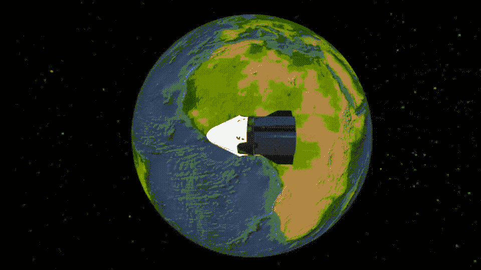
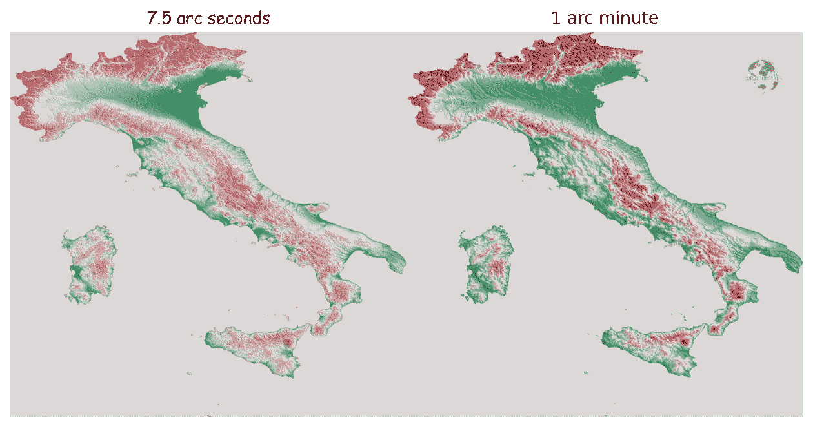
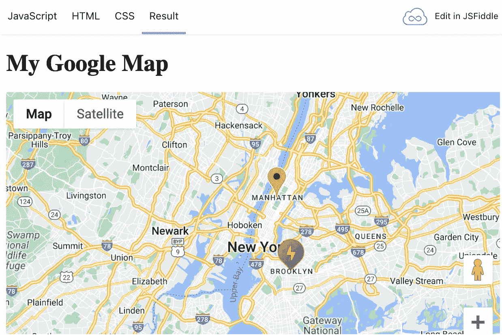
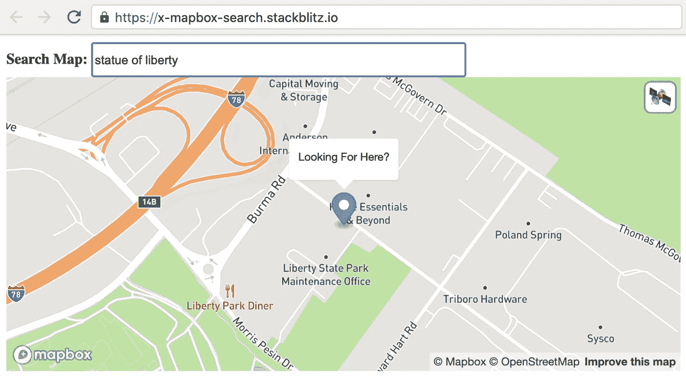
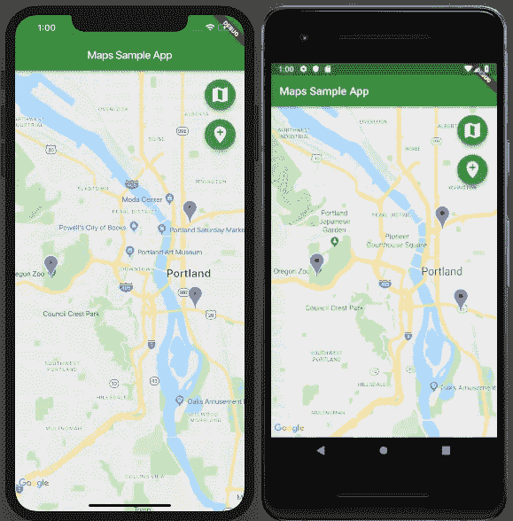
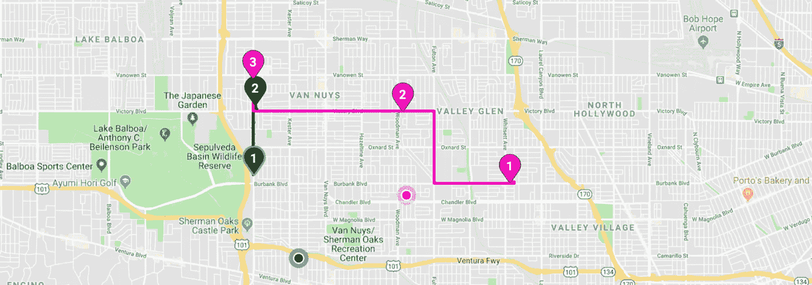
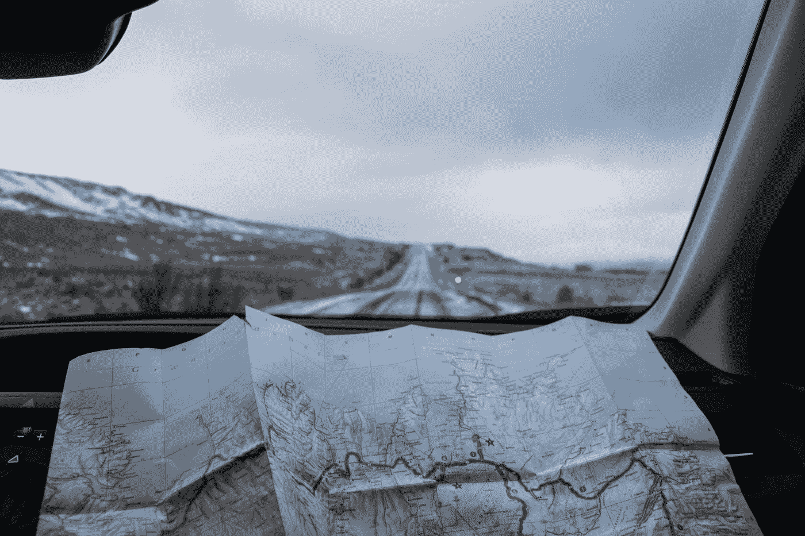
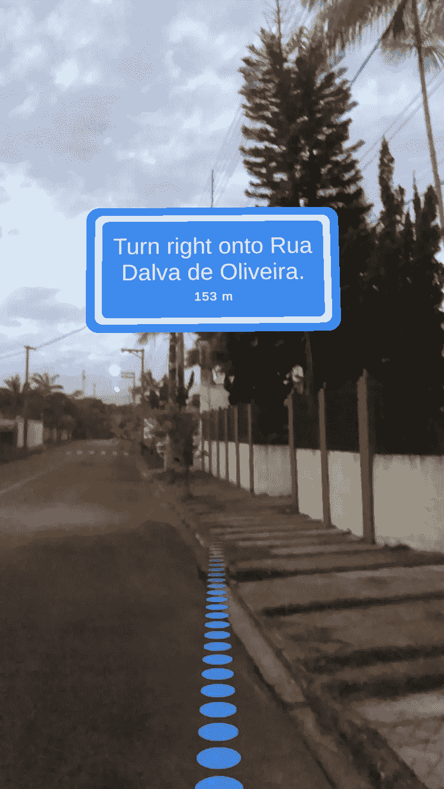
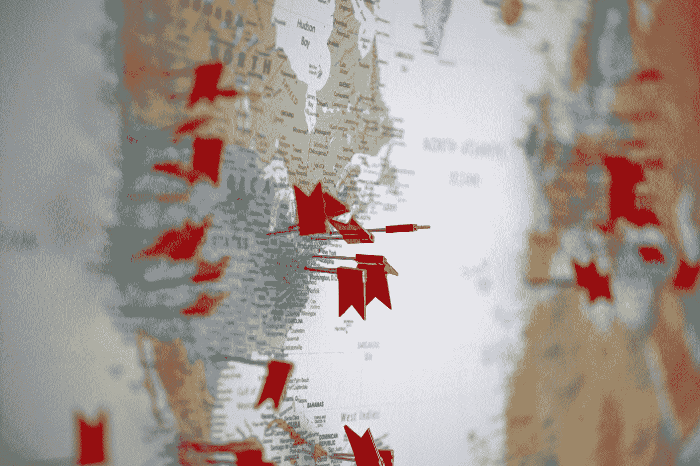
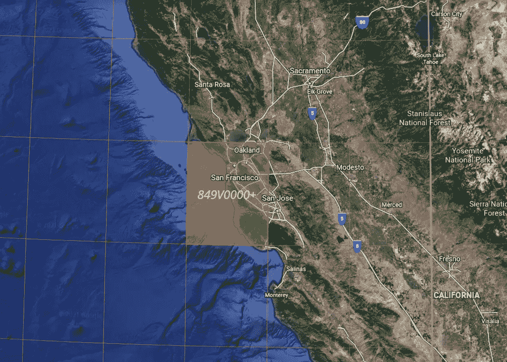

# 来自 JavaScript、Python、Android、iOS、Flutter、Unity3D、AWS 和 NFTs 的地球日快乐

> 原文：<https://betterprogramming.pub/happy-earth-day-from-javascript-python-android-ios-flutter-unity3d-aws-and-nfts-7b7ef7427deb>

## 为开发者精心挑选的 12 个故事

格雷格·罗森克在 [Unsplash](https://unsplash.com?utm_source=medium&utm_medium=referral) 上的照片

欢迎来到第 11 版咖啡字节，更好的编程每日文摘。

这一期，我们放大地图(嗯，今天是地球日！)，通过突出显示一些我们最喜欢的来自 JavaScript、Python、iOS、Android、Flutter、AWS、Unity3D 和 NFTs 的帖子。

## [在 SwiftUI 下的 SceneKit 中管理相机](/managing-the-camera-in-scenekit-under-swiftui-6608e7a0de52)

通过[标记运气](https://medium.com/u/cad7f7bef2a?source=post_page-----7b7ef7427deb--------------------------------) — 4 分钟读取

穿越管理相机的陷阱之旅——建立地球和它的月亮都在旋转的地方的卫星视图。

作者 Gif

## [用 Python 制作漂亮的地形图](https://medium.com/towards-data-science/creating-beautiful-topography-maps-with-python-efced5507aa3)

由亚当·赛明顿——8 分钟阅读

有很多工具和方法可以用来生成上面分享的美丽的意大利地图，但是在这篇文章中，我将带你通过一种非常规的方法使用 Python，希望你会像我一样确信，如果某件事情值得做，就值得用 Python 来做。

作者图片

## [使用谷歌地图 JavaScript API 添加自定义标记](https://javascript.plainenglish.io/add-custom-markers-with-the-google-maps-javascript-api-43e8b83f4f7d)

通过 [Ravindu Senaratne](https://medium.com/u/fa8a7e85927d?source=post_page-----7b7ef7427deb--------------------------------) — 4 分钟阅读

在本文中，我将介绍如何创建地图、添加标记、如何为标记添加自定义图标以及如何添加弹出叠加图。

作者的 js dild 结果

## [使用更少的 HTML 在您的 Web 应用程序上显示地图](/a-simple-map-with-less-html-cda03679ea18)

艾伦·金(Allen Kim)—3 分钟阅读

使用自定义元素用几行 HTML 显示地图—搜索地图，用标记和弹出窗口显示地图，等等。

## [加入谷歌地图让 Flutter](https://medium.com/flutter/google-maps-and-flutter-cfb330f9a245)

通过[肯齐·施莫尔](https://medium.com/u/d46c128329ea?source=post_page-----7b7ef7427deb--------------------------------) — 5 分钟阅读

本文将一步步向您展示如何向 Flutter 应用程序添加 Google 地图小部件。以下是您今天要构建的内容:

作者图片

## [vue . js 中谷歌地图的动态 SVG 标记](/dynamic-svg-markers-for-google-maps-in-vue-js-7541fa1a54a) (2019)

由[大卫·玛特](https://medium.com/u/2bf4bb8c7f86?source=post_page-----7b7ef7427deb--------------------------------) — 3 分钟阅读

在这个主题中，我将向您展示如何使用 SVG 通过 Vue.js 生成动态标记。

对于 Vue，我一直在使用`vue2-google-maps` 包来更容易地与地图交互。如果您选择不同的库，或者您只是使用没有包装器的纯 API，那么这篇文章仍然对您有用。

作者图片

## [如何在 iOS 中实现自定义地图工具包标注](/how-to-implement-a-custom-mapkit-callout-in-ios-e452cda98278)

由约西夫·摩尔多瓦 — 4 分钟读完

我把我的经历写下来留给后人，希望可以让其他人不用花太多时间去研究如何实现自定义的地图工具包标注 UI，同时仍然保持标记固定的原始外观。

作者 Gif

## [swift ui 中的地图介绍](/an-introduction-to-map-in-swiftui-ec3a310fcbbd)

通过 [Kelvin Tan](https://medium.com/u/aa2fd093903e?source=post_page-----7b7ef7427deb--------------------------------) — 3 分钟读取

苹果在 iOS 上改进了`Map`的体验，提供了对位置隐私的更多控制。考虑到这一点，当我得知苹果推出了`Map`时，我真的很惊讶。我很确定他们已经放出来了，但是一查，居然是`MapView`。

我对比了一下`Map`和`MapView`，发现`MapView`其实是为了 UIKit，而`Map`是为了 SwiftUI。

图片来自 Unsplash

## 使用 Unity3D 在 10 分钟内创建一个类似 Google Maps 实时视图的应用程序！

由[丹尼尔·福特](https://medium.com/u/4e878d7d9e45?source=post_page-----7b7ef7427deb--------------------------------) — 7 分钟阅读

在我们的 [Unity AR+GPS 定位](https://assetstore.unity.com/packages/tools/integration/ar-gps-location-134882)插件的最新版本(3.6.0)中，我们很高兴能够带来一个受谷歌地图实时视图启发并由 [Mapbox 方向 API](https://docs.mapbox.com/help/glossary/directions-api/) 支持的令人兴奋的功能:路线和导航功能。

通过新的路线和导航功能，您将能够快速创建应用程序，帮助用户使用增强现实在城市、公园、活动场所和其他地方导航。

作者演示

## [带 AWS 定位服务的交互式地图(第 1 部分)](https://tomwilderspin.medium.com/interactive-maps-with-aws-location-service-part-1-c423a38ce37e)

由汤姆·威尔德斯平 — 6 分钟读完

如果你的应用程序需要一个地图解决方案，你会发现有许多不同的选择。一些更受欢迎的选项有成熟、功能全面的 API 和库，如 [MapBox](https://www.mapbox.com/) 、 [Bing](https://www.bingmapsportal.com/) 和全面的 [GoogleMaps API](https://cloud.google.com/maps-platform) 。亚马逊的初始产品与这些现有的全功能 API 相去甚远，但它确实包括一些基础知识:地理编码、反向地理编码、地图绘制以及一个有趣的地理围栏和跟踪器解决方案，该解决方案利用了 [AWS EventBridge](https://aws.amazon.com/eventbridge) 。

图片来自 unsplash

## [介绍地区国家森林公园](https://medium.com/area-tokens/introducing-area-tokens-81931cbcc3dd)

通过 [DappPunk](https://medium.com/u/33d2912d1891?source=post_page-----7b7ef7427deb--------------------------------) — 6 分钟读取

区域 NFT 是权威的地理定位数字收藏品。它们是不可替代的代币(NFT ),在以太坊区块链提供地球上所有区域的所有权证明。它们还通过在数字世界和物理世界之间架起桥梁来支持数字资产生态系统。

加号代码 849V0000+表示包含旧金山及其周边地区的 1 × 1 区域。最初下降时销售的区域 NFT 将与此水平相关。(图片:谷歌地球)

## [探索 Android 版谷歌地图合成库](/exploring-google-map-compose-library-for-android-af2a784f9508)

由[斯蒂芬·维努兹](https://medium.com/u/c11030d62971?source=post_page-----7b7ef7427deb--------------------------------) — 7 分钟阅读

随着[最近发布了](https://cloud.google.com/blog/products/maps-platform/compose-maps-sdk-android-now-available)[地图构建库](https://github.com/googlemaps/android-maps-compose)，这是我用 Jetpack Compose 构建项目的绝佳时机。在这个应用程序中，我从我的服务器上获取一个给定区域周围的兴趣点列表，并在地图上标记它们。

本文将带您了解如何使用动态标记渲染地图。我们还将介绍如何在与地图交互时刷新这些兴趣点(平移、缩放、旋转)。

图片来自 Unsplash

直到下一次，

[Anupam](https://medium.com/u/9833cc01f515?source=post_page-----7b7ef7427deb--------------------------------) 以及更好的编程团队。