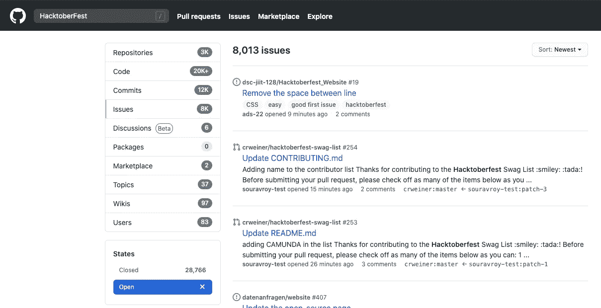
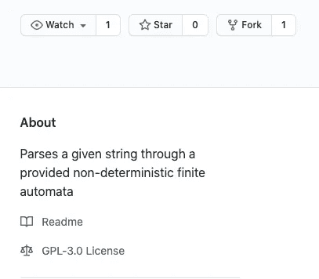
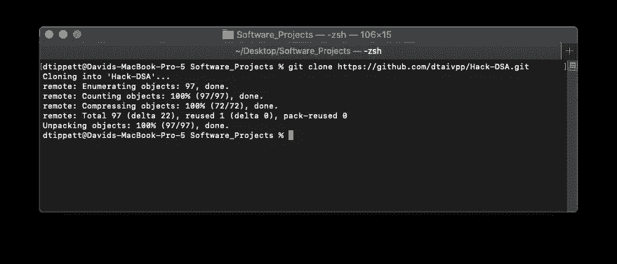
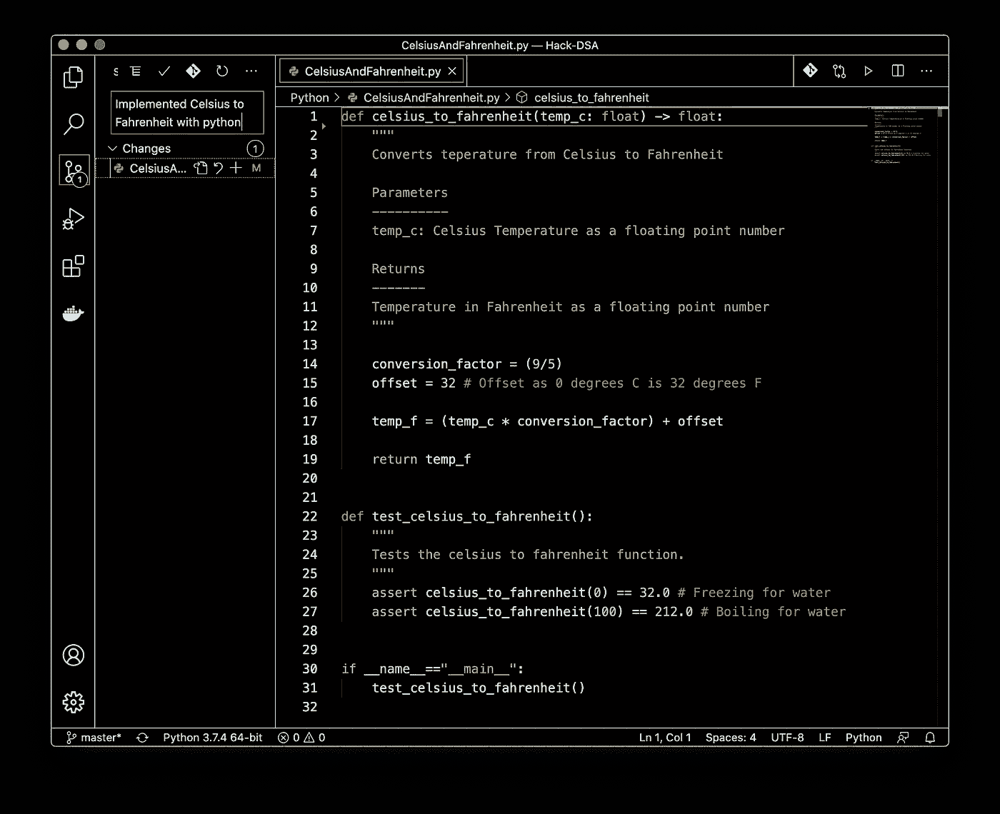
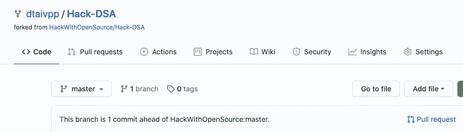
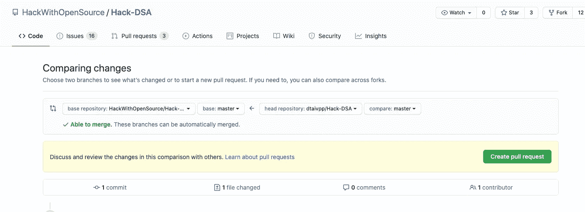
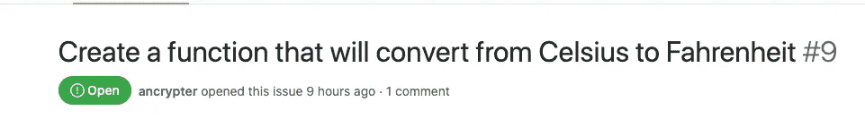
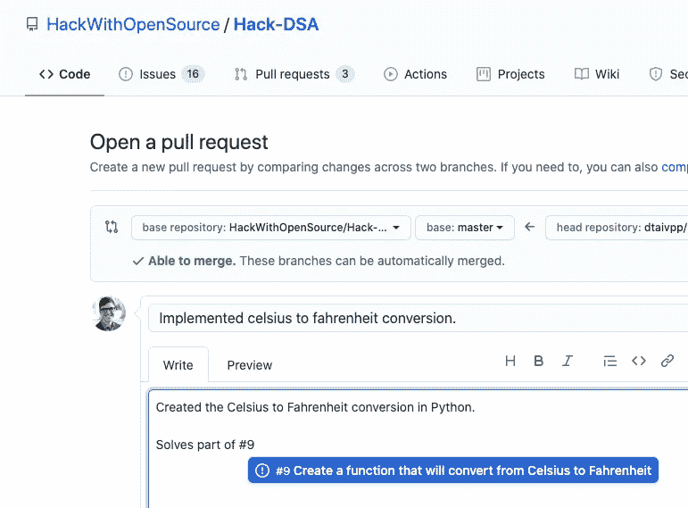

# Hacktoberfest 快乐！

> 原文：<https://betterprogramming.pub/happy-hacktoberfest-7648e6cfce63>

## 参与开源的好方法

来自 [Hacktoberfest](https://hacktoberfest.digitalocean.com/) 的照片。

秋天来了，所有南瓜香料恶作剧也来了。这也意味着 Hacktoberfest 的时间到了！你可能会问，“那是什么？”Hacktoberfest 是由 [DigitalOcean](https://www.digitalocean.com/) 、 [DEV](https://dev.to/) 和 [Intel](https://www.intel.com/content/www/us/en/homepage.html) 主办的为期一个月的活动。这是让新开发人员为开源项目做贡献的推动力。

为什么要参与？嗯，本月前 70，000 名提交四个拉请求的人(在 [Hacktoberfest](https://hacktoberfest.digitalocean.com/) 网站注册后)将获得一件免费 t 恤！它们真的是很好的 t 恤，而且往往还带有很酷的贴纸。

# 发现问题

找问题！值得庆幸的是，GitHub 和 Hacktoberfest 团队的成员让这变得超级简单。首先，您将希望在 GitHub 的搜索栏中搜索 Hacktoberfest 标签，并选择整个 GitHub。接下来，您将希望将其筛选为问题，然后打开问题。按 new 排序，从左边栏中选择你想贡献的语言。或者，您可以使用[该链接](https://github.com/search?o=desc&q=HacktoberFest&s=created&state=open&type=Issues)选择所有设置。

下面是我的搜索结果的图片。如果你正在为新手寻找一期好杂志，你可以看看那些有“初学者”或“好的第一期”标签的:

作者截图。

# 贡献:派生回购

一旦你找到一个你想做的项目，你应该检查是否有一个`Contributing.md`文件。这些文件通常会告诉你它们使用了什么约定(例如，测试、文档或代码风格标准)。

阅读完之后，您将需要创建一个存储库的分支。创建一个 fork 就像在 repo 的右上角选择 fork 按钮一样简单。创建一个 fork 意味着您要在您的帐户下使用存储库的一个副本。

需要注意的一件重要事情是，当您创建一个 fork 时，您不会自动从父存储库中获取更新。查看[本指南](https://www.earthdatascience.org/courses/intro-to-earth-data-science/git-github/github-collaboration/update-github-repositories-with-changes-by-others/#:~:text=To%20sync%20your%20forked%20repo,to%20update%20your%20local%20clone.)将您的回购与父母同步。

作者截图。

# 贡献:做出改变

接下来，您将想要克隆您创建的 fork(它将显示在您的存储库下面)。一旦你这样做了，它就像你用过的任何其他 Git repo 一样工作。如果你是 Git 或 GitHub 的新手，[这个指南](https://towardsdatascience.com/getting-started-with-git-github-6235f5ae3a0b)将展示你的库的基本工作。

作者截图。

下面是一个好的提交请求的例子。我已经实现了他们要求的改变。我有一个 docstring 来解释这个函数做什么，输入(大多数 repos 不需要)和注释来描述代码在做什么:

作者截图。

我将此提交并推至我个人的回购分支。接下来，我们将看看如何创建一个拉取请求。

# 贡献:提出拉取请求

好了，现在你已经完成了你的编辑并把它们推到了你的分叉上，是时候做 PR (pull request)了。在我的 Hack-DSA 副本上，你可以在右下角看到“拉请求”按钮。继续点击:

作者截图。

接下来，您将希望确保适当的更改已经进入提交。完成检查后，选择右侧绿色的“创建拉动式请求”按钮。

作者截图。

您可能希望引用您正在解决的全部或部分问题的问题编号。对于我们的例子，我们将部分解决问题#9。

作者截图。

在我们的提取请求中，您需要描述您所做的更改，并标记我们在上一步中提到的问题编号。最后，选择右下角的“创建拉动请求”按钮！

作者截图。

恭喜你！就像这样，你已经提交了你的第一个拉动请求，并在你的方式得到你的赃物！但是，一定要注意你的拉取请求，因为项目可能会回来要求你做一些改变以符合他们的标准。

Hacktoberfest 快乐，祝您投稿愉快！