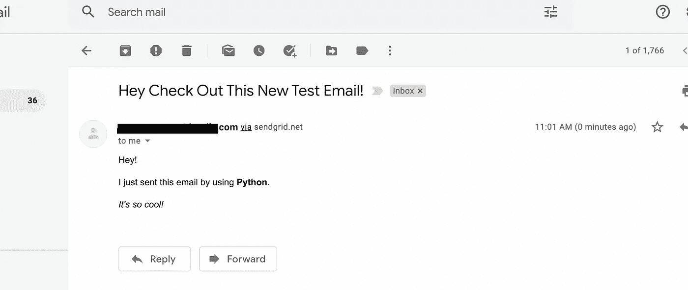
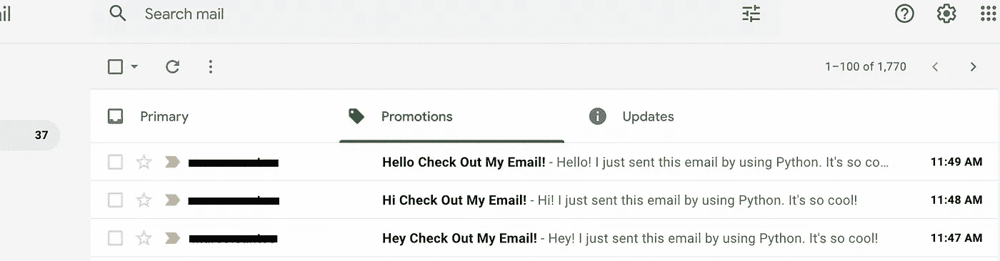

# 利用 Python 的能力以编程方式发送电子邮件

> 原文：<https://betterprogramming.pub/harness-the-power-of-python-to-send-emails-programmatically-ee0fb720d6a3>

## 使用 Python 发送电子邮件的分步教程


布雷特·乔丹在 [Unsplash](https://unsplash.com?utm_source=medium&utm_medium=referral) 上的照片

编程可以用于很多事情。从创建简单的数学函数到构建移动应用程序。它还可以用来自动完成特定的任务，只需几秒钟，而不是自己动手，可能需要几个小时。随着我们开发出独特和特殊的方法来利用代码，越来越多的任务变得自动化。其中一项任务是——*发送电子邮件*。

但是发送电子邮件不是已经是一种更简单的传递信息的方式了吗？电子邮件确实在本质上取代了物理邮件，但是它仍然需要某种形式的人工干预。这些形式包括(但不限于):

*   打印电子邮件
*   安排或知道何时发送电子邮件
*   确定谁在接收电子邮件

我敢肯定还有更多，但这些是最明显的。不管怎样，如果我们可以自动发送带有代码的电子邮件会怎么样？具体用 Python？这种程序的应用范围可以从预定的电子邮件提醒到公司的大规模营销电子邮件。继续阅读，您将了解如何快速设置一个简单的 Python 脚本来发送电子邮件，而无需使用 Gmail 等电子邮件提供商。

# 选择电子邮件服务

不是说 Gmail 或者雅虎，而是有 API 的邮件服务。使用这样的服务将允许您通过一个易于使用的 API 非常灵活地发送多封电子邮件。我发现这是开始用 Python 发送电子邮件的最简单的方法之一。

我使用的电子邮件服务叫做 [SendGrid](https://sendgrid.com) 。它可以免费使用，并且很容易建立一个帐户。该服务的免费等级计划允许您每天发送多达 100 封电子邮件。它也是支持 Python 的开发人员友好的文档。在本文教程的剩余部分，我们将使用 SendGrid。

## 入门指南

为了开始使用 SendGrid，你需要*创建一个免费账户*。完成后，请遵循以下步骤:

1.  验证您的发件人电子邮件地址—在 dashboard 侧栏中，转至*设置*至*发件人验证*至*单个发件人验证*至*创建新发件人。*输入所需信息，并进入电子邮件收件箱验证地址。
2.  获取 API 密钥—返回到*设置*到 *API 密钥*到*创建 API 密钥*。获得完全访问权并命名。点击*创建&视图*查看并复制 API 密钥以备将来使用。

仅此而已。如果你想添加更多的电子邮件地址来发送，你需要像以前一样验证它们。有了 API 密钥和经过验证的电子邮件地址，您就可以开始编码了。

# 1.安装发送网格

假设您使用的是 Jupyter 笔记本电脑或 Jupyter 实验室，您可以使用以下命令直接从 Jupyter 安装 SendGrid:

```
!pip install sendgrid
```

否则，您可以在您的命令终端中使用上面的相同命令来完成它，但是去掉感叹号— `pip install sendgrid`。

# 2.导入 SendGrid 库并设置 API 键

安装 SendGrid 后，可以导入包中的库:

```
from sendgrid import SendGridAPIClient
from sendgrid.helpers.mail import Mail
```

接下来，您需要使用 API 键，并将其分配给 SendGrid 客户机。您需要保持 API 密钥的私有性。我把我的保存在代码之外的一个文本文件中，以便在需要时访问它进行赋值:

```
# Importing and assigning the api key
with open("../sendGrid-API.txt", "r") as f:
    api_key = f.read()

# Using the api key with the sendgrid client
sg = SendGridAPIClient(api_key)
```

# 3.设置电子邮件变量

这里你需要为你的邮件设置不同的变量。变量名是不言自明的:

```
sender = "[example@yahoo.com](mailto:example@yahoo.com)"recipient = "[example@gmail.com](mailto:example@gmail.com)"subject = "Hey Check Out This Test Email!"content = "I just sent this email with Python. So cool!"
```

# 4.构造电子邮件对象

这是我们从 SendGrid 创建 email 对象的地方。只需使用上面的变量，并将它们分配给适当的参数:

```
email = Mail(
    from_email=sender,
    to_emails=recipient,
    subject=subject,
    html_content=content
)
```

# 5.发送电子邮件

在这里，我们将使用 SendGrid 客户端发送我们在上面构建的电子邮件对象:

```
response = sg.send(email)# Printing out the response 
print(response.status_code)
```

打印出响应状态代码，以便了解电子邮件是否已被接受并准备发送。

此外，如果可以的话，检查收件人的收件箱，看看你是否收到了邮件。

# 6.把所有的放在一起

现在，为了使前面的代码流集中起来，我们将把上面的所有元素组合成一个函数。变量是我们唯一需要调整的。下面是一些代码:

通过使用这个函数，我们只需要更改电子邮件变量的详细信息。如果需要，可以在函数之外更改这些细节。下面是我们可以用来测试新功能的新细节。

## 新变量

```
# New Variables
sender = "[example@yahoo.com](mailto:example@yahoo.com)"recipient = "[example@gmail.com](mailto:example@gmail.com)"subject = "Hey Check Out This New Test Email!"# With some html formatting
content = """
    Hey!

    <p>I just sent this email by using <b>Python</b>.</p> 

    <p><i>It's so cool!<i/></p>
"""# Testing the function
sendMyEmail(sender, recipient, subject, content)
```

除了消息的内容之外，上面的变量基本相同。SendGrid 的 API 的一个优点是它接受 HTML 文本格式。在这里，我们格式化了先前的文本，以包含一些新的 HTML 标签，使新的测试电子邮件流行起来！

下面是我们使用的 HTML 标签及其效果的简要介绍:

*   `<p>text</p>` —段落间距。
*   `<b>text</b>` —粗体文本。
*   `<i>text<i/>` —斜体文本。

如果函数运行正常，那么您应该会收到来自上面代码的返回消息:`‘Email has been accepted!’`

## 查看电子邮件

为了更加确定该功能，您可以检查收件人的电子邮件收件箱，查找您刚刚发送的邮件:



使用 SendGrid 从 Python 收到的电子邮件

# 7.发送变量动态变化的电子邮件

现在，我们已经测试并成功发送了一封电子邮件，我们可以继续该功能的一些更实际的应用。有很多很棒的应用程序可以从一个像我们刚刚创建的简单函数中开发出来，但是让我们继续做一些简单但比以前稍微复杂的事情。

在下面的代码块中，您将学习如何在不同的时间发送主题、内容不断变化的多封电子邮件。

首先，让我们导入一个新的库，我们将使用它在不同的时间间隔发送电子邮件:

```
import time
```

接下来，我们将创建一个循环来遍历一组问候。这个列表将是我们的电子邮件如何随着每次迭代而改变。在每次迭代中，主题和内容将根据问候语列表进行调整。

正如您在上面的代码中所看到的，问候语只改变了一个单词就影响了主题行和内容。在循环结束时，在再次发送另一封电子邮件之前，有一小段等待时间(如果需要，您可以调整)。

如果循环运行成功，您应该能够在收件人的收件箱中看到三封不同的电子邮件:



在三个不同的时间发了三封邮件

如果你看到类似上图的东西——太好了！您已经使用 Python 成功发送了多封主题和内容不同的电子邮件！

# 其他使用案例

上面只是一个简单的例子，说明了我们可以用 Python 发送电子邮件。但是，还有更多的应用和不同的方法可以利用该功能进行扩展，例如:

*   向一个大的联系人邮件列表发送有点私人的电子邮件。
*   安排向选定的一组人发送电子邮件提醒。
*   自动发送更新和新信息。
*   大众营销活动。
*   还有更多…

SendGrid 是一个非常棒的工具，你应该[仔细阅读 Python 文档](https://github.com/sendgrid/sendgrid-python)以了解更多关于它的特性。例如，它们已经内置了发送给多个个人的功能。

我希望你已经充分了解了用编程和 Python 发送电子邮件的伟大应用。这是一个伟大的应用程序，用于任何重复的电子邮件任务，你可能会遇到。创造性地应用这个功能，你将会有很多机会自动完成你的日常任务！

# 资源

查看这个 [GitHub 库](https://github.com/marcosan93/Medium-Misc-Tutorials/blob/main/Send-Emails-with-Python.ipynb)获取完整的源代码。这是完整的[发送网格文档](https://github.com/sendgrid/sendgrid-python)。

> 在这里注册一个中级会员，可以无限制地访问和支持像我这样的内容！在你的支持下，我赚了一小部分会费。谢谢！