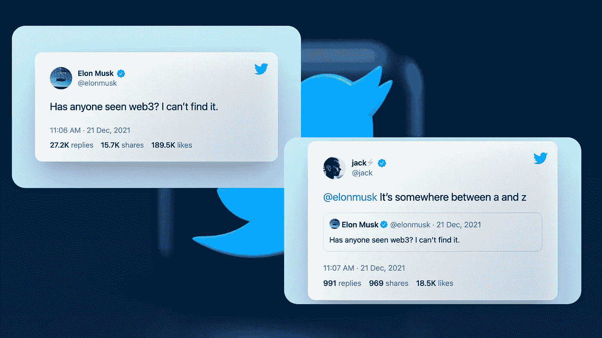
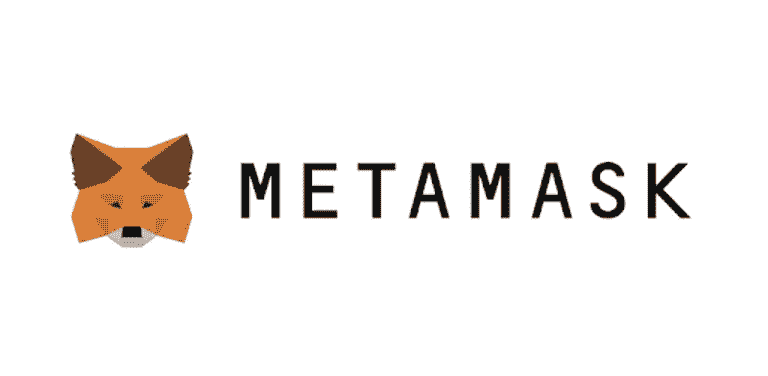
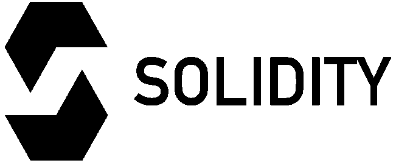
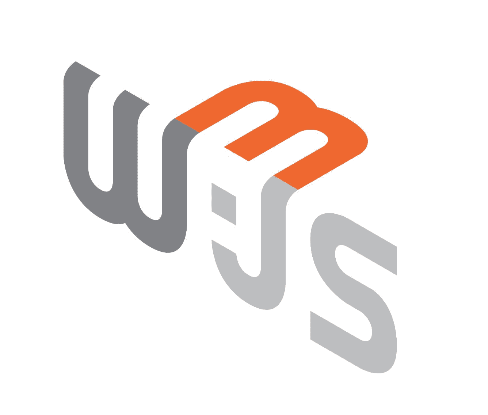

# “有人看过 Web3 吗？”—2022 年成为 Web3 开发者的完整路线图和资源

> 原文：<https://betterprogramming.pub/has-anyone-seen-web3-a-complete-roadmap-free-resources-to-become-web3-developer-4e5dc9332c1f>

## 20 多个文档、教程和视频，帮助您开始使用 Web3



亚历山大·沙托夫在 [Unsplash](https://unsplash.com?utm_source=medium&utm_medium=referral) 上拍摄的背景照片。由作者使用画布编辑

上个月，当马斯克和多尔西嘲笑 Web3 的想法时，Twitter 疯了。很少有人称之为互联网的未来，也很少有人说它是假的。但是你知道 Web 3.0 到底是什么，它是如何工作的吗？在本文中，将向您介绍互联网的新领域，以及如何从开发人员的角度开始涉足这一领域。

# **关键要点**

*   对 Web3 及其生态系统的初学者友好介绍
*   Web3 是炒作还是互联网的未来？
*   学习 Web3 技术的路线图

# 通俗地说

正如 [Eshita](https://eshita.mirror.xyz/H5bNIXATsWUv_QbbEz6lckYcgAa2rhXEPDRkecOlCOI) 简要写道:

*   网络 1:阅读
*   网络 2:读，写
*   网络 3:读、写、拥有

通俗地说，Web3 被广泛理解为互联网的第三个也是最新的“阶段”。

Web1 是只读的。互联网是一堆相互连接的电脑。人们消费静态网页，用户只是消费者。

Web2 是动态的，即读和写。人们在我们都熟悉的社交平台上创造和消费内容。在 web2 中，科技巨头通过充当中间人从用户身上榨取价值。这些价值/数据让他们获利颇丰，所以 web 2.0 是定向广告和缺乏隐私的时代。

Web3 是分散的，即读、写和拥有。人们通过代币创造、消费和拥有他们的作品。Web3 是建立在点对点的计算机网络上的，这些计算机无需中间人就能相互交流。

# Web3 是炒作还是互联网的未来？

你可能在网上看到过类似这样的讨论:“Web3 又是一个骗局吗？”。

不难发现，所有这些谈话都围绕着某个他们不喜欢的秘密。但是 Web 3.0 只是使用了集成了加密支付的互联网。系统本身不是一个“骗局”。这就像因为不喜欢卡内基钢铁而把工业革命称为骗局一样。

我们正处于开发的早期阶段，肯定会有许多项目存在缺陷。然而，最终随着越来越多的人采用它，用例开始变成现实，那时我们将看到真正的去中心化。如果每个人都不参与，你就不能分散。

推特上的 [@ianDAOs](https://twitter.com/ianDAOs/status/1473709735694241805)

# 开始使用 Web 3.0 的开发者路线图

## **1。Web 2.0 技能**

作为先决条件，您应该了解 JavaScript 和 web 开发的一般知识。你的网络 2 技能，如 TS/JS，反应，查克拉/材料界面将会给你一个进入网络 3 的良好开端。此外，核心计算机概念(操作系统、网络)和解决问题的技能是基本的，无论是 web2 还是 web3 都需要。

## **2。学习区块链技术的基础知识**

区块链是一项神奇的技术，但却不容易理解。你必须花些时间去理解你以后要在什么基础上构建。

*   [EdX 上的区块链技术课程](https://www.edx.org/course/blockchain-technology)
*   [uda city 上的区块链开发者纳米度](https://www.udacity.com/course/blockchain-developer-nanodegree--nd1309)
*   [区块链讲解【YouTube】](https://www.youtube.com/watch?v=qOVAbKKSH10)

## 3.了解元掩码或任何等效的加密钱包



官方标志

Metamask 是一个用于与区块链交互的钱包。这是一个加密用户应该具备的基本技能，然而，开发人员应该比普通用户知道的更多。例如如何以编程方式请求网络更改并检测当前帐户和网络。

*   [元蒙版文档](https://docs.metamask.io/guide/)
*   [设置元掩码钱包](https://www.youtube.com/watch?v=MfkqgXNPiHg)
*   [面向开发者的元掩码:一步一步构建第一个 Web3 应用](https://www.youtube.com/watch?v=9kdVAeZ7knk)

```
**Additional: Learn How to read transactions with a Block Explorer**Start with any Block explorer like [EtherScan](https://etherscan.io/) or [BlockExplorer](https://blockexplorer.com/). Try understanding what each term means, google them, there is a lot to learn here. A lot of people don’t know how to read the transactions. Also, learn by reading code of other popular smart contracts most of them are Open Source. Learn how to verify a contract from explorer.
```

## **4。** **了解智能合约**

智能合约是你如何实际编程区块链。它们是已经分发给区块链的代码片段，并且是用区块链节点能够理解的语言编写的。智能合约几乎可以做任何事情，从可替代和不可替代的令牌到下一个去中心化应用的后端。然而，它们不同于您通常编写的代码。

*   智能合约【Coursera】

## 5.学会稳健



图片来自[https://en.bitcoinwiki.org/wiki/Solidity](https://en.bitcoinwiki.org/wiki/Solidity)

基于以太坊虚拟机的新语言。对于索拉纳和附近，学习锈语言。但是这篇文章只关注 EVM，所以让我们深入到可靠性。这种语言正在快速发展，新的版本很快就会推出，所以不要不知所措。推荐阅读习惯，因为一些好的教程是文本格式，而不是视频格式。

```
Best way to start Solidity is by [creating some Zombies](https://cryptozombies.io/).
```

*   [实例巩固](https://solidity-by-example.org/)
*   [Solidity 教程:以太坊、区块链开发、智能合约和 EVM 的完整课程](https://www.youtube.com/watch?v=ipwxYa-F1uY)
*   [Freecodecamp【YouTube】](https://www.freecodecamp.org/news/learn-solidity-blockchain-and-smart-contracts-in-a-free/)
*   [EatTheblocks【YouTube】](https://www.youtube.com/watch?v=p3C7jljTXaA)
*   [实体文件【中间】](https://docs.soliditylang.org/en/v0.8.10/)
*   [智能合约程序员【YouTube】](https://www.youtube.com/watch?v=hMwdd664_iw&amp;list=PLO5VPQH6OWdULDcret0S0EYQ7YcKzrigz)
*   [Dapp 大学【YouTube】](https://www.youtube.com/c/DappUniversity/playlists)

## 6.了解如何与区块链对接



Web3.js 徽标

分散式应用由两部分组成:你的前端和在区块链上执行的智能合约。为了让您的前端与区块链对话，您需要与它进行交互。这里有两个与实现以太坊 API 的区块链接口的流行选择，web3.js 和 ethers.js

您可以使用 Web3.js 来创建与 Etherem 区块链交互的客户端。它是一个库的集合，允许您将以太网从一个帐户转移到另一个帐户，从智能合约中读取和写入数据，并构建智能合约。

*   [Dapp 大学— Web3.js 播放列表](https://www.youtube.com/playlist?list=PLS5SEs8ZftgXlCGXNfzKdq7nGBcIaVOdN)
*   [Dapp 大学 2 小时课程](https://www.youtube.com/watch?v=kDo_MdyNJzI)
*   [Web3.js 文档](https://web3js.readthedocs.io/en/v1.5.2/)

`[ethers.js](https://docs.ethers.io/v5/)`库打算成为以太坊区块链及其生态系统的一个全面的轻量级接口。它是在 ethers.io 的基础上创建的，但现在已经发展成为一个更加通用的库。

*   [YouTube 教程](https://www.youtube.com/results?search_query=ethersjs)

## 7.测试和部署智能合约

简单和初学者友好的方法是从混合 IDE 开始。就像我们如何使用 VS 代码一样，Remix 是一个用于编写 Solidity 代码的在线 IDE。

*   [Remix【稳固的在线 IDE】](https://remix.ethereum.org/)

最好的方法是使用强烈推荐的[安全帽](https://hardhat.org/)框架。

在安全帽出现之前，有两种工具。即 Truffle(用于在区块链上部署和测试合同)和 Ganache(用 10 个钱包运营一个本地区块链)。安全帽是这两种工具的结合。测试和区块链合二为一！是不是很酷！

*   [文档](https://hardhat.org/getting-started/)
*   [安全帽 YouTube 教程](https://www.youtube.com/watch?v=9Qpi80dQsGU)

## 8.加入社区并参加黑客马拉松

以下是 9 个繁荣的社区:

*   [开发者道](https://twitter.com/developer_dao)
*   [构建空间](https://twitter.com/_buildspace)
*   [达卡德](https://dacade.org/)
*   [锅头](https://twitter.com/Pot_Heads_NFT/)
*   [探险家指南](https://twitter.com/sigleapp)
*   Web3Community
*   [虚构人物](http://figment.io)
*   [构建空间](https://buildspace.so/)
*   [任务书](https://www.questbook.app/)(特定于印度)
*   [超级团队](https://superteam.fun/)

一些黑客马拉松和开源贡献:

*   [开发帖子](https://devpost.com/hackathons?themes[]=Blockchain)
*   [Gitcoin](https://gitcoin.co/)
*   [黑客链接](https://hackerlink.io/)
*   [全球通用](https://ethglobal.com/)

# 结论

好吧，就这么定了。希望这篇帖子对你有帮助。

学习 Web3.0 和区块链开发一开始可能听起来令人生畏，但每个人都可以做到。

从计算机科学的基础开始，一步一步地学习 JavaScript，从可靠性到尖端的 Defi 应用程序。