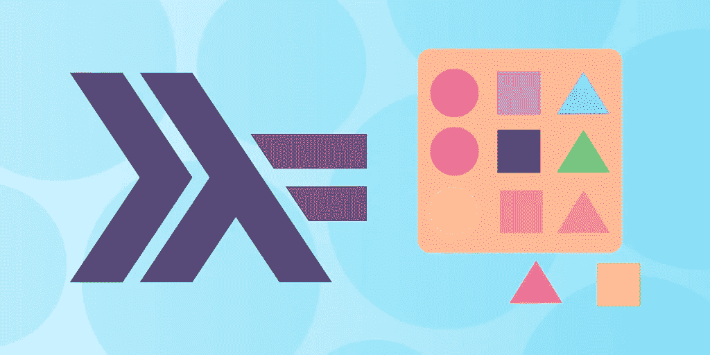
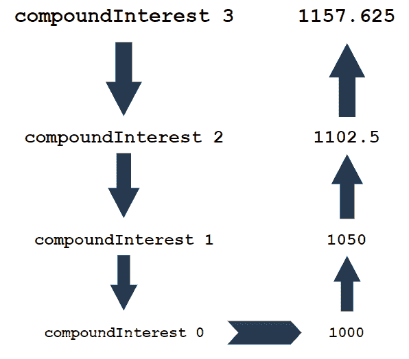

# Haskell 教程:函数式编程入门

> 原文：<https://betterprogramming.pub/haskell-tutorial-get-started-with-functional-programming-6de2527b0a05>

## 从基础到高级概念



图片来源:作者

Haskell 是一种经典的函数式编程语言，在 21 世纪 20 年代有所复兴。随着对数据科学家需求的增长，公司正在寻找能够随着大数据量扩展并保持效率的工具。

Haskell 是这项工作的完美选择——拥有多年的优化和专门为这种业务数据分析构建的特性。

今天，我们将通过对 Haskell 的实际介绍来帮助您克服函数式编程的学习曲线。

**下面是我们今天要讲的内容:**

```
1\. [What Is Functional Programming?](#6b9b)
2\. [What Is the Haskell Programming Language?](#97e5)
3\. [Basics of the Haskell Syntax](#a447)
4\. [Advanced Haskell Concepts](#b4be)
5\. [What to Learn Next](#0807)
```

# 什么是函数式编程？

函数式编程是一种声明式编程范式，用于创建包含一系列简单函数而非语句的程序。

虽然 OOP 程序擅长表现具有独特特征的物理对象，但函数式程序是纯数学的，用于复杂的数学计算或非物理问题，如人工智能设计或高级方程模型。

**函数范式中的所有函数必须:**

*   **纯**:它们不会产生副作用或改变输入数据
*   **与程序状态**无关:相同输入的值总是相同的，与其他变量值无关

每个函数完成一个单独的操作，可以按顺序组合完成复杂的操作。例如，我们可能有一个函数将输入数`doubleInput`加倍，另一个函数将该数除以圆周率`divPi`。

这些功能中的任何一个都可以单独使用，或者它们可以串在一起，这样`doubleInput`的输出就是`divPi`的输入。这种特性使得函数程序的各个部分高度模块化，因为函数可以在程序中重用，可以被调用、作为参数传递或返回。

# 什么是 Haskell 编程语言？

Haskell 是一种编译的、静态类型的函数式编程语言。它创建于 20 世纪 90 年代初，是第一批开源纯函数式编程语言之一，以美国逻辑学家哈斯凯尔·布鲁克斯·加里的名字命名。Haskell 加入了 Lisp，成为一种基于数学的更古老但有用的函数式语言。

Haskell 语言是为函数式编程而从头开始构建的，具有强制性的纯度强制和不可变的数据。它主要以其惰性计算和内存安全而闻名，避免了 C 或 C++等语言中常见的内存管理问题。

与 Java 等其他静态类型语言相比，它还提供了更健壮的数据类型选择，具有参数多态性、基于类(ad-hoc)的多态性、类型族等类型特性。

总的来说，Haskell 将函数式编程的性能和可伸缩性优势与多年的优化和独特的工具结合在一起。

现在，Haskell 主要用于金融、生物技术或电子商务等数据丰富的业务领域的数据分析。这些行业对可伸缩性和安全性日益增长的需求使得 Haskellers 成为一个非常受欢迎的群体。

下面是一个 Python 中的命令式解决方案在 Haskell 中如何表现为声明式函数式解决方案的示例:

```
def compound_interest(years):
  current_money = 1000
  for year in range(years):
    current_money = current_money * 1.05
  print('After {years} years, you have {money:.2f} dollars.'.format(years=years, money=current_money))
  return current_money 
compound_interest(10)compoundInterest :: Int -> Double
compoundInterest 0 = 1000
compoundInterest n = 1.05 * (compoundInterest (n - 1))
main = printf "After 10 years, you have %.2f dollars." (compoundInterest 10)
```

与命令式程序相比，Haskell 程序具有:

*   类型和静态类型批注
*   没有声明。该函数是用表达式逐个定义的。
*   没有循环。我们每次都用递归调用来乘以利率。
*   没有可变变量。我们使用一个递归表达式从( *n-* 1)年后的值得到 *n* 年后的值。
*   这个函数没有副作用。将结果打印到屏幕上发生在计算结果的函数之外。

# Haskell 的显著特征

## **记忆安全**

包括自动内存管理，以避免内存泄漏和溢出。Haskell 的内存管理类似于 Golang、Rust 或 Python。

## **已编译**

使用 GHC·哈斯克尔编译器提前直接编译成机器源代码。GHC 经过高度优化，可以生成高效的可执行文件来提高性能。它还有一个名为 GHCi 的交互式环境，允许对表达式进行交互式评估。这个特性是 Haskell 在高输入数据分析方面受欢迎的关键。

## **静态类型化**

有一个类似于 Java 的静态类型系统，它在环境中验证 Haskell 代码。这让您可以在开发的早期就捕捉到 bug。Haskell 丰富的类型选择意味着对于给定的变量，您总是有最完美的类型。

## **强制实施的功能性最佳实践**

实施函数式编程规则，例如纯函数和带有错误消息的不可变变量。这一特性最大限度地降低了程序的复杂性，并确保您充分利用了它的功能。

## **懒评**

将计算推迟到需要结果时。Haskell 以其优化的惰性评估能力而闻名，这使得重构和函数组合变得容易。

## **并发**

Haskell 通过绿色线程(虚拟线程)和`async`和`stm`库使并发变得容易，这些库为您提供了创建并发程序所需的所有工具。强制纯函数增加了简单性，避免了并发编程的许多常见问题。

## **图书馆**

Haskell 在这一点上已经开源了几十年，这意味着有成千上万的库可用于每一个可能的应用程序。可以肯定的是，你遇到的几乎所有问题都会有一个现成的库来解决。一些流行的附加功能是 Stack，它构建和处理依赖关系，以及 Cabal，它添加了打包和分发功能。

# Haskell 语法的基础

现在你知道了为什么 Haskell 今天还在使用，让我们探索一些基本的语法。Haskell 的两个最核心的概念是类型和函数。

*   **类型**是行为相似的值的集合，例如数字或字符串
*   **函数**可用于将一种类型的值映射到另一种类型

## 数字类型

数值类型保存不同范围和位数的数值，如`15`或`1.17`。Haskell 有三种常见的数字类型:

*   `Int`为 64 位(> 20 位)整数
*   `Integer`可以表示任意数字的`Int`类型列表(类似于其他语言中的`BigInt`)
*   `Double`为 64 位十进制数。每个数字类型都使用标准操作符，如`+`、`-`和`*`。只有`Double`支持除法运算，所有`Integer`除法都会作为`Double`返回。例如:

```
Prelude> 3 / 2
1.5
```

下面是更多数字类型操作的例子。

```
Prelude> 1 + 2
3
Prelude> 5 * (7 - 1)
30
```

Haskell 使用类型推理为给定的操作分配最符合逻辑的数据类型。因此，如果显而易见，我们不必声明类型，例如`Int`对`Double`值。

要显式声明数据类型，可以在每个值后添加名称，如下所示:

```
Prelude> (1 :: Int) + (2 :: Int)
3
```

Haskell 还包括用于常见数字运算的预定义函数，如指数、整数除法和类型转换。

*   **幂** ( `^`):将第一个数字提升到第二个数字的幂。这将执行几个隐藏的乘法运算，并返回最终结果。
*   **整数除法** ( `div`):用于完成整数的除法运算，而不需要变成双精度。所有小数都被截断。还有一个模数运算符(`mod`)，可以让您找到余数。

```
Prelude> div 7 3 
2
Prelude> mod 7 3
1
```

*   类型转换:Haskell 不支持跨类型操作，这意味着我们经常要转换值。Prelude 包括不同常见类型的类型转换，如`fromIntegral`或`fromDouble`。

```
Prelude> 5.2 + fromIntegral (div 7 3)
7.2
```

## 用线串

字符串类型表示可以构成单词或短语的一系列字符。它们用双引号括起来，以区别于其他数据类型，比如`“string string”`。

一些基本的字符串函数是:

*   **连接:**使用`++`操作符连接两个字符串

```
Prelude Data.Char> "hello, " ++ "world" 
"hello, world"
```

*   **反转:**反转字符串中字符的顺序，使第一个字符成为最后一个

```
Prelude Data.Char> reverse "hello" 
"olleh" Prelude Data.Char> reverse "radar" 
"radar"
```

## 元组

Tuble 类型是一种数据类型，包含预设值的两个链接值。例如，`(5, True)`是一个包含整数`5`和布尔值`True`的元组。它具有元组类型`(Int, Bool)`，表示包含第一个`Int`值和第二个`Bool`值的值。

```
twoNumbers :: (Double, Double)
twoNumbers = (3.14, 2.59)
address :: (String, Int, String, Int)
address = ("New York", 10005, "Wall St.", 1)
main = do 
  print twoNumbers 
  print address
```

元组构造本质上是一个将两个值链接起来的函数，这样它们就被视为一个值。

## 自定义功能

使用以下定义创建您自己的函数:

```
function_name :: argument_type -> return_type
```

函数名是用来调用函数的，参数类型定义了任何输入参数允许的数据类型，返回类型定义了返回值将出现的数据类型。

定义后，输入一个定义函数行为的等式:

```
function_name pattern = expression
```

函数名呼应了更大函数的名称，模式充当占位符，将被输入参数替换，表达式概述了如何使用该模式。

下面是一个函数的定义和公式的例子，这个函数将打印传递的字符串两次。

```
sayTwice :: String -> String
sayTwice s = s ++ s
main = print (sayTwice "hello")
```

## 列表

列表是递归定义的元素序列。像链表一样，每个元素指向下一个元素，直到最后一个元素，最后一个元素指向一个特殊的`nill`值来标记列表的结束。

列表中的所有元素必须是相同的数据类型，使用方括号定义，如`[Int]`或`[String]`。然后，用该类型的一系列逗号分隔的值填充列表。一旦被填充，所有值的当前顺序都是不可变的。

```
ints :: [Int]
ints = [1, 2, 3]
```

列表对于存储以后需要循环的数据很有用，因为它们很容易与递归一起使用。

## 自定义数据类型

Haskell 还允许您创建自己的数据类型，类似于我们创建函数的方式。每种数据类型都有一个名称和一组该类型可接受的期望值。

为了更好地理解这一点，看一下标准库的`Bool`类型定义:

```
data Bool = False | True
```

自定义数据类型用关键字`data`标记，并由以下项目命名为`Bool`。`=`标记了名称和接受值之间的界限。然后`False | True`定义类型`Bool`的任何值必须为真或假。

类似地，我们可以定义一个自定义的`Geometry`数据类型，它接受三种形状，每种形状都有不同的输入要求。

```
data Geometry = Rectangle Double Double | Square Double | Circle Double
```

我们的`Geometry`数据类型允许创建三种不同的形状:矩形、正方形和圆形。

这些形状是数据构造器，定义了类型为`Geometry`的元素的可接受值。A `Rectangle`用两个 double(它的宽度和高度)来描述，a `Square`用一个 double(一边的长度)来描述，a `Circle`用一个 single double(它的半径)来描述。

当创建一个`Geometry`值时，您必须声明您希望将哪个构造函数`Rectangle`、`Square`或`Circle`用于您的输入。例如:

```
*Geometry> s1 = Rectangle 3 5 :: Geometry 
*Geometry> s2 = Square 4 :: Geometry
*Geometry> s3 = Circle 7 :: Geometry
```

## 类型类别

类型类是共享一个公共属性的类型的集合。例如，type class `Show`是可以使用`show`函数转换成字符串的所有类型的类(注意大小写的不同)。它的语法是:

```
class Show a where
  show :: a -> String
```

所有类型类声明都以`class`关键字、一个名称(`Show`)和一个类型变量(`a`)开始。`where`关键字设置了一个条件，调用所有类型，其中下面的语句等同于`True`。在这种情况下，`Show`使用接受变量并返回`String`的`show`函数查找所有类型。

换句话说，属于`Show`类型类的每个类型`a`都必须支持`show`功能。类型类的行为类似于面向对象编程语言的接口，因为它们定义了一组数据的蓝图。

# 高级 Haskell 概念

## 高阶函数

与其他函数式编程语言一样，Haskell 将函数视为一等公民，可以从其他函数传递或返回。作用于或返回新函数的函数称为*高阶函数。*

您可以使用高阶函数组合您的模块化函数来完成复杂的运算。这是函数组合的重要部分，其中一个函数的输出作为下一个函数的输入。

函数`applyTwice`将整数函数作为第一个参数，并对第二个参数应用两次。

```
applyTwice :: (Int -> Int) -> Int -> Int
applyTwice f x = f (f x)
```

括号阐明了第一个`Int`集合应该一起理解为一个`Int`函数，而不是两个独立的`Int`值。

现在我们将创建一些示例函数，`double`和`next`，以传递给我们的高阶函数，`applyTwice`。

```
applyTwice :: (Int -> Int) -> Int -> Int
applyTwice f x = f (f x)
double :: Int -> Int
double x = 2 * x
next :: Int -> Int 
next x = x + 1
main = do 
  print (applyTwice double 2) -- quadruples
  print (applyTwice next 1) --adds 2
```

## λ表达式

如果我们想不止一次地使用`double`和`next`，我们上面的`applyTwice`实现是有效的。但是如果这是我们唯一需要这种行为的时候呢？我们不想为一次使用创建一个完整的功能。

相反，我们可以使用 Haskell 的 lambda 表达式来创建一个匿名函数。这些基本上是一次性函数，在使用的地方定义了表达式，但是没有保存它的名称。Lambda 表达式以其他方式作为带有输入参数和返回值的函数工作。

例如，我们可以将我们的`next`函数转换成一个 lambda 表达式:

```
\x -> x + 1
```

Lambda 表达式总是以反斜杠(`\`)开始，然后为函数`x`的输入列出一个占位符。然后有一个箭头函数来标记表达式的开始。该表达式在调用`x`时使用输入参数。

在这里，我们的 lambda 表达式本质上是说，“将`1`添加到传递给我的任何输入中。然后，返回新值。

还可以使用 lambda 表达式作为高阶函数的输入。下面是我们的`applyTwice`函数如何处理 lambda 表达式而不是函数:

```
applyTwice :: (Int -> Int) -> Int -> Int
applyTwice f = f . f
main = do 
  print (applyTwice (\x -> x * 2) 8)
  print (applyTwice (\x -> x + 1) 7)
```

Lambda 表达式通常用于为高阶函数提供简单的行为，您不希望将这些行为保存到函数中，或者只需要一次。您还可以通过将它们提供给抽象的高阶函数，使用它们来概述程序的一般逻辑模式。

## 递归

像 Haskell 这样的函数式语言不像命令式语言那样有循环或条件语句。相反，他们使用递归来创建重复的行为。这是因为递归结构是声明性的，就像函数式编程一样，因此更适合。

> ***提醒:*** *递归函数是反复调用自身直到达到指定程序状态的函数。*

下面是 Haskell 中递归函数的一个例子:

```
compoundInterest :: Int -> Double
compoundInterest 0 = 1000
compoundInterest n = 1.05 * compoundInterest (n - 1)
main = print (compoundInterest 3)
```

第一个等式涵盖了输入值为`0`时执行的基本情况，并立即产生结果`1000`。第二个等式是递归情况，它使用输入值`n - 1`的计算结果来计算输入值`n`的结果。

看看这个递归函数是如何对每个递归步骤求值的:



图片来源:作者

从循环到递归结构的转换是采用 Haskell 时最难做出的改变之一。复杂的递归结构会导致深度嵌套效应，这可能会使理解或调试变得混乱。

然而，Haskell 通过要求纯函数和使用惰性求值来避免执行顺序问题，最大限度地降低了这个问题的严重性。

# 接下来学什么

祝贺您迈出了学习 Haskell 的第一步！虽然从命令式/通用语言(如 JavaScript、Perl 或 PHP)迁移到 Haskell 是一个挑战，但是有几十年的学习资料可以帮助你。

**接下来你要学习的一些概念是:**

*   单子表达式
*   Currying
*   多次递归调用
*   输入输出集成

快乐学习！