# Hasura、GraphQL 和带 Angular 的自动代码生成

> 原文：<https://betterprogramming.pub/hasura-graphql-and-auto-code-generation-with-angular-2e6321e4d532>

## 为 GraphQL 客户端设置代码生成


在 [Unsplash](https://unsplash.com?utm_source=medium&utm_medium=referral) 上由 [Boitumelo Phetla](https://unsplash.com/@writecodenow?utm_source=medium&utm_medium=referral) 拍摄的照片

在我目前的长期项目中，我面临的问题是快速建立一个 GraphQL 网关，以便与数据库和后端进行有效的通信。

经过一些研究，我遇到了 [Hasura](https://hasura.io/) ，这是一个网关服务，它能够为您的 SQL 数据库和其他受支持的端点自动生成一个包罗万象的 GraphQL 模式。不仅如此，它还具有许多其他方便的附加功能，如授权、webhooks、事件，甚至 CI/CD 集成，以便将对数据库的更改迁移到生产环境中。最好自己去看，因为他们也有一个很棒的网站。

如果你熟悉用 [Apollo](https://www.apollographql.com/docs/) 设置 GraphQL 服务器，你可能会知道，这需要相当多的工作。你必须手工编写一个[模式](https://www.apollographql.com/docs/tutorial/schema/)并自己定义你的[查询、变异和订阅](https://www.apollographql.com/docs/tutorial/resolvers/)。现在，如果这些都可以自动完成，你会怎么说？只需在 SQL 数据库中设置一些表，所有可能的查询、变更和订阅都由 Hasura 自动生成。太棒了，对吧？

为了更进一步，我们想定义一个客户机，它可以调用和订阅所有那些自动生成的 GraphQL 查询。不要用 Apollo 手动设置[客户端](https://apollo-angular.com/docs/)，在代码中没有静态类型和用于查询的大[神奇字符串](https://en.wikipedia.org/wiki/Magic_string)，让我们自动生成一切。您只需在*中定义您的查询。graphql* 文档，您就可以开始了。

让我们建立一个展示来更深入地探讨这个话题。

# 概观

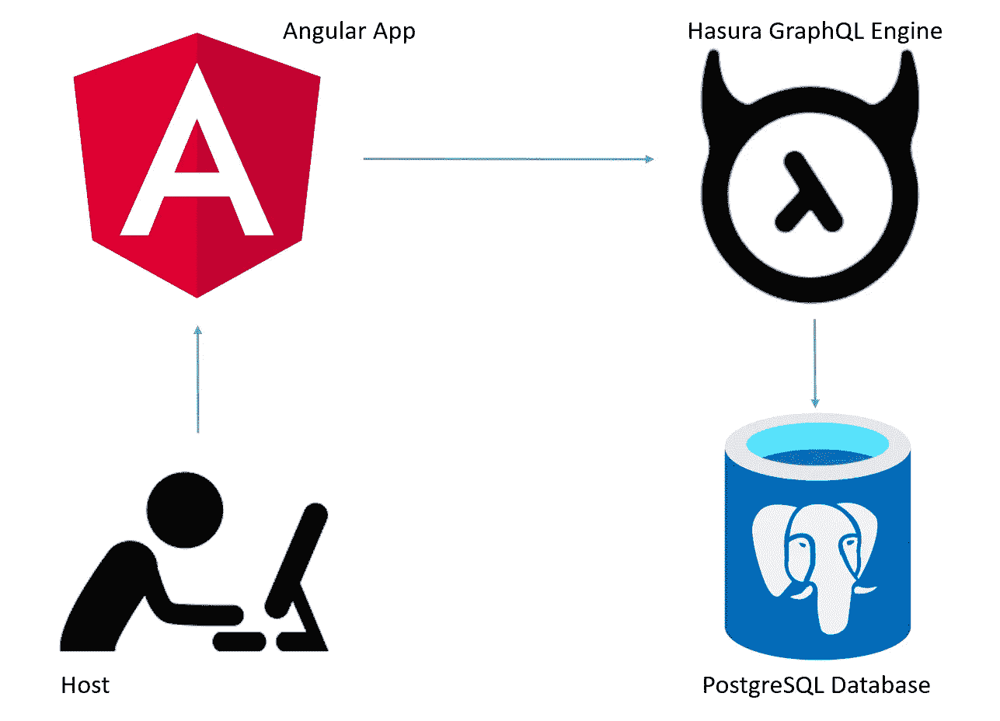

架构概述

在本次展示中，我们将搭建一个服务器-客户端应用程序，其中 Angular 作为我们的前端，Hasura+PostgreSQL 作为我们的后端。在 Angular 中，我们将受益于 Apollo 客户机的自动代码生成，而 Hasura 将负责将 SQL“翻译”成 GraphQL。

请记住:自动代码生成并不特定于 Hasura。您可以对任何兼容 Apollo 的 GraphQL 后端使用这种方法。

# 用 Postgres 设置 Hasura

在这个展示中，我们将创建一个 PostgreSQL 数据库和一个 Hasura 云实例，全部免费。

1.  登录[哈苏拉云](https://cloud.hasura.io/)并创建一个自由层项目。这将创建网关，我们稍后将连接到该网关。
2.  点击**发射控制台**切换到哈苏拉控制台。在这里，您可以编辑整个数据库，设置动作、事件，还可以用 GraphQL 语言生成所有的查询、变异和订阅。
3.  在**数据→创建 Heroku 数据库**你可以免费创建并连接一个 PostgreSQL 数据库。或者，您也可以连接到现有的数据库。

# 建立数据结构

当数据库建立时。让我们创建一个样本数据结构。对于这个例子，我选择了一个简单的聊天应用程序结构。单击您的数据库(**default**default)并单击 **public** 模式。在右侧点击**创建表格**。

我们将设置两个表:

*   包含唯一的 **id** 和**名称**的*用户*表:

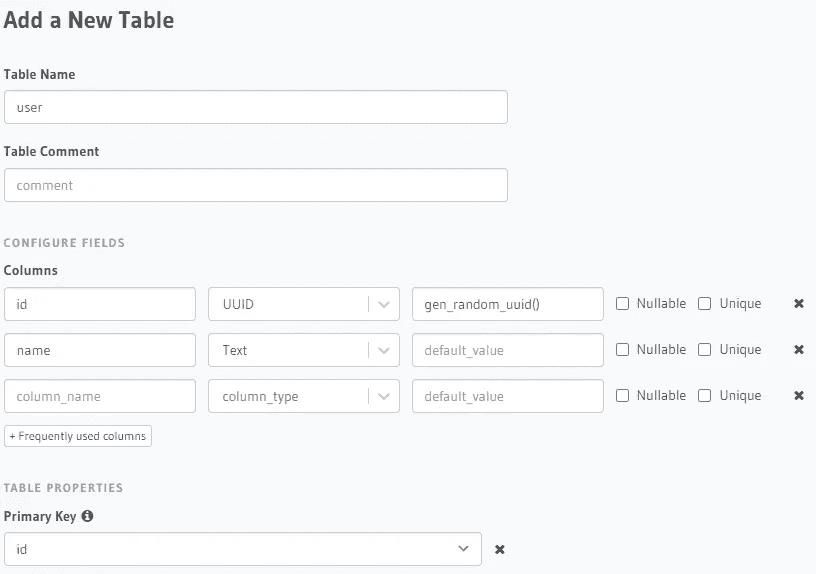

添加表**用户**

*顺便说一下，我强烈推荐使用 UUID 作为您的标识符/主键，因为客户端可以安全地生成唯一的 UUID。因此，您不需要额外调用服务器，只需要为每个对象安排一个新的 id，而不是用一个自动增加的数字作为主键。*

*   以及一个*消息*表，包含**发送方**和**接收方**的 id、**消息、**和**时间戳**:

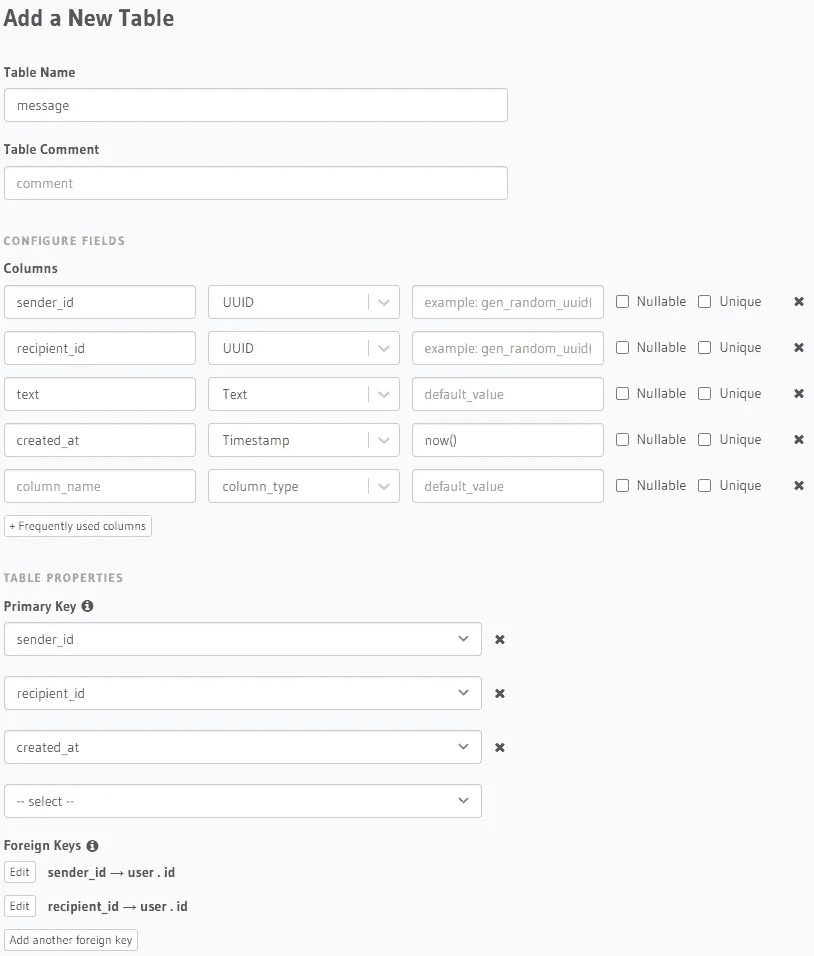

添加表**消息**

在这里，我们还将设置外键关系，这将使我们能够使用 GraphQL 进行嵌套查询(例如，获取来自特定发件人的所有消息)。

*我强烈推荐所有的表和字段使用一致的命名方案，因为自动代码生成器将使用规则从它们中生成类名和属性名。这里最好的做法是**`snake_case`*。**

*添加完表后，我们将设置它们之间的关系。单击表 message → Relationships ，您将看到基于上述外键的建议关系:*

*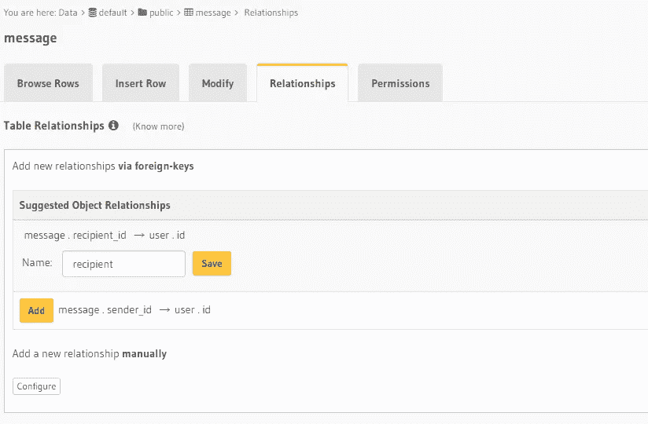*

*为**消息**设置关系*

*对象关系是一对一的关系，这意味着每条消息只有一个发件人和一个收件人。不要忘记将建议的姓名分别更改为收件人和发件人。*

*现在，对于用户表，我们建议使用数组关系，这意味着每个用户可能有多个发送的消息和多个接收的消息。添加为`received_messages`和`sent_messages`:*

*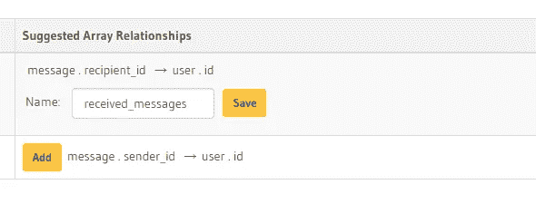*

*为**用户**设置关系*

*现在我们已经完全建立了表格，让我们添加一些测试数据。*

# *手动添加数据*

*点击用户→插入行，添加用户简和鸢。如果您在用户表的设置中选择了`gen_random_uuid()`，您可以将 id 字段留空。否则使用 UUID 生成器在线，生成一个自定义的 UUID。*

*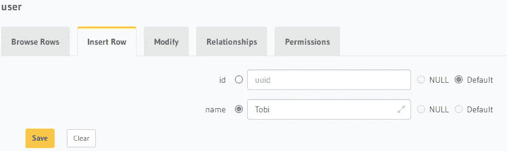*

*添加新的**用户***

*完成后，单击**浏览行**检查您的数据并查看新生成的 UUIDs:*

*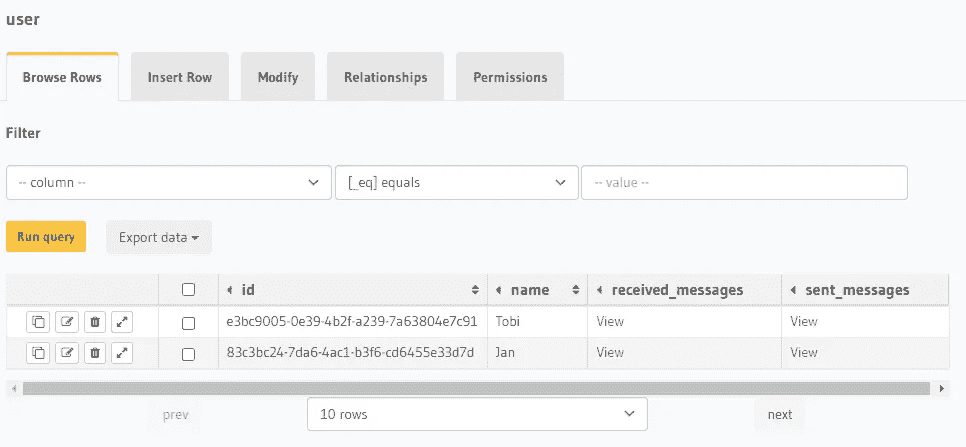*

*一些示例用户*

*现在向消息表中添加一些示例消息。将您的用户的 UUIDs 用于`sender_id`和`recipient_id`:*

*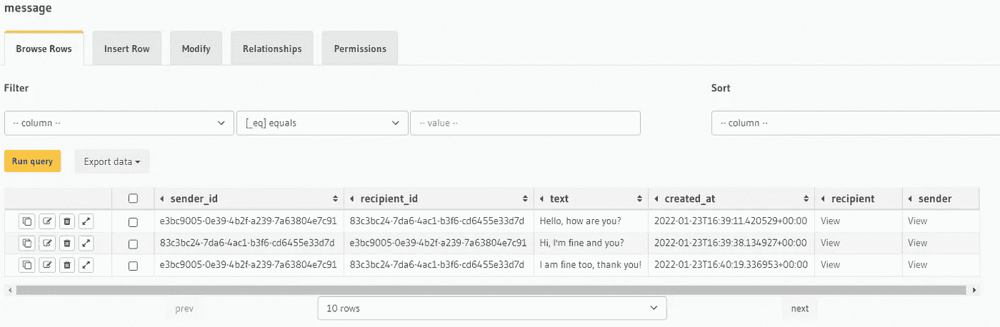*

*一些示例消息*

*太好了！现在我们已经设置了测试数据，可以继续检查一些查询结果。*

# *查询、变异和订阅*

*此时，Hasura 已经创建了您可以在后台想象的所有查询、突变和订阅的模式。您可以通过选择上面的 **API** 选项卡来检查它们。*

*在左边，您将看到 Explorer，在这里您可以通过选择您想要查询的复选框来组装您的查询、突变和订阅。通过选中以下框继续操作:*

*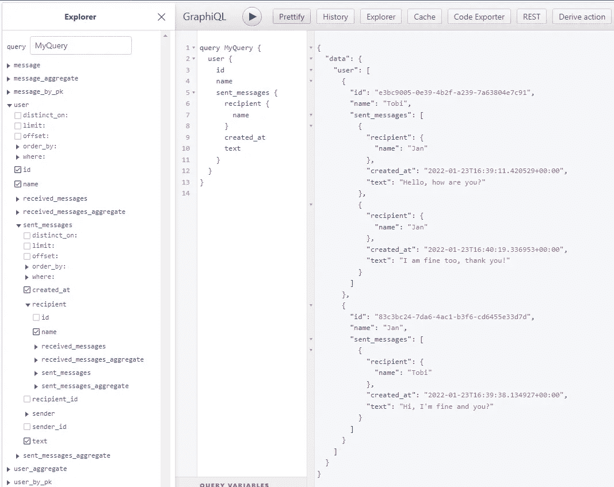*

*图形资源管理器示例*

*在中间窗口中，您将看到我们刚刚一起点击的查询的 GraphQL 代码，在右侧，在您按下**播放**按钮后，您将看到该查询的结果。*

*在这种情况下，我们请求:*

*   *每个用户*
*   *他们的身份证和姓名*
*   *每条发送的消息(嵌套在`user`内)*
*   *收件人的姓名和文本(嵌套在`sent_messages`中)*

*请注意可请求字段是如何嵌套的(例如，用户→已发送消息→收件人→姓名)。这要归功于我们在上面配置的外键和关系。*

*如果在资源管理器窗格中向下滚动，还可以选择突变和订阅:*

*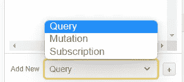*

*GraphQL 调用的三种类型*

*只需选择其中一个，然后单击+来配置它们。*

**请记住，这个 GraphiQL Explorer 仅供参考。所有查询、变更和订阅的模式都已经生成。我们只需要在客户端应用程序中一起单击这些查询，然后将它们复制/粘贴到我们的。graphql 文件。**

# *为角度设置 GraphQL Codegen*

*现在让我们用 [Apollo](https://apollo-angular.com/docs/get-started/) 和 [GraphQl Codegen](https://www.graphql-code-generator.com/plugins/typescript-apollo-angular) 来设置我们的 Angular 客户端应用程序。为了不超出这个展示的范围，我创建了一个小的 Angular 应用程序，可以在这里找到。在下一节中，我将只展示如何设置 Apollo、自动代码生成和用法。*

*首先，我们需要向我们的 Angular 项目添加所有必需的包。对于 npm，请使用以下命令:*

```
*# The base requirements are the following packages:> npm install apollo-angular @apollo/client graphql
> npm install --save @graphql-codegen/cli# Additionally we will need these packages:> npm install @graphql-codegen/introspection @graphql-codegen/typescript @graphql-codegen/typescript-operations @graphql-codegen/typescript-apollo-angular*
```

*检查您的 package.json，如果已经安装了所有这些模块。*

*现在我们需要在 Angular 项目的 **src** 文件夹中创建 **codegen.yml** 文件:*

*graphql-codegen 的 codegen.yml 配置文件*

*这里我已经添加了一些配置，我觉得很有用:*

*   *模式 URL 和管理密码可通过环境变量(或一个[)进行配置。env](https://www.graphql-code-generator.com/docs/config-reference/codegen-config#environment-variables) 文件)，这对于不将秘密推送到源代码控制是有用的。*
*   *代码生成器将在`src/**/*.graphql` (= All)下搜索 GraphQL 定义。所有子目录中的 graphql 文件)。*
*   *代码生成器将生成文件`src/app/@graphql/_generated.ts`，该文件将包含所有静态类型的类型、查询、变异、订阅，甚至它们的响应。*
*   *已经添加了所需的插件。*
*   *一些配置。参见[此处](https://www.graphql-code-generator.com/plugins/typescript-operations)供参考。*

*完成后，我们现在可以添加一些 GraphQL 定义。*

# *添加 GraphQL 定义*

*移动到您选择的子文件夹，在那里您想要 GraphQL 定义并创建文件`definitions.graphql`。我的情况是`src/app/@graphql/definitions.graphql`。*

*在这个文件中，让我们添加我们在上面的 GraphQL Explorer 中定义的查询、一个变体和一个订阅:*

*三个示例调用的 GraphQL 定义*

*在这里，您还可以看到如何在 GraphQL 定义中使用变量。*

*就是这样！我们现在准备自动生成几百行代码，这将节省我们大量的时间和精力。*

# *生成您的代码*

*如果您尚未将环境变量添加到 CLI、主机或*中。env* 文件，现在请这样做。您将需要:*

*   *`HASURA_SCHEMA_URL` : `https://<your-server>/v1/graphql`*
*   *`HASURA_ADMIN_SECRET` : `<your-admin-secret>`*

*现在将下面的脚本行添加到您的`package.json`中:*

```
*"codegen": "graphql-codegen --config codegen.yml"# Or in case of a .env file (install the package dotenv first):
"codegen": "graphql-codegen --config codegen.yml -r dotenv/config"*
```

*现在，您可以在 CLI 甚至 CI/CD 管道中调用以下内容:*

```
*> npm run codegen*
```

*这将从 Hasura 中提取当前模式，并生成`src/app/@graphql/_generated.ts` *下的所有类。**

*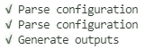*

*成功代码生成的控制台输出*

# *从 Angular 调用查询、突变和订阅*

*通过检查您的`package.json`，确保您已经安装了 [apollo-angular](https://apollo-angular.com/docs/get-started) 。*

*首先，我们需要初始化 Apollo 客户机。这很容易做到，只需向您添加以下内容`app.module.ts`:*

*仅使用 Websocket 为 Angular 实现 Apollo 客户端*

*让我们来看看自动生成的`_generated.ts`文件。如果您滚动到底部，您会发现生成的静态类型的查询、变异和订阅。它们像你在`definitions.graphql`中定义的那样命名，以' *GQL'* 为后缀，例如`SendMessageMutationGQL`。*

*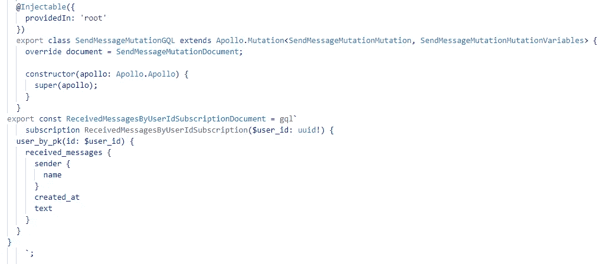*

*自动生成的 GraphQL 调用*

*要处理这些类型，只需将它们导入到任何组件的构造函数中。我们现在有三种不同类型的 GraphQL 调用，每种调用的用法都略有不同。*

*都是[可观测的](https://angular.io/guide/observables)。要执行它们，您需要订阅它们。在 subscribe 调用或 Observable 管道中，您可以处理每个调用的静态类型结果。*

*因此`subscriptions`将连续发出新的结果，而`queries`和`mutations`将在完成前发出一个结果。*

*让我们看看如何用自动生成的代码实现每种类型的 GraphQL 调用:*

*一个示例服务的实现，包括所有三种 GraphQL 调用类型*

*不同类型的语法如下:*

*   *对于查询:`QueryName.watch({<arguments>}).valueChanges.subscribe(…)`*
*   *对于突变:`MutationName.mutate({<arguments>}).subscribe(…)`*
*   *对于订阅:`SubscriptionName.subscribe({<arguments>}).subscribe(…)`*

*您将得到一个`ApolloQueryResult<TResult>`或一个`SubscriptionResult<TResult>`，其中也可能包含错误。因此，建议在您的可观察管道中检查这些错误。*

# *实现组件*

*最后一步，我们实现一个基本组件作为用户界面。在这种情况下，我使用的是`AppComponent`:*

*聊天的组成部分*

*聊天的 HTML*

*瞧，我们有一个非常简单的聊天应用程序，简可以通过它给鸢发信息！因为我们将消息的接收实现为一个`subscription`，所以当请求的值在 Hasura 上改变时，我们总是会得到一个更新。作为发送消息的结果，订阅被触发，我们得到一个新的消息数组。*

*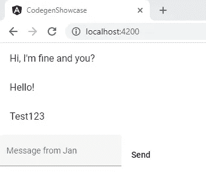*

*工作聊天*

# *结论*

*使用这些方法节省了我们的时间、精力，以及服务器端和客户端大量不可读的代码。*

*该服务器实际上是无代码的，甚至可以扩展，具有以下特性:*

*   *自定义身份验证*
*   *最多单行和单行字段的授权*
*   *事件挂钩*
*   *自定义操作(用于业务逻辑)*
*   *远程模式*
*   *以及更多，这些将在我接下来的文章中介绍。*

*客户端现在拥有尽可能少的(不可维护的)样板代码。如果你感兴趣，你可以在这里查看实现阿波罗客户端[的“正常”方式](https://apollo-angular.com/docs/data/queries)。在我看来，这是不可维护的，原因如下:*

*   *GraphQL 定义是神奇的字符串，这意味着您没有 linter 支持，即使在运行时，您也不会得到任何异常，直到您尝试执行查询。*
*   *查询、结果和参数没有被键入，这再次导致不可预测的异常和非常困难的维护。*

*与此相反，现在有了静态类型，甚至有了 GraphQL 代码的 linter(可安装在 VSCode 中)。此外，当您尝试运行代码生成时，如果您的。graphql 文件，这意味着您有一个预运行时错误检查，这对于 CI/CD 管道也很有用。*

*如果您想亲自体验一下，可以在这里查看我的 Github 知识库:[https://github.com/TobiStr/angular-hasura-graphql-codegen](https://github.com/TobiStr/angular-hasura-graphql-codegen)*

*感谢您花时间阅读这篇文章。我希望，你会觉得它有知识性、教育性和趣味性。非常感谢您的支持和参与。*

*如果您有兴趣了解干净架构、干净编码和最新技术栈的最新趋势、技巧和诀窍，尤其是在 C#环境中。净和有棱角——如果你考虑跟踪我，我会很感激。*

*祝你有美好的一天！*

**

*如果你还没有每天使用媒体来增长你的知识，现在是开始的最佳时机！借助 Medium，您可以轻松获得更多关于高度专业的主题的知识，发布高质量的内容，并接触到更广泛的受众。要开始，只需使用以下链接创建一个中型帐户:*

*[*加入中现*](https://medium.com/@tobias.streng/membership)*

*通过这样做，你将获得一个强大的平台，可以帮助你联系新的作者和读者，每天学习新的东西。*