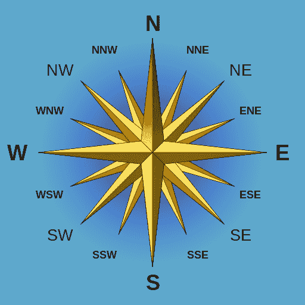

# 你听说过代码高尔夫吗？

> 原文：<https://betterprogramming.pub/have-you-heard-of-code-golf-f410c8692dbc>

## 全新的编程挑战有助于拓展您的思维


照片由[威尔·波拉达](https://unsplash.com/@will0629?utm_source=unsplash&utm_medium=referral&utm_content=creditCopyText)在 [Unsplash](https://unsplash.com/?utm_source=unsplash&utm_medium=referral&utm_content=creditCopyText) 拍摄

code golf 的目标很简单:使用尽可能少的字符找到给定编码问题的解决方案。谁产生的工作方案字符数最少，谁就赢。

这不同于传统的编程挑战，在传统的编程挑战中，目标是尽可能快速或最有效地解决问题。

让我解释这是如何工作的，以及为什么我这么喜欢它…

# 简单的例子

给定挑战“输出 1 到 10 之间的数字，每个数字占一行”，我们可以看到下面的 PHP 代码…

```
for ($i = 1; $i <= 10; $i++) echo "$i\n";
```

…输给了矮个子:

```
while(++$i < 11) echo "$i\n";
```

后者的 29 个字符胜过前者的 41 个。真正的挑战比这更难，但现在你明白基本的想法了。我们将在下面看一个适当的例子。

# 你为什么要这么做？

这就是我喜欢代码高尔夫的原因:

1.  这很有趣，也很有挑战性，但与传统的编码问题不同。
2.  这是一个很好的改变，可以解决挑战，而不必担心代码标准、性能和 big-O 符号。
3.  它鼓励横向思维——我们通常不会试图让代码变得更小、可读性更差(除非我们是在生产环境中处理它)。
4.  它促进对所用语言的深入了解，并有助于学习。
5.  竞争不一定是时间敏感的(即不是解决方案竞赛)，因此它们可以在给定的时间范围内发生。

我曾经在以前的开发工作中为感兴趣的人举办过每周代码高尔夫挑战赛。“打高尔夫”非常适合在办公室环境中跑步，因为这是一种低压力的乐趣，人们可以在有时间或需要从挤压虫子中休息一下时进行。

在我运行的版本中，在周末之前找到最佳解决方案的人可以在周五提前离开——这带来了一些有趣(和激烈)的竞争。

我已经在这篇文章中包含了如何挑战自己的信息。

在回顾彼此的解决方案和我自己的工作时，我经常发现我以前不知道的语言的新功能和内置功能。“嘿，我不知道 JavaScript 可以做到这一点…这是非常酷的！”

这使得它很容易向管理层推销——它有助于团队建设并增强编码能力。也有许多在线社区运行高尔夫挑战，在底部引用。

# 深入的例子

看看下面的 16 点罗盘:



图片来源: [Serg！o](https://commons.wikimedia.org/wiki/File:Compass_Rose_English_North.svg) [CC BY-SA 3.0](https://creativecommons.org/licenses/by-sa/3.0/)

给定一个表示罗盘上一个方向的字符串输入，按顺时针顺序输出两个相邻的方向。例如:

```
**INPUT: OUTPUT** N: NNW NNE
SW: SSW WSW
ENE: NE E
...and so forth
```

现在，我将在我的代码示例中使用 PHP，因为这是我在 office 锦标赛中使用的语言(因为我们在后端使用它)。

它也相当有名，但对不熟悉的人来说仍然可读。变量以“`$`”开头，它有一堆内置函数，这些函数的名称都是自我描述的，并且它以传统的方式使用大括号和分号。

我要回到过去，挖掘一些旧代码，所以它可能有点过时，关于语言的标准和能力，但重点是给你消化高尔夫挑战的想法。为了提高可读性，我还将牺牲一些潜在的优化。

所以，回到问题。这是一个相当简单的问题，可以用很多方法来解决。我们可以首先将方向存储在一个数组中，在该数组中找到目标输入，然后输出相邻的字符串:

好吧，我们有一个可行的解决方案。它有 152 个字符。我们似乎在构建数组时消耗了大量字符，并在给定的输入位于数组的开头或结尾时补偿了绕回情况。

让我们看看我们是否能在这方面有所改进:

那更好，我们减少到 133 个字符。我们正在拆分一个字符串(在 PHP 中拆分被称为“explode”)来构建我们的数组，这使我们的得分提高了 19。

我们仍然花费了相当多的字符来处理数组环绕，以及访问它所需的语法。

但是一定有更好的方法！

让我们稍微考虑一下这个问题。这基本上是一个字符串邻接问题。也许我们可以抛弃数组的概念，只处理一个字符串，然后搜索并解析出我们想要的东西。

现在，什么擅长搜索和提取字符串的一部分？当然是 Regex！让我们试一试:

好了，我们只剩下 116 个字符了。这基本上是我第一次学习 code golf 时，在网上遇到这个问题时提交的解决方案。

我们根本不用处理数组。对于绕回问题，我们有一个更优雅的解决方案，只需在末端延长字符串并重复一个方向。正则表达式魔术让我们找到我们的目标，抓住它旁边的两个方向。

在这之后，与我们最初的解决方案相比，我们去掉了 36 个字符。我想你现在已经理解了代码高尔夫背后的想法。

用你选择的语言自己尝试这个问题。看看你能否改进上述解决方案(我知道这是可能的)。

更好的是，在一个小组中进行，看看谁提出了最佳解决方案，并分析每个人的方法。看到有多少种方法来解决同一个问题总是很有趣的！

# 给高尔夫球手的建议

要掌握 code golf，您首先需要抛弃根深蒂固的开发最佳实践(并且经常做相反的事情)。

从不同的角度面对挑战，不断问自己:“解决这个问题的另一种方法是什么？”减少你的选择，直到你找到一个比所有其他方案都短的解决方案。

当竞争激烈时，钻研你所选择的语言的黑暗艺术，尽可能多地使用肮脏的手段来去掉一两个字符——这可能意味着胜利和失败的区别。

当你练习高尔夫球时，你很快就会意识到总有一个技巧是你还没有学会的，所以回顾别人的解决方案会让你为以后的比赛做更好的准备。

在你力争到底的过程中，请记住以下几点:

1.  在编写任何代码之前，思考或“白板”问题及其可能的解决方案。
2.  抛出“最佳实践”。你的最佳(也就是最短的)解决方案很可能是低效的、混乱的，而且肯定会在拉取请求中遭到断然拒绝。
3.  考虑对问题的多种方法进行编码，然后对它们进行提炼，看看哪种方法产生的影响最小。
4.  从为你自己的利益写“可读”的代码开始，然后在你得到一个可行的解决方案后削减它。
5.  利用节省空间的技术，如三元运算符、递增/递减运算符、变量赋值中的逻辑运算符、循环声明中的赋值等。
6.  尽最大努力滥用你所使用的语言的灵活性、不赞成使用的特性和潜在的怪癖，以尽可能减少你的字符数。
7.  查看您的特定语言文档，特别是用于处理字符串、数组、正则表达式、lambdas 等的内置函数。
8.  针对你所选择的语言，在谷歌上搜索一些高尔夫技巧。

# 举办比赛的技巧

我从跑步和参加高尔夫锦标赛中学到了一些东西:

1.  评分系统中不要包含空格、制表符或换行符。使用类似于[字符计数工具](https://charactercounttool.com/)的工具，它给出了一个你可以使用的“字符(不含空格)”度量。这使得解决方案保持一定的可读性，这使得比较结果更令人愉快。
2.  选择有多个解决方案的相对简单的问题。字符串和数组操作问题是一个很好的起点。重算法的解决方案可能更适合中级或高级挑战，但它们通常更适合更传统的比赛——代码高尔夫的要点是从中获得突破。
3.  裁决，盲人比赛最适合参与。分享挑战和完成挑战的时间表，让挑战者提交他们的解决方案，并维护一个“分数领先”排行榜，该排行榜会随着提交内容的增加而更新。当人们看到数字下降时，这将鼓励进一步的竞争——如果那些已经提交答案的人知道有更优的解决方案，他们将无法抗拒提高分数的努力。
4.  一个群体松弛/不和谐的渠道是一个伟大的排行榜。每当提交的内容打破了之前的最好成绩，宣布“要打破的分数现在是 253 个字符”，就会引发参与。
5.  如果出现平局，谁先提交谁就赢——这将鼓励人们尽早并经常提交。
6.  考虑轮换审裁员；谁赢了上一场挑战，谁就可以展示下一场挑战。
7.  避免“高尔夫”语言。有一个专门针对代码高尔夫的编程语言家族，即 ie。它们被设计成产生尽可能短的程序。它们还会产生完全不可读的代码。我发现这让游戏失去了很多乐趣，也失去了学习的潜力。用“真正的”语言来代替。

花一些时间思考什么会带来最大的享受和参与，明确逻辑，然后开始你的挑战！

# 点击链接

足够的阅读，时间开始打高尔夫球！你可以从查看下面的在线资源和社区开始，然后开始自己的竞赛。四个！

1.  我的 GitHub repo 是关于我在以前的工作中运行的[挑战集](https://github.com/kld87/code-golf)的。[这是我最喜欢的挑战](https://github.com/kld87/code-golf/blob/master/week11/week11.md)，虽然我有偏见，因为这是我自己想出来的。
2.  Stack Exchange 上的[Code Golf community](https://codegolf.stackexchange.com/)和[我在详细示例中使用的源问题](https://codegolf.stackexchange.com/questions/116507/turn-me-22-5-with-a-rose/116519)。
3.  Reddit 的 [r/codegolf](https://www.reddit.com/r/codegolf/) 以及[r/daily program](https://www.reddit.com/r/dailyprogrammer/)可以作为一个很好的挑战来源。
4.  谷歌周围的提示和问题，有大量的东西在那里！