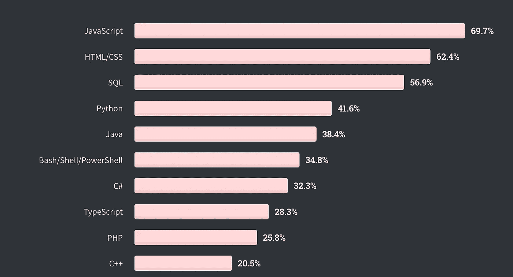

# 你听说过 Prolog 吗？

> 原文：<https://betterprogramming.pub/have-you-heard-of-prolog-ce34fdb8660a>

## 快速回顾这种鲜为人知的编程语言，以及为什么它可能会影响你的职业生涯


保罗·德拉古纳斯在 [Unsplash](https://unsplash.com/s/photos/lost?utm_source=unsplash&utm_medium=referral&utm_content=creditCopyText) 上的照片。

Prolog 是你通常在形成阶段(在学校、大学等等)学习的语言之一，但是它几乎是同时被学习和遗忘的。

这是为什么呢？嗯，就我个人而言，我责怪我们的行业。在过去的 17 年里，我一直在软件开发行业工作，在此期间，我参与了各种各样的 web 开发和大数据相关的项目(即大型平台、ETL 管道以及二者之间的一切)。事实是，我从未在任何地方看到一行序言。

快进到上周。这是一个普通的星期二，我正在面试一名有抱负的软件开发人员。当被问及他们知道如何使用其他什么语言时，他们放弃了这句话:“嗯，我在大学期间学过 Prolog，但没有人再使用它了。”

这让我想到，“这有多准确？”

当然，那不可能是真的，是吗？完整声明:我不是那些在大学期间学习 Prolog 的软件开发人员。我从未将它视为我课程的一部分，但我确实在几年前阅读 [*七周七种语言*](https://www.amazon.com/Seven-Languages-Weeks-Programming-Programmers/dp/193435659X/) (顺便说一下，这是所有开发人员的必读书籍)时了解到了它。Prolog 是所涉及的语言之一，它无疑显示了它的潜力。所以，我再问一遍:*为什么不再用了？*

考虑到不同社区中每周涌现的不同编程语言或框架的数量，人们可能会认为我们的生态系统是非常动态和不断变化的。然而，这并不完全正确。事实上，如果你真的想一想，并没有太多的变化。有许多过程式编程，一些声明式编程，相当多的面向对象编程，以及最近(这里的“最近”，我指的是最近几年)的函数式编程。还有其他范例，但是根据 StackOverflow 的 2020 年开发者调查，十大最流行的编程语言是:



根据 [StackOverflow](https://insights.stackoverflow.com/survey/2020#technology-programming-scripting-and-markup-languages-professional-developers) 统计，十大最常用的编程语言。

如果你仔细观察，在前十名中，你有:

*   过程编程:Python，Bash，PHP，JavaScript
*   面向对象编程:Python，C#，TypeScript，PHP，C++，JAVA
*   函数式编程:Python，JavaScript
*   声明式编程:SQL

我没有列出 HTML/CSS，因为众所周知，这些语言是否真的是编程语言是一种毫无意义的争论(我试图避免在这里引发一场激烈的争论)。

但是我的观点仍然是:逻辑程序员在哪里？事实上，Prolog 程序员在哪里？他们甚至不在名单上。[来看看](https://insights.stackoverflow.com/survey/2020#technology-most-loved-dreaded-and-wanted-other-frameworks-libraries-and-tools-wanted3)！

所以问题依然存在:Prolog 还在用吗？如果是，谁在使用它，用途是什么？

# 谁在使用 Prolog？

相信我，Prolog 仍然在使用——只是没有像我们行业中一些最常用的语言那样广泛，这是有充分理由的。但在深入讨论之前，让我快速解释一下 Prolog 是什么，以防您过去没有体验过。

## 什么是 Prolog？

Prolog 是一种逻辑编程语言，本质上意味着它是以声明的方式编写的(而不是使用其他常见语言中可用的命令式方法)。您使用关系、事实和规则来指定您的业务逻辑，然后在这些事实上查询您的数据。

这绝对是一种不同的工作方式，但是你可能会发现(如果你对 Prolog 研究得足够深入的话)它使得解决一些问题变得非常容易。

使用 Prolog，首先定义世界的期望状态，也称为谓词(事实)，然后要求 Prolog 尝试达到该状态。

比如，我们来玩一个游戏。假设你有这些神奇的数字:`1`、`2`、`4`和`5`。您希望能够使用其中两个数字找到一个简单的“加法”运算的所有解。这样想一想:

```
Given 1 is a magic number
Given 2 is a magic number
Given 4 is a magic number
Given 5 is a magic numberWhich numbers can I add together that will result in 6? 
```

当然，我们阅读这些语句，并且可以在心里解决它，但是如果你想用一种最“普通”的语言来实现它，你必须实现某种算法来测试所有可能的组合，评估它们的结果，并且只保留匹配的组合。

然而，使用 Prolog，解决方案是我刚刚编写的伪代码，简单地用其他单词编写:

```
magicNumber(1)
magicNumber(2)
magicNumber(4)
magicNumber(5) ?- magicNumber(X), magicNumber(Y), plus(X, Y, 6)
```

前几行和我说的一样，说哪些是“幻数”，然后你简单地说，“给定我的幻数，关于变量`X`和`Y`，考虑到它们加起来是`6`，我可以使用哪些？”

结果是:

```
1, 5
2, 4
5, 1
4, 2
```

我们可以继续使事情变得更复杂，以避免重复的解决方案，但这应该足够复杂，以使您了解逻辑编程的威力。你需要一段时间才能明白，因为你没有解决问题。你只是在陈述你的世界的规则(即哪些数字是神奇的)，然后陈述想要的解决方案。中间的步骤，也就是你一直想实现的步骤，是由引擎完成的。

如果你想继续阅读，请看这些例子。它们非常有趣。

现在考虑一下这种力量。你如何使用它，为什么你还没有？

## Prolog 现在真正闪光的地方在哪里？

我理解您可能会看到这一点，并认为它对您的日常工作毫无用处——特别是如果您是一名前端开发人员或在 Node.js 中开发自动化工具的话。这是公平的，并不是每种语言都适用于每种场景。我们都知道。然而，这种基于逻辑的编程方式在*和*中发挥了巨大的作用:模式匹配。

人工智能中的一个关键领域是，如果你试图理解自然语言，理解如何使用模式匹配，这就是 Prolog 的亮点。请注意，在人工智能中还有很多其他的关键领域。我只是说 Prolog 在其中一个里面非常有用。

那么鉴于这一事实，Prolog 的闪光点在哪里呢？如果你想的话，你可以在哪里使用它？嗯，如果您在日常工作中处理诸如调度(如果您还没有尝试过，这是很难解决的)、数字电路验证、流量控制或任何其他类型的[约束逻辑编程](https://en.wikipedia.org/wiki/Constraint_logic_programming)之类的问题，那么您可能想看看它。

特别是对于人工智能，如果你对回答集编程或 NLP(如自然语言处理)感兴趣，Prolog 也非常有帮助。考虑到所需知识的深度，对于这样一篇文章来说，给出这样一个例子可能太多了，因为我不是 Prolog 专家，所以我希望您相信我。如果我引起了你的兴趣，那就去看看[一些例子](https://www.cs.unm.edu/~luger/ai-final2/CH8_Natural%20Language%20Processing%20in%20Prolog.pdf)。

## 那么到底是谁在使用 Prolog 呢？

我们终究还是想回答这个问题，不是吗？

根据目前提供的数据，可以安全地假设有使用 Prolog 的组，但是它们并不为每个人所熟知，因为它们的字段并不公开。即使他们的项目*是众所周知的*，他们也不会到处宣扬他们是用 Prolog 创建的，因为 Prolog 通常只是整体的一小部分。然而，请考虑以下示例:

*   [TerminusDB](https://github.com/terminusdb/terminusdb-server) :这是一个模型驱动、版本控制的 RDF 数据库，能够提供 Git 为版本管理所做的许多特性和行为，但是适用于大型数据集。它提供了一个标准的 RESTful API，允许您与之交互。
*   [IBM 的 Watson](https://www.ibm.com/watson) :没错，IBM 的旗舰项目之一也在内部使用 Prolog。当然，它并不像 TerminusDB 那样仅仅构建在 Prolog 上，但它确实使用了 Prolog。你可能知道，也可能不知道，Watson 旨在充当人类专家的助手，允许你询问特定的信息或回答简单的问题。当著名的[击败了著名电视节目 *Jeopardy* 的主要冠军](https://www.youtube.com/watch?v=YgYSv2KSyWg)时，它被媒体报道了。IBM 背后的团队使用 Prolog 来解析自然语言，并将人类提出的问题翻译成沃森可以使用和理解的形式。
*   GeneXus :这个低代码开发平台使用 Prolog 将你想要的功能转换和翻译成代码(它为你生成代码)。它可以生成多种语言的代码，包括 Java、Ruby、C#、Objective-C 等等。

正如你所看到的，如果你看一下整个产品，有一系列的用例，但是 Prolog 只是这些系统的一部分，对于一系列很难解决的问题有很大的帮助。

请注意，如果您查看 GitHub 并做一个快速的“prolog”搜索，您会注意到有超过 7000 个存储库声称 Prolog 是他们的语言之一，所以有许多人在尝试使用它。问题是(在我看来),他们中没有多少人能够制造出成功的商业产品，让他们为公众所熟知。

# 结论

所以，结束它，回到我们最初的问题:这个人准确吗？Prolog 只是教学工具吗？

我对此的回答是“不，绝对不是。”事实上，它是一个伟大的工具——一个非常强大的工具。正因为如此，它需要的理解水平不是每个人都愿意达到的。这需要改变思维方式，离开你的 OOP 舒适区，进入声明性的世界。但是如果你这样做了，并给它一个机会，它可能会成为你最喜欢使用的工具之一。考虑到它通常应用的领域较少，它可以很好地帮助你塑造你的职业生涯。

就我个人而言，我从来没有机会在工作中使用 Prolog，但我确实看到了它的潜力，以及如果正确使用它会有多大的帮助——以至于我每隔一段时间就会回头去看它。

你呢？你以前用过吗？你现在能检查一下吗？请在下面留下评论，分享您使用 Prolog 的体验。