# 拥有一个 Docker 容器作为你的私人 NPM 注册表——简单的方法

> 原文：<https://betterprogramming.pub/having-a-docker-container-as-your-private-npm-registry-the-easy-way-68159fa94cc4>

## 使用 Azure Container Registry 将您的 Azure Docker 容器实例更改为私有的 NPM 注册表

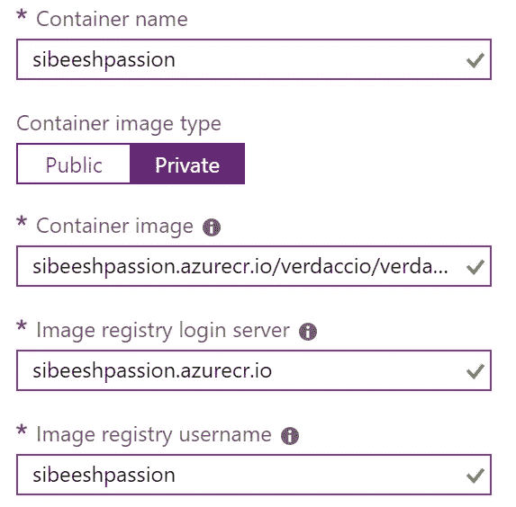

Azure Docker 容器实例

# 介绍

在生活中的某些时候，我们需要私人范围内的几乎所有东西，这包括你的 NPM 包。您可能已经为您的公司或您自己创建了一个私人 NPM 包，并希望在某个地方托管它。您可能已经看到了付费版本的 npm，但在本文中，我们将把 Docker 容器实例更改为私有的 npm 注册表，一旦准备就绪，您就可以在该注册表上托管您的私有 NPM 包。让我们开始吧。

# 背景

正如我前面提到的，我将创建一个容器实例，并将其更改为私有的 NPM 注册表。我将使用[微软 Azure](https://sibeeshpassion.com/category/azure/) 。

# 设置 Docker 私人 NPM 注册中心

要创建 Azure 容器注册表，您应该拥有有效的 Azure 订阅。如果你没有，请得到一个；它会帮助你理解这篇文章。一旦您获得 Azure 订阅，您就可以开始了。

## 创建 Azure 容器注册表

有了 GitHub，我们可以上传我们的项目/源代码，进行版本控制，创建分支，等等。你可以把 Azure 容器注册中心看作一个类似的服务。Azure 容器注册中心或 ACR 是一个私有的 Docker 注册中心，在这里你可以很容易地从同一个地方管理你所有的 Docker 容器映像。是不是很酷？根据微软的说法，你可以使用 Azure 容器注册来:

*   跨所有类型的 Azure 部署存储和管理容器映像
*   使用熟悉的开源 Docker 命令行界面(CLI)工具
*   将容器映像保存在部署附近，以减少延迟和成本
*   使用 Azure Active Directory 简化注册表访问管理
*   在单个 Docker 注册表中维护 Windows 和 Linux 容器映像

登录到门户后，单击`+`图标，创建一个资源，并搜索容器注册表。

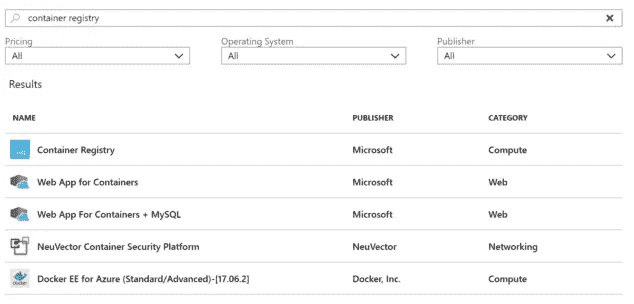

搜索容器注册表

当您单击容器注册表时，会要求您提供上图中显示的详细信息。

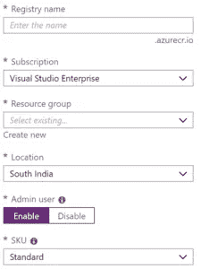

容器注册详细信息

记住要启用 admin 用户，因为只有启用了它，您才能使用注册表名称作为用户名，使用 Admin 用户访问密钥作为密码登录 Docker。我将在下一节进一步解释这一点。

一旦您创建了您的容器注册表，您将获得一个登录服务器作为`yourregistryname.azurecr.io`。您可以随时在概览部分查看其他信息。如果您点击设置下的访问键链接，您可以看到您的容器注册表的用户名和密码。记住，我们在创建容器注册表时已经启用了 Admin 用户属性。

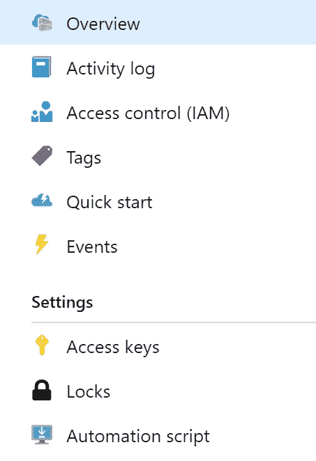

容器注册表设置

请注意，注册表名称和管理员用户名是相同的。

## 创建本地 Docker 容器

对于这一步，您应该在您的机器上下载并安装 Docker。安装后，请确保它正在您的机器上运行。让我们一起开始一些令人惊奇的事情吧。

让我们先试试 Docker version 命令，以确保它工作正常。

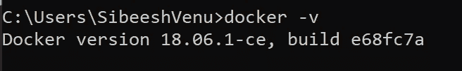

Docker 版本

现在 Docker 工作正常，我们可以开始创建我们本地的 NPM 注册中心了。为此，我将从 Verdaccio 的 Docker hub 提取一个包。

Verdaccio 是构建在 Node.js 之上的私有 npm 代理注册表。

*   这是一个基于 Node.js 的 web 应用程序
*   这是一个私人的国家预防机制登记处
*   这是一个本地网络代理
*   这是一个可插拔的应用程序
*   这是一个相当容易的安装和使用
*   它与纱线、npm 和 pnpm 完全兼容
*   它是基于分叉的，并且`sinopia@1.4.0` 100%向后兼容。

我们来拉一下 Verdaccio 的图像:

```
docker pull verdaccio/verdaccio
```

完成后，运行“docker images”来查看您的 Verdaccio 映像。

```
verdaccio/verdaccio           latest              c542d9e516e4        3 weeks ago         659MB
```

提取整个图像可能需要几分钟时间。因为我已经提取了最新的图像，所以我很快就会得到下面的输出。

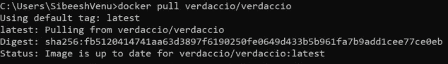

码头工人

您还可以标记您需要的版本:

```
docker pull verdaccio/verdaccio:3
```

现在是时候开始跑步了，你准备好了吗？

```
docker run -it --rm --name verdaccio -p 4873:4873 verdaccio/verdaccio
```

最后一个参数是我们的图像名称，如果您的本地文件中没有这样的图像，它将从 Docker hub 中提取。您可能已经注意到，我们正在使用端口 4873，稍后当我们创建容器实例时，这个端口将被映射到容器实例端口。确保您得到了所示的输出。

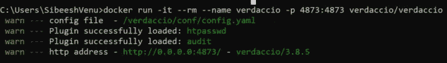

Verdaccio 码头运行

您现在应该能够转到 [http://localhost:4873](http://localhost:4873) 并看到 Verdaccio 正在成功运行。

## 将本地容器推送到 Azure 容器注册中心

既然我们已经有了一个运行中的 Azure 容器注册中心和一个可以充当私有 NPM 注册中心的本地容器，让我们把它推送到 ACR。从登录 Azure 容器注册服务器开始。

```
docker login sibeeshpassion.azurecr.io
```

一旦您使用正确的凭证运行以上命令，您将看到下面的输出。

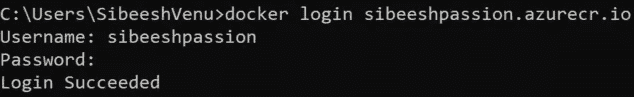

Docker 登录 Azure 容器注册表

现在让我们标记我们的图像，因为这将帮助我们在容器注册表中轻松管理我们的图像。

```
docker tag <image name> <login server>/<repository name>/<name>:v1
```

例如，我使用了下面的命令:

```
docker tag verdaccio/verdaccio sibeeshpassion.azurecr.io/verdaccio/verdaccio:v1
```

将您的映像推送到容器注册表:

```
docker push sibeeshpassion.azurecr.io/verdaccio/verdaccio:v1
```

如果一切正常，您将看到以下输出:

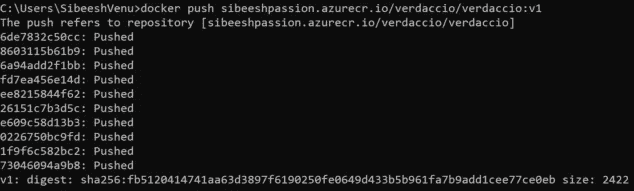

推送到容器注册表

现在，你可以登录到你的 Azure 门户，并检查你的 Azure 容器注册库。您应该能够看到您的图像与我们提供的标签。

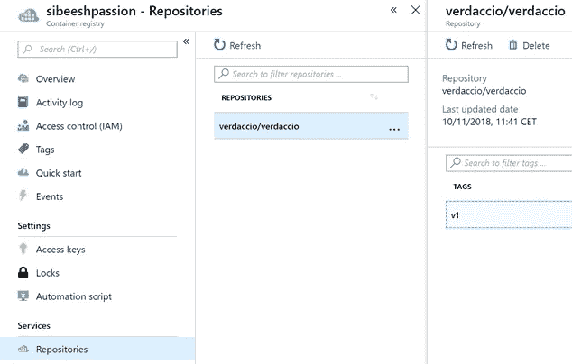

Azure 容器注册表中的存储库

## 创建容器实例

我们有一个有效的容器注册中心，它可以作为一个私有的 NPM 注册中心，但是我们还没有完成。我们需要一个地方来运行这个注册表。谢天谢地，Azure 拥有我们需要的一切。我们将创建一个容器实例，这是运行单个容器的最简单、最快的方法。创建容器实例时，您必须经历三个步骤:

1.  配置基本设置
2.  指定容器要求
3.  最终确定容器实例

**配置基础设置**

您可以配置设置来满足您的需求，我的配置如下:

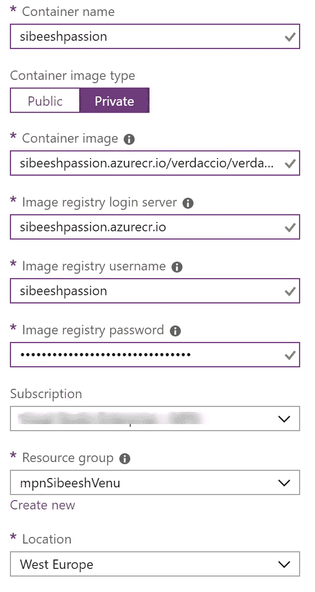

容器实例基本设置

请注意，我已经将容器图像类型设置为 Private。

**指定集装箱要求**

在这里，我将公共 IP 地址设置为“Yes”，这样我就可以在配置时设置 DNS 标签。我还将端口设置为 4873。


Azure 容器实例中的网络设置

## 最终确定容器实例

在这一步，你可以验证你的所有设置，Azure 将在后台验证它们。如果它们有效，将启用“确定”按钮。启用后，单击确定。构建您的资源可能需要一些时间，一旦完成，您可以随时转到容器实例的概述，并使用端口 4873 运行它。例如，我可以在这个 URL 中看到我的容器【http://sibeeshpassion.westeurope.azurecontainer.io:4873/#/. 

## 将您自己的私人 NPM 软件包推送到 Docker private NPM 注册表

哇，我们现在有一个私人码头 NPM 登记处了！让我们将我们的私人 NPM 包推送到这个注册表。几天前我创建了自己的 NPM 包，如果你想知道如何，你可以阅读这篇文章。我将在 vscode 中打开我的包。

在我们发布包之前，添加用户:

```
npm adduser --registry=http://sibeeshpassion.westeurope.azurecontainer.io:4873/#/
```

系统将提示您输入用户名和密码:

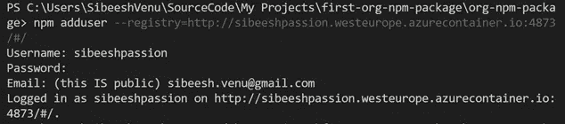

NPM 用私有注册地址发布

运行我们的发布命令:

```
npm publish dist --registry=http://sibeeshpassion.westeurope.azurecontainer.io:4873/#/
```

如果发布成功，您将获得以下输出:

```
npm notice === Tarball Details ===
npm notice name:          org-npm-package
npm notice version:       1.1.1
npm notice package size:  7.8 kB
npm notice unpacked size: 37.9 kB
npm notice shasum:        f1d8e033bb6d2545502802510258cf9f8bcc9ab3
npm notice integrity:     sha512-3MuplP75D0gpj[...]Z5KFo0DNbzGFw==
npm notice total files:   22
npm notice
+ org-npm-package@1.1.1
```

还等什么，快去 Docker 看看你的包裹吧！我急切地等待着这一时刻，并通过导航到我的容器来查看我的包:[http://sibeesh passion . westeurope . azure container . io:4873/#/detail/org-NPM-package。](http://sibeeshpassion.westeurope.azurecontainer.io:4873/#/detail/org-npm-package.)

# 使用您的私人软件包从 Docker 私人 NPM 注册表

运行以下命令，您的私有包将从您的私有 Docker NPM 注册表中提取:

```
npm install org-npm-package --registry=http://sibeeshpassion.westeurope.azurecontainer.io:4873
```

# 结论

祝贺你，我们已经成功地创建了一个私人码头 NPM 注册。继续创建尽可能多的私有包，并将它们移动到您的私有 NPM 注册表中。非常感谢您关注/阅读这篇文章。我真的很感谢你的时间和努力。我们刚刚学习了如何:

1.  创建 Azure 容器注册表
2.  创建一个本地 Docker 容器
3.  创建 Verdaccio 映像，并在本地 docker 容器中运行它
4.  将本地 Verdaccio 映像推送到 Azure 容器注册表
5.  使用 Azure 容器注册中心设置 Docker 容器实例
6.  把 NPM 的包裹推给私人码头工人 NPM 登记处
7.  从私有注册表中提取包

你可以随时在 Medium 和 Twitter 上关注我。

[](https://medium.com/@sibeeshvenu) [## Sibeesh Venu -培养基

### 在介质上阅读 Sibeesh Venu 的作品。职业上是工程师，热情上是作家。微软 MVP…

medium.com](https://medium.com/@sibeeshvenu) [](https://twitter.com/SibeeshVenu) [## sibeesh Venu(@ sibeesh Venu)| Twitter

### Sibeesh Venu 的最新推文(@SibeeshVenu)。https://t.co/qgUFdZS3Zb,微软 MVP @MVPAward，@CsharpCorner…

twitter.com](https://twitter.com/SibeeshVenu) 

# 轮到你了。你怎么想呢?

非常感谢你的阅读。我很快会带着同一主题的另一篇文章回来。我遗漏了什么吗？不要忘记与我分享您的反馈！

最亲切的问候