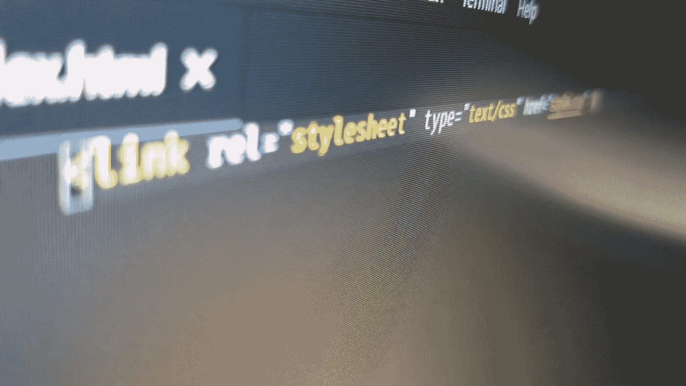
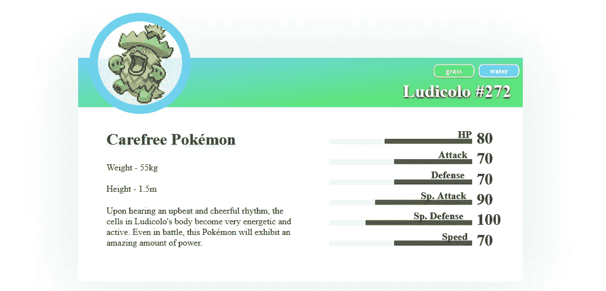
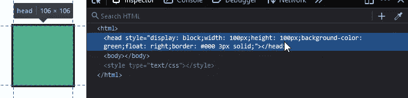
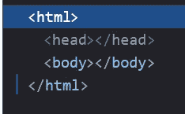
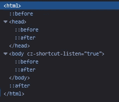
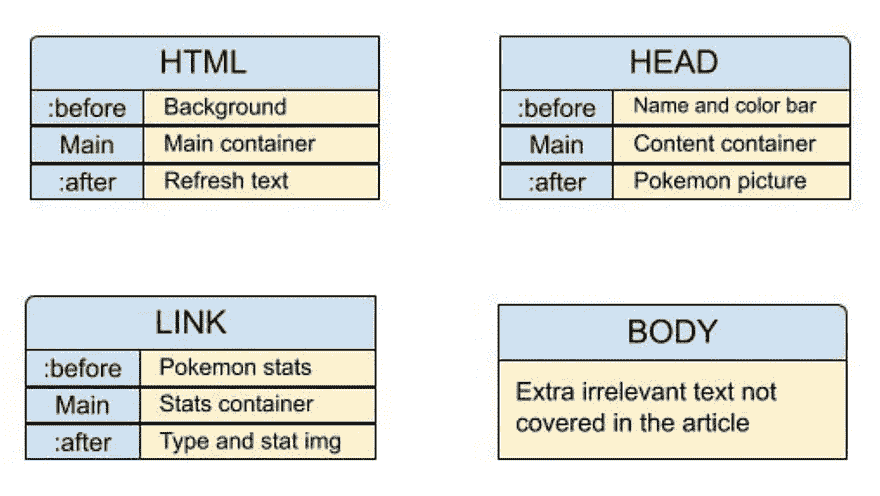
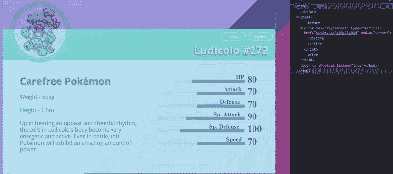
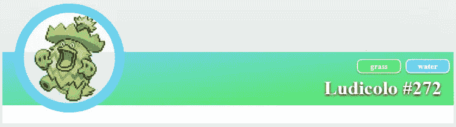

# 用不切实际的 CSS 取乐

> 原文：<https://betterprogramming.pub/having-fun-with-impractical-css-3401bc18d567>

## 制作“单线”网站的旅程

图片来源:作者

# 源文件和免责声明

在这篇文章中，我们将利用浏览器和 CSS 以我们可能不应该的方式制作一个“单行”网页。这些技巧不能保证永远有效，也不应该在任何生产环境中使用，因为[有一些相当大的限制](#6d3e)。

你可以在我的 GitHub 上获得源文件并跟随操作指南[。](https://github.com/donk/One-line-website-tutorial)

 [## donk/单线网站教程

### 单行网站教程 GitHub 的文件和占位符图像是超过 5000 万开发者的家园

github.com](https://github.com/donk/One-line-website-tutorial) 

# CSS3:不是编程语言，但功能强大

尽管 JavaScript 在现代网页设计中备受瞩目，但 [CSS3](https://developer.mozilla.org/en-US/docs/Archive/CSS3#:~:text=CSS3%20is%20the%20latest%20evolution,flexible%20box%20or%20grid%20layouts) 凭借其自身的能力已经变得非常强大，为我们提供了许多有用的选择器来控制网站的几乎每个视觉方面，以及以有趣的方式对元素进行分层和动画制作的能力。我们将利用本文中的一些优势。

## 什么是 CSS？

CSS 是任何 web 项目的生命线。没有它，互联网将是一个非常枯燥的地方，基本上是一个 Word 文档。制作一个单行网站依赖于一些简洁的 CSS3 技巧，所以对 CSS 有一个基本的了解是非常有帮助的。如果你是 CSS 新手并想了解更多，Bradley Nice 已经整理了一篇 niceʰᵃʰ的文章，其中的资源可以给你一个很好的开始。

 [## CSS +备忘单的终极指南📑

### ClickHelp.com 的内容经理 Bradley Nice——专业的技术写作工具

medium.com](https://medium.com/level-up-web/the-ultimate-guide-to-css-103b0f883de3) 

# 将 CSS3 推向极限，一个奇怪的想法

 [## 26 个仅用 CSS 构建的令人印象深刻的 web 项目。

### 我们对比了近 12000 个纯 CSS 项目，选出了前 26 名。

medium.mybridge.cos](https://medium.mybridge.co/26-impressive-web-projects-built-with-css-only-4a4c2f773a21) 

在偶然看到上面的文章后，我被一些巧妙的 CSS 技巧和大量的创造力所激发！虽然这些例子中的大部分在视觉上非常好，但我想看看我是否可以利用文章中使用的技巧来制作一些更具功能性的东西，类似于普通的网页。事实证明，这不仅是可能的，而且会变得非常有趣。

# 传说中的“一行”网站(操作指南)

嗯，不完全是虚构的…事实上，我不认为很多人真的谈论过制作一个单行网站，因为老实说，这是一个非常糟糕的想法。不管怎样，如果您决定将 CSS3 专门用于设计，您只需要一行代码:到样式表本身的链接！

我们要做这个，只用一行 HTML(Firefox 上是零)

# 我们将用来使一切工作的技巧

我们将利用一些巧妙的小技巧来让事情正常进行。在我们进入任何代码之前，我想解释一些我们在建立这个网页时将会利用的东西。

## 任何 HTML 标签都可以被样式化

因为我们可以改变 CSS 中的`display`属性，所以我们可以像对待常规的`
`一样对待任何标签，甚至是主体之外的标签，以及`<html>`标签本身！

借助 CSS 的魔力(甚至是内联)，通常隐藏的功能标签现在变成了一个绿色方块！

## 现代浏览器填补了我们 HTML 的空白

如果期望页面是 HTML，今天的网络浏览器不需要所有通常的标签；即使你创建了一个空的 HTML 文件，`<html>`、`<head>`和`<body>`标签仍然存在，以供我们进行样式化。

这是一个空的 HTML 文件！

这对我们非常有用，因为我们将有四个主要元素可以使用，而不是只能在 HTML 中使用`<link>`标签！

## 伪元素让一切成为可能

[伪元素](https://developer.mozilla.org/en-US/docs/Learn/CSS/Building_blocks/Selectors/Pseudo-classes_and_pseudo-elements#What_is_a_pseudo-element)是使这些页面成为可能的基础。只有伪元素可以被赋予一个`content`属性，这是我们在网页上获取文本的唯一方式(除了使用图片)。

相同的空 HTML 文件，带有伪元素！

因为每个 HTML 标签都有一个`:before`和`:after`伪元素，所以我们可以处理三倍数量的标签。这给了我们多达 12 个元素，足以让我们建立一个网页。

## 服务器端的技巧可以让事情变得动态

这是一种在网站上经常使用的技术:您可以将`Content-type` HTTP 头设置为`text/css`，并创建任何普通的 PHP/Node 逻辑来输出带有您想要的任何特殊数据的动态 CSS。我们将在另一篇文章中讨论这个问题；现在，我们将关注造型的主要概念。

**我们还可以用服务器端的魔法做一个零线站点！这是一个非常巧妙的技巧，但不幸的是它只在 Firefox 中有效。您可以使用 PHP 将样式表包含在标题中，这将在不使用任何 HTML 的情况下加载样式。缺点是没有`<link>`标签，无法样式化，损失了三个元素。你还需要像 normal 一样使用一个`<link>`标签来支持 Chrome/Edge。我在我制作的另一个单行网站中使用了这种技术:[www.isspencerpooping.com](https://www.isspencerpooping.com)**

# 将这些技巧付诸实践

现在我们知道有足够多的元素可以被设计，至少可以得到一些结构的外观，我们可以开始我们的单行网站了！

## 创建文件

首先我们需要在某个地方创建一个`index.html`和`style.css`文件。在你最喜欢的编辑器中打开它们，把所有的 HTML 源代码添加到`index.html`文件中:
`<link rel=”stylesheet” type=”text/css” href=”style.css” />`

## 规划结构

由于一些元素嵌套在其他元素中，所以它们的位置是相对于它们的父元素的，这可能会使事情变得复杂。下面是我如何为我们的 Pokédex 布局的图表，尽管它几乎可以用任何方式来完成。我最终不需要使用 body 标签，我觉得这很有趣。

左边的图表显示了右边使用的结构。相当整洁！

你不需要精心计划你的结构，但是对你需要什么元素以及它们将被放置在哪里有一个好的想法是没有坏处的。一旦你弄清楚了它的结构，你就可以把它想象成任何一个普通的 div 块，并且像平常一样使用 CSS。

# 理论够多了，让我们开始编码吧

## 背景和主容器

根据结构图，我们想要`html:before`中的背景。

然后我们希望`html`元素包含所有内容。这允许我们使用正常堆叠的相对定位的元素，而不是我们自己手动定位每个元素。

## 添加一些内容:标题区域

现在我们有了容器，我们可以开始构建我们的内容了。我们将从标题区域开始，它显示了神奇宝贝的名称、它们的神奇宝贝编号以及它们的类型。我们将在下一个代码块中添加一些 SVG，所以请确保从 GitHub 中获取它们[。](https://github.com/donk/One-line-website-tutorial)

使用的标题背景是基于神奇宝贝类型的动态渐变。我们将忽略动态内容，在另一篇文章中讨论，现在使用占位符。

如果你现在加载页面，即使我们刚刚在上面添加了标题区域，所有的内容都是空白的。

这是因为从技术上讲，`head:before`是`head`的子元素，它还没有被样式化。我碰到过几次这个问题，会感到困惑，这就是为什么我建议规划出结构。如果事情看起来不对劲，你应该检查父母没有把事情搞糟。

我们将为`head`标签添加样式，这样我们可以看到主要内容，然后通过使用`head:after` 选择器添加乐天河童的图像来结束标题区域。让图像动态变化将在另一篇文章中讨论。

我们走吧！终于有东西可见了，我们已经成功了一半！

## 文本技巧:多行内容

现在我们已经通过样式化`head`标签创建了内容的标题区域，我们需要做的是获取实际的文本内容。虽然我们之前使用了`content`属性作为神奇宝贝的名字，但是我们需要一些换行符来分隔内容。一般来说，`content`属性文本将作为单行文本，通常在父对象的宽度内换行，但是我们可以通过设置`white-space:pre-wrap;`来强制内容用`\a`换行。

使用空白:预换行；允许我们使用\a 创建换行符

## 添加描述

接下来，我们将向页面添加描述。这将使用上面的技巧，所以我们可以从描述中分离出基本的统计数据。我们还将宽度设置为 50%,并在顶部添加一个边距，以便为 genus text 和 stats 图表腾出空间。

## 完成种类和统计图像

最后，我们将通过添加属名和统计图像来完成所有工作。这使用了由描述创建的空间，因此我们可以将`link:after`放置在它的下面，允许我们将统计图像放在右边，将`background-position`和 genus 放在我们上面设置的页边空白的顶部。

# 就是这样！

刷新你的页面，你就有了一个非常漂亮的小索引条目！查看源代码，你会发现它只显示了链接。很漂亮，对吧？您可以使页面比我们在本文中所做的更复杂，但是请记住这也有一些缺点。

## 单行网页的注意事项

*   用户交互几乎不存在。访问者甚至不能突出显示或复制我们的任何文本。
*   没有太多的元素可以使用，布局的结构会使一些想法难以实现。
*   除此之外，12 个元素中只有 8 个可以用于文本。
*   CSS 文件可能会变得有点乱(这可能是个人问题)。
*   尽管我们可以做出一些非常可爱的设计，但是对于在任何专业网站上使用来说都有点太基础了。

# 让事情变得更有活力，和更巧妙的技巧

您可以使用前面提到的服务器端技巧，使用您喜欢的任何数据，使 CSS 文件中的内容、图像或任何内容动态化。我的下一篇文章将进一步解释这一点，并介绍更多巧妙的技巧来迎合您在创建单行网站时可能遇到的特殊情况。

你可以在 https://www.notlikely.me/pokedex 查看我们将在下一篇文章中制作的动态版本。

感谢您的阅读！我希望你喜欢这篇文章，并学到了一些新东西。如果你有任何问题，或者想得到更好的解释，请告诉我！