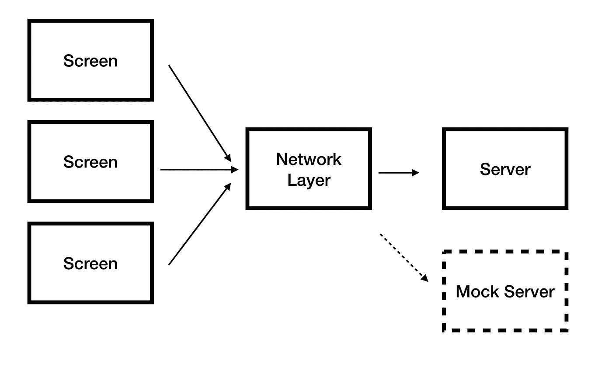
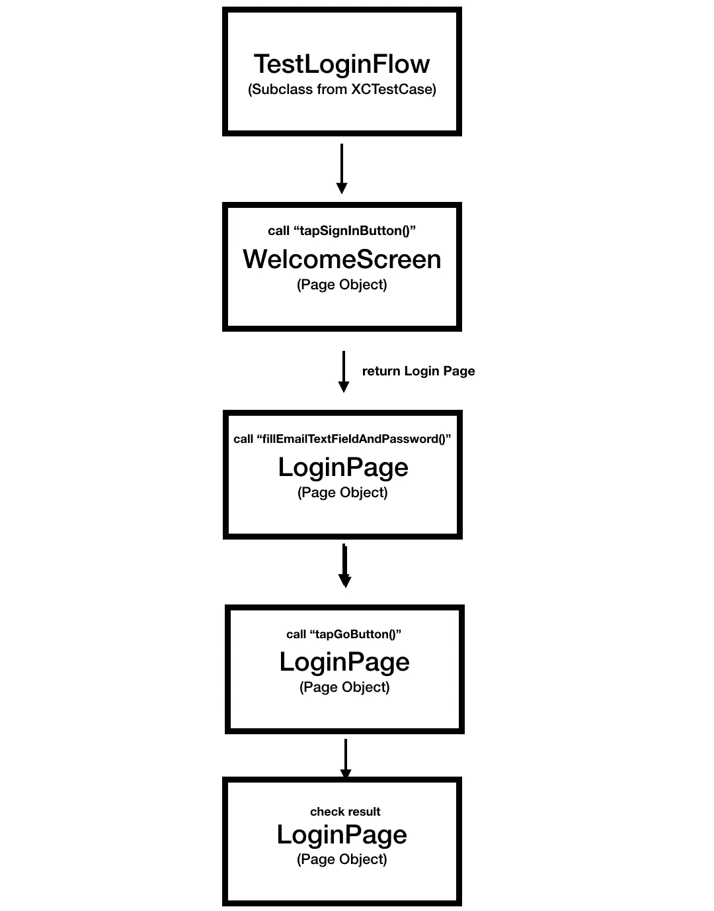

# 如何解决 UI 测试的问题

> 原文：<https://betterprogramming.pub/having-troubles-with-ui-testing-heres-how-to-nail-it-cee2a90e5ce5>

## 用页面对象模型模仿 API 和维护测试

亚当·威尔森在 [Unsplash](https://unsplash.com/search/photos/testing?utm_source=unsplash&utm_medium=referral&utm_content=creditCopyText) 上拍摄的照片

# UI 测试的重要性

单元测试很重要。他们确保我们的函数正常工作，我们没有破坏任何东西，并捕捉边缘情况。

然而，从用户的角度来看，如果按下确认按钮没有将他们带到预期的屏幕，这并不重要。所以，UI 测试并没有取代测试套件中的单元测试，它只是完成了单元测试。

# 用户界面测试的问题

我不知道随着时间的推移，有多少开发人员维护单元测试，但我知道 UI 测试在开发人员中仍然非常少见。实际上，是有原因的。

由于以下原因，很难设置 UI 测试来防止随着时间的推移而中断:

*   我们的应用程序使用后端服务器，因此测试变得非常不一致:网络问题或服务器问题。我们无法控制从服务器返回的请求。
*   编写 UI 测试脚本需要很多时间。为单个测试定位按钮或处理屏幕间的导航。然后，当我们想要创建一个新的测试用例时，我们必须复制代码。
*   这些测试不仅写起来很长，而且可读性也不好。试着在它们被创造两天后去理解它们，你就会明白我的意思。
*   用户界面一直在变化。我们添加和删除按钮、屏幕、滚动条等等。每当我们想做一些小的改变时，更新测试就成了一场噩梦。

# 模拟你的后端

大多数移动应用程序都使用后端服务器，对于 UI 测试来说，这可能是一个挑战。

任何自动测试的第一条规则是，如果你运行测试 1000 次，你应该期望每次都有相同的结果。因此，服务器和网络问题使你的测试不可靠。

但是，如果您遵循 SoC(关注点分离)，您可以通过创建一个*模拟服务器*来模拟您的后端服务器，在您的网络层实现它，并使您的测试完全可靠和可预测。

许多工具可以帮助您模拟您的服务器，但原则总是相同的——用一个本地组件替换您的服务器，该组件对您的网络请求返回可预测和可靠的响应对象。

在各种情况下(登录、注销、数据同步等)测试您的应用。)，您可以将您的“请求->响应”模拟数据保存到不同的 [JSON](https://www.json.org/) 文件中，其中每个文件代表不同的场景(登录、注册)。

您使用启动选项用首选文件加载您的测试，因此您不仅解决了可靠性问题，还可以用不同的情况测试您的应用程序。

模拟服务器的协议。

但是建立所有的嘲讽数据是需要时间的！

你是开发商，施展你的魔法吧！运行一次应用程序时“记录”请求和响应。你可以用查尔斯代理服务器或者写一些代码将所有的网络数据保存到一个文件中。

# 模仿其他 API

这个方法不一定要以仅仅模仿你的服务器来结束。您也可以模仿其他 API。

例如，假设您有一个管理地址簿联系人的应用程序，它会与设备的地址簿同步。

同样，如果您将地址簿连接器与应用程序的其余部分分离，并遵循面向协议的设计模式，您可以用模拟地址簿替换您的连接器，并返回不同联系人的对象，无论设备当前拥有什么地址簿。

日历、提醒和其他系统 API 也是如此。

# 用页面对象模型维护测试

编写 UI 测试脚本需要时间和精力，但真正的问题是如何长期维护它。

解决这个问题最简单的方法是创建一个叫做*页面对象模型*的东西。

页面对象模型是附加到屏幕上的对象。它有一个对 [XCUIApplication](https://developer.apple.com/documentation/xctest/xcuiapplication) 的引用，它的职责是在页面上采取行动，定位元素并在需要时返回下一个页面对象。

请注意，我不打算向您展示如何编写 UI 测试脚本，而是想向您展示如何解决为您的应用程序建立良好的测试基础设施时出现的日常问题。

页面对象的示例。

使用页面对象的 UI 测试示例。

页面对象的原则是我们将测试脚本从处理布局中分离出来。

这让我们可以快速编写非常小的、可读的 UI 测试，同时，通过为每个屏幕构建一个专用的对象来重用辛苦的工作。

此外，当您的 UI 发生变化时，您所要做的就是修改页面对象中的相关方法，而无需接触实际的测试用例。

# 结论

这是一篇关于如何克服 UI 测试问题的简短介绍。

正如我所说的，还有额外的和更复杂的工具，比如设置你的本地服务器来模仿，[剧本模式](https://serenity-js.org/design/screenplay-pattern.html)，或者 [Xcode](https://developer.apple.com/xcode/) 的配置文件。我将在以后的文章中尝试深入探讨这些问题。

最重要的是，你需要建立一个稳定的、可读的、可重用的 UI 测试基础设施，不要再浪费宝贵的时间让 Xcode 为你做健康检查了。