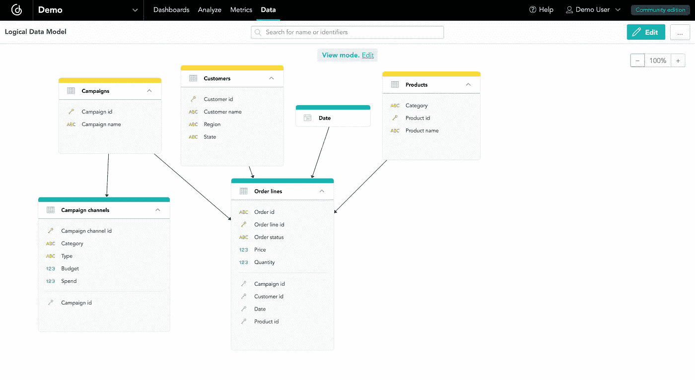
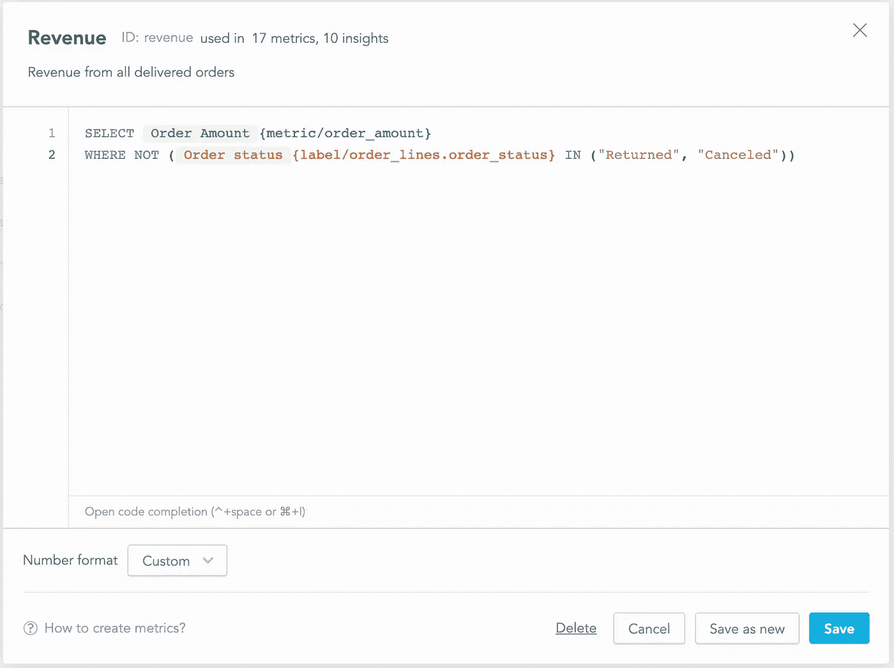
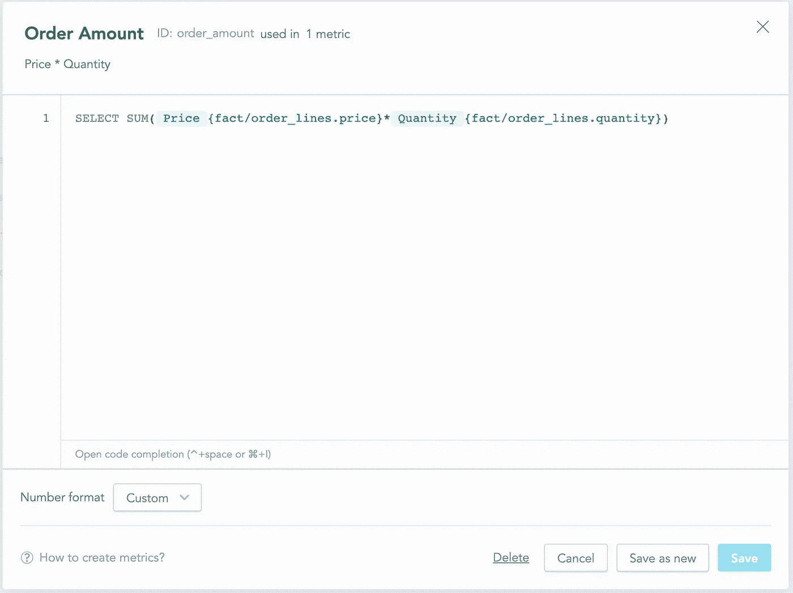
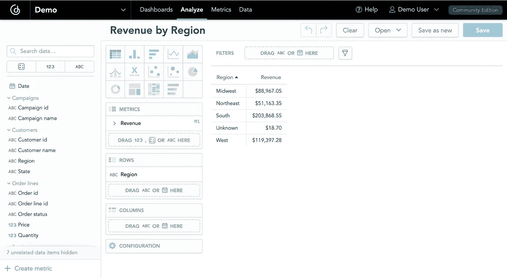
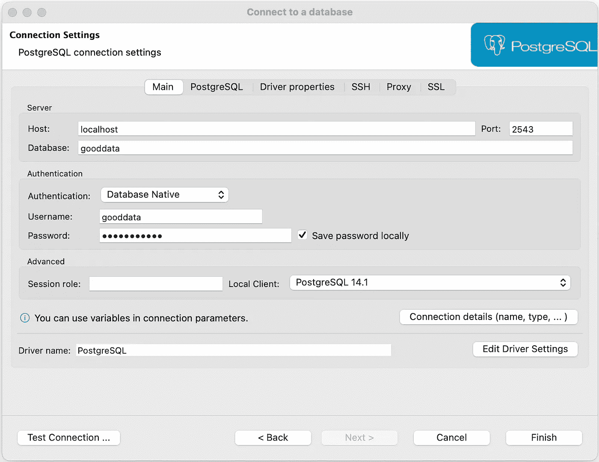
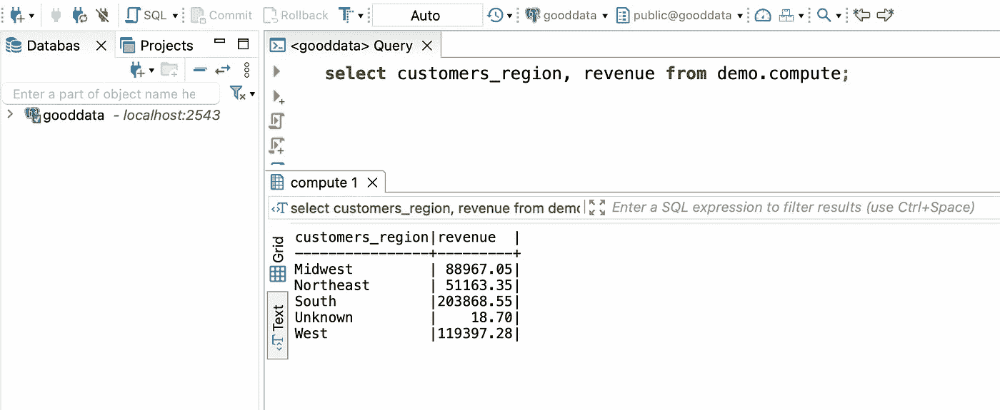
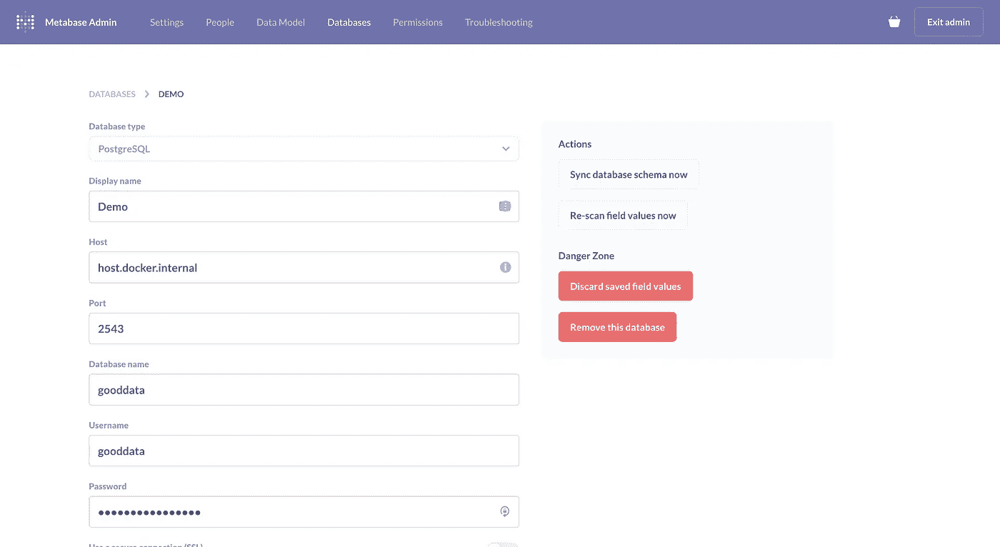
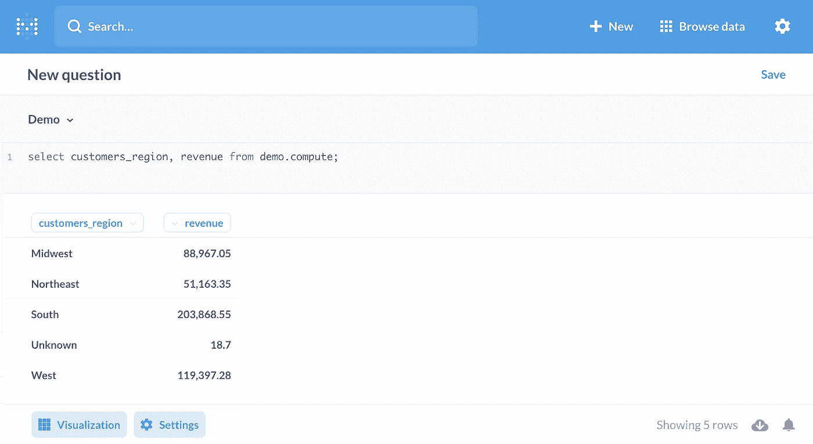
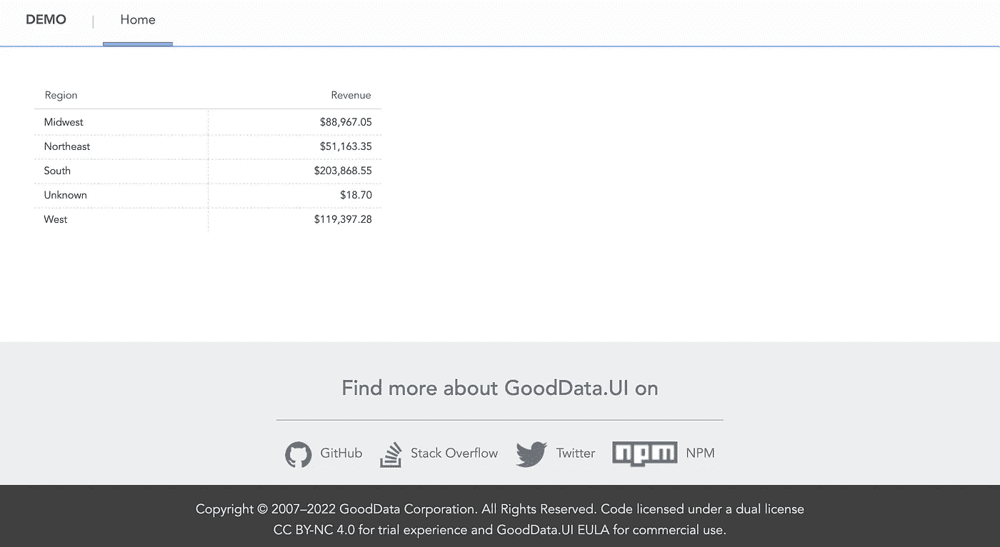
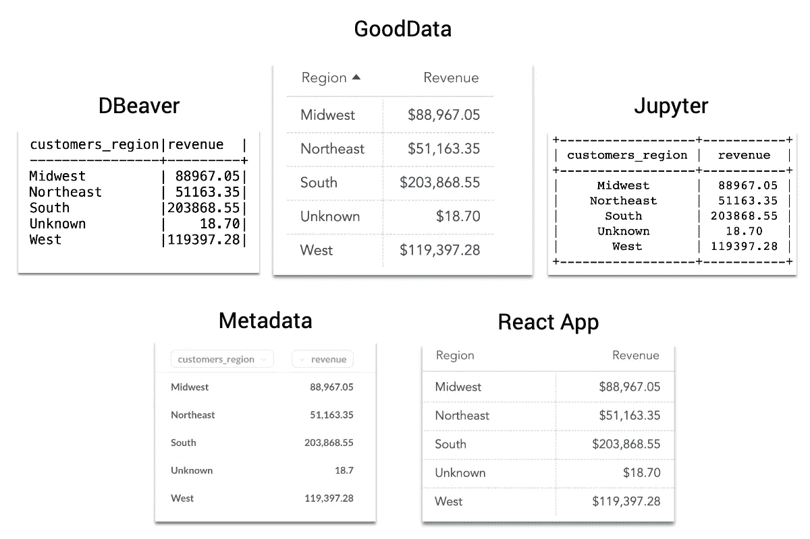

# 无头 BI:公制标准化在行动

> 原文：<https://betterprogramming.pub/headless-bi-metric-standardization-in-action-afb2ac7e89b6>

## 了解各种数据工具如何访问无头 BI 平台，使用相同的指标，并获得一致的结果


公制标准化是目前的热门话题。公司正在部署各种解决方案——指标存储、指标层和无头 BI 平台——为所有数据工具提供一致的指标，以避免[不一致的危险区域](https://lahannin.medium.com/danger-zone-inconsistent-metrics-at-work-306f09051a4)。

本文提供了一个简单的指标标准化示例，其中不同的数据消费者— SQL 客户端、data science IDE、BI 平台和 React 应用程序—访问一个无头 BI 平台，使用相同的指标，并获得一致的结果。

```
**Table of contents:**· [What is headless BI?](#2f68)
· [Setting up the headless BI platform](#4ae9)
  ∘ [GoodData.CN CE](#c1f0)
  ∘ [GoodData Foreign Data Wrapper](#0472)
· [Consuming a standardized revenue metric](#b714)
  ∘ [SQL clients](#2cde)
  ∘ [Data science IDEs](#8ea7)
  ∘ [BI platforms](#8f73)
  ∘ [React applications](#8b56)
  ∘ [Comparing the results](#7232)
· [Summary](#39e1)
```

# 什么是无头毕？

无头 BI 意味着我们将分析后端和计算与消费分开。这种分离允许我们通过 API 和标准协议将通用语义层暴露给多种数据工具。

因为所有数据消费者都可以访问单一的指标来源，所以我们的数据工程师、分析师和最终用户可以使用他们选择的工具，使用一致的指标(对每个人都有相同的意义)。

# 设置无头 BI 平台

本文用【GoodData.CN】社区版来介绍无头 BI 的概念。GoodData 作为一个容器在我们的本地机器上运行，我们将用无头 BI 用例所需的 GoodData 外部数据包装器(FDW)来配置它。

## 好数据。CN CE

要阅读本文，您可以下载包含 docker-compose 文件的 GoodData [Python SDK](https://github.com/gooddata/gooddata-python-sdk) ，并在根文件夹中运行以下命令:

```
*$ docker-compose up -d*
```

docker-compose 命令启动 GoodData.CN 社区版和 GoodData FDW 容器，并将预定义的分析对象(数据连接器、语义模型、度量、可视化和仪表板)加载到 GoodData.CN 中。

一旦容器开始运行，让我们转到 [http://localhost:3000/](http://localhost:3000/) 并登录平台。

```
**User:** demo@example.com
**Password:**demo123
```

下面是用 docker-compose 创建的**演示**工作空间的逻辑数据模型。后来，这个模型和一个**收入**指标被暴露给外部数据工具。



逻辑数据模型— GoodData。通信网络（Communicating Net 的缩写）

预定义的分析对象还包含一个**收入**指标。该指标使用另一个指标——计算所有订单收入的**订单金额**——并且只计算已交付订单的收入(订单状态不是**已退回**也不是**已取消**)。



收入指标—GoodData。通信网络（Communicating Net 的缩写）

下面是在**收入**指标中使用的**订单金额**指标:



订单量指标— GoodData。通信网络（Communicating Net 的缩写）

在 **Analyze** **选项卡**上，我们可以创建一个简单的表格，按地区划分收入。结果将作为一个基准，因为我们将在以后的章节中用不同的数据工具重新创建它。



按地区划分的收入— GoodData。通信网络（Communicating Net 的缩写）

## GoodData 外部数据包装器

GoodData 外部数据包装器是 PostgreSQL 外部数据包装器扩展。它建立在多核处理器的基础上，可以产生很好的数据。CN 的度量、计算和数据在 PostgreSQL 中以表格的形式提供。

我们可以连接到正在运行的 PostgreSQL:

*   从控制台使用`psql --host localhost --port 2543 --user gooddata gooddata123`
*   从任何其他客户端使用 JDBC 字符串:`jdbc:postgresql://localhost:2543/gooddata`

```
**Username:** gooddata
**Password:** gooddata123
```

一旦连接，我们可以与 GoodData.CN 外国数据包装工作。首先，我们需要在 PostgreSQL 中定义我们的 GoodData.CN 服务器。

好数据。PostgreSQL 中的 CN 服务器

接下来，我们将把整个语义模型导入到一个特殊的**计算伪表**中。从该表中进行选择将触发 GoodData.CN 服务器上基于我们在选择中指定的列的分析计算。

> 计算机被称为伪表是有原因。它不遵循关系模型。您选择的列映射到语义模型中的事实、度量和标签。select 的计算结果将自动聚合映射到语义模型中标签的列的结果。换句话说，计算表的基数根据您选择的列而变化。
> 
> ― [GoodData 外部数据包装文档](https://gooddata-fdw.readthedocs.io/en/latest/foreign_tables.html)

将语义模型导入伪表

# 消费标准化收入指标

目前，收入指标仅用于 GoodData.CN 平台。让我们看看如何使用其他数据工具访问语义模型和使用度量。

## SQL 客户端

首先，SQL 客户机——在本例中为[DBeaver](https://github.com/dbeaver/dbeaver)——需要连接到 GoodData FDW。

```
**Connection type:** PostgreSQL
**Host:** localhost
**Port:** 2543
**Database:** gooddata
**Username:** gooddata
**password:** gooddata123
```



数据库连接— DBeaver

一旦连接就绪，我们就可以编写一个 SQL 查询来计算之前在 GoodData.CN 创建的按地区划分的相同收入。

```
**select** customers_region, revenue **from** demo.compute;
```



按地区划分的收入— DBeaver

## 数据科学 IDEs

要使用 [Jupyter](https://jupyter.org/) ，让我们从命令行启动笔记本服务器:

```
*$ jupyter notebook*
```

接下来，我们将使用 ipython-sql 连接到 FDW，运行与 DBeaver 使用的相同的 sql 查询，并打印 Revenue by Region 结果。

按地区划分的收入— Jupyter

## 商务智能平台

作为一个 BI 平台，本文使用了[元数据库](https://hub.docker.com/r/metabase/metabase/)，我们将它作为一个容器在本地运行。以下命令启动元数据库容器(注意，原始端口从 3000 更改为 12345，因为 GoodData.CN CE 使用端口 3000):

```
*$* *docker run -d -p 12345:3000 --name metabase metabase/metabase*
```

一旦元数据库容器开始运行，我们需要创建一个网络来连接该容器和 FDW 容器，因为正如您所猜测的，一切都还在本地运行。

```
*$* *docker network create network* *$* *docker network connect network metabase* *$* *docker network connect network gooddata-fdw-container-name*
```

接下来，我们可以使用以下详细信息和凭据将元数据库连接到 FDW 伪表:

```
**Host:** host.docker.internal
**Port:** 2543
**Database name:** gooddata
**Username:** gooddata
**password:** gooddata123
```



数据库连接—元数据库

当连接完成时，我们可以再次使用相同的 SQL 查询来计算按区域划分的收入结果。



按区域划分的收入-元数据库

## 反应应用程序

对于这一部分，我使用 [GoodData 创建了一个 React 应用程序。UI](https://github.com/gooddata/gooddata-ui-sdk) 加速器工具包。它是一个基于 CLI 的工具，引导您逐步在终端应用程序中创建应用程序。该工具创建了一个应用程序，我们不需要或只需要很少的额外配置就可以使用。

从 React 项目开始，我们在终端中运行下面的命令，并遵循 CLI 提供的指令。

```
npx --ignore-existing @gooddata/create-gooddata-react-app my-app
```

构建完成后，我们需要转到生成的目录，用`yarn start` 命令启动应用程序。

```
cd my-app
yarn start
```

然后，我们按照主页上的指示对`src/constants.js` 文件进行如下编辑。

Constant.js 配置— React 应用程序

接下来，我们将为数据模型对象生成人类可读的 JavaScript 标识符，稍后将在代码中使用。首先，我们导出 GoodData.CN 身份验证令牌环境变量(该令牌对于所有 GoodData.CN CE 安装都是相同的)，然后运行以下命令:

```
export TIGER_API_TOKEN=YWRtaW46Ym9vdHN0cmFwOmFkbWluMTIz
yarn refresh-ldm
```

一旦生成了数据模型对象和其他元数据的可读名称，我们就可以编辑`src/routes/Home.js`文件来匹配下面的代码，从而创建一个按地区划分的收入表:

home.js 地区收入表代码 React 应用程序

当我们返回浏览器并转到**主页选项卡**时，我们会看到按地区显示的嵌入式收入结果。



按地区划分的收入— React 应用

## 比较结果

为了便于比较，我将前面步骤的所有结果合并到下图中。正如我们所见，所有工具都访问相同的语义模型，使用相同的**收入**指标，并计算完全相同的结果。



跨各种数据工具的标准化收入指标

# 摘要

本文的目的是展示开始标准化度量是多么容易。标准化意味着我们所有的指标都在一个地方定义，可以被不同的数据工具使用，比如 SQL 客户端、数据科学 ide、BI 平台和应用程序。

借助 headless BI，标准化是通过将分析后端和计算从消费中分离出来，并通过 API 和标准协议公开语义层来实现的。因此，我们可以使用我们熟悉的工具，使用一致的指标，对数据的含义有共同的理解。