# 用 Pimcore 和 Gatsby 创建一个动态的无头博客

> 原文：<https://betterprogramming.pub/headless-pimcore-c52e7351cec2>

## 了解如何使用 Pimcore 作为后端来实现博客


由[卢卡斯·布拉塞克](https://unsplash.com/@goumbik?utm_source=medium&utm_medium=referral)在 [Unsplash](https://unsplash.com?utm_source=medium&utm_medium=referral) 拍摄的照片

无头解决方案正在全世界传播，并将成为网站和电子商务的标准。这个应用领域的主要概念是预先生成页面，并将它们作为静态内容。这是获得最佳性能、减少网络流量的绝佳方法，而且——难以置信——减少了环境影响，节省了计算功耗！

在我上一篇关于 Gatsby " [如何用 Gatsby](/gatsby-blog-react-d5b0d3a5d83c?sk=1741acdd6e1ac165ba4ddbe0384110a4) 创建博客"的文章中，我解释了如何使用 JavaScript 和 Markdown 内容创建静态博客。这一次，我想向前迈出一步，添加一个用于编辑内容的动态后端。

本文的路线图非常简单，由两个步骤组成:

1.  安装和配置 Pimcore
2.  进入静态博客应用程序，从 Pimcore 获取数据

准备好了吗？开始吧！

# 安装和配置 Pimcore

使用 Pimcore Book 的 repo 作为参考，您可以通过键入`sh install.sh`来安装 Pimcore。这将开始下载所有文件，并提示您输入管理员凭证，然后您将能够打开浏览器并导航`[http://localhost/admin](http://localhost/admin.)` [。](http://localhost/admin.)

对于我们将要实现的演示，我们必须创建两种内容类型，一种用于博客文章，一种用于页面。为了保持后端的东西尽可能接近前端提供的设置，我们将实现为 Pimcore 的对象。

为此，只需使用下图所示的菜单导航至课程部分:

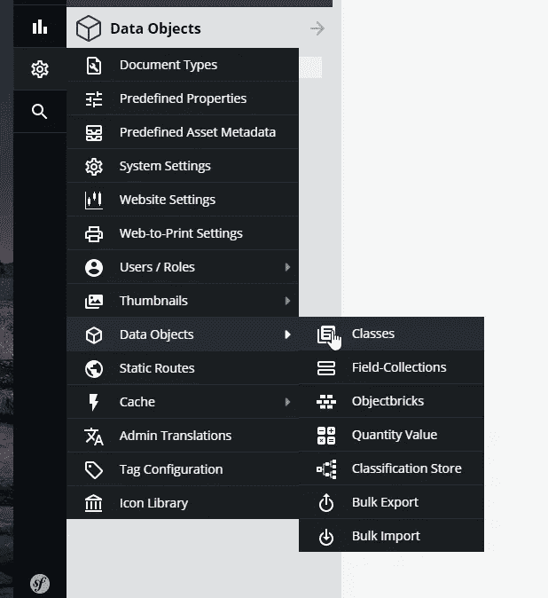

编辑类定义

然后我们必须创建类，每个类对应一种内容类型。你只需要点击`add class`按钮并添加字段。下图显示了我们设置操作的结果。

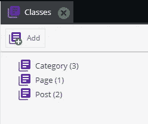

班级名单

现在我们可以选择一个实体并逐个添加字段。这很简单，你只需右击字段树并使用菜单。

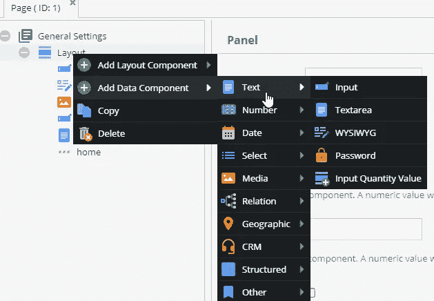

向实体添加字段

Post 实体的最终结果如下图所示，当然，您可以添加您想要的字段数量。

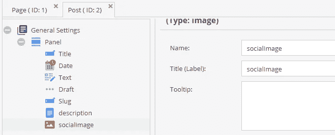

包含所有字段的 post 实体

此外，您可以为字段验证、唯一性和索引设置特殊设置。在下一张图中，我们展示了为字段`slug`设置了一个只允许小写字母和连字符的正则表达式。

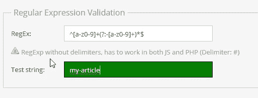

正则表达式验证器

最后，我们必须准备三个文件夹，您将在其中添加数据，如下一个截图所示。

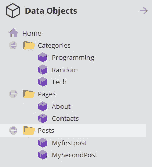

第三页

此时，您可以添加数据。在下图中，您可以看到为网页输入的内容。

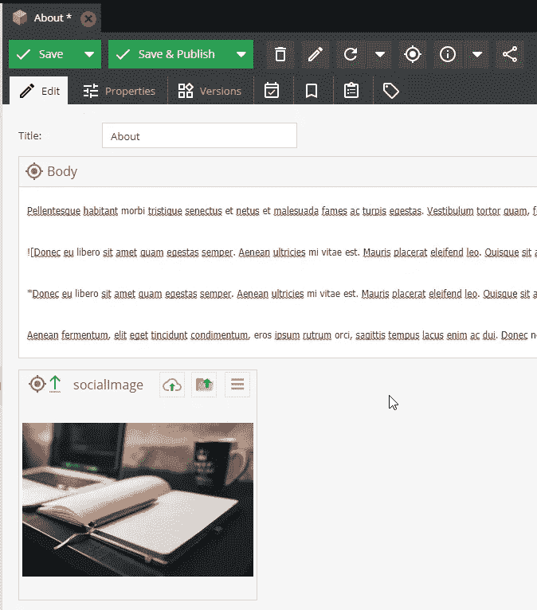

页面的数据输入

此时，我们只需要激活 DataHub 模块，该模块公开 GraphQL 中的数据，我们就设置好了。为此，第一步是安装软件包，并使用以下命令激活它:

```
composer require pimcore/data-hub
```

在这些步骤之后，您应该通过运行命令`bin\console pimcore:bundle:list:`看到类似这样的内容

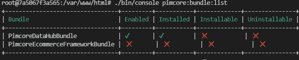

数据中心安装的输出

现在我们可以配置这个包了。第一步是通过点击`add`向模式中添加实体，如下图所示。

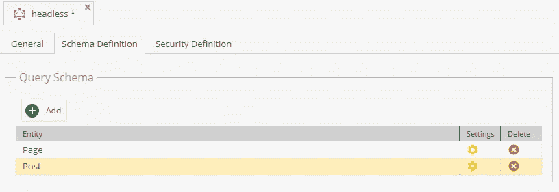

配置实体

单击齿轮图标可以打开一个弹出窗口，让您选择想要通过 API 公开的字段。下图显示了如何简单地将字段从左列拖放到右列。

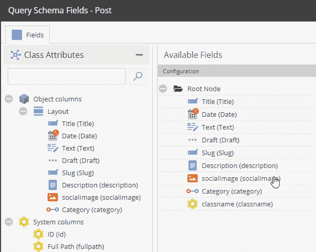

配置字段映射

最后一步是通过添加 API 键来启用端点，并允许读取所有数据，因为这是一个公共端点。

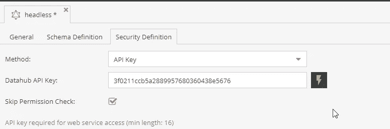

配置 API 密钥

然后，您可以导航到 Graphi 界面来测试数据，您可以看到类似于下图的内容！

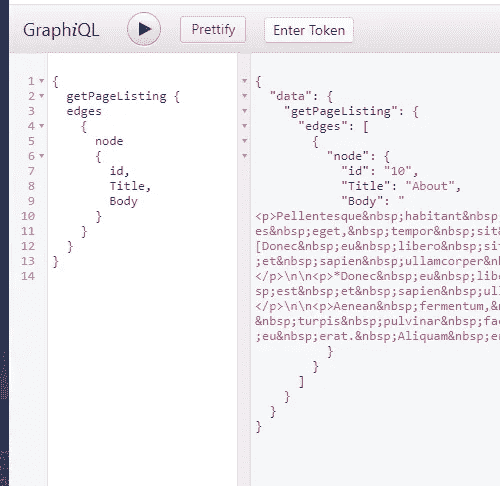

graphql 模式和一个示例查询

现在我们已经准备好了 GraphQL 和数据引擎，我们可以移动到前端部分了！直接跳到下一节！

# 连接后端和前端

我们将从我上一篇关于盖茨比的文章中使用的项目开始。因此，您可以参考原始文章来了解模板如何工作的细节。无论如何，如果你已经有了一些关于 Gatsby 或 SPA 的经验，你应该能够毫无问题地遵循下面的步骤

## 安装插件

第一步是添加 GraphQL 插件，用于从外部数据源获取数据。首先，您需要使用下面的命令安装节点插件

```
docker-compose exec dev bash #enter the dev container
npm install gatsby-source-graphql
```

然后你必须将这个插件添加到插件列表中。在我们的例子中，我们使用了内部容器的 URL(所以是`backend`而不是`localhost`)。这足以让您对我们的 Pimcore 数据库进行查询。

由于我们的行动，我们将看到 Gatsby 的 GraphQL 面板的一个额外的数据源。下图显示了输出:

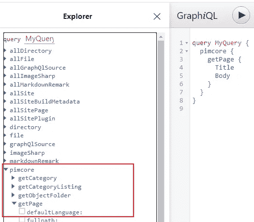

gatsby 的内部 graphql 引擎

## 更新网页目录

我们的模板是从 markdown 内容数据库中读取的。现在我们有了一个动态 CMS，我们必须用新的查询替换旧的查询。
我们要工作的第一个地方是`create-page.js`文件，文件的目录就写在这里。在下一个代码片段中，我们将看到查询和 foreach 循环，该循环遍历所有项目并生成页面。这个例子是针对 post 实体的，但是它对于所有其他实体都非常相似，所以我们将只关注这个实体。当然，在文章的最后，您会找到获得完整源代码的链接😃

在上面的代码片段中，我们可以看到对 Pimcore 数据源的查询，该查询从文章列表中选择了一些字段，然后是一个 forach 循环，为每个条目创建一个页面。通过`createPage`方法添加的所有条目都被添加到了`allSitePages`容器中，因此 feed 和 sitemap 插件可以读取这个包含所有页面的条目超集，而不管页面类型如何。

在代码片段的第二部分，我们看到我们添加了页面的 id 作为组件的参数，该组件将呈现页面，我们选择了正确的模板。此外，我们确定页面的路径。

现在我们已经准备好了页面的目录，我们必须进入模板部分！

## 更改模板部件

模板是一个文件，它在 GraphQL 上进行查询，然后使用数据进行呈现。下一个代码片段显示了`post-template.js`文件的实现。

前面的代码片段显示了主模板。底部的查询将`id`参数作为输入，这个参数与我们传递给`createPage`方法的参数完全相同。查询结果可作为组件的参数，并由组件定义中的`{data}`参数选择。组件代码非常简单，因为它只是将相关数据赋给变量，并使用模板进行渲染。

然后，下一步是对所有其他实体(类别、页面、标签)和列表页面(类别列表、页面列表等)进行同样的操作。)，顺便说一下，这些步骤相当重复，您可以查看源代码以获得任何参考。

完成这些步骤后，你就可以打开你的浏览器，输入`http://localhost:8000`，看到你的网站直播了！

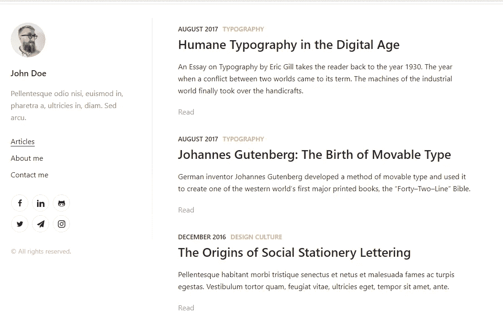

博客的输出

前面的图像显示了后端填充了与原始 Luminex 模板相同的数据的模板。现在该是总结一切，讨论我们能带回家的东西的时候了。

# 带什么回家

在本文中，我们讨论了后端和前端主题。一方面，使用 Pimcore 定义我们的数据模型和公开 GraphQL APIs 非常容易，因为我们已经从可视化界面完成了所有步骤。此外，将它附加到博客甚至更容易，因为我们只需要在源代码中添加适当的查询！

我们可以想象，多亏了盖茨比的上千个插件，我们本可以使用 WordPress、 [DatoCMS](https://medium.com/u/e6bb0b7e5834?source=post_page-----c52e7351cec2--------------------------------) 、 [Contentful](https://medium.com/u/5a131a53c7b2?source=post_page-----c52e7351cec2--------------------------------) 任何其他的无头 CMS。

我们要带回家的是，很容易实现一个网站作为一个 SPA，然后使用 Gatsby 使它成为静态的。这是许多场景的正确方法，可以提高性能，减少主机和负载的压力！

在解释过程中对一些步骤感到困惑？只需查看我之前的[关于盖茨比](/gatsby-blog-react-d5b0d3a5d83c?sk=1741acdd6e1ac165ba4ddbe0384110a4)的文章，或者发现如何用 Pimcore 创建传统博客。

# 参考

*   【Pimcore 官方文档
*   [本文中使用的优秀博客模板](https://www.gatsbyjs.com/starters/alxshelepenok/gatsby-starter-lumen)
*   [盖茨比官方文档](https://www.gatsbyjs.com/)
*   [本文的源代码](https://github.com/zeppaman/headless-gatsbyjs-pimcore)📦