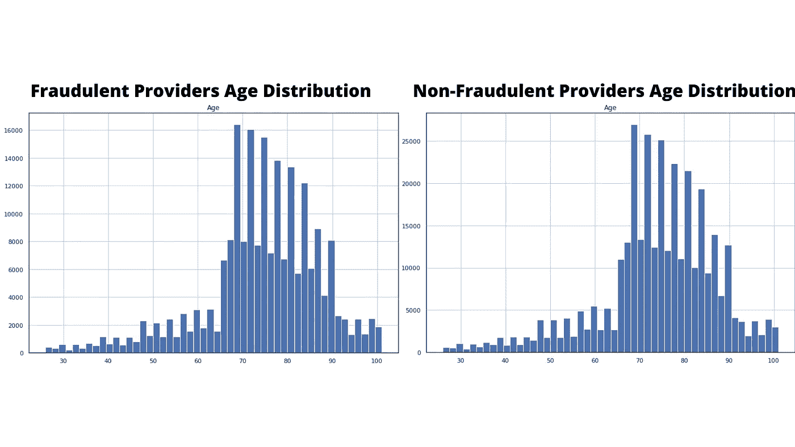
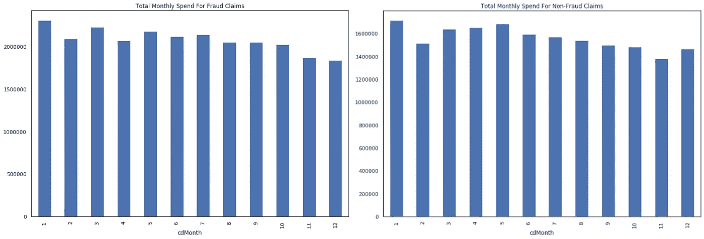
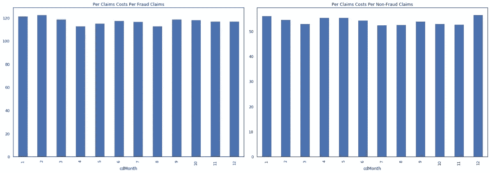
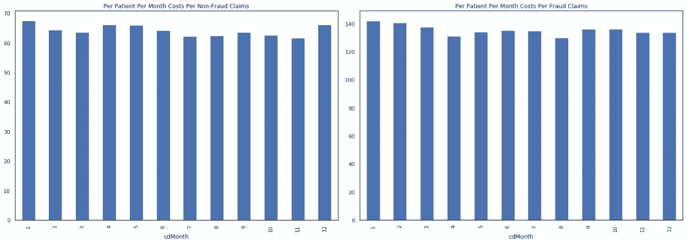
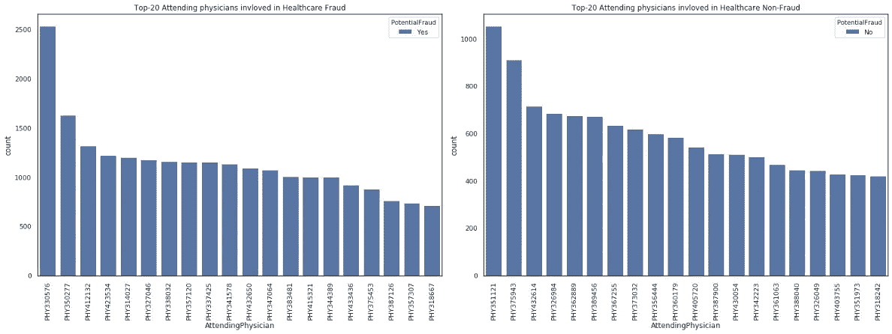
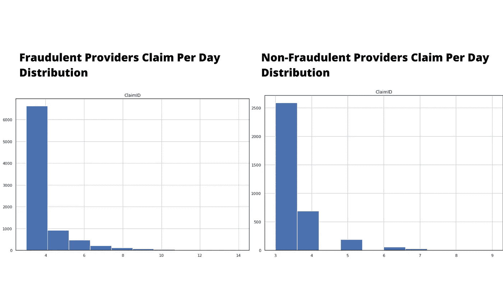

# 使用 Python 进行医疗欺诈检测

> 原文：<https://betterprogramming.pub/healthcare-fraud-detection-with-python-5a7a6738b5b2>

## 探索性数据分析的重要性

在 [Unsplash](https://unsplash.com/s/photos/healthcare?utm_source=unsplash&utm_medium=referral&utm_content=creditCopyText) 上由 [Ani Kolleshi](https://unsplash.com/@anikolleshi?utm_source=unsplash&utm_medium=referral&utm_content=creditCopyText) 拍照

今年四月，[一项 12 亿美元的医疗保险计划](https://www.nytimes.com/2019/04/09/us/billion-dollar-medicare-scam.html)利用了美国成千上万的老年人。事实上，这只是消费者和保险公司每年数十亿美元医疗欺诈成本的一小部分。

医疗欺诈可能来自许多不同的方向。有些人可能会想到假装受伤的病人，但实际上，许多欺诈是由提供者造成的(正如上面《纽约时报》的文章)。

医疗服务提供者通常会有经济激励来增加不必要的手术或声称他们从未做过的工作。这导致了许多不同类型的欺诈，很难逐个发现。

例如，来自医疗保健提供商的欺诈可能包括:

*   [向上编码](https://www.verywellhealth.com/what-is-upcoding-2615214)
*   医学上不必要的程序
*   回扣
*   提供应该由医生提供的护士和工作人员的服务

这四种欺诈方法通常是有效的，原因有几个。首先，索赔数量太多，索赔处理人员很难在支付之前发现它们。因此，这些欺诈性索赔往往会在被抓住之前得到支付。另一个很好的理由是，有时[裁决](https://www.merriam-webster.com/dictionary/adjudicate)索赔的成本可能比索赔本身的价值还要高。

这使得保险提供商很难合理地花钱创造捕捉这些不良行为的方法。

这就是为什么在投资数十万美元到你的第一个欺诈检测系统之前，你应该首先从多个方向分析你的主张，以了解欺诈可能来自哪里。

这就是探索性数据分析步骤发挥作用的地方。

# 什么是探索性数据分析？

当您第一次开始分析数据时，您的目标将是对数据集有一个很好的理解。

这被称为探索性数据分析。特别是，如果您的公司遵循 [OSEMN](https://medium.com/breathe-publication/life-of-data-data-science-is-osemn-f453e1febc10) (获取、清理、探索、建模和解释)数据科学流程，那么这就是 *E* 步骤。

使用这个过程有助于清晰地管理您的进度。

这一步的目的是熟悉数据并推动未来的分析。一般来说，这一步包括分析数据集的偏差、趋势、制作图表等。

这不是关于结构或过程，而是意味着通过一种流动状态带来可能的洞察力。

你如何接近这一步取决于你如何工作得最好。例如，我们的偏好是思考我们想要回答的关于数据集的问题，然后着手回答这些问题。

例如，在我们今天的分析中，我们将查看来自 Kaggle.com 的[医疗欺诈数据集。数据集侧重于欺诈，并提供关于哪些提供商可能有欺诈性索赔的见解。](https://www.kaggle.com/rohitrox/healthcare-provider-fraud-detection-analysis)

因此，我们的问题将基于对这些提供商欺诈案例的支持，以及为什么值得我们的业务提供商投资我们的项目。

以下是一些问题示例:

1.  年龄在索赔欺诈中起作用吗？
2.  月复一月，欺诈发生时有什么模式吗？
3.  欺诈性提供商的每次索赔比非欺诈性提供商多吗？
4.  欺诈性提供商是否比非欺诈性提供商从每个患者身上赚得更多(例如，每个会员每月，或 PMPM)

这些问题可以帮助构建和指导我们的分析，这样我们就不会花太多时间漫无目的地徘徊。

# EDA 的目的是什么？

这个 EDA 步骤的目的是为后面更深入的分析提供支持。在最近的一篇文章中，我们讨论了[敏捷数据科学](https://www.theseattledataguy.com/using-agile-methodologies-in-data-science/)的概念，与其说是一个严格的过程，不如说是一个框架。这是其中一个步骤，当您进行分析时，您可以使用图表和指标提出有趣的观点，这可能有助于推进您的业务案例。

注意:在这个例子中，为了方便使用，我们已经将所有的数据集连接在一起。你可以在这里找到[的代码。](https://www.kaggle.com/rohitrox/medical-provider-fraud-detection)

例如，在我们上面的问题中，我们希望支持这样一种观点，即值得调查欺诈性提供商。

所以让我们来看看他们是如何表现的。我们在 [SaturnCloud.io](https://www.saturncloud.io/?source=br-2) 中运行这一切，因为启动虚拟机、运行这一分析以及共享它很容易。

在第一部分，我们来看看年龄。这通常是一个很好的起点，因为这是一个您可能会在数据中看到一些模式的自然位置。

所以我们可以用熊猫里的直方图函数来分析这个。

然而，一旦我们观察它，它似乎以相当均匀的分布分解。这意味着两组数据中有一个非常相似的样本。

我们想回答的下一个问题集中在支出上。首先，我们想看看总体支出情况。最初，当分析总量时，没有什么突出的东西，如下图所示。

**欺诈索赔的每月总支出与非欺诈索赔的每月总支出**

总的来说，这几个月似乎是一致的，除了欺诈方面的每月总额似乎要高得多。所以我们想调查一下。

我们可以这样来看待这个问题。首先，我们来看看每个月的平均理赔成本。

**欺诈索赔的每次索赔成本与非欺诈索赔的每次索赔成本**

我们可以看到，每次索赔的平均成本有很大差异。在供应商可能实施欺诈的情况下，他们通常收取两倍于非欺诈供应商的费用。(需要对支持这一点的主张进行更多的分析)。

医疗保健行业使用的另一个重要指标是 PMPM。这代表每个成员每月的 T4。这是一个很好的衡量标准，可以看出一个病人每月的花费。

因此，我们不看平均索赔费用，而是看每月平均病人费用。从技术上来说，我们应该通过计算一个病人在这个月是否有有效的保险来看这个问题。

然而，由于数据集的原因，我们并没有具体的数据。因此，目前，我们使用患者 ID 的代理。它并不完美，但它是我们现在将使用的，如下面的代码所示。

**欺诈索赔的每位患者每月成本与非欺诈索赔的每位患者每月成本的对比**

看着这个，你会注意到一个可能有欺诈性索赔的保险公司对每个病人的收费也是非欺诈性保险公司的两倍。

现在，为什么我们在进入模型开发之前做这个探索性的分析很重要呢？

原因是，这提供了一个坚实的商业案例，向你的利益相关者推销你为什么愿意进一步投资这个项目。

你已经有了一个能引起任何商业伙伴兴趣的商业理由。根据每月支出图表，如果您能够打击这种保险欺诈，您的提供商每月可以节省 750，000 美元，一年可以节省数百万美元。

此外，您已经看到了欺诈提供商的一些倾向。

但是你还不能停止分析数据。

# 总是获得更多支持

现在，作为一名数据科学家或分析师，您将需要进一步的支持证据来继续这条道路。

这意味着从这些数据中引入其他角度，进一步支持保险公司的成本远远超过所需的观点。

这里有几种方法可以做到这一点。

让我们首先来看看每位医生一年中的索赔总数。让我们来看看细分是什么样子的，比较欺诈和非欺诈索赔。

**卷入医疗欺诈的前 20 名主治医师与未卷入医疗欺诈的前 20 名主治医师的对比**

您将会注意到，在可能存在欺诈的情况下，医生向提供者提出的索赔数量与我们的非欺诈医生之间存在巨大差异。

此外，医生 PHY330576 似乎比他在欺诈提供商的同行做了更多的索赔。这值得深入研究。

这位医生提供如此多的索赔可能有商业原因。也许他们处理的程序非常小而且容易做，这可能只是一个混淆因素。

再说一次，很难说。但是，这进一步支持了欺诈性提供商正在提供或声称提供不需要的额外服务的想法。

让我们从另一个角度最后看一下这个问题。

让我们试着分析一名医生每天提供的平均索赔数量，而不是按月细分。如果我们根据提供商是否欺诈来分析医生每天的索赔数量，我们会发现什么？

从这两个图表中，我们可以看到，与非欺诈提供商相比，欺诈提供商的索赔数量要大得多，每天超过三起或更多。

此外，当您进一步调查时，您会发现欺诈性提供商在一天内有 15%的索赔具有三个或更多索赔 id，而非欺诈性提供商只有 3%。

如您所见，欺诈性提供商每天的索赔额要高得多。

这是非常可疑的，也是开始分析数据的好地方。

从这里开始，作为分析师，您的目标将是分析每天有三个或更多索赔的索赔类型。这可能会给你一个行为模式。

然而，我们现在将停止我们的分析。

在我们继续之前，我们想指出一个在我们的分析过程中帮助我们的漂亮特性。 [SaturnCloud.io](https://www.saturncloud.io/?source=br-2) 自动与 Git 集成。这意味着，当您在回答这些不同的问题时，如果您不小心更改了代码中的某些内容，并且不记得是什么，那么您可以很容易地回滚。这很方便，因为你甚至看不到我们开发的所有图表。

因此，能够回滚并查看是否有更有意义的代码片段是非常有帮助的！

# 探索性分析可以节省时间，增加认同

在对 Kaggle 的最初分析中，他们试图在没有真正找到目标人群的情况下立即开发一个模型。

这里我们有一个可能的目标人群(每天提供三个或更多索赔的医生)。这将在与利益相关者的会议上再次提出。但这说明了 EDA 为什么重要。

这并不总是直接进入模型。有时，这是关于首先发展坚实的支持，成为可能值得关注的人群。

在这种情况下，每天分析三个或更多的索赔是有价值的，因为这似乎是一个因素。

从这里你会想知道在这些病例中包括什么程序或诊断，因为这可能会进一步提供正在发生的事情的信息。

我们真的希望这给了你有价值的见解，为什么 EDA 是重要的。它帮助您更好地理解数据，同时为您的业务合作伙伴提供支持。