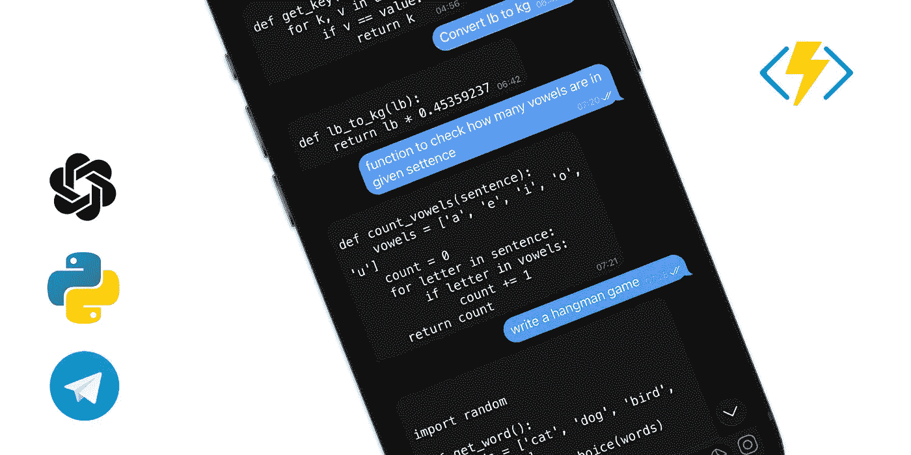
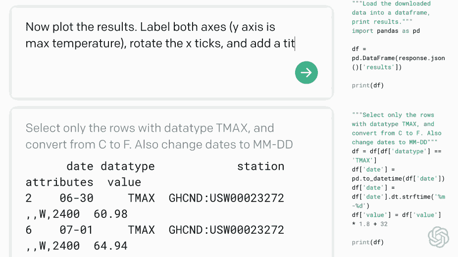
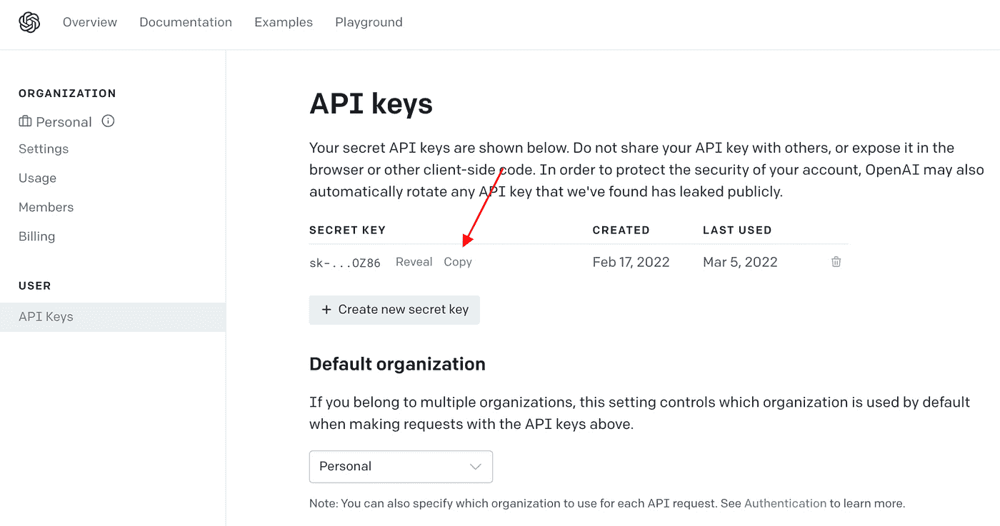
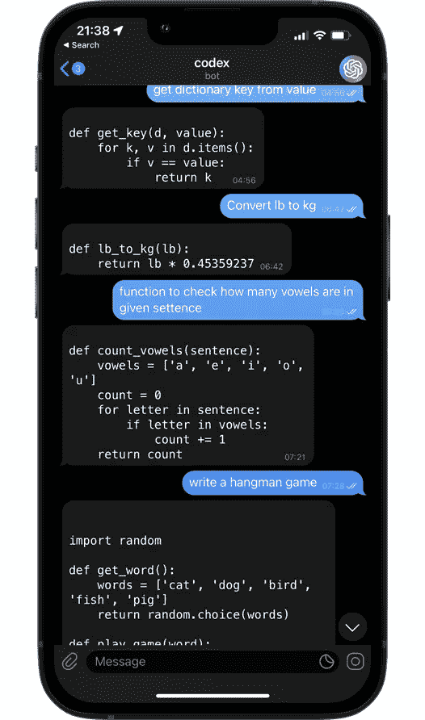

# 你好抄本:建立一个开放的电报机器人

> 原文：<https://betterprogramming.pub/hello-codex-openai-gpt-3-telegram-bot-362d93ea6959>

## 循序渐进的 Python 教程



厌倦了等待 Github 副驾驶的邀请，我决定自己动手。

OpenAI 的 Codex 是一个 GPT 3 发电站，将简单的英语转换成可运行的代码。它还可以完成许多其他与代码相关的任务，比如将代码从一种语言翻译成另一种语言，生成文档字符串，以及解释已经编写好的代码。



以下是创建你自己的密码电报机器人的步骤。

> **先决条件:**要访问 Codex API，你需要获得 OpenAI 的邀请。这是免费的，大约一周后我得到了批准。在这里加入等候名单[。](https://openai.com/blog/openai-codex/)

如果你还没有这样做，请[下载](https://telegram.org/) Telegram，他们还提供了一个很棒的桌面应用程序。

**请求一个机器人** 这个，你跟[机器人爸爸](https://t.me/botfather)说。他是你所有机器人方面的专家，从创造到设置等等。

键入`/newbot`开始。
机器人父亲会让你选择一个机器人名称(必须是唯一的)和一个用户名，然后它会为你的新机器人生成一个认证令牌。

**Codex Key**
接下来，继续从 OpenAI 中获取您的 [API key](https://beta.openai.com/account/api-keys) 。

[](https://beta.openai.com/account/api-keys)

记下你刚拿到的两把钥匙，我们很快就会用到它们。

提示:处理跨环境的秘密可能会很麻烦。多普勒公司(T21)的人提供了一个很棒的(免费)产品来处理这一切。

**Python 代码** 启动你最喜欢的编辑器(对我来说是 [VS 代码](https://code.visualstudio.com/download))，让我们来点乐子吧！

首先，我们 pip 安装以下两个库:

```
pip install openai
pip install pyTelegramBotAPI
```

像这样开始:

使用 API 时，启用日志记录总是一个好主意。最终，我们会希望在某个地方举办这个活动，这样我们记录的越多，我们就越不会被蒙在鼓里。

> 注意我是如何从 os 导入 environ 的。使用 env['BOT_API_KEY']比 os.environ 更漂亮/简洁。

现在，让我们建立我们闪亮的新机器人和法典之间的公报。

上面，我们首先建立了 bot 的装饰器，将我们的消息传递给它下面的函数。

在第 7 行，我们将`max_tokens`设置为`1200`,这是因为虽然 Codex 允许每个调用最多 4096 个令牌(包括您的提示),但电报机器人每条消息最多 4096 个 UTF 8 字符。一个令牌大约相当于 4 个字符。

了解更多关于各种`openai.Completion.create`参数[这里](https://beta.openai.com/docs/api-reference/completions/create)，他们的文档很牛逼。

在第 14 行中，我们利用了 Telegram 提供强大的降价支持的事实，因此代码显示得很好，并且还允许点击复制。

最后，`bot.infinity_polling()`对新来的消息保持开放的耳朵。

> 电报机器人还可以做很多其他很酷的事情，pyTelegramBotAPI 在[中详细介绍了这些事情。](https://github.com/eternnoir/pyTelegramBotAPI)

在运行脚本之前，在当前目录下创建一个`.env`文件(注意前面的点),如下所示:

```
BOT_API_KEY = bot-key-here
OPENAI_API_KEY = openai-key-here
```

您的完整脚本应该是这样的:

恭喜你。你现在有你自己的法典总是在你的指尖。



为了让你的机器人总是可访问的，你需要把它托管在云中。不管是 AWS 还是 Heroku，跟自己喜欢的走；请记住`bot.infinity_polling()`需要一个服务器设置(即 Flask)来正确运行。为了避免持续的计算时间，我们可以设置一个 webhook 来代替轮询。在下一篇文章中，我将向你展示作为一个 Azure Function 应用程序我是如何做到这一点的。

喜欢这篇文章吗？来吧，为它鼓掌…👏