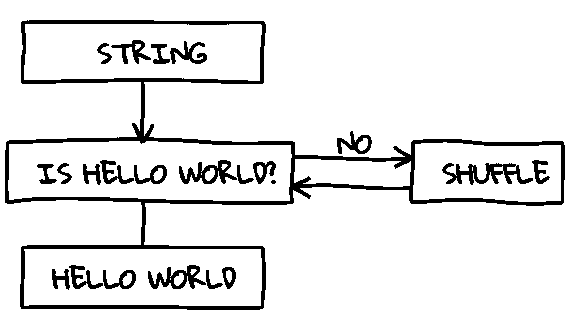
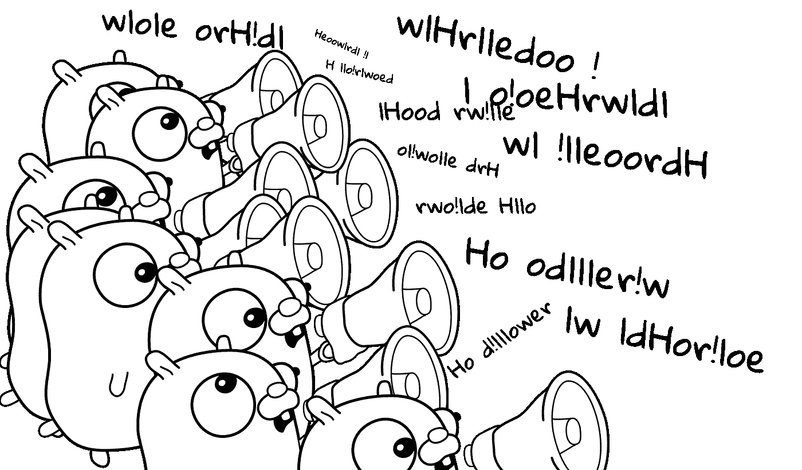
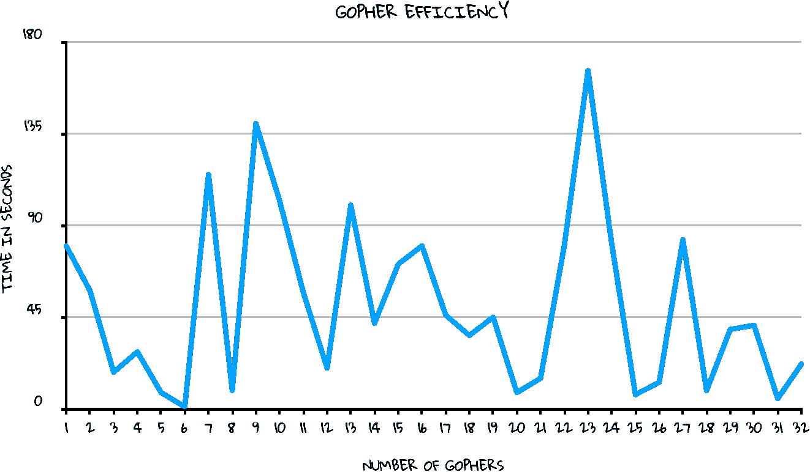

# 你好，去吧

> 原文：<https://betterprogramming.pub/hello-go-6721933be560>

## 异想天开的围棋入门


我喜欢上了 Go，主要原因是它是一种简单的语言。但是这让你，开发者，变聪明的选择更少了。如果你必须聪明地编写一个程序，你就必须加倍聪明地维护和调试它。

因此，为了展示围棋的美丽和简单，我们将演练一个经典的小“你好，世界！”程序。

# 打招呼

有很多方法可以得到包含“Hello，world！”最好是在无服务器架构上包括区块链和神经网络，以获得最大宣传因素，但这样做完全是矫枉过正——更不用说像打印到标准输出这样简单的事情也会超出预算。

相反，我们将对输入字符串进行排列排序，直到得到所需的输出“Hello，world！”



在 Go 中实现这一点相当简单。

我们将从目标字符串中取出一部分，将其转换成符文，并使用`rand.Shuffle` 对其进行洗牌，直到它与目标字符串匹配。

```
**package** main**import** (
 *"fmt"
  "math/rand"*
)**func** main() {
  t := *"Hello World!"*
  s := []**rune**(t)

  **for** {
    rand.Shuffle(len(s), **func**(i int, j int) {
      s[i], s[j] = s[j], s[i]
    }) **if** **string**(s) == t {
      **break** }
  } fmt.Println(string(s))
}
```

我们将使用`go run hello.go`来运行这个。

太棒了。我们得到了最小高效的“你好，世界”程序。

# 跟踪进度

我们已经完成了基本的工作，但是最好有一些进度日志，包括排列计数和值。所以我们来补充一下。

```
**package** main**import** (
  *"fmt"
  "math/rand"*
)**func** main() {
  t := *"Hello World!"*
  s := []**rune**(t) **for** {
    rand.Shuffle(len(s), **func**(i int, j int) {
      s[i], s[j] = s[j], s[i]
    }) fmt.Println(string(s)) **if** **string**(s) == t {
      **break**
    }
  }
}
```

我们将用`go build hello.go`建造这个。

太好了！我们有输出。

至于添加置换计数，没有必要将这种开销包含到我们的可执行文件中，因为我们可以将它放入一个外部命令中，比如`cat(1)`、*、*，其中有一个行号选项*。*

```
**$** hello | cat -n
```

使用默认种子，我们需要 38，528，967 次迭代才能到达“Hello，world！”排列。

**注意**:如果你使用的是微软的 Windows 操作系统，没有类似 UNIX 的环境，此时此刻你可能要重新评估你的人生选择。现在甚至还有 Windows/Unix。

# 许多比一个多

考虑到我们的程序需要做什么，它的计算速度已经相当快了。垃圾收集器也没有让我们陷入太多的困境，尽管我们在不断地创建新的字符串。

我们仍然可以通过并行生成字符串来加快速度。反过来，这将使 Go 能够调度我们的计算在可能的情况下跨多个硬件线程并行运行。

Go 的并发模型基于自包含的协程，它们通过通道传递消息进行通信，这通常用 Gophers 作为比喻来描述。

所以我们要做的是强迫一群可爱的小地鼠做所有的工作，试图猜测并通过频道向我们喊出正确的排列，而我们只是坐在主要区域决定它是正确还是错误的答案。



我们的大部分实现将保持不变。

我们将把置换重组提取到一个函数中，该函数向我们的通道发送消息。在我们的 main 函数中，我们迭代消息，测试它们与目标字符串的等价性。

```
**package** main**import** (
  *"fmt"
*  *"math/rand"*
)**func** main() {
  t := *"Hello world!"*
  c := **make**(**chan** **string**) **for** i := 0; i < 32; i++ {
    **go** gopher(t, c)
  } **for** s := **range** c {
    fmt.Println(s) **if** s == t {
      **break**
    }
  }
}**func** gopher(t **string**, c **chan** **string**) {
  s := []**rune**(t) **for** {
    rand.Shuffle(**len**(s), **func**(i, j **int**) {
      s[i], s[j] = s[j], s[i]
    }) c <- **string**(s)
  }
}
```

成功！我们让地鼠同时一起工作。

# 一群人有多少？

我们从中获得了什么样的性能提升？我们实际上降低了性能。

越多并不总是越好，事实证明，本课没有最初计划的[螺纹开膛手](https://amzn.to/2r7RyCr)的预算。因此，让 32 个地鼠在四个线程上工作意味着它们可能需要在指定的队列中等待，然后才能被允许工作。

那么到底多少才算太多呢？传统观点认为每个硬件线程一个，但只有一种方法可以找到答案，那就是测量它。

我们将用 time(1)来度量程序完成所需的时钟时间。



不错！我们有明确的数据:六只无疑是地鼠的最佳数量。

# 结论

地鼠可以很好地执行猴子排序——算法是种间兼容的！

这就是对 Go 并发性的古怪看法。如果你不喜欢围棋，你应该喜欢。如果你想以不涉及排列排序和豆袋插图等可怕算法的方式学习围棋，我建议试试“[的围棋编程语言](https://amzn.to/2HN2Ovj)。