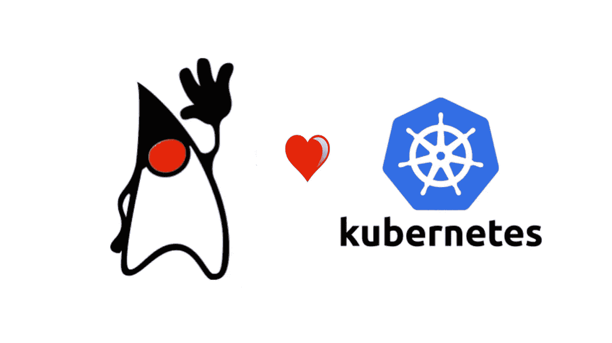

# 你好，库伯内特·Spring Boot

> 原文：<https://betterprogramming.pub/hello-kubernetes-spring-boot-a20e47d57872>

## 让我们构建一个最简单的 Java Spring Boot 应用程序，它作为一个 pod 在 Kubernetes 集群中运行



图片来源:[桑德罗·贾科莫齐](https://dev.to/sandrogiacom)

# 项目的结构:

```
├── Dockerfile
├── build.gradle
├── gradle
│   └── wrapper
│       ├── gradle-wrapper.jar
│       └── gradle-wrapper.properties
├── gradlew
├── k8s
│   └── depl.yaml
├── settings.gradle
└── src
    └── main
        └── java
            └── hello
                ├── App.java
                └── HelloWorldCtrl.java
```

我们的`App.java`是应用程序的入口点:

上面的代码包含创建 Spring Boot 应用程序所需的最少几行代码。

`HelloWorldCtrl.java`包含一个简单的控制器，它映射根路径`(“/”)`并返回一个问候字符串:

# 构建应用程序

我使用 Gradle 作为我的构建工具。`build.gradle`文件也是最小的，由以下几行组成:

```
plugins {
    id 'org.springframework.boot' version '2.3.3.RELEASE'
    id 'io.spring.dependency-management' version '1.0.8.RELEASE'
    id 'java'
}

group = 'com.test'
version = '0.0.1-SNAPSHOT'
sourceCompatibility = '1.8'

repositories {
    mavenCentral()
}

dependencies {
    implementation 'org.springframework.boot:spring-boot-starter-web'
}
```

# 创建 K8s 资源

为了创建 K8s 部署，我们需要一个 Docker 映像。让我们在我们的`Dockerfile`中添加以下几行:

我们 Docker 文件中的步骤:

*   将项目复制到`/app`
*   使用 Gradle 构建项目
*   使用上一步的结果运行应用程序

我们现在可以构建映像并推送到中心:

```
docker build -t marounbassam/hello-spring .
docker push marounbassam/hello-spring
```

K8s 部署很简单。它由[部署](https://kubernetes.io/docs/concepts/workloads/controllers/deployment/)和[服务](https://kubernetes.io/docs/concepts/services-networking/service/)组成:

部署定义了 pod 的两个副本，这两个副本将运行从 image 属性中指定的映像构建的容器。

服务的类型是`ClusterIP`(默认的 Kubernetes 服务)。它在我们的集群中为我们提供了一项服务，其他应用也可以访问这项服务。

在集群中创建资源:

```
kubectl create -f <yaml_file>
```

资源可以按如下方式可视化:

```
+---------------------+
| hello-world-service |
|                     |
|    10.15.242.210    |
+---------O-----------+
          |
          +-------------O--------------------------O
                        |                          |
              +---------O-----------+    +---------O-----------+
              |        pod 1        |    |        pod 2        |
              |                     |    |                     |
              |     hello-world     |    |     hello-world     |
              +---------------------+    +---------------------+
```

# 在集群内部

```
$ kubectl get pods
NAME                         READY     STATUS    RESTARTS   AGE
hello-world-5bb87c95-6h4kh   1/1       Running   0          7h
hello-world-5bb87c95-bz64v   1/1       Running   0          7h
$ kubectl get svc
NAME                  TYPE        CLUSTER-IP      EXTERNAL-IP   PORT(S)    AGE
hello-world-service   ClusterIP   10.15.242.210   <none>        8080/TCP   5s
kubernetes            ClusterIP   10.15.240.1     <none>        443/TCP    7h
$ kubectl exec -it hello-world-5bb87c95-6h4kh bash
$ (inside the pod) curl 10.15.242.210:8080
$ (inside the pod) Greetings from Spring Boot!
```

我们可以看到服务器已经启动，正在 pod 内部运行。根据您的云提供商，您可以设置类型为`LoadBalancer`的服务，并从集群外部访问应用程序。

# 结论

我们创建了一个简单的 Spring Boot 应用程序，将其包装在 Docker 容器中，并在 K8s pod 中使用该容器，该 pod 由 K8s 部署进行编排，并通过服务公开。

该服务为两个创建的 pod 提供了一个简单的负载平衡器，并且可以根据应用程序需求轻松扩展。