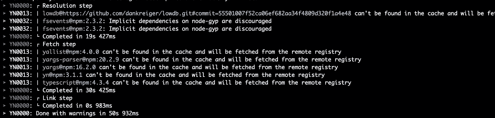

# 你好纱 2，再见 Node_modules。

> 原文：<https://betterprogramming.pub/hello-yarn-2-goodbye-node-modules-21d97afc1a75>

## 有什么新鲜事(也是 JS 历史上最不痛苦的告别)


奥斯曼·拉纳在 [Unsplash](https://unsplash.com?utm_source=medium&utm_medium=referral) 上拍摄的照片

三年多前的 2017 年， [Yarn 1.0 在脸书工程博客](https://engineering.fb.com/2017/09/07/web/announcing-yarn-1-0/)正式公布。到那时，仅仅在它第一次发布 11 个月后，已经有超过 175，000 个存储库开始使用新的包管理器。

尽管 Yarn 的成功故事一直持续至今，但该工具也成为许多经典包处理弱点的受害者，如速度慢、复杂性增加和数据占用。

Yarn 2 带来了一些基本的变化，这些变化不仅解决了这些问题，还改善了您的整体工作流程。


再也看不到任何这样的迷因将是关于 Yarn 2 最悲伤的部分。([来自 Reddit](https://www.reddit.com/r/ProgrammerHumor/comments/6s0wov/heaviest_objects_in_the_universe/) )

# Yarn 2 有什么新内容？

新版本已经于去年 1 月发布(也就是 2020 年)，然而，大多数大型项目和库花了很长时间来适应新的即插即用方式。

虽然一些大公司仍在努力实现兼容性(截至撰写本文时:Angular、React Native 和 Flow)，但现在是在您的代码库中尝试它的好机会。

即插即用支持并不是 Yarn 2 带来的唯一重大变化(这个概念本身甚至不是那么新，可以追溯到 2018 年 9 月)，更新实际上提供了许多伟大的功能，使生活变得更加简单。

Yarn 的维护者在这些改进上倾注了整整一年的时间，你可以肯定地感觉到 Yarn 2 是一款经过深思熟虑的产品。

# 实际可调试 CLI 输出

它从 CLI 输出开始，现在这个输出更加结构化了。虽然纱线控制台文本以前充其量是一个具有挑战性的视觉狂野西部，但格式和颜色现在有助于大大提高可读性。



Yarn 的 CLI 输出不再是杂乱无章的文本墙。

最重要的是，每一行都有自己的错误代码，因此调试起来容易多了。所以是时候给这个列表添加书签了。

# 不仅仅是 node_modules

当然，将 Yarn 2 简化为一个可怕的文件夹的完全废弃不会公正地对待这个版本。但是，嘿——它不见了。这是一个重要的里程碑。

新版本大大减少了文件 I/O 的数量，从而在安装过程中节省了大量时间。

Yarn 现在在一个单独的`pnp.js`文件中保存了一个地图，这个文件跟踪包的引用，一旦你运行你的代码，它将确保 node 知道正确的位置。

不过，那些下载的软件包需要放到你磁盘上的某个地方*。这就是新的`.yarn`文件夹的用途。*

*当 node_modules 最终消失时。*

*从现在开始，这个位置就是您的那些依赖项被缓存的地方，但是——我建议在您自己的项目中测量它——占用的内存要少得多。*

# *纱线 dlx*

*在这之前，直接运行一个远程的非安装包是你必须利用 npm 的`npx`来完成的事情。现在 Yarn 终于发布了自己的命令。*

*使用 Yarn 2，您可以使用`yarn dlx`在临时环境中执行一个包，而不必先安装它。*

# *补丁协议*

*在本地修补依赖关系现在变得容易多了。您可以指示 Yarn 将一个包提取到一个临时文件夹中，然后在完成后生成一个包含 diff 的文件:*

```
*yarn patch node-fetch
yarn patch-commit /private/var/patchfolder > mypatch.patch*
```

*因为补丁目录从来不会被直接使用，所以很少有空间会把事情弄糟。今后，您将仅参考您的补丁文件:*

```
*{
  "dependencies": {
    "node-fetch": "patch:node-fetch@2.6.1#./mypatch.patch"
  }
}*
```

*这甚至适用于间接(传递性)依赖，使其成为在官方补丁发布之前修补安全问题的一个很好的特性！*

*更多文档可以在[这里](https://github.com/yarnpkg/berry/tree/master/packages/plugin-patch)和[这里](https://yarnpkg.com/features/protocols#patch)找到。*

# *发布工作流*

*如果您在一个多工作空间设置中工作(例如像 monorepo ),那么在您的树中发布并随后升级所有消耗的包可能会成为一项乏味的工作。*

*理想情况下，您发布一个工作区的新版本，所有的依赖项都会随着新版本自动更新。*

*这正是[版本插件](https://github.com/yarnpkg/berry/tree/master/packages/plugin-version)为你做的。它开启了新的[发布工作流程](https://next.yarnpkg.com/features/release-workflow)消除了必须弄清楚升级什么和在哪里升级的痛苦。*

# *别等了。立即开始迁移。*

*根据您的包的复杂性，迁移到新版本的 Yarn(又名 modern 或 berry)可能需要一段时间，但这是值得的。*

*如果你需要更多好的理由:确保你查看了这个列表。*

*如果你已经相信了:看一看迁移指南。*

*这次更新对每个人都有好处:你。你的团队。还有你的硬盘。*

**嗨，我是弗里德里希！我在工作中是一名经理和开发人员，在家里是一名业余爱好者——厨师、音乐家、数据和语言爱好者。你可以在* [*LinkedIn*](https://bit.ly/3m0DXaT) *上找到我。**