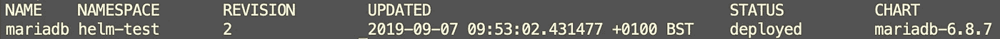
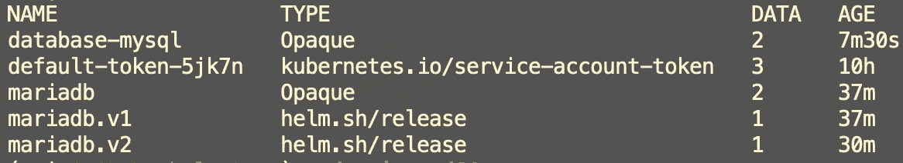

# 头盔 3:新测试版的乐趣

> 原文：<https://betterprogramming.pub/helm-3-fun-with-the-new-beta-8f91c70891ff>

## 更干净、更简单、更安全，拥有您喜爱的先前功能

一名 Kubernetes 训练师首先把我的注意力带到了[头盔 3](https://github.com/helm/community/blob/master/helm-v3/000-helm-v3.md) 。当时，人们对此知之甚少。以下是我所看到的:

*   不再有[舵柄](https://github.com/helm/helm/tree/master/cmd/tiller)
*   Lua 模板将和 Go 模板一起被引入

我承认，当我看到 Lua 模板的样子时，我并不高兴。它似乎离我们试图模仿的最初的 [YAML](https://yaml.org/) 更远了。至少在第一种情况下，Go 模板仍然会得到支持，这让我们松了一口气。

# 但是现在，Helm 3 Beta 出来了！

而且比原来的目标瘦了一点。我将首先关注我们需要理解的东西，然后我将讨论丢失 Lua 模板的奇怪情况。

## 舵柄坏了

是的，他们兑现了承诺。Tiller 带来了一些严重的安全风险，并使 Helm 的安装复杂化。因此，现在一切都发生在客户端。使用客户端凭据直接从客户端计算机运行安装。这意味着您的集群中不需要上帝级别的服务帐户。

这影响了功能。举个例子，从舵 2 发出的`helm list`命令。输出如下所示:

在头盔 3 中，柱子有些变化。应用版本不再列出，名称空间显示在名称旁边:

他们为什么移动名称空间列，应用程序版本发生了什么变化？

## App 版本很简单

它还在那里。只需运行`helm history <my release>`就可以看到合适的应用程序版本。

## 名称空间现在更重要了

最初，针对 Tiller 存储一个释放。如果您有一个 Tiller 实例在运行，这意味着一个发布名称在集群中是惟一的。`mariadb`只是指`mariadb`的一个版本，而不是另一个版本。

在头盔 3 中，随着舵杆的移除，这个功能已经消失了。相反，版本作为`Secret`资源存储在安装版本的名称空间中。您可以通过在您的发布名称空间中运行`kubectl get secret`来查看这一点。您会看到类似这样的内容:

如果你拔出`mariadb.v1`的 YAML，你会看到一大块加密数据。这是版本`v1`的完整版本。这大大简化了 Helm 的功能。它不执行不同的计算，而是简单地取出这个`secret`，解密它并应用配置。

## 那么这对我的应用程序意味着什么呢？

除非你对 Helm 做了什么特别奇怪的事情，否则这个改动应该不会带来太大的麻烦(抱歉)。唯一一次你会进入波涛汹涌的水域(再次抱歉)是如果你偏离了路线(我停不下来)并且滥用了工具。保持真实，乘风破浪(哦，男孩)。

## 回滚和原子发布仍然有效吗？

是的，他们有。头盔 2 上的所有旗帜都在。早期出现的一个主要问题是如何保留分蘖组件的所有优点。碰巧的是，他们干得非常出色。

## 图表不需要再有创意了

头盔 3 带来了一个全新的功能，[图书馆图表](https://helm.sh/blog/helm-3-preview-pt6/)。这些图表本身不需要声明任何资源。他们可以简单地定义模板供你的其他舵图使用。

这为存储关于您的应用程序的公共信息创造了一个很好的地方，而不需要在多个舵图表之间复制它。

# 那么我们应该注意什么样的事情呢？

我订阅了一些[头盔库](https://github.com/helm):

*   有一个[打开的拉取请求](https://github.com/helm/helm/pull/5582)，用于包含从 Helm 2 到 Helm 3 的迁移文档。我很感兴趣地关注着。
*   [所有问题](https://github.com/helm/helm/issues?utf8=%E2%9C%93&q=is%3Aissue+is%3Aopen+helm3)都与掌舵 3 有关。核心维护者很有帮助地将所有的问题都添加到前缀中，这样我们就可以很容易地跟踪它们。

## 但是 Lua 模板呢？

别担心，我没忘记。我做了一些调查，发现了以下关于 Github 问题的回复:

> …目前的计划是确保我们在 Go SDK 中打下基础，允许在 3.0 之后添加 Lua 库 API。只要我们能够在没有任何兼容性破坏的情况下为 3.0 之后添加这一功能打下基础，那么这似乎是我们可以做的事情。— bacongobbler

因此，在未来的某个时候，我们仍然要处理 Lua 模板(不管是好是坏，我会抑制我的悲观情绪)，但是它们已经从最初的 3.0 版本中被删除了。

# 结论

就我目前所见，可以肯定地说我很兴奋，印象深刻。看起来赫尔姆的人们真的带来了他们的 A 级比赛。头盔 3 更干净，更简单，更安全，同时保持了许多我们在以前版本中喜欢的功能。大家干得好！