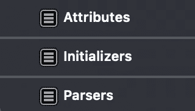
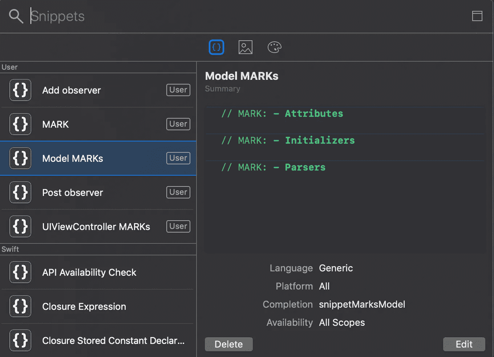
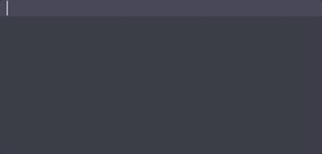

# 有用的 iOS 和 Xcode 代码片段

> 原文：<https://betterprogramming.pub/helpful-code-snippets-for-ios-21aa5ef894de>

## 组织您的代码并创建新的代码段以在您的代码库中使用

[丘特尔斯纳普](https://unsplash.com/@chuttersnap?utm_source=unsplash&utm_medium=referral&utm_content=creditCopyText)在 [Unsplash](https://unsplash.com/?utm_source=unsplash&utm_medium=referral&utm_content=creditCopyText) 上拍照

编写干净易读的代码总是很重要，但是组织好代码也很重要。

在 iOS 开发中，在文件中分隔代码的最佳方式是使用标记，而不是每次都写这些标记，您可以只使用如下代码片段:

UIViewController 标记代码段

这段代码片段展示了将`UIViewController`分成几个部分的方法。根据您的架构，可能需要不同的标记。这个片段是一个简单的 MVC 架构。

模型中可能会用到另一个有用的代码片段:

模型标记代码片段

注意破折号(`// MARK: -`)在跳转栏的标记之间添加了一条漂亮的分隔线。在 Xcode 11 上，你可以在小地图视图中看到同样的分离。

标记的跳转栏视图

# 标记代码片段的好处

*   文件间的一致性。
*   项目间的一致性。
*   开发者的共享标记。
*   代码的组织。
*   开发者表现。

# 创建您自己的代码片段

任何代码都可以是代码片段，不仅仅是标记。实际上，每个好处都适用于每个代码片段。

如果你想在 Xcode 中创建新的代码片段，你只需要选择一部分代码，右击它，选择选项*创建代码片段*。然后，您可以通过按`cmd` + `shift` + `L`进行编辑和删除。

Xcode 11 UI 用于查看、编辑和删除代码片段

## 如何使用它们

有两种方法:

*   按`cmd` + `shift` + `L`查看您所有代码片段的列表，然后选择一个。
*   (推荐)在创建代码片段时分配一个*完成*，然后只需在代码中键入它，就会弹出添加它的选项。提示:在所有代码片段的开头添加一个关键字，然后只需输入这个词就可以访问所有代码片段。

# 与您的团队分享

打开`~/Library/Developer/Xcode/UserData/CodeSnippets`并发送你所有的`.codesnippet`文件，或者将它们添加到一个 [GitHub repo](https://github.com/mjurfest/ios-xcode-snippets) 中。

将文件添加到文件夹后(如果文件夹不存在，请创建它)，重新启动 Xcode，并开始在所有项目中使用片段。

# 可用的代码片段

在创建您自己的代码片段集合之前，请在这个 [GitHub repo](https://github.com/mjurfest/ios-xcode-snippets) 中查看我的。欢迎你投稿。

 [## mjurfest/ios-xcode-snippets

### 此时您不能执行该操作。您已使用另一个标签页或窗口登录。您已在另一个选项卡中注销，或者…

github.com](https://github.com/mjurfest/ios-xcode-snippets)