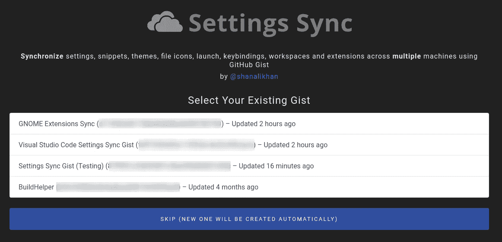
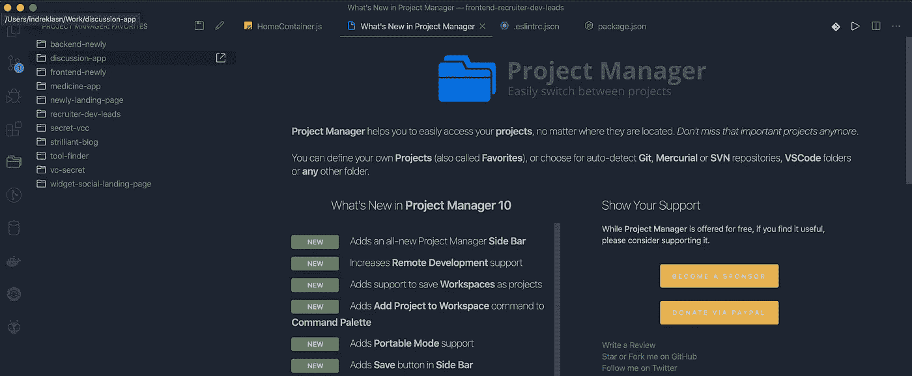
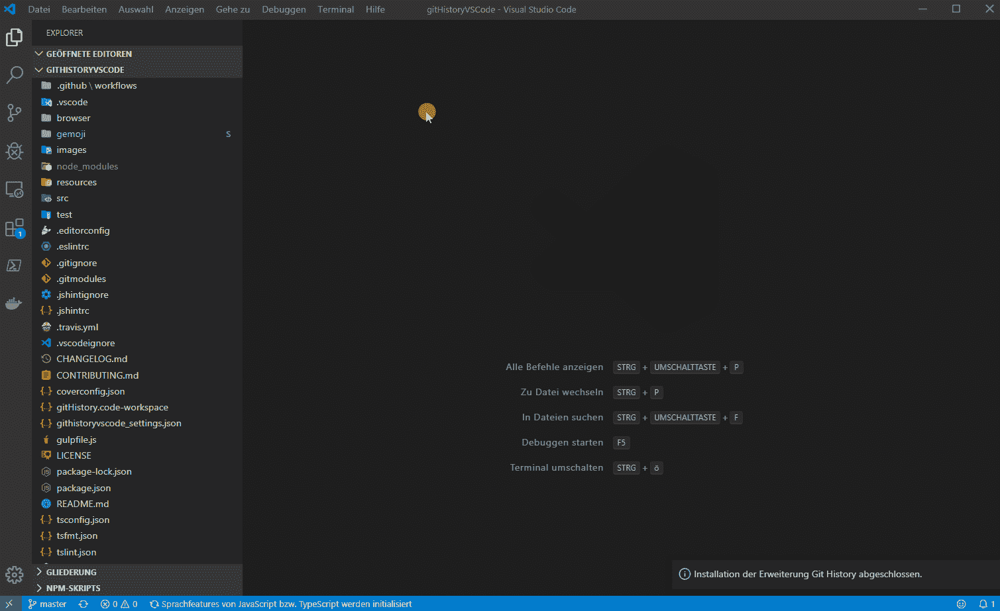
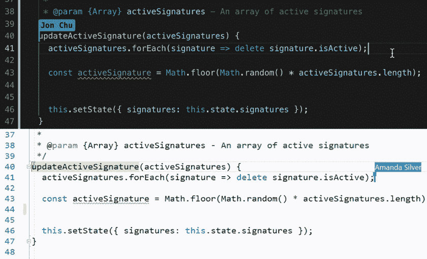

# 以下是 10 个有用的 Visual Studio 代码扩展

> 原文：<https://betterprogramming.pub/here-are-10-useful-visual-studio-extensions-3caeb250d8ed>

## 用这些扩展让你的 VS 代码更好

由 [Unsplash](https://unsplash.com?utm_source=medium&utm_medium=referral) 上的[émile Perron](https://unsplash.com/@emilep?utm_source=medium&utm_medium=referral)拍摄的照片

VS 代码允许开发者安装有用的包，让我们更有效率。已经有一堆有用的开源包，所以我在列表中收集了一些我最喜欢的。

如果你对设计你的 VS 代码感兴趣，[这里有八个很棒的主题，你可以从今天开始使用](https://medium.com/better-programming/here-are-8-awesome-themes-for-visual-studio-code-1bd173f8b10d)。

事不宜迟，这里有八个有用的 VS 代码扩展，你可以从今天开始使用，提高你的工作效率。

# 设置同步

使用 GitHub gists 在多台机器上同步设置、代码片段、主题、文件图标、启动、按键绑定、工作区和扩展。

[设置同步](https://marketplace.visualstudio.com/items?itemName=Shan.code-settings-sync)

# 进口成本

这个扩展将在编辑器中以内联方式显示导入包的大小。该扩展利用 webpack 和 Babili Webpack 插件来检测导入的大小。

[进口成本](https://marketplace.visualstudio.com/items?itemName=wix.vscode-import-cost)

# 文件实用程序

创建、复制、移动、重命名和删除文件和目录的便捷方式。

[文件工具](https://marketplace.visualstudio.com/items?itemName=sleistner.vscode-fileutils)

# npm 智能感知

VS 代码插件，在导入语句中自动完成 npm 模块。

[npm 智能感知](https://marketplace.visualstudio.com/items?itemName=christian-kohler.npm-intellisense)

# 项目管理人

项目管理器帮助您轻松访问您的项目，无论它们位于何处。不要再错过重要的项目了。

您可以定义自己的项目(也称为*收藏夹*)或者选择 autodetect Git、Mercurial 或 SVN 库，或者 VS 代码文件夹(或者任何其他文件夹)。

[项目经理](https://marketplace.visualstudio.com/items?itemName=alefragnani.project-manager)

# SVG 查看器

VS 代码的 SVG 查看器。

[SVG 查看器](https://marketplace.visualstudio.com/items?itemName=cssho.vscode-svgviewer)

# Git 历史

查看您的 Git 日志和文件历史。您还可以比较分支或提交。

[Git 历史记录](https://marketplace.visualstudio.com/items?itemName=donjayamanne.githistory)

# 实时分享

Visual Studio Live Share 使您能够与其他人实时协作编辑和调试，而不管您正在使用什么编程语言或正在构建什么类型的应用程序。

[现场分享](https://marketplace.visualstudio.com/items?itemName=MS-vsliveshare.vsliveshare)

# 代码拼写检查器

这个拼写检查器的目标是帮助捕捉常见的拼写错误，同时保持较低的误报率。

[代码拼写检查器](https://marketplace.visualstudio.com/items?itemName=streetsidesoftware.code-spell-checker)

# 远程 SSH

使用 SSH 打开远程机器上的任何文件夹，并利用 VS Code 的完整特性集。

Remote - SSH 扩展允许您使用任何带有 SSH 服务器的远程机器作为您的开发环境。这可以在各种情况下极大地简化开发和故障排除。

[远程- SSH](https://marketplace.visualstudio.com/items?itemName=ms-vscode-remote.remote-ssh)

# 结论

感谢阅读——我希望你至少找到了一个有用的扩展。快乐编码，保持冷静！

了解我最新内容的最好方式是通过我的[简讯](https://wholesomedev.substack.com/welcome)。成为第一个得到通知的人。

我的[简讯](https://wholesomedev.substack.com/welcome)。成为第一个得到通知的人。