# 这里是每个开发人员都应该知道的 11 个控制台命令

> 原文：<https://betterprogramming.pub/here-are-11-console-commands-every-developer-should-know-54e348ef22fa>

## 使用这些控制台命令提高您的日常工作效率


照片由 [Sai Kiran Anagani](https://unsplash.com/photos/Tjbk79TARiE) 在 [Unsplash](https://unsplash.com/) 上拍摄

命令行让我们的生活变得更加简单，因为我们可以自动执行一些普通的任务，让事情运行得更顺畅。不用在图形用户界面*(GUI)*中四处点击，我们可以发出几个命令，然后称之为工作完成。

Unix shell 是一个命令行解释程序或 shell，为类似 Unix 的操作系统提供命令行用户界面。外壳既是一种交互式命令语言，也是一种脚本语言，由操作系统使用外壳脚本来控制系统的执行。

默认情况下，每个基于 Linux 或 Mac 的操作系统都安装了命令行，通常名为“终端”命令行 *(CLI)* 让我们轻松地移动和重命名文件，对数据进行排序，并在计算机中导航。

[成为媒介会员直接支持我的工作](https://trevorlasn.medium.com/membership)。你也可以在媒体上看到所有的故事。提前感谢！

事不宜迟，这里有 11 个命令行技巧，会让你的生活更轻松。

# 1.可做文件内的字符串查找

```
$ grep "some string" file
```

grep 命令在每个文件中搜索模式。它还寻找由换行符分隔的模式，grep 打印匹配模式的每一行。

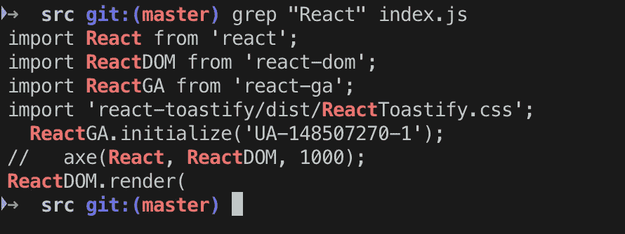

使用`**grep**`命令查找文件中的所有 React 关键字

`-i`选项使我们能够在给定文件中不区分大小写地搜索字符串。它匹配像“反应”、“反应”和“反应”这样的词

```
$ grep -i "REact" file
```

我们可以用`-c` *(计数)*标志找到匹配给定字符串/模式的行数。

```
$ grep -c "react" index.js
```

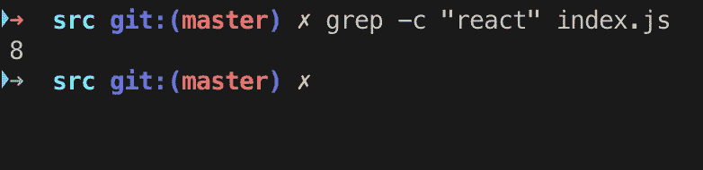

计算“反应”这个词在生活中出现的次数

这是我在网上找到的一个关于`grep`命令的有趣且有教育意义的漫画。


来源:[巫师杂志](https://wizardzines.com/zines/bite-size-command-line/)

另外，变体程序`egrep`和`fgrep`分别与
`grep -E`和`grep -F`相同。这些变体已被弃用，
但提供它们是为了向后兼容。

你可以用`grep`做很多事情——在这里阅读文档进行深入研究[。](http://man7.org/linux/man-pages/man1/grep.1.html)

# 2.限位开关（Limit Switch）

```
$ ls
```

列出当前活动路径中的文件和目录。如果*路径名*是一个文件，`ls`根据请求的选项显示该文件的信息。如果*路径名*是一个目录，ls 显示文件及其子目录的信息。

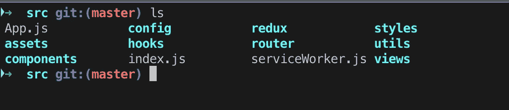

使用 **ls** 命令显示当前目录下的所有文件

你可能已经注意到文件显示为灰色，而文件夹是蓝色的。这是为了帮助我们区分文件夹和文件。

# 3.显示当前工作目录

```
$ pwd
```

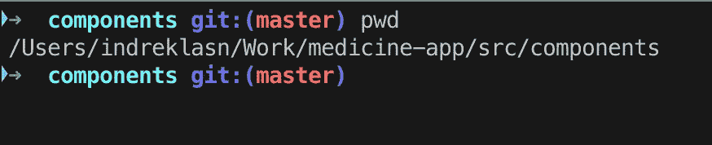

打印出当前工作目录( ***pwd*** )

`pwd`命令是一个命令行实用程序，用于打印当前工作目录。输出将把当前工作目录的完整系统路径打印到标准输出中。默认情况下，`pwd`命令忽略符号链接，尽管当前目录的完整物理路径可以用一个选项显示。

# 4.猫

```
$ cat somefile.js
```

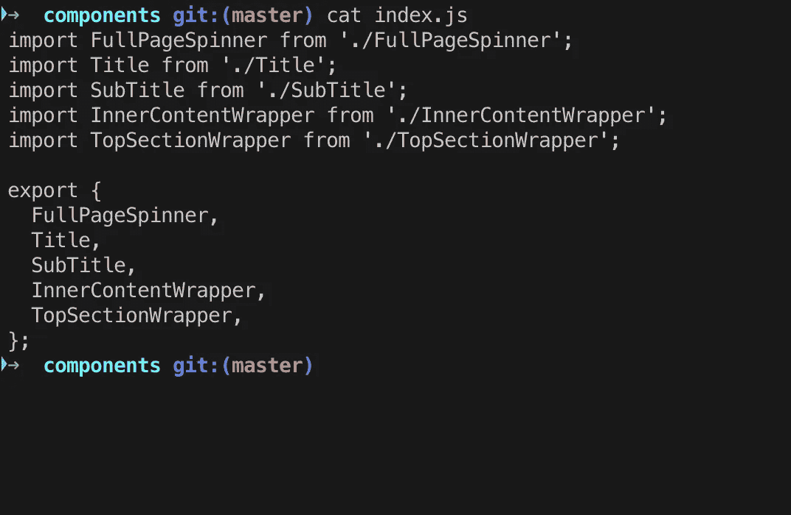

使用**类别**显示文件内容

`cat`命令有三个与文本文件相关的功能:

*   展示它们
*   合并副本
*   创造新的

cat 最常见的用途是读取文件的内容，而`cat`往往是实现这一目的最方便的程序。

在下面的示例中，使用输出重定向操作符(由向右的尖括号表示)将 cat 的标准输出重定向到文件 2:

```
$ cat somefile > somefile2
```

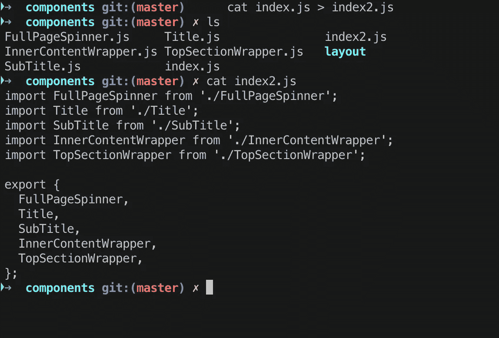

使用 cat 创建文件

# 5.回声

```
$ echo "some text"
```

Linux 中的`echo`命令用于显示作为参数传递的一行文本/字符串。`echo`是一个内置命令，主要用于 shell 脚本和批处理文件，将状态文本输出到屏幕或文件。

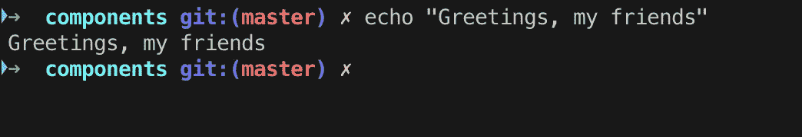

# 6.触控

```
$ touch somefile
```

`touch`命令用于创建一个没有任何内容的文件。当用户在创建文件时没有数据要存储时，可以使用`touch`命令。

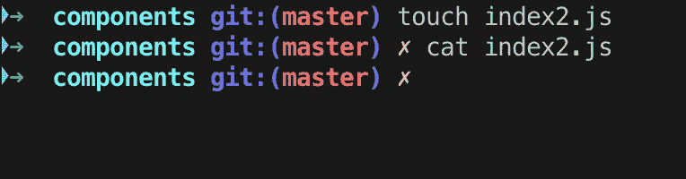

使用 touch 创建新文件

注意我们是如何使用`touch`创建文件和`cat`查看文件内部的。因为新创建的`index2.js`文件是空的，所以 cat 不返回任何内容。

以下是`cat`和`touch`的主要区别:

*   `cat` —用于创建包含内容的文件。
*   `touch` —创建一个没有任何内容的文件或空文件。记住，使用`touch`命令创建的文件是空的。当用户在创建文件时没有要存储的数据时，此命令很有用。

# 7.mkdir

```
$ mkdir some-directory
```

正如您所猜测的，mkdir 在当前活动路径中创建了一个新的空目录。使用这个命令创建新文件夹，而不是在文本编辑器或 GUI 中四处点击。

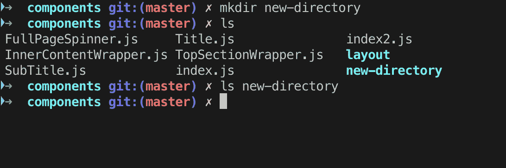

用 mkdir 创建新目录

*注意:*注意我们如何使用前面的`ls`命令查看目录内部。

## 7.1 rm

```
$ rm someFile
```

Rm 代表 remove，它确实做了它所说的事情。移除或删除文件。

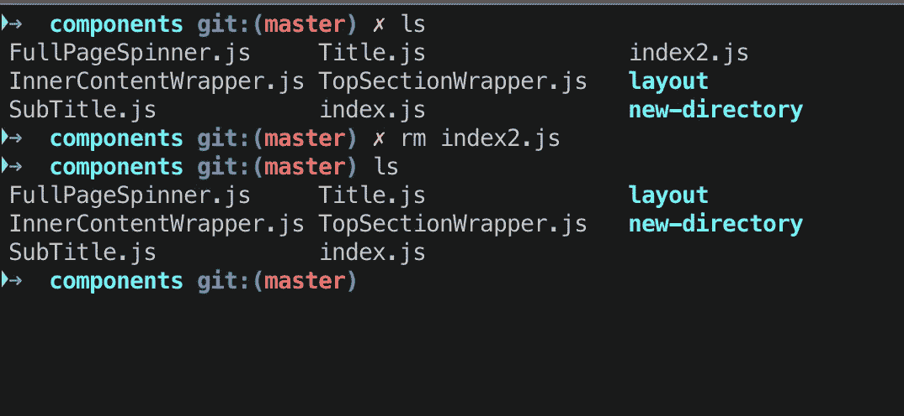

用`**rm**`命令删除文件

默认情况下，`rm`命令不会删除目录。您需要传递`-rf`标志来删除目录。

```
$ rm -rf some-directory
```


用 **rm** 命令删除一个目录(注意我们传递了一个删除目录的标志)

*注意:*这将无条件删除目录，无论目录内是否有内容。

## 7.2 rmdir

```
$ rmdir some-directory
```

如果目录中没有内容,`rmdir`命令会删除目录。

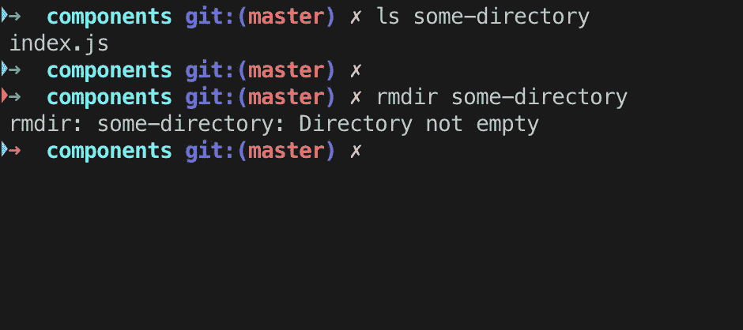

使用 **rmdir** 移除空目录

# 8.尾巴

```
$ tail somefile
```

`tail`命令读取一个文件并输出它的最后一部分(“尾部”)。

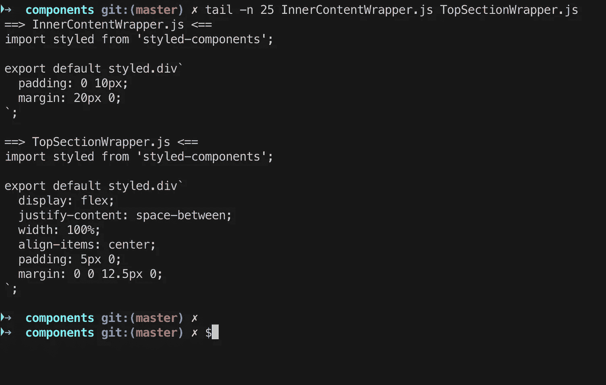

输出最后的 *num* 行，而不是默认的(10)

在查看崩溃报告或以前的历史日志时,`tail`命令很有用。下面是它在处理文件日志时有用的一个例子。

```
**# tail /var/log/messages
Mar 20 12:42:22 hameda1d1c dhclient[4334]: DHCPREQUEST on eth0 to 255.255.255.255 port 67 (xid=0x280436dd)
Mar 20 12:42:24 hameda1d1c avahi-daemon[2027]: Registering new address record for fe80::4639:c4ff:fe53:4908 on eth0.*.
Mar 20 12:42:28 hameda1d1c dhclient[4334]: DHCPREQUEST on eth0 to 255.255.255.255 port 67 (xid=0x280436dd)
Mar 20 12:42:28 hameda1d1c dhclient[4334]: DHCPACK from 10.76.198.1 (xid=0x280436dd)
Mar 20 12:42:30 hameda1d1c avahi-daemon[2027]: Joining mDNS multicast group on interface eth0.IPv4 with address 10.76.199.87.
Mar 20 12:42:30 hameda1d1c avahi-daemon[2027]: New relevant interface eth0.IPv4 for mDNS.
Mar 20 12:42:30 hameda1d1c avahi-daemon[2027]: Registering new address record for 10.76.199.87 on eth0.IPv4.
Mar 20 12:42:30 hameda1d1c NET[4385]: /sbin/dhclient-script : updated /etc/resolv.conf
Mar 20 12:42:30 hameda1d1c dhclient[4334]: bound to 10.76.199.87 -- renewal in 74685 seconds.
Mar 20 12:45:39 hameda1d1c kernel: usb 3-7: USB disconnect, device number 2**
```

# 9.wget

```
$ wget someurl
```

GNU Wget 是一个使用 HTTP、HTTPS、FTP 和 FTPS——最广泛使用的互联网协议——检索文件的自由软件包。它是一个非交互式的命令行工具，所以可以很容易地从脚本、CRON 作业、没有 X-Windows 支持的终端等调用它。

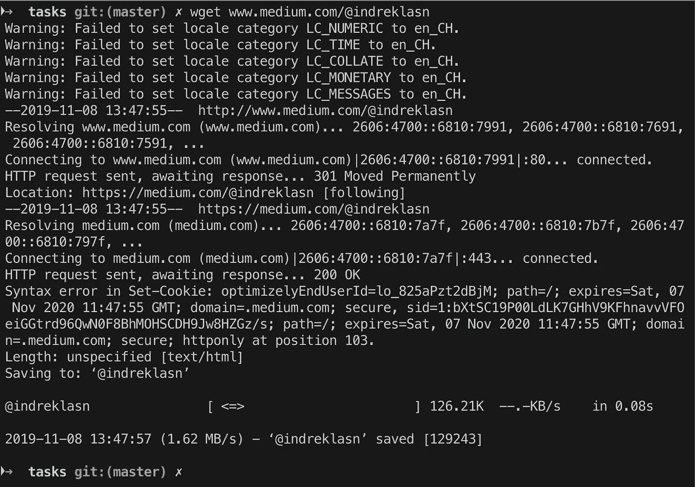

获取关于网页的信息

GNU Wget 有许多特性可以使检索大文件或镜像整个 web 或 FTP 站点变得容易，包括:

*   可以使用 REST 和 RANGE 恢复中止的下载
*   可以使用文件名通配符和递归镜像目录
*   许多不同语言的基于 NLS 的消息文件
*   可以选择将下载文档中的绝对链接转换为相对链接，以便下载的文档可以在本地相互链接
*   可以在大多数类似 UNIX 的操作系统以及 Microsoft Windows 上运行
*   支持 HTTP 代理
*   支持 HTTP cookies
*   支持持久 HTTP 连接
*   无人值守/后台操作
*   使用本地文件时间戳来确定镜像时是否需要重新下载文档
*   GNU Wget 是在 [GNU 通用公共许可证](https://www.gnu.org/licenses/gpl.html)下发布的。

阅读官方 GNU 文档了解更多信息。

# 10.发现

```
$ find path -name filename
```

`find`命令让您快速查找文件或目录。当您在处理一个包含数百个文件和多个目录的大型项目时，这非常有用。

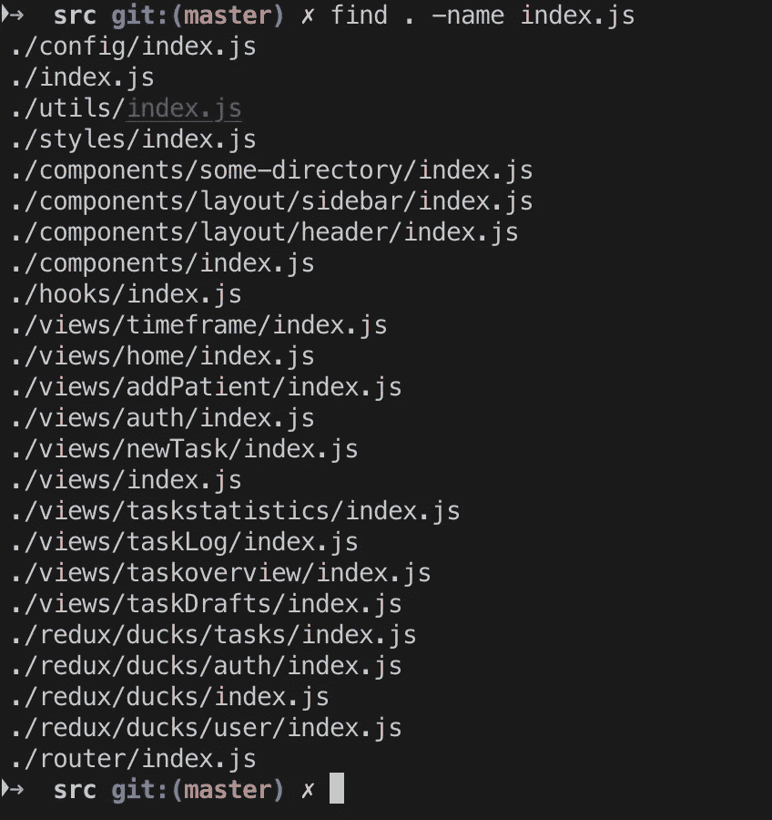

查找所有名为 **index.js** 的文件

## 搜索特定类型的文件

`find`命令还允许您在一个目录(及其子目录)中搜索相同类型的文件。例如，下面的命令将搜索当前工作目录中的所有`.js`文件。

```
$ find . -name "*.js"
```

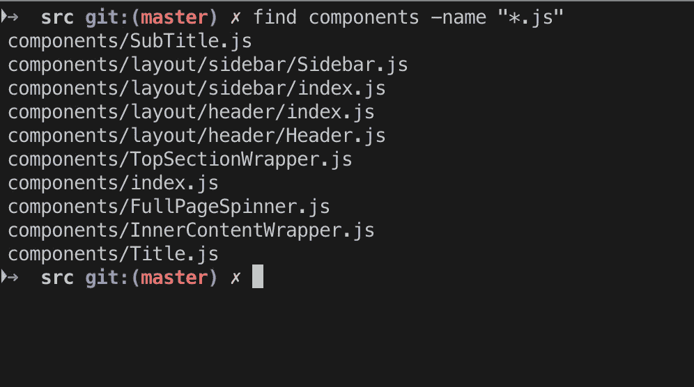

查找全部。组件目录中的 js 文件

# 11.平均变化

```
$ mv somefile /to/some/other/path
```

`mv`命令将文件或目录从一个地方移动到另一个地方。`mv`命令支持移动单个文件、多个文件和目录。

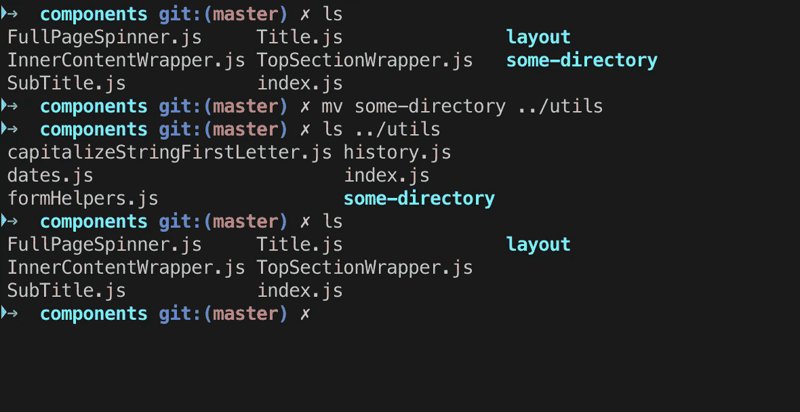

将**部分目录**从**组件**移动到**工具**目录

# 结论

感谢阅读，我希望你学到了新的东西。如果你知道一个方便的命令行技巧，请让我们一起成长，并张贴在回复中。

如果你想了解更多关于 shell 命令的知识，我建议你去抢一下*[*Linux for 初学者*](https://amzn.to/2QazBku)*这本书。保持好奇和饥渴！**

**了解我最新内容的最好方式是通过我的简讯。成为第一个得到通知的人。**

****

**我的[简讯](https://wholesomedev.substack.com/welcome)。成为第一个得到通知的人。**