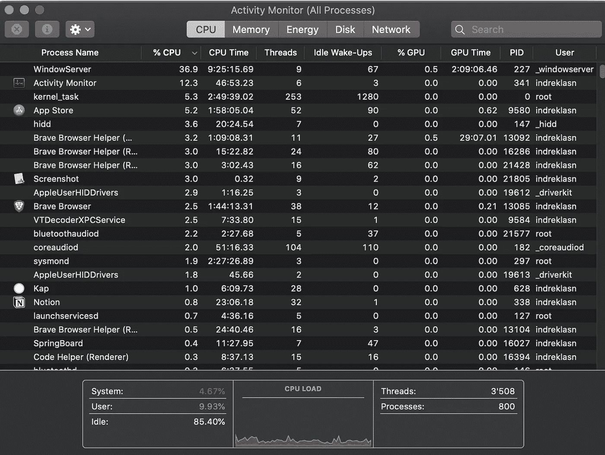
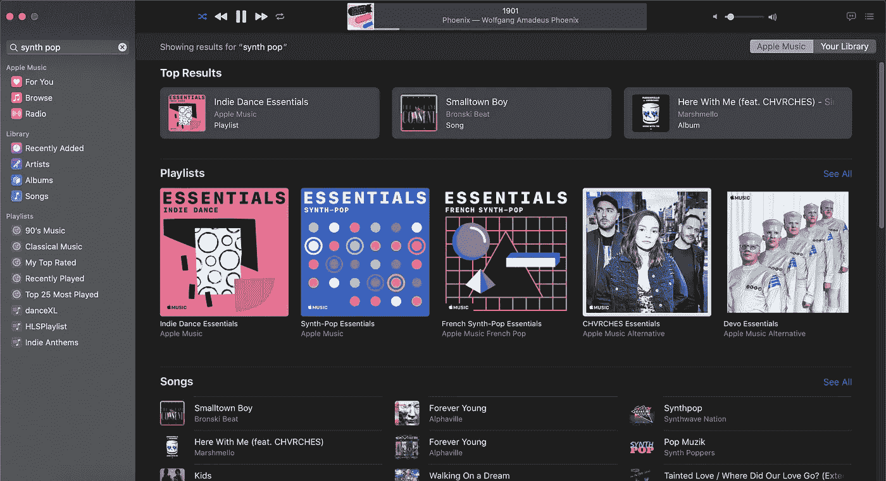
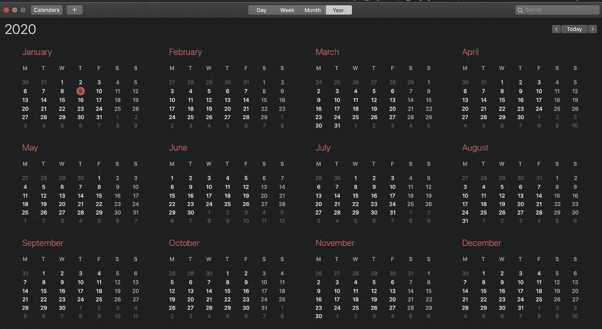
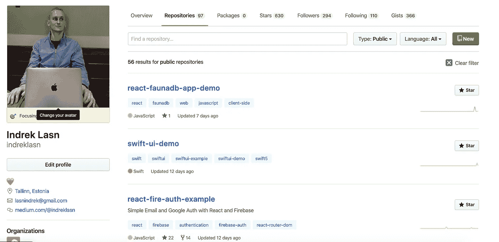

# 需要灵感？这里有 5 个具有挑战性的应用创意，你可以从今天开始构建

> 原文：<https://betterprogramming.pub/here-are-5-challenging-app-ideas-you-can-start-building-today-jan-2020-78cd4fb45996>

## 通过这些编码挑战提高您的技能

像任何其他技能一样，编码可以通过奉献、毅力和努力来掌握。编码就像一块肌肉，需要不断训练。

这篇文章假设你熟悉编码，但是缺乏关于编码内容的创造性想法。我们编码人员经常有强烈的编码欲望，但是缺乏构建什么的想法。把这一块作为正确方向的指针，争取在一个月内完成所有挑战。

没有任何进一步的延迟，这里是提高您的编码技能的编码挑战。

# 可定制的富文本编辑器

富文本编辑器的目的是减少用户将格式表达为有效 HTML 标记的工作量。富文本编辑器为用户提供了格式化文本的选项。

可定制的富文本编辑器— [教程链接此处](https://medium.com/better-programming/lets-build-a-customizable-rich-text-editor-with-slate-and-react-beefd5d441f2)

每个人都曾经使用过富文本编辑器，那么为什么不构建一个呢？

以下是一些最常用的富文本编辑器。如果你对如何构建一个富文本编辑器感到好奇，我不久前写了一个全面的教程——你可以在这里找到它。

## 下面是您将通过构建富文本编辑器学到的东西

*   如何将段落、句子和代码格式化为有效的 HTML
*   如何监听事件并根据事件启动操作
*   用户可访问性——例如，如何在编辑器控制器中使用键盘

# CPU 活动监视器

如果你喜欢硬件，这款适合你。购买外部主板，如 Uno R3，或者，如果可以，监控当前设备的 CPU 使用情况，如笔记本电脑或台式电脑。

Mac OS 活动监视器

中央处理器(CPU)对每个电子设备都是必不可少的。如果你愿意，它是计算机的大脑。为了确保 CPU 不会超负荷、过热等，查看其工作负载是很重要的。

## 下面是您将通过构建 CPU 活动监视器学到的东西

*   如何连接到你的 Arduino 原型 CPU(选择任何 CPU)
*   如何编写低级代码，比如 C 或 C++
*   如何构建一个与 CPU 通信并显示所有关键信息的用户界面

# 苹果音乐克隆

谁不喜欢音乐？为什么不建立自己的音乐播放器来了解事情是如何在引擎盖下工作的？任何现代音乐流媒体服务都有很多内幕。

苹果音乐

您可以构建 web 或桌面版本。选择权在你——挑一个看起来对你最有吸引力的。如果你想练习你的 web 开发技能，做一个 web 版本。如果您想练习构建本机桌面应用程序，请构建桌面版本。

## 以下是您通过构建 Apple Music 克隆版将学到的内容

*   如何从 Apple Music API 获取歌曲进行播放
*   如何暂停、播放下一首歌曲和播放上一首歌曲
*   如何处理音量变化
*   在收音机、专辑和歌曲之间浏览视图

在这里找到[苹果音乐 API](https://developer.apple.com/documentation/applemusicapi) 。

# 日历应用程序

了解日期是成为优秀开发人员的关键。任何稍微复杂的应用程序都会以某种方式涉及到日期。制作自己的日历是熟悉时区和日期工作方式的好方法。

苹果日历

你可以挑任何你喜欢的日历。我会推荐谷歌或苹果日历，因为它们都有干净的用户界面。

## 下面是您将通过构建日历应用程序学到的东西

*   如何处理不同的日期和时区
*   用户如何预订特定时间段的活动
*   当事件即将开始时显示通知和提醒

# 显示和过滤 GitHub 存储库

GitHub 允许您显示和过滤您的公共和私有存储库。通过构建自己的版本来增加您的投资组合。GitHub 有一个 [REST](https://developer.github.com/v3/) 和 [GraphQL](https://developer.github.com/v4/) API 来帮助你开始——选择你更喜欢的那个。

[GitHub 仓库页面](https://github.com/indreklasn?utf8=%E2%9C%93&tab=repositories&q=&type=public&language=)

## 下面是您将通过构建 GitHub 存储库页面学到的内容

*   如何从 GitHub API 获取存储库
*   如何根据关键字、星级和编程语言过滤存储库
*   如何用 HTML 创建布局，用 CSS 创建样式/定位元素

# 结论

感谢阅读！记住，擅长编码需要你投入工作。

**附言:寻找更多的编码思路？永远不要耗尽编码的想法，永远不要。** [**在这里获取权限来一堆前端挑战被我。**](https://gumroad.com/l/IuqKc)

构建尽可能多的应用程序是提高编码水平的最好方法之一，如果不是最好的话。

了解我最新内容的最好方式是通过我的[时事通讯](https://wholesomedev.substack.com/welcome)。成为第一个得到通知的人。

我的[简讯](https://wholesomedev.substack.com/welcome)。成为第一个得到通知的人。