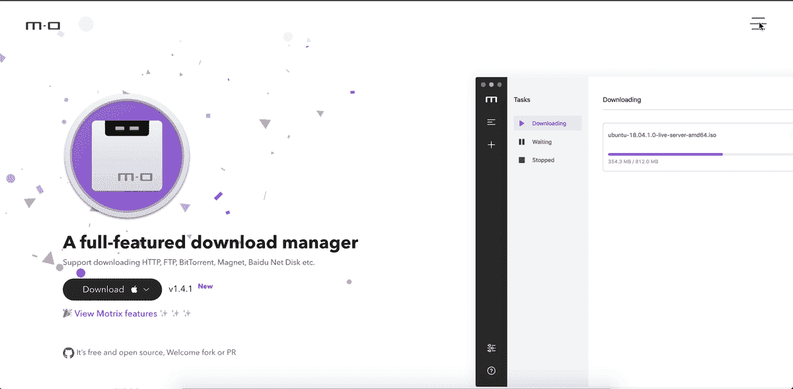
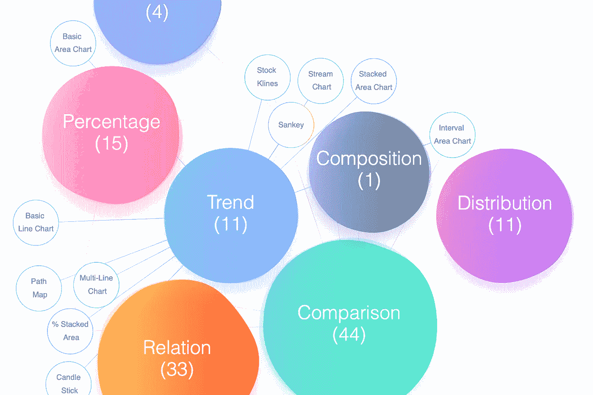
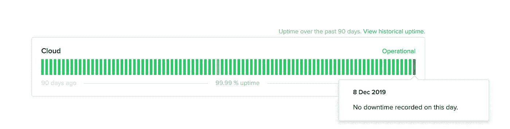
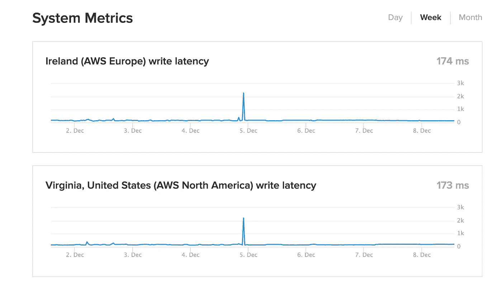

# 5 代码的前端挑战(2019 年 12 月版)

> 原文：<https://betterprogramming.pub/here-are-5-front-end-challenges-to-code-dec-2019-edition-7d691c4b023>

## 保持你的前端技能敏锐，应对这些挑战

由 [Filiberto Santillán](https://unsplash.com/@filijs?utm_source=medium&utm_medium=referral) 在 [Unsplash](https://unsplash.com?utm_source=medium&utm_medium=referral) 拍摄的照片

只有一种方法可以让你变得擅长编码，那就是尽可能多的编码。我们程序员早上醒来时有编码的欲望，但是经常缺乏关于编码什么的创造性想法。

这篇文章的目的是为你提供挑战，这样你就可以做你喜欢的事情——编码！

编码是一块肌肉，和其他肌肉一样需要训练。事不宜迟，这里有五个前端挑战，帮助您启动并运行。

# 1。 **带内容的动态菜单**

来源:[https://motrix.app/](https://motrix.app/)

当你点击菜单时，看着内容缩小——很酷的效果，对吧？！

## 通过完成这个挑战，你将学到什么

*   CSS 过渡和动画。
*   如何重新定位布局和内容？
*   如何和谐地使用 HTML 和 JavaScript 来增加网站的交互性？

# 2。 **气泡图**

气泡图——来源:[https://antv.vision/en](https://antv.vision/en)

气泡图是一种显示三维数据的图表。每个实体及其三个相关数据被绘制成一个圆盘，通过圆盘的`xy`位置表示两个 vᵢ值，通过其大小表示第三个值。

## 通过完成这个挑战，你将学到什么

*   如何使用 JavaScript 可视化数据？
*   使用 CSS 和 JavaScript 实现过渡、样式和交互性。

# 3。 **屏蔽认证表单**

来源:https://dashboard.stripe.com/login

## 什么是输入掩码？

输入掩码是控制哪些数据可以输入表单字段的一种方式。它们由一组严格的规则管理，站点访问者在尝试填写表单时不能违反这些规则。

## 通过完成这个挑战，你将学到什么

*   如何对表单和输入使用强制的严格规则。
*   如何使用 JavaScript 验证表单？
*   如何使用 CSS 和 JavaScript 创建动态表单？

在 WPForms 阅读更多关于屏蔽输入[的信息。](https://wpforms.com/how-to-create-input-masks-for-your-sites-forms-with-examples/)

# 4。 **垂直条形图**

来源:https://status.fauna.com/#about-this-site

在可视化每日、每周、每月或每年的数据时，垂直条形图非常有用。上面的例子显示了每天的服务正常运行时间。

## 通过完成这个挑战，你将学到什么

*   如何使用 JavaScript 创建垂直条形图？
*   如何使用 CSS 来设计图表？
*   如何用 JavaScript 可视化数据？

# 5。 **系统指标图**

来源:[https://status.fauna.com/#week](https://status.fauna.com/#week)

在可视化销售、对话、毛利润、崩溃报告等方面，系统指标图表非常有用。这个清单还在继续。

每个复杂的应用程序都会以某种方式利用系统图表。尽早动手是个不错的主意。

## 通过完成这个挑战，你将学到什么

*   如何使用 JavaScript 创建系统图表？
*   如何使用 CSS 来设计图表？
*   如何用 JavaScript 可视化数据？

# 结论

我希望这篇文章对您有所帮助，并让您获得了新的代码挑战。

**附言:寻找更多的编码思路？永远不要耗尽编码的想法，永远不要。** [**在这里获取权限来一堆前端挑战被我。**](https://gumroad.com/l/IuqKc)

如果你是 JavaScript 新手，想学习这门语言，我建议你从阅读书籍和构建东西开始。

从《 [*学习 JavaScript*](https://amzn.to/2LOkzjj) 的更聪明的方法》这本书开始，这里有一个有趣的应用程序列表，可以构建。

记住，编码是一项很难掌握的技能，因此，你应该尽可能多地编码。任何技能都可以通过时间、奉献和毅力来掌握。

了解我最新内容的最好方式是通过我的简讯。成为第一个得到通知的人。

我的[简讯](https://wholesomedev.substack.com/welcome)。成为第一个得到通知的人。